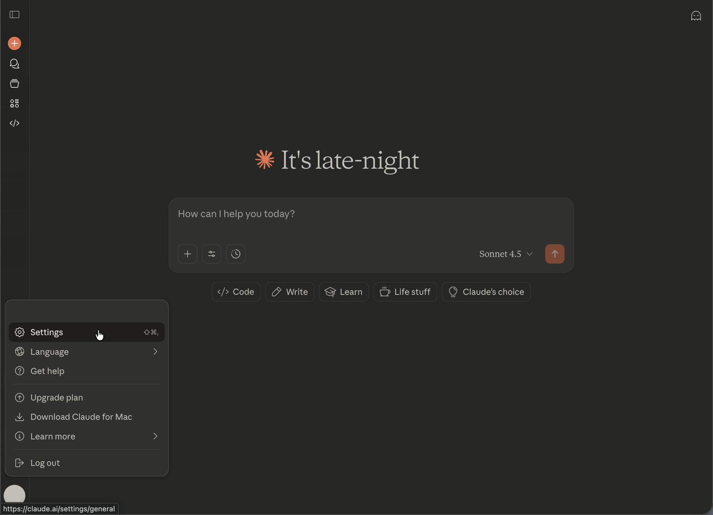
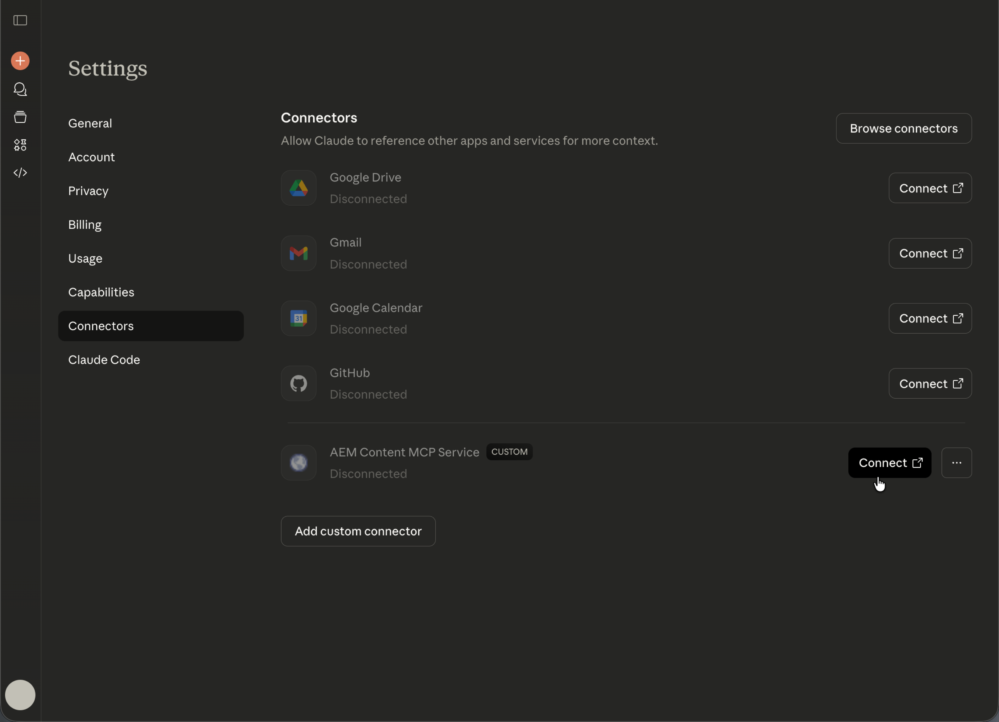

# Setting Up Anthropic Claude with AEM MCP {#setup-claude}

Följ de här stegen för att ansluta Anthropic Claude till AEM MCP-servrar.

* Registrera en eller flera AEM MCP-server-URL:er i Claude&#39;s MCP-konfiguration.
* Slutför inloggningsflödet för Adobe.
* Du kan även aktivera automatisk bekräftelse för vissa verktyg i konfigurationsområdet. Det här alternativet rekommenderas för sökning och skrivskyddade åtgärder.
* Kontrollera att MCP-servern är markerad innan du startar konversationen.
* Be Claude att utföra AEM-relaterade uppgifter. Claude väljer AEM Tools som exponeras av MCP-servern baserat på din uppmaning.

