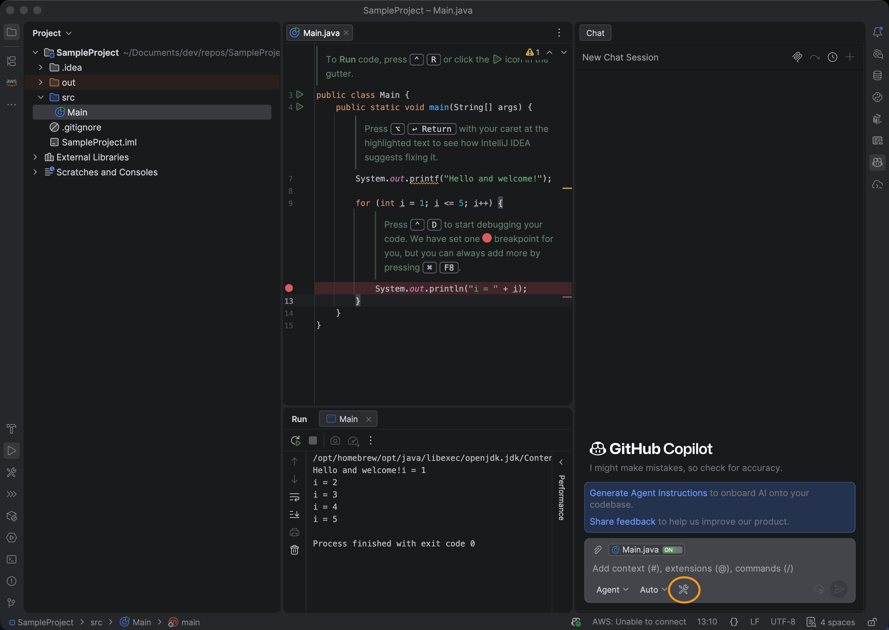

# Konfigurera JetBrains med GitHub Copilot och AEM MCP {#setup-jetbrains-copilot}

Följ de här stegen för att ansluta GitHub Copilot i en JetBrains IDE (till exempel IntelliJ IDEA, WebStorm eller PyCharm) till AEM MCP-servrar.

1. Öppna GitHub Copilot Chat i JetBrains IDE genom att klicka på ikonen **GitHub Copilot Chat** till höger om redigeraren.

   

1. Klicka på ikonen **settings** på panelen Kompilera chatt för att öppna MCP-konfigurationen.

   

1. I **Inställningar** går du till **Verktyg > GitHub Copilot > Model Context Protocol (MCP)** och klickar på **Configure** för att öppna konfigurationsfilen `mcp.json`.

   

1. Lägg till en eller flera URL-adresser för AEM MCP-servrar i filen `mcp.json`. Till exempel:

   ```json
   {
     "servers": {
       "aem": {
         "url": "https://mcp.adobeaemcloud.com/adobe/mcp/content"
       }
     }
   }
   ```


   


1. Spara filen. GitHub Copilot identifierar den nya serverkonfigurationen automatiskt och visar en **Start** -åtgärd.

   

1. Klicka på åtgärden **Start** och logga in med din Adobe ID för att slutföra autentiseringsflödet när du uppmanas till detta.

1. Du kan granska och hantera identifierade verktyg genom att klicka på indikatorn för **verktyg** som visas på panelen Kopiera chatt. Du kan även aktivera eller inaktivera enskilda verktyg.


   

1. Använd GitHub Copilot Chat för att anropa AEM-verktyg som en del av dina arbetsflöden för utveckling och innehåll.