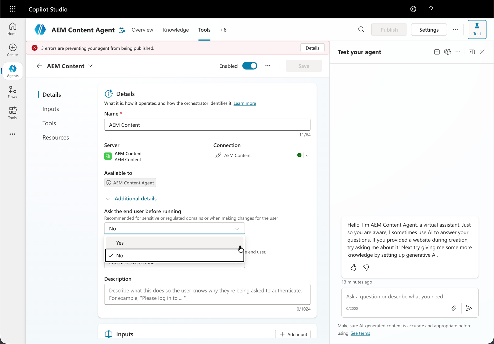

# Konfigurera Microsoft Copilot Studio med AEM MCP {#setup-microsoft-copilot-studio}

Följ de här stegen för att ansluta Microsoft Copilot Studio till AEM MCP-servrar.

* Skapa en ny agent.
* Navigera till verktygsavsnittet och klicka på **Lägg till verktyg**.
* Välj ett befintligt verktyg eller skapa ett nytt.
* Konfigurera ett nytt MCP-verktyg som pekar på en eller flera URL:er för AEM MCP-servrar.
* Upprätta en anslutning som kan delas eller dedikeras mellan agenter.
* Logga in med ditt Adobe ID när du omdirigeras.
* Du kan även aktivera läget för automatisk bekräftelse eller kräva att slutanvändaren bekräftar för alla verktygsinteraktioner.
* När du testar din agent öppnar du först anslutningshanteraren för att tilldela en anslutning till sessionen och trycker sedan på **Försök igen**.

