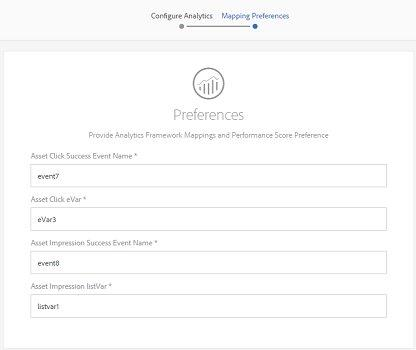

# Lägg till digitalt material i Adobe Experience Manager {#add-assets-to-experience-manager}

[!DNL Adobe Experience Manager] berikar det binära innehållet i de överförda digitala filerna med omfattande metadata, smarta taggar, renderingar och andra DAM-tjänster (Digital Asset Management). Du kan överföra olika typer av filer, till exempel bilder, dokument och råbildfiler, från den lokala mappen eller en nätverksenhet till [!DNL Experience Manager Assets].

Ett antal överföringsmetoder tillhandahålls. Förutom den vanligaste uppladdningen av webbläsare finns det andra metoder att lägga till resurser i Experience Manager-databasen, bland annat skrivbordsklienter, som Adobe Asset Link eller Experience Manager, överförings- och förtäringsskript som kunderna skulle skapa samt automatiserade importfunktioner som lagts till som Experience Manager-tillägg.

Vi fokuserar på överföringsmetoder för slutanvändare här och tillhandahåller länkar till artiklar som beskriver tekniska aspekter av överföring och förtäring av resurser med hjälp av API:er för Experience Manager och SDK:er.

Du kan överföra och hantera binära filer i Experience Manager, men de vanligaste filformaten har stöd för ytterligare tjänster, som metadataextrahering eller generering av förhandsgranskning/återgivning. Mer information finns i de [filformat](file-format-support.md) som stöds.

Du kan också välja att utföra ytterligare bearbetning av de överförda resurserna. Ett antal resursbearbetningsprofiler kan konfigureras för mappen, till vilken resurserna överförs, för att lägga till specifika metadata, återgivningar eller bildbehandlingstjänster. Mer information finns i [Ytterligare bearbetning](#additional-processing) nedan.

>[!NOTE]
>
>Experience Manager som Cloud Service utnyttjar ett nytt sätt att överföra resurser - direkt binär överföring. Den stöds som standard av produktfunktioner och -klienter, som Experience Manager användargränssnitt, Adobe Asset Link och Experience Manager, och är därmed genomskinlig för slutanvändarna.
>
>Ladda upp kod som är anpassad eller utökad av kunder som tekniska team behöver för att kunna använda de nya överförings-API:erna och protokollen.

## Överför resurser {#upload-assets}

<!-- #ENGCHECK do we support pausing? I couldn't get pause to show with 1.5GB upload.... If not, this should be removed#

   You can pause the uploading of large assets (greater than 500 MB) and resume it later from the same page. Tap the **[!UICONTROL Pause]** icon beside progress bar that appears when an upload starts.

   

   The size above which an asset is considered a large asset is configurable. For example, you can configure the system to consider assets above 1000 MB (instead of 500 MB) as large assets. In this case, **[!UICONTROL Pause]** appears on the progress bar when assets of size greater than 1000 MB are uploaded.

   The Pause button does not show if a file greater than 1000 MB is uploaded with a file less than 1000 MB. However, if you cancel the less than 1000 MB file upload, the **[!UICONTROL Pause]** button appears.

   To modify the size limit, configure the `chunkUploadMinFileSize` property of the `fileupload`node in the CRX repository.

   When you click the **[!UICONTROL Pause]** icon, it toggles to a **[!UICONTROL Play]** icon. To resume uploading, click the **[!UICONTROL Play]** icon.

   
-->

<!-- #ENGCHECK do we support pausing? I couldn't get pause to show with 1.5GB upload.... If not, this should be removed#
   The ability to resume uploading is especially helpful in low-bandwidth scenarios and network glitches, where it takes a long time to upload a large asset. You can pause the upload operation and continue later when the situation improves. When you resume, uploading starts from the point where you paused it.
-->

<!-- #ENGCHECK assuming this is not relevant? remove after confirming#
   During the upload operation, [!DNL Experience Manager] saves the portions of the asset being uploaded as chunks of data in the CRX repository. When the upload completes, [!DNL Experience Manager] consolidates these chunks into a single block of data in the repository.

   To configure the cleanup task for the unfinished chunk upload jobs, go to `https://[aem_server]:[port]/system/console/configMgr/org.apache.sling.servlets.post.impl.helper.ChunkCleanUpTask`.
-->

Om du vill överföra en fil (eller flera filer) kan du antingen markera dem på skrivbordet och dra användargränssnittet (webbläsaren) till målmappen. Du kan också starta en överföring från användargränssnittet.

1. Navigera till den plats där du vill lägga till digitala resurser i [!DNL Assets] användargränssnittet.
1. Gör något av följande om du vill överföra resurserna:

   * Tryck på **[!UICONTROL Create]** ikonen i verktygsfältet. Tryck sedan på menyn **[!UICONTROL Files]**. Du kan byta namn på filen i den dialogruta som visas om det behövs.
   * I en webbläsare som har stöd för HTML5 drar du resurserna direkt till [!DNL Assets] användargränssnittet. Dialogrutan för att byta namn på filen visas inte.

   

   Om du vill markera flera filer trycker du på Ctrl- eller Kommando-tangenten och markerar resurserna i dialogrutan för filväljaren. När du använder en iPad kan du bara markera en fil i taget.

1. Om du vill avbryta en pågående överföring klickar du på Stäng (`X`) bredvid förloppsindikatorn. När du avbryter överföringen tas den delvis överförda delen av resursen bort [!DNL Assets] .

   Om du avbryter överföringen innan filerna har överförts, avbryter du överföringen av den aktuella filen och uppdaterar innehållet [!DNL Assets] . Filer som redan har överförts tas dock inte bort.

1. I dialogrutan för överföringsförlopp [!DNL Assets] visas antalet överförda filer och de filer som inte kunde överföras.

   Dessutom visas den senaste resursen som du överför eller den mapp som du skapade först i användargränssnittet för Resurser.

>[!NOTE]
>
>Mer information om hur du överför kapslade mapphierarkier finns i [Massöverföring av resurser](#bulk-upload).

<!-- #ENGCHECK I'm assuming this is no longer relevant.... If yes, this should be removed#

### Serial uploads {#serialuploads}

Uploading numerous assets in bulk consumes significant I/O resources, which may adversely impact the performance of [!DNL Assets]. In particular, if you have a slow internet connection, the time to upload drastically increases due to a spike in disk I/O. Moreover, your web browser may introduce additional restrictions to the number of POST requests [!DNL Assets] can handle for concurrent asset uploads. As a result, the upload operation fails or terminate prematurely. In other words, [!DNL Assets] may miss some files while ingesting a bunch of files or altogether fail to ingest any file.

To overcome this situation, [!DNL Assets] ingests one asset at a time (serial upload) during a bulk upload operation, instead of the concurrently ingesting all the assets.

Serial uploading of assets is enabled by default. To disable the feature and allow concurrent uploading, overlay the `fileupload` node in Crx-de and set the value of the `parallelUploads` property to `true`.

### Streamed uploads {#streamed-uploads}

If you upload many assets to [!DNL Experience Manager], the I/O requests to server increase drastically, which reduces the upload efficiency and can even cause some upload task to time out. [!DNL Assets] supports streamed uploading of assets. Streamed uploading reduces the disk I/O during the upload operation by avoiding asset storage in a temporary folder on the server before copying it to the repository. Instead, the data is transferred directly to the repository. This way, the time to upload large assets and the possibility of timeouts is reduced. Streamed upload is enabled by default in [!DNL Assets].

>[!NOTE]
>
>Streaming upload is disabled for [!DNL Experience Manager] running on JEE server with servlet-api version lower than 3.1.
-->

### Hantera överföringar när det redan finns en resurs {#handling-upload-existing-file}

Om du överför en resurs med samma namn som en resurs som redan finns på den plats där du överför resursen visas en varningsdialogruta.

Du kan välja att ersätta en befintlig resurs, skapa en annan version eller behålla båda genom att byta namn på den nya resursen som överförs. Om du ersätter en befintlig resurs tas metadata för resursen och eventuella tidigare ändringar (till exempel anteckningar, beskärning och så vidare) som du har gjort för den befintliga resursen bort. Om du väljer att behålla båda resurserna får den nya resursen ett nytt namn med numret `1` tillagt i namnet.

>[!NOTE]
>
>När du väljer **[!UICONTROL Replace]** i [!UICONTROL Name Conflict] dialogrutan genereras resurs-ID om för den nya resursen. Detta ID skiljer sig från ID:t för föregående resurs.
>
>Om resursinsikter är aktiverat för att spåra visningar/klick med Adobe Analytics blir det återskapade resurs-ID:t ogiltigt för de data som har samlats in för resursen i Analytics.

Om du vill behålla den duplicerade resursen i [!DNL Assets]klickar du på **[!UICONTROL Keep]**. Om du vill ta bort den duplicerade resursen som du överförde trycker/klickar du **[!UICONTROL Delete]**.

### Hantering av filnamn och förbjudna tecken {#filename-handling}

[!DNL Experience Manager Assets] förhindrar att du överför resurser med förbjudna tecken i filnamn. Om du försöker överföra en resurs med ett filnamn som innehåller ett eller flera otillåtna tecken visas ett varningsmeddelande och överföringen stoppas tills du tar bort dessa tecken eller överför med ett tillåtet namn. [!DNL Assets]

I dialogrutan kan du ange långa namn för de filer som du överför, så att de passar organisationens specifika regler för filnamn. [!UICONTROL Upload Assets]

Följande (blankstegsavgränsad lista med) tecken stöds emellertid inte:

* resursens filnamn får inte innehålla `* / : [ \\ ] | # % { } ? &`
* resursmappens namn får inte innehålla `* / : [ \\ ] | # % { } ? \" . ^ ; + & \t`

## Överför resurser gruppvis {#bulk-upload}

Om du vill överföra fler filer, särskilt om de finns i en kapslad mapphierarki på disken, kan du använda följande metoder:

* Använd ett anpassat överföringsskript eller verktyg som utnyttjar API:er för [överföring av resurser](developer-reference-material-apis.md#asset-upload-technical). Ett sådant anpassat verktyg kan lägga till ytterligare hantering av resurser (t.ex. översätta metadata eller byta namn på filer), om det behövs.
* Använd [Experience Manager-datorprogrammet](https://docs.adobe.com/content/help/en/experience-manager-desktop-app/using/using.html) för att överföra kapslade mapphierarkier.

>[!NOTE]
>
>Bulköverföring som en del av innehållsmigrering från andra system när du konfigurerar och distribuerar till Experience Manager kräver noggrann planering, övervägande och val av verktyg. I [distributionsguiden](/help/implementing/deploying/overview.md) finns riktlinjer för innehållsmigreringsmetoder.

## Överför resurser med skrivbordsklienter {#upload-assets-desktop-clients}

Förutom webbläsarens användargränssnitt har Experience Manager stöd för andra klienter på datorn. De ger också en uppladdningsupplevelse utan att du behöver gå till webbläsaren.

* [Adobe Asset Link](https://helpx.adobe.com/enterprise/using/adobe-asset-link.html) ger åtkomst till resurser från [!DNL Experience Manager] Adobe Photoshop, Adobe Illustrator och Adobe InDesign. Du kan överföra det öppna dokumentet till [!DNL Experience Manager] direkt från användargränssnittet Adobe Asset Link från dessa skrivbordsprogram.
* [Experience Manager-datorprogrammet](https://docs.adobe.com/content/help/en/experience-manager-desktop-app/using/using.html) förenklar arbetet med resurser på datorn, oberoende av filtyp eller vilket program som hanterar dem. Det är särskilt användbart att överföra filer i kapslade mapphierarkier från det lokala filsystemet, eftersom webbläsaröverföring bara stöder överföring av platta fillistor.

## Ytterligare bearbetning {#additional-processing}

Om du vill få mer bearbetning av de överförda resurserna kan du använda resursbearbetningsprofiler i mappen, som resurserna överförs till. De är tillgängliga i **[!UICONTROL Properties]** mappdialogrutan.

Följande profiler är tillgängliga:

* [Med metadataprofiler](metadata-profiles.md) kan du använda standardmetadataegenskaper för resurser som överförs till den mappen
* [Med bearbetningsprofiler](asset-microservices-configure-and-use.md) kan du generera fler återgivningar än vad som är möjligt som standard.

Om Dynamic Media är aktiverat i din miljö:

* [Med dynamiska mediebildprofiler](dynamic-media/image-profiles.md) kan du använda en särskild beskärningskonfiguration (**[!UICONTROL Smart Cropping]** och pixelbeskärning) och skärpekonfiguration för de överförda resurserna.
* [Med dynamiska videoprofiler](dynamic-media/video-profiles.md) kan du använda särskilda videokodningsprofiler (upplösning, format, parametrar).

>[!NOTE]
>
>Dynamisk mediebeskärning och andra åtgärder för resurser är icke-förstörande, d.v.s. de ändrar inte det överförda originalet, utan tillhandahåller i stället parametrar för beskärning eller medieomvandling som ska utföras när resurserna levereras

För mappar som har en tilldelad bearbetningsprofil visas profilnamnet på miniatyrbilden i kortvyn. I listvyn visas profilnamnet i **[!UICONTROL Processing Profile]** kolumnen.

## Överför eller importera resurser med API:er {#upload-using-apis}

Teknisk information om överförings-API:er och protokoll samt länkar till SDK med öppen källkod och exempelklienter finns i avsnittet [för överföring](developer-reference-material-apis.md#asset-upload-technical) av resurser i utvecklarreferensen.

>[!MORELIKETHIS]
>
>* [Adobe Experience Manager-datorprogram](https://docs.adobe.com/content/help/en/experience-manager-desktop-app/using/introduction.html)
>* [Adobe Asset Link](https://www.adobe.com/creativecloud/business/enterprise/adobe-asset-link.html)
>* [Adobe Asset Link-dokumentation](https://helpx.adobe.com/enterprise/using/adobe-asset-link.html)
>* [Teknisk referens för överföring av tillgångar](developer-reference-material-apis.md#asset-upload-technical)

