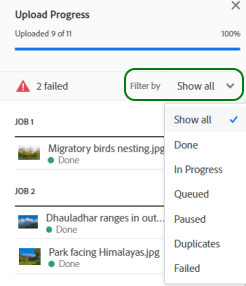

# Överför resurser {#add-assets}

Om du vill lägga till nya resurser att arbeta med överför du några resurser från det lokala filsystemet. <!-- TBD: Many of the [common file formats are supported](/help/assets/supported-file-formats-assets-view.md). -->

Du kan använda följande metoder för att överföra en eller flera resurser eller en mapp som innehåller resurser:

* Dra resurser eller mappar i användargränssnittet och följ instruktionerna på skärmen.
* Klicka **[!UICONTROL Add Assets]** i verktygsfältet och lägg till filer i dialogrutan för överföring.

<!-- TBD: Update this GIF
 -->

Du kan använda någon av dessa metoder för att överföra resurser när du har skapat en mapp. Klicka på om du vill skapa en tom mapp **[!UICONTROL Create Folder]** i verktygsfältet. while [!DNL Assets view] har en kraftfull fulltextsökningsfunktion som du kan använda för att ordna dina resurser bättre med hjälp av mappar.

När du har markerat filerna visas en bekräftelsedialogruta där du kan lägga till fler filer eller ta bort redan markerade filer. Om du vill lägga till fler filer i en markering klickar du på **[!UICONTROL Browse]** och väljer **[!UICONTROL Browse files]** eller **[!UICONTROL Browse folders]**. Lägg till fler filer eller mappar från samma mapp eller från en annan mapp.

När alla filer är i kö klickar du på **[!UICONTROL Upload]**.

*Bild: Innan du överför de valda resurserna kan du lägga till eller ta bort resurser från kön.*

>[!TIP]
>
>Om du överför en mappstruktur till resursvyn behöver du inte skapa en ZIP-fil med mappstrukturen. Du kan överföra mappstrukturer direkt. En ZIP-fil som överförts till resursvyn lagras som en ZIP-resurs och extraheras inte automatiskt efter överföringen.

## Visa överföringsförlopp och status {#upload-progress}

När du överför många resurser eller kapslade mappar till [!DNL Assets view]kan vissa resurser inte överföras av olika anledningar, till exempel duplicerade resurser och nätverksproblem.

Om du vill spåra överföringsförloppet klickar du **[!UICONTROL Upload Progress]** i verktygsfältet. På en panel visas överföringsförloppet för alla resurser.

Om du vill visa en delmängd av resurser baserat på överföringsförloppet eller överföringsstatusen använder du filtret i **[!UICONTROL Upload Progress]** sidofält. De olika filtren är att visa alla resurser, slutförda överföringar, pågående överföringar, köade resurser som ska överföras, pausade överföringar, duplicerade resurser och resurser som inte kunde överföras.

*Bild: Filtrera de resurser som du försökte överföra baserat på överföringsstatus eller överföringsförlopp.*

Omedelbart efter att resurserna har överförts [!DNL Assets view] bearbetar resurserna för att generera miniatyrbilder och bearbeta metadata. För många resurser tar bearbetningen tid. Om ingen miniatyrbild visas och du ser ett bearbetningsmeddelande på platshållarminiatyrbilden kontrollerar du mappen igen efter några minuter. Under bearbetningen, bland annat, [!DNL Assets view] skapar återgivningarna, lägger till smarta taggar och indexerar resursinformationen för sökning.

*Bild: Överförda resurser visar bearbetning på plattan som de bearbetas.*

## Resursåtergivningar {#renditions}

[!DNL Assets view] bearbetar det överförda materialet i nära realtid och för många filtyper som stöds genereras renderingar. Återgivningarna skapas för bilder och ändrar storlek på versioner av den överförda bilden. Du kan inte bara hämta resursen utan även återgivningarna för att använda en lämplig version. Du kan visa alla återgivningar av en resurs när du [förhandsgranska en resurs](/help/assets/navigate-assets-view.md#preview-assets).

*Bild: Visa och hämta renderingarna.*

## Hantera misslyckade överföringar {#resolve-upload-fails}

Om det av någon anledning inte går att överföra en resurs som stöds klickar du på **[!UICONTROL Retry]** från [!UICONTROL Upload Progress] fönster.

*Bild: Försök igen om en fil som stöds inte kan överföras av någon anledning.*

Om du försöker överföra duplicerade resurser överförs inte resurserna förrän du uttryckligen bekräftar överföringen. Först markeras de duplicerade resurserna som misslyckade överföringar. Du kan lösa problemet genom att skapa en version, ta bort och ersätta befintliga resurser eller skapa en kopia genom att byta namn på resursen. Du kan lösa sådana fel från en resurs i taget eller göra det samtidigt för alla misslyckade dubbletter på en gång.

*Bild: Lös problemet med en resurs i taget för duplicerade resurser som inte kan överföras som standard.*

*Bild: Lös problem för alla resurser samtidigt för duplicerade resurser som inte kan överföras som standard.*

>[!TIP]
>
>Du kan överföra resurser till DAM-databasen direkt från din [!DNL Creative Cloud] datorprogram.
<!--TBD
See how [[!DNL Assets view] integrates with [!DNL Adobe Asset Link]](/help/assets/integration-assets-view.md).
-->

## Ta bort resurser eller mappar {#delete-assets}

Användare kan ta bort enskilda resurser eller mappar som inte längre behövs. Så här tar du bort en resurs eller en mapp:

* Använd alternativet som är tillgängligt på en resurs eller en mapps miniatyrbild.

  

  *Bild: Åtgärder för filer och mappar är tillgängliga på resursen eller mapppanelen.*

* Välj en resurs eller en mapp och klicka på **[!UICONTROL Delete]**  i verktygsfältet.

## Nästa steg {#next-steps}

* [Titta på en video för att överföra resurser i resursvyn](https://experienceleague.adobe.com/docs/experience-manager-learn/assets-essentials/basics/creating.html)

* Ge produktfeedback med [!UICONTROL Feedback] alternativ som finns i användargränssnittet i resursvyn

* Ge feedback på dokumentationen med [!UICONTROL Edit this page]  eller [!UICONTROL Log an issue]  som finns till höger

* Kontakt [Kundtjänst](https://experienceleague.adobe.com/?support-solution=General#support)
