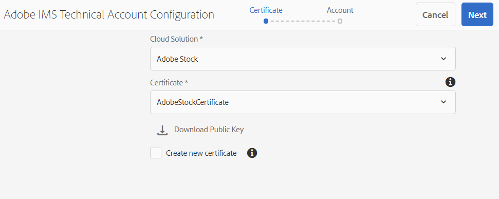
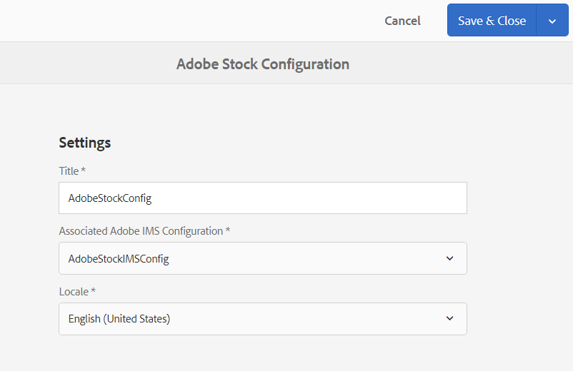

# Använd [!DNL Adobe Stock] resurser i [!DNL Adobe Experience Manager Assets] {#use-adobe-stock-assets-in-aem-assets}

| Version | Artikellänk |
| -------- | ---------------------------- |
| AEM 6.5 | [Klicka här](https://experienceleague.adobe.com/docs/experience-manager-65/assets/using/aem-assets-adobe-stock.html?lang=en) |
| AEM as a Cloud Service | Den här artikeln |

[!DNL Adobe Stock] ger designers och företag tillgång till miljontals utvalda och royaltyfria foton, vektorer, illustrationer, videor, mallar och 3D-resurser av hög kvalitet för alla kreativa projekt.

[!DNL Adobe Stock] som standard inkluderar Enterprise-erbjudanden delningsrättigheter i hela organisationen. När en mediefil har hämtats av en användare i organisationen kan andra användare i organisationen identifiera, hämta och använda den här mediefilen utan att behöva licensiera den igen. När en mediefil har licensierats av din organisation är rätten att använda den evig.

Organisationer kan integrera sina företag [!DNL Adobe Stock] planera med [!DNL Experience Manager Assets] för att säkerställa att licensierade mediefiler finns tillgängliga i stor omfattning för kreativa projekt och marknadsföringsprojekt, med de kraftfulla filhanteringsfunktionerna i [!DNL Experience Manager]. [!DNL Experience Manager] -användare snabbt kan hitta, förhandsgranska och licensiera Adobe Stock-resurser som har sparats i [!DNL Experience Manager], utan att lämna [!DNL Experience Manager] gränssnitt.

## Integrera [!DNL Experience Manager] och [!DNL Adobe Stock] {#integrate-aem-and-adobe-stock}

[!DNL Experience Manager Assets] ger användarna möjlighet att söka, förhandsgranska, spara och licensiera [!DNL Adobe Stock] resurser direkt från [!DNL Experience Manager].

**Förutsättningar**

Integreringen kräver:

* En igång [!DNL Experience Manager Assets] som [!DNL Cloud Service] instance
* An [företag [!DNL Adobe Stock] plan](https://stockenterprise.adobe.com/)
* En användare med behörigheter i Admin Console till standardproduktprofilen för Stock
* En användare med behörighet till profilen Developer Access som skapar integration i Adobe Developer Console

Ett företag [!DNL Adobe Stock] plan,

* Anger produktberättigande för [!DNL Adobe Stock] (Lager som är anslutna till Experience Manager)
* Krediter som köpts till [!DNL Adobe Admin Console] för ditt Stock-berättigande
* Aktiverar JWT-autentisering (Service Account) inom [!DNL Adobe Developer Console] för ditt Stock-berättigande
* Gör det möjligt att hantera krediter och licenser globalt inifrån [!DNL Adobe Admin Console]

Inom berättigandet finns en standardproduktprofil för [!DNL Adobe Stock] finns i [!DNL Admin Console]. Det går att skapa flera profiler, och de här profilerna avgör vem som kan licensiera Stock-mediefiler. En användare som har direktåtkomst till produktprofilen har åtkomst [https://stock.adobe.com/](https://stock.adobe.com/) och licensiera Stock-mediefiler. Det finns ett annat sätt att använda Developer Access för att skapa en integrering (API). Integreringen autentiserar kommunikationen mellan [!DNL Experience Manager Assets] och [!DNL Adobe Stock].

>[!NOTE]
>
>Verifieringen av Stock-tjänstkontot (JWT) följer med Enterprise Stock-berättigandet.
>
>Integreringen stöder inte Oauth-autentisering för Enterprise Stock-berättigande.

<!--
### Create an IMS configuration {#create-an-ims-configuration}

1. In the [!DNL Experience Manager] user interface, navigate to **[!UICONTROL Tools]** > **[!UICONTROL Security]** > **[!UICONTROL Adobe IMS Configurations]**. Click **[!UICONTROL Create]** and select **[!UICONTROL Cloud Solution]** > **[!UICONTROL Adobe Stock]**.
1. Either reuse an existing certificate or select **[!UICONTROL Create new certificate]**.
1. Click **[!UICONTROL Create certificate]**. Once created, download the public key. Click **[!UICONTROL Next]**. Leave the [!UICONTROL Adobe IMS Technical Account Configuration] screen open to provide the required values shortly.
1. Access [Adobe Developer Console](https://console.adobe.io). Ensure that your account has administrator permissions for the organization for which the integration is required.
1. Click **[!UICONTROL Create new project]** and click **[!UICONTROL Add API]**. Select **[!UICONTROL Adobe Stock]** from the list of APIs that are available to you. Select [!UICONTROL OAUTH 2.0 Web].
1. Provide **[!UICONTROL Default redirect URI]** and **[!UICONTROL Redirect URI pattern]** values. Click **[!UICONTROL Save configured API]**. Copy the generated ID and secret.
1. In [!UICONTROL Adobe IMS Technical Account Configuration] screen, provide the values in the boxes titled **[!UICONTROL Title]**, **[!UICONTROL Authorization Server]**, **[!UICONTROL API Key]**, **[!UICONTROL Client Secret]**, and **[!UICONTROL Payload]**. For detailed information about these values, see [JWT authentication quick start](https://www.adobe.io/authentication/auth-methods.html#!AdobeDocs/adobeio-auth/master/JWT/JWT.md).

-->
<!-- TBD: Update the URL to update the terminology when AIO team updates their documentation URL. Logged issue github.com/AdobeDocs/adobeio-auth/issues/63.
-->

<!--
### Create [!DNL Adobe Stock] configuration in [!DNL Experience Manager] {#create-adobe-stock-configuration-in-aem}

1. In the [!DNL Experience Manager], navigate to **[!UICONTROL Tools]** > **[!UICONTROL Cloud Services]** > **[!UICONTROL Adobe Stock]**.
1. Click **[!UICONTROL Create]** to create a configuration and associate it with your existing IMS Configuration. Select `PROD` as the environment parameter.
1. In **[!UICONTROL Licensed Assets Path]** field, leave a location as is. Do not change the location where you want to store the [!DNL Adobe Stock] assets.
1. Complete creation by adding all the required properties. Click **[!UICONTROL Save & Close]**.
1. Add [!DNL Experience Manager] users or groups, who can license the assets.

>[!NOTE]
>
>If there are multiple [!DNL Adobe Stock] configurations, select the desired configuration in User Preferences panel. To access the panel from Experience Manager home page, click the user icon and then click **[!UICONTROL User Preferences]** > **[!UICONTROL Stock Configuration]**.

-->

## Steg för integrering [!DNL Experience Manager] och [!DNL Adobe Stock] {#integration-steps}

Integrera [!DNL Experience Manager] och [!DNL Adobe Stock]utför du följande steg i den listade sekvensen:

1. [Hämta ett offentligt certifikat](#public-certificate)

   I [!DNL Experience Manager], skapa ett IMS-konto och generera ett offentligt certifikat (offentlig nyckel).

1. [Skapa JWT-anslutning (Service Account)](#createnewintegration)

   I [!DNL Adobe Developer Console], skapa ett projekt för [!DNL Adobe Stock] organisation. Under projektet konfigurerar du ett API med den offentliga nyckeln för att skapa en JWT-anslutning (Service Account). Hämta tjänstkontots autentiseringsuppgifter och information om JWT-nyttolast.

1. [Konfigurera IMS-konto](#create-ims-account-configuration)

   I [!DNL Experience Manager]konfigurerar du IMS-kontot med hjälp av tjänstkontots autentiseringsuppgifter och JWT-nyttolast.

1. [Konfigurera molntjänsten](#configure-the-cloud-service)

   I [!DNL Experience Manager], konfigurera och [!DNL Adobe Stock] molntjänst som använder IMS-kontot.

### Skapa en IMS-konfiguration {#create-an-ims-configuration}

IMS-konfigurationen autentiserar din [!DNL Experience Manager Assets] författarinstans med [!DNL Adobe Stock] berättigande.

IMS-konfigurationen har två steg:

* [Hämta ett offentligt certifikat](#public-certificate)
* [Konfigurera IMS-konto](#create-ims-account-configuration)

### Hämta ett offentligt certifikat {#public-certificate}

Den offentliga nyckeln (certifikatet) autentiserar din produktprofil i Adobe Developer Console.

1. Logga in på [!DNL Experience Manager Assets] molninstans.

1. Från **[!UICONTROL Tools]** navigera till **[!UICONTROL Security]** > **[!UICONTROL Adobe IMS Configurations]**.

1. På sidan Adobe IMS-konfigurationer klickar du på **[!UICONTROL Create]**. The **[!UICONTROL Adobe IMS Technical Account Configuration]** sidan öppnas.

1. I **[!UICONTROL Certificate]** flik, välja **[!UICONTROL Adobe Stock]** från **[!UICONTROL Cloud Solution]** listruta.

1. Du kan skapa ett certifikat eller återanvända ett befintligt certifikat för konfigurationen.

   Om du vill skapa ett certifikat väljer du **[!UICONTROL Create new certificate]** kryssruta och ange en **alias** för den offentliga nyckeln. Aliaset används som namn på den offentliga nyckeln.

1. Klicka på **[!UICONTROL Create certificate]**. Klicka sedan på **[!UICONTROL OK]** för att generera den offentliga nyckeln.

1. Klicka på **[!UICONTROL Download Public Key]** och spara filen med den offentliga nyckeln (.crt) på datorn. Den offentliga nyckeln används senare för att konfigurera API för din Brand Portal-klient och generera autentiseringsuppgifter för tjänstkontot i Adobe Developer Console.

   Klicka på **[!UICONTROL Next]**.

   

1. I **Konto** skapas ett Adobe IMS-konto som kräver inloggningsuppgifterna för tjänstkontot.

   Öppna en ny flik och [skapa en JWT-anslutning (Service Account) i Adobe Developer Console](#createnewintegration).

### Skapa JWT-anslutning (Service Account) {#createnewintegration}

I Adobe Developer Console konfigureras projekt och API:er på organisationsnivå. När du konfigurerar ett API skapas en JWT-anslutning (Service Account). Det finns två metoder för att konfigurera API, genom att generera ett nyckelpar (privata och offentliga nycklar) eller genom att överföra en offentlig nyckel. I det här exemplet genereras autentiseringsuppgifterna för tjänstkontot genom att den offentliga nyckeln överförs.

Så här genererar du tjänstkontots autentiseringsuppgifter och JWT-nyttolast:

1. Logga in på Adobe Developer Console med systemadministratörsbehörighet. Standardwebbadressen är [https://www.adobe.com/go/devs_console_ui](https://www.adobe.com/go/devs_console_ui).

   Kontrollera att du har valt rätt IMS-organisation (Stock-berättigande) i listrutan (organisation).

1. Klicka på **[!UICONTROL Create new project]**. Ett tomt projekt med ett systemgenererat namn skapas för din organisation.

   Klicka på **[!UICONTROL Edit project]**. Uppdatera **[!UICONTROL Project Title]** och **[!UICONTROL Description]** och klicka sedan på **[!UICONTROL Save]**.

1. I **[!UICONTROL Project overview]** flik, klicka **[!UICONTROL Add API]**.

1. I **[!UICONTROL Add an API window]**, markera **[!UICONTROL Adobe Stock]**. Klicka på **[!UICONTROL Next]**.

1. I **[!UICONTROL Configure API]** fönster, markera **[!UICONTROL Service Account (JWT)]** autentisering. Klicka på **[!UICONTROL Next]**.

   

1. Klicka på **[!UICONTROL Upload your public key]**. Klicka **[!UICONTROL Select a File]** och ladda upp den publika nyckeln (.crt-filen) som du har laddat ned i [hämta offentligt certifikat](#public-certificate) -avsnitt. Klicka på **[!UICONTROL Next]**.

1. Verifiera den offentliga nyckeln och klicka på **[!UICONTROL Next]**.

1. Välj standard **[!UICONTROL Adobe Stock]** produktprofil och klicka på **[!UICONTROL Save configured API]**.

1. När API:t har konfigurerats omdirigeras du till API-översikten. Från vänster navigering under **[!UICONTROL Credentials]** klickar du på **[!UICONTROL Service Account (JWT)]** alternativ. Här kan du visa autentiseringsuppgifter och utföra åtgärder som att generera JWT-tokens, kopiera autentiseringsuppgifter och hämta klienthemlighet.

1. Från **[!UICONTROL Client Credentials]** -fliken, kopiera **[!UICONTROL client ID]**.

   Klicka **[!UICONTROL Retrieve Client Secret]** och kopiera **[!UICONTROL client secret]**.

   

1. Navigera till **[!UICONTROL Generate JWT]** och kopiera **[!UICONTROL JWT Payload]** information.

Du kan nu använda klient-ID (API-nyckel), klienthemlighet och JWT-nyttolast för att [konfigurera IMS-kontot](#create-ims-account-configuration) in [!DNL Experience Manager Assets].

### Konfigurera IMS-konto {#create-ims-account-configuration}

Du måste ha [certifikat](#public-certificate) och [JWT-referenser (service account)](#createnewintegration) för att konfigurera IMS-kontot.

Så här konfigurerar du IMS-kontot:

1. Öppna IMS-konfigurationen och gå till **[!UICONTROL Account]** -fliken. Du höll sidan öppen medan [erhålla det offentliga certifikatet](#public-certificate).

1. Ange en **[!UICONTROL Title]** för IMS-kontot.

   I **[!UICONTROL Authorization Server]** anger du URL-adressen: [https://ims-na1.adobelogin.com/](https://ims-na1.adobelogin.com/).

   Ange klient-ID i **[!UICONTROL API key]** fält, **[!UICONTROL Client Secret]** och **[!UICONTROL Payload]** (JWT-nyttolast) som du har kopierat när [skapar tjänstkontoanslutningen (JWT)](#createnewintegration).

1. Klicka på **[!UICONTROL Create]**. En IMS-kontokonfiguration skapas.

   

1. Välj IMS-kontokonfigurationen och klicka på **[!UICONTROL Check Health]**.

   Klicka **[!UICONTROL Check]** i dialogrutan. När konfigurationen är klar visas ett meddelande om att *Token har hämtats*.

   

### Konfigurera molntjänsten {#configure-the-cloud-service}

Konfigurera [!DNL Adobe Stock] molntjänst:

1. I [!DNL Experience Manager] användargränssnitt, navigera till **[!UICONTROL Tools]** > **[!UICONTROL Cloud Services]** > **[!UICONTROL Adobe Stock]**.

1. I [!DNL Adobe Stock Configurations] sida, klicka **[!UICONTROL Create]**.

1. Ange en **[!UICONTROL Title]** för molnkonfigurationen.

   Välj den IMS-konfiguration som du har skapat när [konfigurera IMS-kontot](#create-ims-account-configuration).

   Välj språkinställning i listrutan.

   

1. Klicka på **[!UICONTROL Save & Close]**.

   Dina [!DNL Experience Manager Assets] författarinstansen är nu integrerad med [!DNL Adobe Stock]. Du kan skapa flera [!DNL Adobe Stock] konfigurationer (till exempel språkbaserade konfigurationer). Nu kan du få åtkomst till, söka efter och licensiera [!DNL Adobe Stock] resurser inifrån [!DNL Experience Manager] användargränssnitt.

   

   >[!NOTE]
   >
   >I det här skedet av integreringen kan bara administratörer komma åt [!DNL Adobe Stock] resurser, söka efter Stock-resurser (med omvärldsbevakning) och licensiera [!DNL Adobe Stock] resurser.
   >
   >Administratörer kan lägga till användare eller grupper ytterligare i [!DNL Adobe Stock] molntjänst och ge behörigheter till dessa icke-adminanvändare i [!DNL Experience Manager] för att komma åt Stock-konfigurationen.

1. Om du vill lägga till användare eller grupper väljer du [!DNL Adobe Stock] molnkonfiguration och klicka på **[!UICONTROL Properties]**.

1. Sök för att lägga till de användare eller grupper som du har tilldelat behörighet att komma åt Adobe Stock-konfigurationen. Se [tilldela behörigheter till användargrupp](#assign-permissions-to-group).

## Tilldela behörigheter till användargruppen {#assign-permissions-to-group}

Administratörer kan skapa användargrupper och ge behörigheter till vissa användare eller grupper för att få åtkomst till [!DNL Adobe Stock] molntjänst.

Följande behörigheter krävs för att en användare ska kunna söka efter och licensiera Adobe Stock-resurser:

* Konfigurera sökvägen: `/conf/global/settings/stock`
* Behörigheter: `jcr:read`
* Behörighetstyp: `Allow`

Du kan skapa en användargrupp eller tilldela behörigheter till en befintlig användargrupp. Behörigheter kan tilldelas från [!DNL Experience Manager Assets] eller från [!DNL User Admin] Konsol.

**Att ge åtkomst till en användargrupp från [!DNL Experience Manager]:**

1. I [!DNL Experience Manager] användargränssnitt, navigera till **[!UICONTROL Tools]** > **[!UICONTROL Security]** > **[!UICONTROL Groups]**. Skapa en användargrupp för [!DNL Adobe Stock].

1. Navigera till **[!UICONTROL Tools]** > **[!UICONTROL Security]** > **[!UICONTROL Permissions]**.

1. Sök efter användargruppen i den vänstra panelen och lägg till ny **[!UICONTROL Access Control Entry (ACE)]** för Adobe Stock.

   * Konfigurera sökvägen: `/conf/global/settings/stock`
   * Behörigheter: `jcr:read`
   * Behörighetstyp: `Allow`

   Klicka på **[!UICONTROL Add]**.

   

1. Navigera till **[!UICONTROL Tools]** > **[!UICONTROL Cloud Services]** > **[!UICONTROL Adobe Stock]**. Välj [!DNL Adobe Stock] molnkonfiguration och klicka på **[!UICONTROL Properties]**.

1. Lägg till den skapade användargruppen i [!DNL Adobe Stock] konfiguration. Klicka på **[!UICONTROL Save & Close]**.

   

**Att ge åtkomst till en användare från [!DNL User Admin Console]:**

1. Öppna [!DNL Experience Manager] Användare Admin Console. Standardwebbadressen är `http://localhost:4502/userdamin`.

1. I den vänstra panelen söker du efter användaren genom att ange `user_id` eller `name`. Dubbelklicka för att öppna användaregenskaperna.

1. Navigera till **[!UICONTROL Permissions]** och tillåt `read` behörigheter för [!DNL Adobe Stock] molnkonfiguration: `/conf/global/settings/stock`.

   >[!CAUTION]
   >
   >Om molnkonfigurationen inte tillåts kan användaren bara komma åt **[!UICONTROL Assets]** i [!DNL Experience Manager] gränssnitt.
   >
   >Tillåt åtkomst till [!UICONTROL Assets] och [!DNL Adobe Stock] ser du till att molnkonfigurationen tillåts för användaren.

1. Klicka **[!UICONTROL Save]** för att uppdatera behörigheterna.

   

1. Lägg till användaren eller gruppen i [!DNL Adobe Stock] molnkonfiguration.

## Få tillgång till Adobe Stock-resurser {#access-stock-assets}

En icke-admin-användare som har behörighet till [!DNL Adobe Stock] molnkonfigurationen kan söka efter och licensiera [!DNL Adobe Stock] resurser från [!DNL Experience Manager] gränssnitt.

Användaren måste utföra ett extra steg för att aktivera [!DNL Adobe Stock] molnkonfiguration före åtkomst [!DNL Adobe Stock] resurser. Det är en engångsaktivitet. Om användaren har tilldelats behörigheter för flera [!DNL Adobe Stock] molnkonfigurationer kan användaren välja önskad konfiguration från **[!UICONTROL User Preferences]**.

Aktivera [!DNL Adobe Stock] molnkonfiguration:

1. Logga in på [!DNL Experience Manager].

1. Klicka på användarikonen i det övre högra hörnet och klicka sedan på **[!UICONTROL My Preferences]**. The **[!UICONTROL User Preferences]** öppnas.

1. Markera önskat **[!UICONTROL Stock Configuration]** i listrutan och klicka på **[!UICONTROL Accept]** för att aktivera konfigurationen.

   

1. Navigera till **[!UICONTROL Assets]** > **[!UICONTROL Adobe Stock]**. Nu kan du visa, söka och licensiera [!DNL Adobe Stock] resurser.

I följande tabell förklaras hur användarbehörigheter fungerar när du använder [!DNL Adobe Stock] resurser:

| Användare | Grupp | Behörigheter | Acceptera Stock-konfigurationen i användarinställningarna | Åtkomst till resurser | Använd Adobe Stock |
| --- | --- | --- | --- | --- | --- |
| admin | Ej tillämpligt | Alla | Ej tillämpligt | Ja | Ja |
| test-doc1 | DAM-användare | /conf/global/settings/stock/cloud-config | Ja | Ja | Ja |
| test-doc1 | DAM-användare | /conf/global/settings/stock/cloud-config | Nej | Fel: Det gick inte att läsa in data | Nej |
| test-doc1 | DAM-användare | **tillåt**: /conf/global/settings/stock **neka**: /cloud-config | Stock-konfigurationen visas inte | Ja | Nej |

## Använd och hantera [!DNL Adobe Stock] resurser i [!DNL Experience Manager] {#usemanage}

Med den här funktionen kan organisationer låta användarna arbeta med [!DNL Adobe Stock] resurser i [!DNL Experience Manager Assets]. Från [!DNL Experience Manager] användargränssnitt, användare kan söka [!DNL Adobe Stock] och licensiera de mediefiler som behövs.

En gång en [!DNL Adobe Stock] mediefilen är licensierad i [!DNL Experience Manager]kan den användas och hanteras som en vanlig resurs. I [!DNL Experience Manager], kan användarna söka efter och förhandsgranska resurserna, kopiera och publicera resurserna, dela resurserna på [!DNL Brand Portal], få tillgång till och använda resurserna via [!DNL Experience Manager] datorprogram, och så vidare.

![Sök efter [!DNL Adobe Stock] resurser och filtrera resultat från [!DNL Adobe Experience Manager] arbetsyta](assets/adobe-stock-search-results-workspace.png)

**A.**[!DNL Adobe Stock] Sök efter resurser som liknar de resurser vars ID har angetts. **B.** Sök efter resurser som matchar ditt val av form eller orientering. **C.** Sök efter en eller flera resurstyper som stöds **D.** Öppna eller komprimera filterrutan **E.** Licensiera och spara den valda resursen i [!DNL Experience Manager] **F.** Spara resursen i [!DNL Experience Manager] med vattenstämpel **G.** Utforska resurser på [!DNL Adobe Stock] webbplatsen som liknar den valda resursen **H.** Visa markerade resurser på [!DNL Adobe Stock] webbplats **Jag.** Antal valda resurser från sökresultaten **J.** Växla mellan kortvyn och listvyn

### Hitta resurser {#find-assets}

Dina [!DNL Experience Manager] -användare kan söka efter resurser i båda, [!DNL Experience Manager] och [!DNL Adobe Stock]. När sökplatsen inte är begränsad till [!DNL Adobe Stock], sökresultaten från [!DNL Experience Manager] och [!DNL Adobe Stock] visas.

* Sök efter [!DNL Adobe Stock] resurser, klicka på **[!UICONTROL Navigation]** > **[!UICONTROL Assets]** > **[!UICONTROL Search Adobe Stock]**.

* Söka efter resurser i [!DNL Adobe Stock] och [!DNL Experience Manager Assets]klickar du på Sök .

Du kan också börja skriva `Location: Adobe Stock` i sökfältet för att markera [!DNL Adobe Stock] resurser. [!DNL Experience Manager] har avancerade filtreringsfunktioner för de sökbara resurserna, vilket gör att användarna snabbt kan nollställa de resurser som behövs med hjälp av filter, som typer av resurser som stöds, bildorientering och licensierat läge.

>[!NOTE]
>
>Resurser som sökts från [!DNL Adobe Stock] visas i [!DNL Experience Manager]. [!DNL Adobe Stock] resurser hämtas och lagras i [!DNL Experience Manager] databasen först efter att en användare antingen [sparar en resurs](/help/assets/aem-assets-adobe-stock.md#saveassets) eller [licensierar och sparar en resurs](/help/assets/aem-assets-adobe-stock.md#licenseassets). Resurser som redan är lagrade i [!DNL Experience Manager] visas och markeras för att underlätta referens och åtkomst. Dessutom finns [!DNL Stock] resurser sparas med ytterligare metadata som anger källan som [!DNL Stock].

![Sök efter filter i [!DNL Experience Manager] och markerade [!DNL Adobe Stock] resurser i sökresultat](assets/aem-search-filters2.jpg)

### Spara och visa de resurser som behövs {#saveassets}

Välj en resurs som du vill spara i [!DNL Experience Manager]. Klicka [!UICONTROL Save] i verktygsfältet högst upp och ange resursens namn och plats. De olicensierade resurserna sparas lokalt med en vattenstämpel.

Nästa gång du söker efter resurser markeras de sparade resurserna med ett märke som anger att sådana resurser är tillgängliga i [!DNL Experience Manager Assets].

>[!NOTE]
>
>De nyligen tillagda resurserna visas med märket Nytt i stället för Licensierad.

### Licensiera resurser {#licenseassets}

Användare kan licensiera [!DNL Adobe Stock] tillgångar genom att använda sin kvot [!DNL Adobe Stock] företagsplan. När du licensierar en mediefil sparas den utan vattenstämpel och är tillgänglig för sökning och användning i [!DNL Experience Manager Assets].

![Dialog där du kan licensiera och spara [!DNL Adobe Stock] resurser i [!DNL Experience Manager Assets]](assets/aem-stock_licenseandsave.jpg)

### Få åtkomst till metadata och resursegenskaper {#access-metadata-and-asset-properties}

Användarna kan komma åt och förhandsgranska metadata, inklusive [!DNL Adobe Stock] metadataegenskaper för resurser som sparats i [!DNL Experience Manager]och lägga till **[!UICONTROL License References]** för en tillgång. Uppdateringarna av licensreferensen synkroniseras dock inte mellan [!DNL Experience Manager] och [!DNL Adobe Stock] webbplats.

Användarna kan se egenskaperna för både, licensierade och olicensierade resurser.

## Kända begränsningar {#known-limitations}

* **Funktioner som begränsar användare från licenser fungerar inte korrekt**: Alla användare har `read` behörigheter till Stock-konfigurationen tillåts söka efter och licensiera [!DNL Adobe Stock] resurser.

* **Användare som inte är administratörer måste manuellt aktivera [!DNL Adobe Stock] molnkonfiguration**: I **[!UICONTROL User Preferences]** fönster, **[!UICONTROL Stock Configuration]** visar [!DNL Adobe Stock] molnkonfiguration har aktiverats men fungerar inte för användare som inte är administratörer. Användaren måste klicka på **[!UICONTROL Accept]** för att aktivera Stock-konfigurationen. Om det här steget inte är slutfört visas ett felmeddelande om åtkomst **[!UICONTROL Assets]**.

* **Varning om redigeringsbild visas inte**: Vid licensiering av en bild kan användare inte kontrollera om en bild endast är för redaktionellt bruk. För att förhindra eventuell felaktig användning kan administratören stänga av åtkomsten till redaktionella mediefiler från Admin Console.

* **Fel licenstyp visas**: En felaktig licenstyp kan visas i [!DNL Experience Manager] för en tillgång. Användarna kan logga in på [!DNL Adobe Stock] webbplats för att se licenstypen.

* **Referensfält och metadata synkroniseras inte**: När en användare uppdaterar ett licensreferensfält uppdateras licensreferensinformationen i [!DNL Experience Manager] men inte på [!DNL Adobe Stock] webbplats. Om användaren uppdaterar referensfälten på [!DNL Adobe Stock] på webbplatsen synkroniseras inte uppdateringarna i [!DNL Experience Manager].

<!--
## Use and manage [!DNL Adobe Stock] assets in [!DNL Experience Manager] {#usemanage}

Using this capability, organizations users can work using [!DNL Adobe Stock] assets in [!DNL Experience Manager Assets]. From within the [!DNL Experience Manager] user interface, users can search [!DNL Adobe Stock] assets and license the required assets.

Once an [!DNL Adobe Stock] asset is licensed in [!DNL Experience Manager], it can be used and managed like a typical asset. In [!DNL Experience Manager], the users can search and preview the assets; copy and publish the assets; share the assets on [!DNL Brand Portal]; access and use the assets via [!DNL Experience Manager] desktop app; and so on.
-->

<!--  

*Figure: Search for [!DNL Adobe Stock] assets and filter results from your [!DNL Experience Manager] interface.*

**A.** Search assets similar to the assets whose [!DNL Adobe Stock] ID is provided. **B.** Search assets that match your selection of shape or orientation. **C.** Search for one of more supported asset types **D.** Open or collapse the filters pane **E.** License and save the selected asset in [!DNL Experience Manager] **F.** Save the asset in [!DNL Experience Manager] with watermark **G.** Explore assets on [!DNL Adobe Stock] website that are similar to the selected asset **H.** View the selected assets on [!DNL Adobe Stock] website **I.** Number of selected assets from the search results **J.** Switch between Card view and List view -->

<!--
### Find assets {#find-assets}

Your [!DNL Experience Manager] users, can search for assets in both, [!DNL Experience Manager] and [!DNL Adobe Stock]. When the search location is not limited to [!DNL Adobe Stock], the search results from [!DNL Experience Manager] and [!DNL Adobe Stock] are displayed.

* To search for [!DNL Adobe Stock] assets, click **[!UICONTROL Navigation]** > **[!UICONTROL Assets]** > **[!UICONTROL Search Adobe Stock]**.

* To search for assets across [!DNL Adobe Stock] and [!DNL Experience Manager Assets], click search .

Alternatively, start typing `Location: Adobe Stock` in the search bar to select [!DNL Adobe Stock] assets. [!DNL Experience Manager] offers advanced filtering capabilities on the searched assets, allowing users to quickly zero-in on the required assets using filters, such as types of supported assets, image orientation, and licensed state.

>[!NOTE]
>
>Assets searched from [!DNL Adobe Stock] are just displayed in [!DNL Experience Manager]. [!DNL Adobe Stock] assets are fetched and stored in [!DNL Experience Manager] repository only after a user either [saves an asset](/help/assets/aem-assets-adobe-stock.md#saveassets) or [licenses and saves an asset](/help/assets/aem-assets-adobe-stock.md#licenseassets). Assets that are already stored in [!DNL Experience Manager] are displayed and highlighted for ease of reference and access. Also, the [!DNL Stock] assets are saved with some additional metadata to indicate the source as [!DNL Stock].

*Figure: Search filters in [!DNL Experience Manager] and highlighted [!DNL Adobe Stock] assets in search results.*

### Save and view the required assets {#saveassets}

Select an asset that you want to save in [!DNL Experience Manager]. Click [!UICONTROL Save] in the toolbar at the top and provide the name and location of the asset. The unlicensed assets are saved locally with a watermark.

Next time when you search for assets, the saved assets are highlighted with a badge, to indicate that such assets are available in [!DNL Experience Manager Assets].

>[!NOTE]
>
>The recently added assets display a New badge instead of Licensed badge.

### License assets {#licenseassets}

Users can license [!DNL Adobe Stock] assets by using the quota of their [!DNL Adobe Stock] enterprise plan. When you license an asset, it is saved without a watermark and is available for searching and using in [!DNL Experience Manager Assets].

*Figure: Dialog to license and save [!DNL Adobe Stock] assets in [!DNL Experience Manager Assets].*

### Access metadata and asset properties {#access-metadata-and-asset-properties}

Users can access and preview the metadata, including the [!DNL Adobe Stock] metadata properties for the assets saved in [!DNL Experience Manager], and add **[!UICONTROL License References]** for an asset. However, the updates to license reference are not synced between [!DNL Experience Manager] and [!DNL Adobe Stock] website.

Users can see the properties for both, licensed and unlicensed assets.

*Figure: View and access metadata and license references of saved assets.*

## Known limitations {#known-limitations}

* **Editorial image warning is not displayed**: When licensing an image, users cannot check if an image is Editorial Use Only. To prevent possible misuse, the administrators can turn off the access to editorial assets from the Admin Console.

* **Wrong license type is displayed**: It is possible that an incorrect license type is displayed in [!DNL Experience Manager] for an asset. Users can log into the [!DNL Adobe Stock] website to see the license type.

* **Reference fields and metadata are not synced**: When a user updates a license reference field, the license reference information is updated in [!DNL Experience Manager] but not on the [!DNL Adobe Stock] website. Similarly, if the user updates the reference fields on the [!DNL Adobe Stock] website, the updates are not synchronized in [!DNL Experience Manager].
-->

**Se även**

* [Översätt resurser](translate-assets.md)
* [HTTP API för Assets](mac-api-assets.md)
* [Resurser som stöds i filformat](file-format-support.md)
* [Söka efter resurser](search-assets.md)
* [Anslutna resurser](use-assets-across-connected-assets-instances.md)
* [Materialrapporter](asset-reports.md)
* [Metadata-scheman](metadata-schemas.md)
* [Hämta resurser](download-assets-from-aem.md)
* [Hantera metadata](manage-metadata.md)
* [Söka efter fasetter](search-facets.md)
* [Hantera samlingar](manage-collections.md)
* [Import av massmetadata](metadata-import-export.md)

>[!MORELIKETHIS]
>
>* [Videosjälvstudiekurs om hur du använder Adobe Stock-resurser med Experience Manager Assets](https://experienceleague.adobe.com/docs/experience-manager-learn/assets/creative-workflows/adobe-stock.html)
>* [Adobe Stock Enterprise Plan - hjälp](https://helpx.adobe.com/enterprise/using/adobe-stock-enterprise.html)
>* [ADOBE STOCK FAQ](https://helpx.adobe.com/stock/faq.html)
