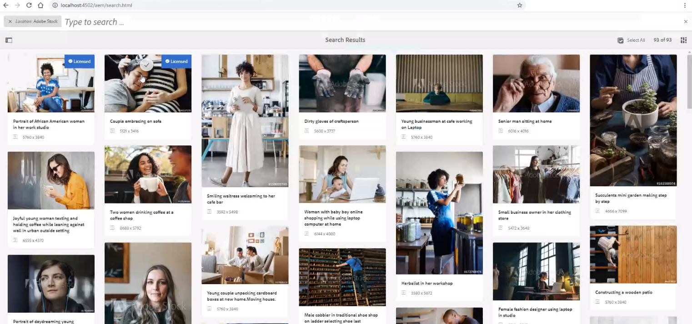

# Använd [!DNL Adobe Stock] resurser i [!DNL Adobe Experience Manager Assets] {#use-adobe-stock-assets-in-aem-assets}

| Version | Artikellänk |
| -------- | ---------------------------- |
| AEM 6.5 | [Klicka här](https://experienceleague.adobe.com/docs/experience-manager-65/assets/using/aem-assets-adobe-stock.html?lang=en) |
| AEM as a Cloud Service | Den här artikeln |

[!DNL Adobe Stock]-tjänsten ger designer och företag tillgång till miljontals utvalda och royaltyfria foton, vektorer, illustrationer, videor, mallar och 3D-resurser av hög kvalitet för alla kreativa projekt.

[!DNL Adobe Stock] för Enterprise-erbjudandet innehåller som standard delningsrättigheter i hela organisationen. När en mediefil har hämtats av en användare i organisationen kan andra användare i organisationen identifiera, hämta och använda den här mediefilen utan att behöva licensiera den igen. När en mediefil har licensierats av din organisation är rätten att använda den evig.

Organisationer kan integrera sin [!DNL Adobe Stock]-företagsplan med [!DNL Experience Manager Assets] för att se till att licensierade mediefiler finns tillgängliga i stor omfattning för kreativa projekt och marknadsföringsprojekt, med de kraftfulla resurshanteringsfunktionerna i [!DNL Experience Manager]. [!DNL Experience Manager]-användare kan snabbt hitta, förhandsgranska och licensiera Adobe Stock-resurser som har sparats i [!DNL Experience Manager], utan att lämna [!DNL Experience Manager]-gränssnittet.

## Krav för att integrera [!DNL Experience Manager] och [!DNL Adobe Stock] {#integrate-aem-and-adobe-stock}

[!DNL Experience Manager Assets] ger användarna möjlighet att söka efter, förhandsgranska, spara och licensiera [!DNL Adobe Stock]-resurser direkt från [!DNL Experience Manager].

Uppfyll följande krav för att aktivera den här integreringen:

* En [!DNL Experience Manager Assets] som körs som en [!DNL Cloud Service]-instans.
* En [!DNL Adobe Stock]-företagsplan.
* En användare med behörighet i [!DNL Admin Console] till standardproduktprofilen för Stock.
* En användare med behörighet till [!DNL Developer Access profile] för att skapa integrering i [!DNL Adobe Developer Console].

En [!DNL Adobe Stock]-företagsplan,

* Tillhandahåller produktberättigande för [!DNL Adobe Stock] (Stock som är anslutna till Experience Manager).
* Krediter som köpts in i [!DNL Adobe Admin Console] för ditt Stock-berättigande.
* Gör det möjligt att hantera krediter och licenser globalt inifrån [!DNL Adobe Admin Console].

I berättigandet finns en standardproduktprofil för [!DNL Adobe Stock] i [!DNL Admin Console]. Det går att skapa flera profiler, och de här profilerna avgör vem som kan licensiera Stock-mediefiler. En användare som har direktåtkomst till produktprofilen har åtkomst till [https://stock.adobe.com/](https://stock.adobe.com/) och kan licensiera Stock-mediefiler. Det finns ett annat sätt att använda Developer Access för att skapa en integrering (API). Integrationen autentiserar kommunikationen mellan [!DNL Experience Manager Assets] och [!DNL Adobe Stock].

<!--
### Create an IMS configuration {#create-an-ims-configuration}

1. In the [!DNL Experience Manager] user interface, navigate to **[!UICONTROL Tools]** > **[!UICONTROL Security]** > **[!UICONTROL Adobe IMS Configurations]**. Click **[!UICONTROL Create]** and select **[!UICONTROL Cloud Solution]** > **[!UICONTROL Adobe Stock]**.
1. Either reuse an existing certificate or select **[!UICONTROL Create new certificate]**.
1. Click **[!UICONTROL Create certificate]**. Once created, download the public key. Click **[!UICONTROL Next]**. Leave the [!UICONTROL Adobe IMS Technical Account Configuration] screen open to provide the required values shortly.
1. Access [Adobe Developer Console](https://console.adobe.io). Ensure that your account has administrator permissions for the organization for which the integration is required.
1. Click **[!UICONTROL Create new project]** and click **[!UICONTROL Add API]**. Select **[!UICONTROL Adobe Stock]** from the list of APIs that are available to you. Select [!UICONTROL OAUTH 2.0 Web].
1. Provide **[!UICONTROL Default redirect URI]** and **[!UICONTROL Redirect URI pattern]** values. Click **[!UICONTROL Save configured API]**. Copy the generated ID and secret.
1. In [!UICONTROL Adobe IMS Technical Account Configuration] screen, provide the values in the boxes titled **[!UICONTROL Title]**, **[!UICONTROL Authorization Server]**, **[!UICONTROL API Key]**, **[!UICONTROL Client Secret]**, and **[!UICONTROL Payload]**. For detailed information about these values, see [JWT authentication quick start](https://www.adobe.io/authentication/auth-methods.html#!AdobeDocs/adobeio-auth/master/JWT/JWT.md).
-->

<!-- 
TBD: Update the URL to update the terminology when AIO team updates their documentation URL. Logged issue github.com/AdobeDocs/adobeio-auth/issues/63.
-->

<!--
### Create [!DNL Adobe Stock] configuration in [!DNL Experience Manager] {#create-adobe-stock-configuration-in-aem}

1. In the [!DNL Experience Manager], navigate to **[!UICONTROL Tools]** > **[!UICONTROL Cloud Services]** > **[!UICONTROL Adobe Stock]**.
1. Click **[!UICONTROL Create]** to create a configuration and associate it with your existing IMS Configuration. Select `PROD` as the environment parameter.
1. In **[!UICONTROL Licensed Assets Path]** field, leave a location as is. Do not change the location where you want to store the [!DNL Adobe Stock] assets.
1. Complete creation by adding all the required properties. Click **[!UICONTROL Save & Close]**.
1. Add [!DNL Experience Manager] users or groups, who can license the assets.

>[!NOTE]
>
>If there are multiple [!DNL Adobe Stock] configurations, select the desired configuration in User Preferences panel. To access the panel from Experience Manager home page, click the user icon and then click **[!UICONTROL User Preferences]** > **[!UICONTROL Stock Configuration]**.
-->

## Integrera [!DNL Experience Manager] och [!DNL Adobe Stock] {#integrate-adobe-stock-with-aem-assets}

Som utvecklare utför du följande steg för att integrera [!DNL Adobe Experience Manager] och [!DNL Adobe Stock].

<!--
1. [Obtain public certificate](#public-certificate)
   
   In [!DNL Experience Manager], create an IMS account and generate a public certificate (public key).

1. [Create service account (JWT) connection](#createnewintegration) 
   
   In [!DNL Adobe Developer Console], create a project for your [!DNL Adobe Stock] organization. Under the project, configure an API using the public key to create a service account (JWT) connection. Get the service account credentials and JWT payload information.

1. [Configure IMS account](#create-ims-account-configuration)

   In [!DNL Experience Manager], configure the IMS account using the service account credentials and JWT payload.

1. [Configure cloud service](#configure-the-cloud-service)

   In [!DNL Experience Manager], configure an [!DNL Adobe Stock] cloud service using the IMS account.

### Create an IMS configuration {#create-an-ims-configuration}

The IMS configuration authenticates your [!DNL Experience Manager Assets] author instance with the [!DNL Adobe Stock] entitlement. 

IMS configuration includes two steps:

* [Obtain public certificate](#public-certificate) 
* [Configure IMS account](#create-ims-account-configuration)

### Obtain public certificate {#public-certificate}

The public key (certificate) authenticates your product profile in Adobe Developer Console.

1. Log in to your [!DNL Experience Manager Assets] cloud instance.

1. From the **[!UICONTROL Tools]** panel, navigate to **[!UICONTROL Security]** > **[!UICONTROL Adobe IMS Configurations]**.

1. In Adobe IMS Configurations page, click **[!UICONTROL Create]**. The **[!UICONTROL Adobe IMS Technical Account Configuration]** page opens. 

1. In the **[!UICONTROL Certificate]** tab, select **[!UICONTROL Adobe Stock]** from the **[!UICONTROL Cloud Solution]** drop-down list.  

1. You can create a certificate or reuse an existing certificate for the configuration. 

   To create a certificate, select the **[!UICONTROL Create new certificate]** check box and specify an **alias** for the public key. The alias serves as name of the public key. 

1. Click **[!UICONTROL Create certificate]**. Then, click **[!UICONTROL OK]** to generate the public key.

1. Click the **[!UICONTROL Download Public Key]** icon and save the public key (.crt) file on your machine. The public key is used later to configure API for your Brand Portal tenant and generate service account credentials in Adobe Developer Console.

   Click **[!UICONTROL Next]**.

   

1. In the **Account** tab, Adobe IMS account is created which requires the service account credentials.

   Open a new tab and [create a service account (JWT) connection in Adobe Developer Console](#createnewintegration). 

### Create service account (JWT) connection {#createnewintegration}

In Adobe Developer Console, projects and APIs are configured at organization level. Configuring an API creates a service account (JWT) connection. There are two methods to configure API, by generating a key pair (private and public keys) or by uploading a public key. In this example, the service account credentials are generated by uploading the public key.

To generate the service account credentials and JWT payload:

1. Log in to Adobe Developer Console with system administrator privileges. The default URL is [https://www.adobe.com/go/devs_console_ui](https://www.adobe.com/go/devs_console_ui).

   Ensure that you have selected the correct IMS organization (Stock entitlement) from the drop-down (organization) list.

1. Click **[!UICONTROL Create new project]**. A blank project with a system-generated name is created for your organization. 

   Click **[!UICONTROL Edit project]**. Update the **[!UICONTROL Project Title]** and **[!UICONTROL Description]**, and then click **[!UICONTROL Save]**.
   
1. In the **[!UICONTROL Project overview]** tab, click **[!UICONTROL Add API]**.

1. In the **[!UICONTROL Add an API window]**, select **[!UICONTROL Adobe Stock]**. Click **[!UICONTROL Next]**. 

1. In the **[!UICONTROL Configure API]** window, select **[!UICONTROL Service Account (JWT)]** authentication. Click **[!UICONTROL Next]**.

   

1. Click **[!UICONTROL Upload your public key]**. Click **[!UICONTROL Select a File]** and upload the public key (.crt file) that you have downloaded in the [obtain public certificate](#public-certificate) section. Click **[!UICONTROL Next]**.

1. Verify the public key and click **[!UICONTROL Next]**.

1. Select the default **[!UICONTROL Adobe Stock]** product profile and click **[!UICONTROL Save configured API]**. 

1. Once the API is configured, you are redirected to the API overview page. From the left navigation under **[!UICONTROL Credentials]**, click the **[!UICONTROL Service Account (JWT)]** option. Here, you can view the credentials and perform actions such as generate JWT tokens, copy credential details, and retrieve client secret.

1. From the **[!UICONTROL Client Credentials]** tab, copy the **[!UICONTROL client ID]**. 

   Click **[!UICONTROL Retrieve Client Secret]** and copy the **[!UICONTROL client secret]**.

   

1. Navigate to the **[!UICONTROL Generate JWT]** tab and copy the **[!UICONTROL JWT Payload]** information. 

You can now use the client ID (API key), client secret, and JWT payload to [configure the IMS account](#create-ims-account-configuration) in [!DNL Experience Manager Assets].

### Configure IMS account {#create-ims-account-configuration}

You must have the [certificate](#public-certificate) and [service account (JWT) credentials](#createnewintegration) to configure the IMS account.

To configure the IMS account: 

1. Open the IMS Configuration and navigate to the **[!UICONTROL Account]** tab. You kept the page open while [obtaining the public certificate](#public-certificate).

1. Specify a **[!UICONTROL Title]** for the IMS account.

   In the **[!UICONTROL Authorization Server]** field, enter the URL: [https://ims-na1.adobelogin.com/](https://ims-na1.adobelogin.com/).  

   Enter the client ID in the **[!UICONTROL API key]** field, **[!UICONTROL Client Secret]**, and **[!UICONTROL Payload]** (JWT payload) that you have copied while [creating the service account (JWT) connection](#createnewintegration).

1. Click **[!UICONTROL Create]**. An IMS account configuration is created. 

   
   
1. Select the IMS account configuration and click **[!UICONTROL Check Health]**.

   Click **[!UICONTROL Check]** in the dialog box. On successful configuration, a message appears that the *Token is retrieved successfully*.

   
-->

1. [Konfigurera ett program i  [!DNL Developer Console]](#set-up-a-program-in-developer-console)
1. [Lägg till konfiguration i  [!DNL AEM] författarinstansen](#add-configuration-in-the-aem-author-instance)

### Konfigurera ett program i [!DNL Developer Console] {#set-up-a-program-in-developer-console}

Utför följande steg för att konfigurera ett program i [!DNL Developer Console]:
1. Navigera till [[!DNL Adobe Developer Console]](https://developer.adobe.com/console/14431/user/servicesandapis) och logga in på din organisation.
1. Välj **[!UICONTROL Create new project]** som är tillgänglig på kontrollpanelen **[!UICONTROL Projects]**.
   
1. Klicka på **[!UICONTROL Add to project]** och välj **[!UICONTROL API]**.
1. Markera **[!UICONTROL Adobe Stock]** och klicka på **[!UICONTROL Next]**.
1. Ange en **[!UICONTROL Credential name]** och verifiera att **[!UICONTROL OAuth Server-to-Server]** är markerad och klicka på **[!UICONTROL Next]**.
1. Välj **[!UICONTROL AEM Assets]** **[!UICONTROL Product profile]** och klicka på **[!UICONTROL Save Configured API]**. Ett meddelande visas som bekräftar att du har skapat ett projekt i [!DNL Developer Console]. Projektets kontrollpanel öppnas och projektnamnet visas högst upp, **[!UICONTROL Adobe Stock]** under **[!UICONTROL APIS]** och **[!UICONTROL AEM Assets]** under **[!UICONTROL Product profile]** och **[!UICONTROL OAuth Server-to-Server]** under **[!UICONTROL Connected credentials]**.
   
1. Välj autentiseringskortet **[!UICONTROL OAuth Server-to-Server]** så visas **[!UICONTROL Credential details]**. Använd dessa [!DNL OAuth Server-to-Server]-autentiseringsuppgifter för ditt projekt, till exempel **[!UICONTROL Client ID]**, **[!UICONTROL Client Secret]**, **[!UICONTROL Scope]**, **[!UICONTROL Credential Name]**, **[!UICONTROL Technical Account ID]**, **[!UICONTROL Organization ID]** för att [lägga till konfiguration i AEM-författarinstansen](#add-configuration-in-the-aem-author-instance).
   

### Lägg till konfiguration i författarinstansen [!DNL AEM] {#add-configuration-in-the-aem-author-instance}

Utför följande steg för att lägga till konfiguration i [!DNL AEM]-författarinstansen:

1. [Konfigurera en ny [!DNL Adobe Stock IMS configuration] i din [!DNL AEM] författarinstans](#set-up-adobe-stock-ims-configuration-in-aem-author-instance)
1. [Lägg till molnkonfigurationen för att ansluta till  [!DNL Adobe Stock]](#add-cloud-configuration-to-connect-adobe-stock)

#### Konfigurera en ny [!DNL Adobe Stock IMS configuration] i din [!DNL AEM author]-instans {#set-up-adobe-stock-ims-configuration-in-aem-author-instance}

Utför följande steg för att konfigurera en ny [!DNL Adobe Stock IMS configuration] i [!DNL AEM]-författarinstansen:
1. Navigera till [!DNL AEM]-författarinstansen.
1. Klicka på , välj **[!UICONTROL Security]** och välj **[!UICONTROL Adobe IMS Configurations]**.
1. Klicka på **[!UICONTROL Create]** om du vill skapa en ny IMS-konfiguration. På sidan **[!UICONTROL Adobe IMS Technical Account Configuration]** visas flera fält, till exempel **[!UICONTROL Cloud Solution]**, **[!UICONTROL Title]**, **[!UICONTROL Authorization Server]**, **[!UICONTROL Client ID]**, **[!UICONTROL Client Secret]**, **[!UICONTROL Scope]** och **[!UICONTROL Org ID]**. Följ de här instruktionerna för att ange information i dessa fält:
   * **[!UICONTROL Cloud Solution]**: Välj **[!UICONTROL Adobe Stock]**.
   * **[!UICONTROL Title]**: Ange ett namn för den här integreringen.
   * **[!UICONTROL Authorization Server]**: Lägg till [https://ims-na1.adobelogin.com/](https://ims-na1.adobelogin.com/) som auktoriseringsserver.
   * **[!UICONTROL Client ID]**: Navigera till din projektkontrollpanel, klicka på alternativet **[!UICONTROL OAuth Server-to-Server]** i den vänstra rutan, markera **[!UICONTROL Credential details]**, kopiera **[!UICONTROL Client ID]** och klistra in den här (se [steg 7](#set-up-a-program-in-developer-console)).

   * **[!UICONTROL Client Secret]**: Navigera till din projektkontrollpanel, klicka på alternativet **[!UICONTROL OAuth Server-to-Server]** i den vänstra rutan, markera **[!UICONTROL Credential details]**, klicka på **[!UICONTROL Retrieve Client Secret]**, kopiera **[!UICONTROL client secret]** och klistra in den här (se [steg 7](#set-up-a-program-in-developer-console)).

   * **[!UICONTROL Scope]**: Navigera till din projektkontrollpanel, klicka på alternativet **[!UICONTROL OAuth Server-to-Server]** i den vänstra rutan, markera **[!UICONTROL Credential details]**, kopiera **[!UICONTROL Scope]** och klistra in den här (se [steg 7](#set-up-a-program-in-developer-console)).

   * **[!UICONTROL Org ID]**: Navigera till din projektkontrollpanel, klicka på alternativet **[!UICONTROL OAuth Server-to-Server]** i den vänstra rutan, markera **[!UICONTROL Credential details]**, kopiera **[!UICONTROL Organization ID]** och klistra in den här (se [steg 7](#set-up-a-program-in-developer-console)).
     
1. Klicka på **[!UICONTROL Create]** så öppnas sidan **[!UICONTROL Adobe IMS Configurations]** och visar den [!DNL Adobe Stock]-integrering som du har skapat.

#### Lägg till molnkonfigurationen för att ansluta till [!DNL Adobe Stock] {#add-cloud-configuration-to-connect-adobe-stock}

Utför följande steg för att lägga till molnkonfigurationen för att ansluta till [!DNL Adobe Stock]:

1. Navigera till din [!DNL AEM author]-instans.
1. Klicka på , välj **[!UICONTROL Cloud Services]**, bläddra och välj **[!UICONTROL Adobe Stock]**.
   
1. Klicka på **[!UICONTROL Create]** så visas flera fält på sidan **[!UICONTROL Adobe Stock Configuration]**. Följ de här instruktionerna för att ange information i dessa fält:
   * **[!UICONTROL Title]**: Navigera till sidan **[!UICONTROL Adobe IMS Technical Account Configuration]** (se [steg 3](#set-up-adobe-stock-ims-configuration-in-aem-author-instance)), kopiera titeln och klistra in den här.
   * **[!UICONTROL Associated Adobe IMS Configuration]**: Välj den [!DNL Adobe Stock]-integrering som du skapade.
   * **[!UICONTROL Locale]**: Välj **[!UICONTROL English (United States)]**.
1. Klicka på **[!UICONTROL Save & Close]**.
   

<!--
### Configure cloud service {#configure-the-cloud-service}

To configure the [!DNL Adobe Stock] cloud service:

1. In the [!DNL Experience Manager] user interface, navigate to **[!UICONTROL Tools]** > **[!UICONTROL Cloud Services]** > **[!UICONTROL Adobe Stock]**.

1. In the [!DNL Adobe Stock Configurations] page, click **[!UICONTROL Create]**.

1. Specify a **[!UICONTROL Title]** for the cloud configuration. 

   Select the IMS configuration that you have created while [configuring the IMS account](#create-ims-account-configuration).

   Select your locale from the drop-down list.

   

1. Click **[!UICONTROL Save & Close]**. 
-->
Din [!DNL Experience Manager Assets]-författarinstans är nu integrerad med [!DNL Adobe Stock]. Du kan skapa flera [!DNL Adobe Stock]-konfigurationer (till exempel språkbaserade konfigurationer). Du kan nu komma åt, söka efter och licensiera [!DNL Adobe Stock]-resurserna inifrån användargränssnittet i [!DNL Experience Manager].

>[!NOTE]
>
>I det här skedet av integreringen kan bara administratörer komma åt [!DNL Adobe Stock]-resurserna, söka efter Stock-resurser (med omvärldsbevakning) och licensiera [!DNL Adobe Stock]-resurserna.
>
>Administratörer kan lägga till användare eller grupper ytterligare i molntjänsten [!DNL Adobe Stock] och ge dessa icke-adminanvändare i [!DNL Experience Manager] behörighet att komma åt Stock-konfigurationen.

1. Om du vill lägga till användare eller grupper väljer du molnkonfigurationen [!DNL Adobe Stock] och klickar på **[!UICONTROL Properties]**.

1. Sök för att lägga till de användare eller grupper som du har tilldelat behörighet att komma åt Adobe Stock-konfigurationen. Se [tilldela behörigheter till användargruppen](#assign-permissions-to-group).

## Tilldela behörigheter till användargruppen {#assign-permissions-to-group}

Administratörer kan skapa användargrupper och ge behörigheter till vissa användare eller grupper för åtkomst till molntjänsten [!DNL Adobe Stock].

Följande behörigheter krävs för att en användare ska kunna söka efter och licensiera Adobe Stock-resurser:

* Konfigurera sökvägen: `/conf/global/settings/stock`
* Behörigheter: `jcr:read`
* Behörighetstyp: `Allow`

Du kan skapa en användargrupp eller tilldela behörigheter till en befintlig användargrupp. Behörigheter kan tilldelas från gränssnittet [!DNL Experience Manager Assets] eller från konsolen [!DNL User Admin].

**För att ge åtkomst till en användargrupp från [!DNL Experience Manager]:**

1. Navigera till **[!UICONTROL Tools]** > **[!UICONTROL Security]** > **[!UICONTROL Groups]** i användargränssnittet för [!DNL Experience Manager]. Skapa en användargrupp för [!DNL Adobe Stock].

1. Navigera till **[!UICONTROL Tools]** > **[!UICONTROL Security]** > **[!UICONTROL Permissions]**.

1. Sök efter användargruppen i den vänstra panelen och lägg till nya **[!UICONTROL Access Control Entry (ACE)]** för Adobe Stock.

   * Konfigurera sökvägen: `/conf/global/settings/stock`
   * Behörigheter: `jcr:read`
   * Behörighetstyp: `Allow`

   Klicka på **[!UICONTROL Add]**.

   

1. Navigera till **[!UICONTROL Tools]** > **[!UICONTROL Cloud Services]** > **[!UICONTROL Adobe Stock]**. Välj molnkonfigurationen [!DNL Adobe Stock] och klicka på **[!UICONTROL Properties]**.

1. Lägg till den skapade användargruppen i konfigurationen för [!DNL Adobe Stock]. Klicka på **[!UICONTROL Save & Close]**.

   

**För att ge åtkomst till en användare från [!DNL User Admin Console]:**

1. Öppna Admin Console för [!DNL Experience Manager]-användare. Standardwebbadressen är `http://localhost:4502/userdamin`.

1. I den vänstra panelen söker du efter användaren genom att ange `user_id` eller `name`. Dubbelklicka för att öppna användaregenskaperna.

1. Navigera till fliken **[!UICONTROL Permissions]** och tillåt `read` behörigheter för molnkonfigurationen [!DNL Adobe Stock]: `/conf/global/settings/stock`.

   >[!CAUTION]
   >
   >Om molnkonfigurationen inte tillåts kan användaren bara komma åt **[!UICONTROL Assets]** i [!DNL Experience Manager]-gränssnittet.
   >
   >Om du vill tillåta åtkomst till [!UICONTROL Assets] och [!DNL Adobe Stock] resurser kontrollerar du att molnkonfigurationen tillåts för användaren.

1. Klicka på **[!UICONTROL Save]** för att uppdatera behörigheterna.

   

1. Lägg till användaren eller gruppen i molnkonfigurationen [!DNL Adobe Stock].

## Få tillgång till Adobe Stock-resurser {#access-stock-assets}

En icke-admin-användare som har behörighet till molnkonfigurationen [!DNL Adobe Stock] kan söka efter och licensiera [!DNL Adobe Stock]-resurserna från gränssnittet [!DNL Experience Manager].

Användaren måste utföra ett extra steg för att aktivera molnkonfigurationen [!DNL Adobe Stock] innan [!DNL Adobe Stock]-resurserna kan nås. Det är en engångsaktivitet. Om användaren har tilldelats behörigheter för flera [!DNL Adobe Stock] molnkonfigurationer kan användaren välja önskad konfiguration från **[!UICONTROL User Preferences]**.

Så här aktiverar du molnkonfigurationen [!DNL Adobe Stock]:

1. Logga in på [!DNL Experience Manager].

1. Klicka på användarikonen i det övre högra hörnet och klicka sedan på **[!UICONTROL My Preferences]**. Fönstret **[!UICONTROL User Preferences]** öppnas.

1. Välj önskad **[!UICONTROL Stock Configuration]** i listrutan och klicka på **[!UICONTROL Accept]** för att aktivera konfigurationen.

   

1. Navigera till **[!UICONTROL Assets]** > **[!UICONTROL Adobe Stock]**. Du kan nu visa, söka efter och licensiera [!DNL Adobe Stock] resurser.

I följande tabell beskrivs hur användarbehörigheterna fungerar när resurserna i [!DNL Adobe Stock] används:

| Användare | Grupp | Behörigheter | Acceptera Stock-konfigurationen i användarinställningarna | Använd Assets | Använd Adobe Stock |
| --- | --- | --- | --- | --- | --- |
| admin | Ej tillämpligt | Alla | Ej tillämpligt | Ja | Ja |
| test-doc1 | DAM-användare | /conf/global/settings/stock/cloud-config | Ja | Ja | Ja |
| test-doc1 | DAM-användare | /conf/global/settings/stock/cloud-config | Nej | Fel: Det gick inte att läsa in data | Nej |
| test-doc1 | DAM-användare | **allow**: /conf/global/settings/stock **deny**: /cloud-config | Stock-konfigurationen visas inte | Ja | Nej |

## Använd och hantera [!DNL Adobe Stock]-resurser i [!DNL Experience Manager] {#usemanage}

Med den här funktionen kan organisationer tillåta sina användare att arbeta med [!DNL Adobe Stock]-resurser i [!DNL Experience Manager Assets]. I användargränssnittet [!DNL Experience Manager] kan användare söka efter [!DNL Adobe Stock] resurser och licensiera de nödvändiga resurserna.

När en [!DNL Adobe Stock]-resurs har licensierats i [!DNL Experience Manager] kan den användas och hanteras som en vanlig resurs. I [!DNL Experience Manager] kan användarna söka efter och förhandsgranska resurserna, kopiera och publicera resurserna, dela resurserna på [!DNL Brand Portal], komma åt och använda resurserna via [!DNL Experience Manager] skrivbordsappen och så vidare.

![Sök efter [!DNL Adobe Stock] resurser och filtrera resultat från din [!DNL Adobe Experience Manager]-arbetsyta](assets/adobe-stock-search-results-workspace.png)

**A.** Sök efter resurser som liknar de resurser vars [!DNL Adobe Stock]-ID anges. **B.** Sök efter resurser som matchar ditt val av form eller orientering. **C.** Sök efter en eller flera resurstyper som stöds **D.** Öppna eller komprimera filterfönstret **E.** Licensiera och spara den valda resursen i [!DNL Experience Manager] **F.** Spara resursen i [!DNL Experience Manager] med vattenstämpel **G.** Utforska resurser på webbplatsen [!DNL Adobe Stock] som liknar den valda resursen **}H.** Visa de markerade resurserna på [!DNL Adobe Stock] webbplatsen **I.** Antal markerade resurser från sökresultaten **J.** Växla mellan kortvyn och listvyn

### Hitta resurser {#find-assets}

Dina [!DNL Experience Manager]-användare kan söka efter resurser i både [!DNL Experience Manager] och [!DNL Adobe Stock]. När sökplatsen inte är begränsad till [!DNL Adobe Stock] visas sökresultaten från [!DNL Experience Manager] och [!DNL Adobe Stock].

* Om du vill söka efter [!DNL Adobe Stock] resurser klickar du på **[!UICONTROL Navigation]** > **[!UICONTROL Assets]** > **[!UICONTROL Search Adobe Stock]**.

* Om du vill söka efter resurser i [!DNL Adobe Stock] och [!DNL Experience Manager Assets] klickar du på Sök .

Du kan också börja skriva `Location: Adobe Stock` i sökfältet för att välja [!DNL Adobe Stock] resurser. [!DNL Experience Manager] har avancerade filtreringsfunktioner för de sökda resurserna, vilket gör att användare snabbt kan nollställa de nödvändiga resurserna med hjälp av filter, som typer av resurser som stöds, bildorientering och licensierat tillstånd.

>[!NOTE]
>
>Assets som söks igenom från [!DNL Adobe Stock] visas i [!DNL Experience Manager]. [!DNL Adobe Stock] resurser hämtas och lagras i [!DNL Experience Manager]-databasen först när en användare antingen [sparar en resurs](/help/assets/aem-assets-adobe-stock.md#saveassets) eller [licenser och sparar en resurs](/help/assets/aem-assets-adobe-stock.md#licenseassets). Assets som redan är lagrade i [!DNL Experience Manager] visas och markeras för att underlätta referens och åtkomst. Dessutom sparas [!DNL Stock]-resurserna med ytterligare metadata för att ange källan som [!DNL Stock].

![Sökfilter i [!DNL Experience Manager] och markerade [!DNL Adobe Stock] resurser i sökresultat](assets/aem-search-filters2.jpg)

### Spara och visa de resurser som behövs {#saveassets}

Välj en resurs som du vill spara i [!DNL Experience Manager]. Klicka på [!UICONTROL Save] i verktygsfältet högst upp och ange resursens namn och plats. De olicensierade resurserna sparas lokalt med en vattenstämpel.

Nästa gång du söker efter resurser markeras de sparade resurserna med ett märke som anger att sådana resurser är tillgängliga i [!DNL Experience Manager Assets].

>[!NOTE]
>
>De nyligen tillagda resurserna visas med märket Nytt i stället för Licensierad.

### Licensiera resurser {#licenseassets}

Användare kan licensiera [!DNL Adobe Stock] resurser genom att använda kvoten för deras [!DNL Adobe Stock] Enterprise-plan. När du licensierar en resurs sparas den utan vattenstämpel och är tillgänglig för sökning och användning i [!DNL Experience Manager Assets].

![Dialogruta där du kan licensiera och spara [!DNL Adobe Stock] resurser i [!DNL Experience Manager Assets]](assets/aem-stock_licenseandsave.jpg)

### Få åtkomst till metadata och resursegenskaper {#access-metadata-and-asset-properties}

Användare kan komma åt och förhandsgranska metadata, inklusive [!DNL Adobe Stock]-metadataegenskaperna för resurserna som sparats i [!DNL Experience Manager], och lägga till **[!UICONTROL License References]** för en resurs. Uppdateringarna av licensreferensen synkroniseras dock inte mellan [!DNL Experience Manager] och [!DNL Adobe Stock]-webbplatsen.

Användarna kan se egenskaperna för både, licensierade och olicensierade resurser.

## Kända begränsningar {#known-limitations}

* **Funktioner för att begränsa användare från licensiering fungerar inte korrekt**: Alla användare med `read` behörighet för Stock-konfigurationen kan söka efter och licensiera [!DNL Adobe Stock]-resurserna.

* **Icke-adminanvändare måste manuellt aktivera [!DNL Adobe Stock] molnkonfigurationen**: I fönstret **[!UICONTROL User Preferences]** visar **[!UICONTROL Stock Configuration]** molnkonfigurationen [!DNL Adobe Stock] som aktiverad, men den fungerar inte för icke-adminanvändare. Användaren måste klicka på knappen **[!UICONTROL Accept]** för att aktivera Stock-konfigurationen. Om det här steget inte är slutfört visas ett felmeddelande om åtkomst till **[!UICONTROL Assets]**.

* **Varning om redigerbar bild visas inte**: När en bild licensieras kan användare inte kontrollera om bilden endast är redigerbar. För att förhindra eventuell felaktig användning kan administratören stänga av åtkomsten till redaktionella mediefiler från Admin Console.

* **Fel licenstyp visas**: Det är möjligt att en felaktig licenstyp visas i [!DNL Experience Manager] för en resurs. Användarna kan logga in på webbplatsen [!DNL Adobe Stock] för att se licenstypen.

* **Referensfält och metadata synkroniseras inte**: När en användare uppdaterar ett licensreferensfält uppdateras licensreferensinformationen i [!DNL Experience Manager] men inte på webbplatsen [!DNL Adobe Stock]. Om användaren uppdaterar referensfälten på webbplatsen [!DNL Adobe Stock] synkroniseras inte uppdateringarna i [!DNL Experience Manager].

<!--
## Use and manage [!DNL Adobe Stock] assets in [!DNL Experience Manager] {#usemanage}

Using this capability, organizations users can work using [!DNL Adobe Stock] assets in [!DNL Experience Manager Assets]. From within the [!DNL Experience Manager] user interface, users can search [!DNL Adobe Stock] assets and license the required assets.

Once an [!DNL Adobe Stock] asset is licensed in [!DNL Experience Manager], it can be used and managed like a typical asset. In [!DNL Experience Manager], the users can search and preview the assets; copy and publish the assets; share the assets on [!DNL Brand Portal]; access and use the assets via [!DNL Experience Manager] desktop app; and so on.
-->

<!--  

*Figure: Search for [!DNL Adobe Stock] assets and filter results from your [!DNL Experience Manager] interface.*

**A.** Search assets similar to the assets whose [!DNL Adobe Stock] ID is provided. **B.** Search assets that match your selection of shape or orientation. **C.** Search for one of more supported asset types **D.** Open or collapse the filters pane **E.** License and save the selected asset in [!DNL Experience Manager] **F.** Save the asset in [!DNL Experience Manager] with watermark **G.** Explore assets on [!DNL Adobe Stock] website that are similar to the selected asset **H.** View the selected assets on [!DNL Adobe Stock] website **I.** Number of selected assets from the search results **J.** Switch between Card view and List view -->

<!--
### Find assets {#find-assets}

Your [!DNL Experience Manager] users, can search for assets in both, [!DNL Experience Manager] and [!DNL Adobe Stock]. When the search location is not limited to [!DNL Adobe Stock], the search results from [!DNL Experience Manager] and [!DNL Adobe Stock] are displayed.

* To search for [!DNL Adobe Stock] assets, click **[!UICONTROL Navigation]** > **[!UICONTROL Assets]** > **[!UICONTROL Search Adobe Stock]**.

* To search for assets across [!DNL Adobe Stock] and [!DNL Experience Manager Assets], click search .

Alternatively, start typing `Location: Adobe Stock` in the search bar to select [!DNL Adobe Stock] assets. [!DNL Experience Manager] offers advanced filtering capabilities on the searched assets, allowing users to quickly zero-in on the required assets using filters, such as types of supported assets, image orientation, and licensed state.

>[!NOTE]
>
>Assets searched from [!DNL Adobe Stock] are just displayed in [!DNL Experience Manager]. [!DNL Adobe Stock] assets are fetched and stored in [!DNL Experience Manager] repository only after a user either [saves an asset](/help/assets/aem-assets-adobe-stock.md#saveassets) or [licenses and saves an asset](/help/assets/aem-assets-adobe-stock.md#licenseassets). Assets that are already stored in [!DNL Experience Manager] are displayed and highlighted for ease of reference and access. Also, the [!DNL Stock] assets are saved with some additional metadata to indicate the source as [!DNL Stock].

*Figure: Search filters in [!DNL Experience Manager] and highlighted [!DNL Adobe Stock] assets in search results.*

### Save and view the required assets {#saveassets}

Select an asset that you want to save in [!DNL Experience Manager]. Click [!UICONTROL Save] in the toolbar at the top and provide the name and location of the asset. The unlicensed assets are saved locally with a watermark.

Next time when you search for assets, the saved assets are highlighted with a badge, to indicate that such assets are available in [!DNL Experience Manager Assets].

>[!NOTE]
>
>The recently added assets display a New badge instead of Licensed badge.

### License assets {#licenseassets}

Users can license [!DNL Adobe Stock] assets by using the quota of their [!DNL Adobe Stock] enterprise plan. When you license an asset, it is saved without a watermark and is available for searching and using in [!DNL Experience Manager Assets].

*Figure: Dialog to license and save [!DNL Adobe Stock] assets in [!DNL Experience Manager Assets].*

### Access metadata and asset properties {#access-metadata-and-asset-properties}

Users can access and preview the metadata, including the [!DNL Adobe Stock] metadata properties for the assets saved in [!DNL Experience Manager], and add **[!UICONTROL License References]** for an asset. However, the updates to license reference are not synced between [!DNL Experience Manager] and [!DNL Adobe Stock] website.

Users can see the properties for both, licensed and unlicensed assets.

*Figure: View and access metadata and license references of saved assets.*

## Known limitations {#known-limitations}

* **Editorial image warning is not displayed**: When licensing an image, users cannot check if an image is Editorial Use Only. To prevent possible misuse, the administrators can turn off the access to editorial assets from the Admin Console.

* **Wrong license type is displayed**: It is possible that an incorrect license type is displayed in [!DNL Experience Manager] for an asset. Users can log into the [!DNL Adobe Stock] website to see the license type.

* **Reference fields and metadata are not synced**: When a user updates a license reference field, the license reference information is updated in [!DNL Experience Manager] but not on the [!DNL Adobe Stock] website. Similarly, if the user updates the reference fields on the [!DNL Adobe Stock] website, the updates are not synchronized in [!DNL Experience Manager].
-->

**Se även**

* [Översätt Assets](translate-assets.md)
* [ASSETS HTTP API](mac-api-assets.md)
* [Filformat som stöds av Assets](file-format-support.md)
* [Sök resurser](search-assets.md)
* [Anslutna resurser](use-assets-across-connected-assets-instances.md)
* [Resursrapporter](asset-reports.md)
* [Metadata-scheman](metadata-schemas.md)
* [Hämta resurser](download-assets-from-aem.md)
* [Hantera metadata](manage-metadata.md)
* [Sök efter ansikten](search-facets.md)
* [Hantera samlingar](manage-collections.md)
* [Import av massmetadata](metadata-import-export.md)
* [Publicera Assets till AEM och Dynamic Media](/help/assets/publish-assets-to-aem-and-dm.md)

>[!MORELIKETHIS]
>
>* [Videosjälvstudiekurs om hur du använder Adobe Stock-resurser med Experience Manager Assets](https://experienceleague.adobe.com/docs/experience-manager-learn/assets/creative-workflows/adobe-stock.html)
>* [Adobe Stock Enterprise Plan - hjälp](https://helpx.adobe.com/enterprise/using/adobe-stock-enterprise.html)
>* [Vanliga frågor om Adobe Stock](https://helpx.adobe.com/stock/faq.html)
