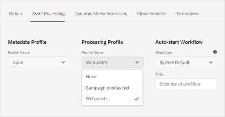

# Använd resursmikrotjänster och bearbetningsprofiler {#get-started-using-asset-microservices}

Resursmikrotjänster ger skalbar och flexibel bearbetning av resurser med molnbaserade program (kallas även arbetare). Adobe hanterar tjänsterna för optimal hantering av olika tillgångstyper och bearbetningsalternativ.

Med resursmikrotjänster kan du bearbeta ett [stort antal filtyper](/help/assets/file-format-support.md) som omfattar fler format som är klara än vad som är möjligt med tidigare versioner av [!DNL Experience Manager]. Exempelvis är det nu möjligt att extrahera PSD- och PSB-format med miniatyrbilder som tidigare krävde tredjepartslösningar som ImageMagick.

Resursbearbetningen beror på konfigurationen i **[!UICONTROL Processing Profiles]**. Experience Manager har en grundläggande standardkonfiguration och låter administratörer lägga till mer specifik konfiguration för bearbetning av resurser. Administratörer kan skapa, underhålla och ändra konfigurationerna för efterbehandlingsarbetsflöden, inklusive valfri anpassning. Genom att anpassa arbetsflödena kan utvecklarna utöka standarderbjudandet.

<!-- Proposed DRAFT diagram for asset microservices flow - see section "asset-microservices-flow.png (asset-microservices-configure-and-use.md)" in the PPTX deck

https://adobe-my.sharepoint.com/personal/gklebus_adobe_com/_layouts/15/guestaccess.aspx?guestaccesstoken=jexDC5ZnepXSt6dTPciH66TzckS1BPEfdaZuSgHugL8%3D&docid=2_1ec37f0bd4cc74354b4f481cd420e07fc&rev=1&e=CdgElS
-->

>[!NOTE]
>
>Resursbearbetningen som beskrivs här ersätter arbetsflödesmodellen `DAM Update Asset` som finns i tidigare versioner av [!DNL Experience Manager]. De flesta standardstegen för generering av återgivning och metadatarelaterade steg ersätts av bearbetningen av resursmikrotjänsterna, och eventuella återstående steg kan ersättas av arbetsflödeskonfigurationen för efterbearbetning.

## Förstå alternativ för tillgångsbearbetning {#get-started}

Experience Manager tillåter följande bearbetningsnivåer.

| Alternativ | Beskrivning | Användningsexempel |
|---|---|---|
| [Standardkonfiguration](#default-config) | Den är tillgänglig som den är och kan inte ändras. Den här konfigurationen har mycket grundläggande funktioner för att skapa renderingar. | <ul> <li>Standardminiatyrbilder som används i användargränssnittet för [!DNL Assets] (48, 140 och 319 pixlar) </li> <li> Stor förhandsgranskning (webbåtergivning - 1 280 pixlar) </li><li> Metadata och textrahering.</li></ul> |
| [Anpassad konfiguration](#standard-config) | Konfigureras av administratörer via användargränssnittet. Ger fler alternativ för generering av återgivning genom att utöka standardalternativet. Utöka det färdiga alternativet om du vill ha olika format och renderingar. | <ul><li>FPO-återgivning. </li> <li>Ändra filformat och upplösning för bilder</li> <li> Tillämpa villkoren på konfigurerade filtyper. </li> </ul> |
| [Egen profil](#custom-config) | Konfigureras av administratörer via användargränssnittet för att använda anpassad kod via anpassade program för att anropa [tjänsten Asset compute](https://experienceleague.adobe.com/docs/asset-compute/using/introduction.html). Stöder mer komplexa krav med en molnbaserad och skalbar metod. | Se [tillåtna användningsfall](#custom-config). |

<!-- To create custom processing profiles specific to your custom requirements, say to integrate with other systems, see [post-processing workflows](#post-processing-workflows).
-->

## Filformat som stöds {#supported-file-formats}

Resursmikrotjänsterna har stöd för en mängd olika filformat för att bearbeta, generera renderingar eller extrahera metadata. I [Filformat som stöds](file-format-support.md) finns en fullständig lista över MIME-typer och de funktioner som stöds för varje typ.

## Standardkonfiguration {#default-config}

Vissa standardinställningar är förkonfigurerade för att säkerställa att standardåtergivningarna som krävs i Experience Manager är tillgängliga. Standardkonfigurationen ser också till att metadataextrahering och textrahering är tillgängliga. Användare kan börja ladda upp eller uppdatera resurser direkt och grundläggande bearbetning är tillgänglig som standard.

Med standardkonfigurationen konfigureras bara den mest grundläggande bearbetningsprofilen. En sådan bearbetningsprofil visas inte i användargränssnittet och du kan inte ändra den. Det körs alltid för att bearbeta överförda resurser. En sådan standardbearbetningsprofil säkerställer att den grundläggande bearbetning som krävs av [!DNL Experience Manager] är slutförd för alla resurser.

<!-- 
-->

## Standardkonfiguration {#standard-config}

[!DNL Experience Manager] har funktioner för att generera mer specifika renderingar för vanliga format efter användarens behov. En administratör kan skapa ytterligare [!UICONTROL Processing Profiles] för att underlätta skapandet av en sådan återgivning. Användarna tilldelar sedan en eller flera av de tillgängliga profilerna till specifika mappar för att få den ytterligare bearbetningen klar. Den extra bearbetningen kan till exempel generera renderingar för webben, mobiler och surfplattor. I följande video visas hur du skapar och använder [!UICONTROL Processing Profiles] och hur du får åtkomst till de skapade återgivningarna.

* **Återgivningens bredd och höjd**: Specifikationen för återgivningens bredd och höjd ger maximala storlekar för den genererade utdatabilden. Resursmikrotjänsterna försöker skapa den största möjliga återgivningen, som inte är större än den angivna bredden och höjden. Proportionerna bevaras, det vill säga de ursprungliga. Ett tomt värde innebär att resursbearbetningen baseras på originalets pixeldimension.

* **Inkluderingsregler** för MIME-typ: När en resurs med en viss MIME-typ bearbetas kontrolleras MIME-typen först mot det utelämnade MIME-typvärdet för återgivningsspecifikationen. Om den matchar den listan genereras inte den här specifika återgivningen för resursen (blockeringslista). Annars kontrolleras MIME-typen mot den inkluderade MIME-typen, och om den matchar listan genereras återgivningen (tillåtelselista).

* **Särskild FPO-återgivning**: När man monterar stora resurser  [!DNL Experience Manager] i  [!DNL Adobe InDesign] dokument väntar formgivarna en hel tid efter att de har  [monterat materialet](https://helpx.adobe.com/indesign/using/placing-graphics.html). Samtidigt blockeras användaren från att använda [!DNL InDesign]. Detta stör det kreativa flödet och påverkar användarupplevelsen negativt. Med Adobe kan du tillfälligt placera små återgivningar i [!DNL InDesign]-dokument till att börja med, vilket kan ersättas med högupplösta resurser vid behov senare. [!DNL Experience Manager] innehåller återgivningar som endast används för placering (FPO). Dessa FPO-återgivningar har en liten filstorlek men har samma proportioner.

Bearbetningsprofilen kan innehålla en FPO-återgivning (endast för placering). Se [!DNL Adobe Asset Link] [dokumentation](https://helpx.adobe.com/se/enterprise/using/manage-assets-using-adobe-asset-link.html) om du behöver aktivera den för din bearbetningsprofil. Mer information finns i [Adobe Asset Link complete documentation](https://helpx.adobe.com/enterprise/using/adobe-asset-link.html).

### Skapa en standardprofil {#create-standard-profile}

Så här skapar du en standardbearbetningsprofil:

1. Administratörer har åtkomst till **[!UICONTROL Tools]** > **[!UICONTROL Assets]** > **[!UICONTROL Processing Profiles]**. Klicka på **[!UICONTROL Create]**.
1. Ange ett namn som hjälper dig att identifiera profilen unikt när du använder den i en mapp.
1. Aktivera **[!UICONTROL Create FPO Rendition]** på fliken **[!UICONTROL Standard]** för att generera FPO-återgivningar. Ange ett **[!UICONTROL Quality]**-värde mellan 1 och 100.
1. Om du vill generera andra återgivningar klickar du på **[!UICONTROL Add New]** och anger följande information:

   * Filnamn för varje återgivning.
   * Filformat (PNG, JPEG, GIF eller WebP) för varje återgivning.
   * Bredd och höjd i pixlar för varje återgivning. Om värdena inte anges används den ursprungliga bildens fullständiga pixelstorlek.
   * Kvalitet i procent av varje JPEG- och WebP-återgivning.
   * Inkluderade och exkluderade MIME-typer för att definiera en profils tillämplighet.

   

1. Klicka på **[!UICONTROL Save]**.

<!-- TBD: Update the video link when a new video is available from Tech Marketing.

The following video demonstrates the usefulness and usage of standard profile.

>[!VIDEO](https://video.tv.adobe.com/v/29832?quality=9)
-->

<!-- This image was removed per cqdoc-15624, as requested by engineering.
  
 -->

## Anpassade profiler och användningsfall {#custom-config}

[!DNL Asset Compute Service] har stöd för en mängd olika användningsområden, t.ex. standardbearbetning, bearbetning av Adobe-specifika format som Photoshop-filer och implementering av anpassad eller organisationsspecifik bearbetning. Den anpassning av arbetsflödet för DAM-uppdatering av tillgångar som tidigare krävdes hanteras antingen automatiskt eller via konfiguration av bearbetningsprofiler. Om de här bearbetningsalternativen inte uppfyller affärsbehoven rekommenderar Adobe att du utvecklar och använder [!DNL Asset Compute Service] för att utöka standardfunktionerna. En översikt finns i [Mer information om utbyggbarhet och när du ska använda den](https://experienceleague.adobe.com/docs/asset-compute/using/extend/understand-extensibility.html).

>[!NOTE]
>
>Adobe rekommenderar att du bara använder ett anpassat program när affärskraven inte kan uppfyllas med standardkonfigurationerna eller standardprofilen.

Det kan omvandla bild, video, dokument och andra filformat till olika renderingar, bland annat miniatyrer, extraherad text och metadata samt arkiv.

Utvecklare kan använda [!DNL Asset Compute Service] för att [skapa anpassade program](https://experienceleague.adobe.com/docs/asset-compute/using/extend/develop-custom-application.html) för de användningsområden som stöds. [!DNL Experience Manager] kan anropa dessa anpassade program från användargränssnittet med hjälp av anpassade profiler som administratörer konfigurerar. [!DNL Asset Compute Service] har stöd för följande användningsområden när externa tjänster anropas:

* Använd [ImageCut API](https://github.com/AdobeDocs/photoshop-api-docs-pre-release#imagecutout) för [!DNL Adobe Photoshop] och spara resultatet som rendering.
* Anropa tredjepartssystem för att uppdatera data, till exempel ett PIM-system.
* Använd [!DNL Photoshop] API för att generera olika renderingar baserat på Photoshop-mall.
* Använd [Adobe Lightroom API](https://github.com/AdobeDocs/lightroom-api-docs#supported-features) för att optimera inkapslade resurser och spara dem som återgivningar.

>[!NOTE]
>
>Du kan inte redigera standardmetadata med de anpassade programmen. Du kan bara ändra anpassade metadata.

### Skapa en anpassad profil {#create-custom-profile}

Så här skapar du en anpassad profil:

1. Administratörer har åtkomst till **[!UICONTROL Tools]** > **[!UICONTROL Assets]** > **[!UICONTROL Processing Profiles]**. Klicka på **[!UICONTROL Create]**.
1. Klicka på fliken **[!UICONTROL Custom]**. Klicka på **[!UICONTROL Add New]**. Ange önskat filnamn för återgivningen.
1. Ange följande information.

   * Filnamn för varje återgivning och ett filtillägg som stöds.
   * [Slutpunkts-URL för en standardanpassad app](https://experienceleague.adobe.com/docs/asset-compute/using/extend/deploy-custom-application.html). Appen måste komma från samma organisation som Experience Manager-kontot.
   * Lägg till tjänstparametrar i [skicka extra information eller parametrar till det anpassade programmet](https://experienceleague.adobe.com/docs/asset-compute/using/extend/develop-custom-application.html#extend).
   * Inkluderade och exkluderade MIME-typer för att begränsa bearbetningen till ett fåtal specifika filformat.

   Klicka på **[!UICONTROL Save]**.

De anpassade programmen är headless [Project Fire](https://github.com/AdobeDocs/project-firefly)-program. Anpassat program får alla angivna filer om de är konfigurerade med en bearbetningsprofil. Programmet måste filtrera filerna.

>[!CAUTION]
>
>Om Firefly-appen och [!DNL Experience Manager]-kontot inte kommer från samma organisation fungerar inte integreringen.

### Ett exempel på en anpassad profil {#custom-profile-example}

För att illustrera hur den anpassade profilen används ska vi överväga ett användningsexempel för att använda anpassad text på kampanjbilder. Du kan skapa en bearbetningsprofil som använder Photoshop API för att redigera bilderna.

Integrering med Asset compute Service gör att Experience Manager kan skicka dessa parametrar till det anpassade programmet med hjälp av fältet [!UICONTROL Service Parameters]. Det anpassade programmet anropar sedan Photoshop API och skickar dessa värden till API:t. Du kan till exempel skicka teckensnittsnamn, textfärg, textvikt och textstorlek för att lägga till den anpassade texten i kampanjbilder.

<!-- TBD: Check screenshot against the interface. -->

*Bild: Använd  [!UICONTROL Service Parameters] fältet för att skicka tillagd information till fördefinierade parametrar som byggs in i det anpassade programmet. I det här exemplet uppdateras bilderna med `Jumanji`-text i `Arial-BoldMT`-teckensnittet när kampanjbilder överförs.*

## Använd bearbetningsprofiler för att bearbeta resurser {#use-profiles}

Skapa och använd de extra anpassade bearbetningsprofilerna på specifika mappar som Experience Manager kan bearbeta för resurser som har överförts till eller uppdaterats i dessa mappar. Den inbyggda standardbearbetningsprofilen körs alltid som standard, men visas inte i användargränssnittet. Om du lägger till en anpassad profil används båda profilerna för att bearbeta de överförda resurserna.

Använd bearbetningsprofiler på mappar på något av följande sätt:

* Administratörer kan välja en bearbetningsprofildefinition i **[!UICONTROL Tools]** > **[!UICONTROL Assets]** > **[!UICONTROL Processing Profiles]** och använda åtgärden **[!UICONTROL Apply Profile to Folder(s)]**. Den öppnar en innehållsläsare där du kan navigera till specifika mappar, markera dem och bekräfta programmet för profilen.
* Användarna kan välja en mapp i Assets-användargränssnittet, använda åtgärden **[!UICONTROL Properties]** för att öppna fönstret för mappegenskaper, klicka på fliken **[!UICONTROL Processing Profiles]** och i popup-listan välja lämplig bearbetningsprofil för mappen. Spara ändringarna genom att klicka på **[!UICONTROL Save & Close]**.
   

>[!TIP]
>
>Endast en bearbetningsprofil kan användas för en mapp. Om du vill generera fler återgivningar lägger du till fler återgivningsdefinitioner i den befintliga bearbetningsprofilen.

När en bearbetningsprofil har tillämpats på en mapp bearbetas alla nya resurser som har överförts (eller uppdaterats) i den här mappen eller någon av dess undermappar med hjälp av den extra bearbetningsprofil som har konfigurerats. Den här bearbetningen är utöver standardprofilen.

>[!NOTE]
>
>En bearbetningsprofil som används på en mapp fungerar för hela trädet, men kan åsidosättas om en annan profil används på en undermapp. När resurser överförs till en mapp kontrollerar Experience Manager egenskaperna för den innehållande mappen för att hitta en bearbetningsprofil. Om ingen används kontrolleras en överordnad mapp i hierarkin för att en bearbetningsprofil ska användas.

Kontrollera att resurserna bearbetas genom att förhandsgranska de genererade återgivningarna i vyn [!UICONTROL Renditions] i den vänstra listen. Öppna förhandsgranskningen av resursen och öppna den vänstra listen för att komma åt vyn **[!UICONTROL Renditions]**. De specifika återgivningarna i bearbetningsprofilen, för vilka den specifika resursens typ matchar reglerna för MIME-typinkludering, bör vara synliga och tillgängliga.

*Bild: Exempel på två extra återgivningar som genereras av en bearbetningsprofil som tillämpas på den överordnade mappen.*

## Efterbehandlingsarbetsflöden {#post-processing-workflows}

I en situation där ytterligare bearbetning av resurser krävs som inte kan utföras med bearbetningsprofilerna, kan ytterligare efterbearbetningsarbetsflöden läggas till i konfigurationen. Detta gör att du kan lägga till helt anpassad bearbetning utöver den konfigurerbara bearbetningen med hjälp av objektmikrotjänster.

Efterbehandlingsarbetsflöden, om de är konfigurerade, körs automatiskt av [!DNL Experience Manager] när bearbetningen av mikrotjänsterna har slutförts. Du behöver inte lägga till startprogram för arbetsflöden manuellt för att utlösa arbetsflödena. Exemplen innehåller:

* Anpassade arbetsflödessteg för att bearbeta resurser.
* Integreringar för att lägga till metadata eller egenskaper i resurser från externa system, till exempel produkt- eller processinformation.
* Ytterligare bearbetning utförd av externa tjänster.

Så här lägger du till en arbetsflödeskonfiguration efter bearbetning i [!DNL Experience Manager]:

* Skapa en eller flera arbetsflödesmodeller. Dessa anpassade modeller kallas *arbetsflödesmodeller för efterbearbetning* i den här dokumentationen. Det är vanliga arbetsflödesmodeller för [!DNL Experience Manager].
* Lägg till de arbetsflödessteg som krävs till dessa modeller. Granska stegen från standardarbetsflödet och lägg till alla nödvändiga standardsteg i det anpassade arbetsflödet. Stegen körs på resurserna baserat på en arbetsflödesmodellkonfiguration. Om du till exempel vill att smart taggning ska ske automatiskt när resurser överförs lägger du till steget i den anpassade arbetsflödesmodellen för efterbearbetning.
* Lägg till [!UICONTROL DAM Update Asset Workflow Completed Process]-steget i slutet. Om du lägger till det här steget vet Experience Manager när bearbetningen avslutas och resursen kan markeras som bearbetad, det vill säga *Ny* visas på resursen.
* Skapa en konfiguration för tjänsten Custom Workflow Runner som gör att du kan konfigurera körning av en arbetsflödesmodell efter bearbetning antingen med en sökväg (mappsökväg) eller med ett reguljärt uttryck.

### Skapa arbetsflödesmodeller för efterbearbetning {#create-post-processing-workflow-models}

Arbetsflödesmodeller för efterbearbetning är vanliga [!DNL Experience Manager] arbetsflödesmodeller. Skapa olika modeller om du behöver olika bearbetning för olika databasplatser eller resurstyper.

Bearbetningssteg ska läggas till baserat på behov. Du kan använda alla steg som stöds, samt alla anpassade arbetsflödessteg.

Kontrollera att det sista steget i varje efterbearbetningsarbetsflöde är `DAM Update Asset Workflow Completed Process`. I det sista steget ser du till att Experience Manager vet när bearbetningen av mediefiler är klar.

### Konfigurera arbetsflödeskörning efter bearbetning {#configure-post-processing-workflow-execution}

Om du vill konfigurera arbetsflödesmodellerna för efterbearbetning som ska köras för resurser som har överförts eller uppdaterats i systemet efter att bearbetningen av resursmikrotjänsterna har slutförts, måste tjänsten Custom Workflow Runner konfigureras.

Adobe CQ DAM Custom Workflow Runner (`com.adobe.cq.dam.processor.nui.impl.workflow.CustomDamWorkflowRunnerImpl`) är en OSGi-tjänst och har två konfigurationsalternativ:

* Efterbehandlingsarbetsflöden efter sökväg (`postProcWorkflowsByPath`): Flera arbetsflödesmodeller kan listas baserat på olika databassökvägar. Banor och modeller ska separeras med kolon. Enkla databassökvägar stöds och bör mappas till en arbetsflödesmodell i sökvägen `/var`. Till exempel: `/content/dam/my-brand:/var/workflow/models/my-workflow`.
* Efterbearbetningsarbetsflöden efter uttryck (`postProcWorkflowsByExpression`): Flera arbetsflödesmodeller kan listas baserat på olika reguljära uttryck. Uttryck och modeller ska separeras med ett kolon. Det reguljära uttrycket ska peka direkt på resursnoden och inte på en av återgivningarna eller filerna. Till exempel: `/content/dam(/.*/)(marketing/seasonal)(/.*):/var/workflow/models/my-workflow`.

>[!NOTE]
>
>Konfigurationen av Custom Workflow Runner är en konfiguration av en OSGi-tjänst. Mer information om hur du distribuerar en OSGi-konfiguration finns i [distribuera till Experience Manager](/help/implementing/deploying/overview.md).
>OSGi-webbkonsolen är inte direkt tillgänglig i distributioner av molntjänster, till skillnad från lokala och hanterade tjänster på [!DNL Experience Manager].

Mer information om vilket standardarbetsflödessteg som kan användas i efterbearbetningsarbetsflödet finns i [arbetsflödessteg i efterbearbetningsarbetsflödet](developer-reference-material-apis.md#post-processing-workflows-steps) i utvecklarreferensen.

## God praxis och begränsningar {#best-practices-limitations-tips}

* Tänk på dina behov av alla typer av återgivningar när du utformar arbetsflöden. Om du inte förutser att en återgivning behövs i framtiden tar du bort steget när du skapar den från arbetsflödet. Det går inte att ta bort återgivningar gruppvis efteråt. Oönskade återgivningar kan ta upp mycket lagringsutrymme efter långvarig användning av [!DNL Experience Manager]. För enskilda resurser kan du ta bort återgivningar manuellt från användargränssnittet. För flera resurser kan du antingen anpassa [!DNL Experience Manager] för att ta bort specifika återgivningar eller ta bort resurserna och överföra dem igen.
* Stödet är för närvarande begränsat till att generera renderingar. Generering av ny resurs stöds inte.
* För närvarande är filstorleksgränsen för metadataextrahering ungefär 10 GB. När mycket stora resurser överförs misslyckas ibland metadataextraheringen.

>[!MORELIKETHIS]
>
>* [Introduktion till tjänsten](https://experienceleague.adobe.com/docs/asset-compute/using/introduction.html) Asset compute.
>* [Förstå utbyggbarhet och när den ska användas](https://experienceleague.adobe.com/docs/asset-compute/using/extend/understand-extensibility.html).
>* [Skapa anpassade program](https://experienceleague.adobe.com/docs/asset-compute/using/extend/develop-custom-application.html).
>* [MIME-typer som stöds för olika användningsområden](/help/assets/file-format-support.md).

<!-- TBD: 
* How/where can admins check what's already configured and provisioned.
* How/where to request for new provisioning/purchase.
-->
