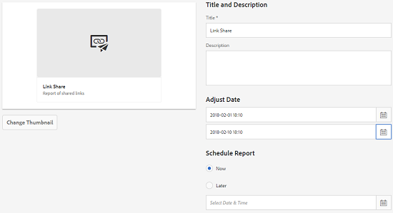

# Resursrapporter {#asset-reports}

Med tillgångsrapportering kan du utvärdera verktyget för din [!DNL Adobe Experience Manager Assets]-distribution. Med [!DNL Assets] kan du generera olika rapporter för dina digitala resurser. Rapporterna innehåller användbar information om hur ditt system används, hur användarna interagerar med resurser och vilka resurser som hämtas och delas.

Använd informationen i rapporterna för att ta fram nyckeltal för att mäta hur [!DNL Assets] används i ert företag och av era kunder.

I [!DNL Assets]-rapporteringsramverket används [!DNL Sling]-jobb för att asynkront bearbeta rapportbegäranden på ett ordnat sätt. Den kan skalas för stora databaser. Asynkron rapportbearbetning ökar effektiviteten och hastigheten med vilken rapporter genereras.

Rapporthanteringsgränssnittet är intuitivt och innehåller detaljerade alternativ och kontroller för att komma åt arkiverade rapporter och visa rapportkörningsstatus (lyckad, misslyckad och köad).

När en rapport skapas meddelas du av <!-- through an email (optional) and --> ett inkorgsmeddelande. Du kan visa, hämta eller ta bort en rapport från rapportlistsidan, där alla tidigare genererade rapporter visas.

## Generera rapporter {#generate-reports}

[!DNL Experience Manager Assets] genererar följande standardrapporter:

* Överför
* Hämta
* Förfaller
* Ändring
* Publicera
* [!DNL Brand Portal] publicera
* Diskanvändning
* Filer
* Länkdelning

[!DNL Adobe Experience Manager] administratörer kan enkelt generera och anpassa dessa rapporter för din implementering. Administratören kan följa de här stegen för att skapa en rapport:

1. I [!DNL Experience Manager]-gränssnittet klickar du på **[!UICONTROL Tools]** > **[!UICONTROL Assets]** > **[!UICONTROL Reports]**.

   

1. På sidan [!UICONTROL Asset Reports] klickar du på **[!UICONTROL Create]** i verktygsfältet.
1. Välj den rapport du vill skapa på sidan **[!UICONTROL Create Report]** och klicka på **[!UICONTROL Next]**.

   

<!-- TBD: How do enable this in CS now? Is it done using some OSGi config now?
   >[!NOTE]
   >
   >Before you can generate an **[!UICONTROL Asset Downloaded]** report, ensure that the Asset Download service is enabled. From the web console (`https://[aem_server]:[port]/system/console/configMgr`), open the **[!UICONTROL Day CQ DAM Event Recorder]** configuration, and select the **[!UICONTROL Asset Downloaded (DOWNLOADED)]** option in Event Types if not already selected.
-->

>[!NOTE]
>
>Som standard inkluderas innehållsfragment och länkdelningar i resursen [!UICONTROL Download]-rapporten. Välj lämpligt alternativ för att skapa en rapport över länkdelningar eller för att exkludera innehållsfragment från hämtningsrapporten.

>[!NOTE]
>
>I [!UICONTROL Download]-rapporten visas endast information om de resurser som har hämtats efter att du har valt var för sig eller som har hämtats med Snabbåtgärd. Den innehåller dock inte information om resurserna som finns i en hämtad mapp.

1. Konfigurera rapportinformation som titel, beskrivning, miniatyrbild och mappsökväg i CRX-databasen där rapporten lagras. Som standard är mappsökvägen `/content/dam`. Du kan ange en annan sökväg.

   

   Välj datumintervall för rapporten.

   Du kan välja att generera rapporten nu eller vid ett framtida datum och tid.

   >[!NOTE]
   >
   >Om du väljer att schemalägga rapporten senare måste du ange datum och tid i fälten Datum och Tid. Om du inte anger något värde behandlas det som en rapport som ska genereras omedelbart.

   Konfigurationsfälten kan variera beroende på vilken typ av rapport du skapar. Rapporten **[!UICONTROL Disk Usage]** innehåller till exempel alternativ för att inkludera resursåtergivningar när du beräknar det diskutrymme som används av resurserna. Du kan välja att inkludera eller exkludera resurser i undermappar för beräkning av diskanvändning.

   >[!NOTE]
   >
   >Rapporten **[!UICONTROL Disk Usage]** innehåller inga fält för datumintervall eftersom den endast visar hur mycket diskutrymme som används.

   

   När du skapar **[!UICONTROL Files]**-rapporten kan du inkludera/exkludera undermappar. Du kan dock inte inkludera resursåtergivningar för den här rapporten.

   

   I rapporten **[!UICONTROL Link Share]** visas URL:er till resurser som delas med externa användare inifrån [!DNL Assets]. <!-- It includes email ids of the user who shared the assets, emails ids of users with which the assets are shared, share date, and expiration date for the link. --> Det går inte att anpassa kolumnerna.

   **[!UICONTROL Link Share]**-rapporten innehåller inga alternativ för undermappar och återgivningar eftersom den bara publicerar de delade URL:er som visas under `/var/dam/share`.

   

1. Klicka på **[!UICONTROL Next]** i verktygsfältet.

1. På sidan **[!UICONTROL Configure Columns]** är vissa kolumner markerade för att visas i rapporten som standard. Du kan markera fler kolumner. Avmarkera en markerad kolumn om du vill utesluta den i rapporten.

   

   Om du vill visa ett anpassat kolumnnamn eller en egenskapssökväg konfigurerar du egenskaperna för resursens binärfil under noden `jcr:content` i CRX. Du kan också lägga till den via egenskapssökvägsväljaren.

   

1. Klicka på **[!UICONTROL Create]** i verktygsfältet. Ett meddelande meddelar att rapportgenereringen har initierats.
1. På sidan [!UICONTROL Asset Reports] baseras rapportgenereringsstatusen på rapportjobbets aktuella tillstånd, till exempel [!UICONTROL Success], [!UICONTROL Failed], [!UICONTROL Queued] eller [!UICONTROL Scheduled]. Samma status visas i inkorgen för meddelanden.Om du vill visa rapportsidan klickar du på rapportlänken. Du kan också markera rapporten och klicka på **[!UICONTROL View]** i verktygsfältet.

   

   Klicka på **[!UICONTROL Download]** i verktygsfältet för att hämta rapporten i CSV-format.

## Lägg till anpassade kolumner {#add-custom-columns}

Du kan lägga till anpassade kolumner i följande rapporter om du vill visa mer data för dina anpassade krav:

* Överför
* Hämta
* Förfaller
* Ändring
* Publicera
* [!DNL Brand Portal] publicera
* Filer

Följ de här stegen för att lägga till anpassade kolumner i de här rapporterna:

1. I [!DNL Manager interface] klickar du på **[!UICONTROL Tools]** > **[!UICONTROL Assets]** > **[!UICONTROL Reports]**.
1. På sidan [!UICONTROL Asset Reports] klickar du på **[!UICONTROL Create]** i verktygsfältet.

1. Välj den rapport du vill skapa på sidan **[!UICONTROL Create Report]** och klicka på **[!UICONTROL Next]**.
1. Konfigurera rapportinformation som titel, beskrivning, miniatyrbild, mappsökväg och datumintervall.

1. Om du vill visa en anpassad kolumn anger du namnet på kolumnen under **[!UICONTROL Custom Columns]**.

   

1. Lägg till egenskapssökvägen under noden `jcr:content` i CRXDE med egenskapssökvägsväljaren. Du kan också skriva sökvägen i fältet för egenskapssökväg.

   

   Om du vill lägga till fler anpassade kolumner klickar du på **[!UICONTROL Add]** och upprepar steg 5 och 6.

1. Klicka på **[!UICONTROL Create]** i verktygsfältet. Ett meddelande meddelar att rapportgenereringen har initierats.

<!-- TBD: How to configure purge now? Is it using OSGi configurations?

## Configure purging service {#configure-purging-service}

To remove reports that you no longer require, configure the DAM Report Purge service from the web console to purge existing reports based on their quantity and age.

1. Access the web console (configuration manager) from `https://[aem_server]:[port]/system/console/configMgr`.
1. Open the **[!UICONTROL DAM Report Purge Service]** configuration.
1. Specify the frequency (time interval) for the purging service in the `scheduler.expression.name` field. You can also configure the age and the quantity threshold for reports.
1. Save the changes.
-->

## Felsökningsinformation, tips och begränsningar {#best-practices-and-limitations}

* Om Diskanvändningsrapporten inte genereras och du använder [!DNL Dynamic Media] kontrollerar du att alla resurser är korrekta. Du löser problemet genom att bearbeta resurserna på nytt och sedan generera rapporten igen.
