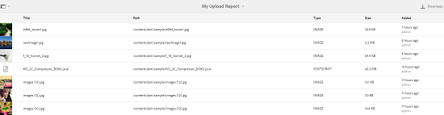

# Asset Reports {#asset-reports}

Med tillgångsrapportering kan du utvärdera hur användbar din [!DNL Adobe Experience Manager Assets] distribution är. Med [!DNL Assets]kan ni generera olika rapporter för era digitala resurser. Rapporterna innehåller användbar information om hur ditt system används, hur användarna interagerar med resurser och vilka resurser som hämtas och delas.

Använd informationen i rapporterna för att ta fram nyckeltal för att mäta hur väl ert företag och era kunder börjar använda [!DNL Assets] dem.

I [!DNL Assets] rapporteringsramverket används [!DNL Sling] jobb för att asynkront bearbeta rapportbegäranden på ett ordnat sätt. Den kan skalas för stora databaser. Asynkron rapportbearbetning ökar effektiviteten och hastigheten med vilken rapporter genereras.

Rapporthanteringsgränssnittet är intuitivt och innehåller detaljerade alternativ och kontroller för att komma åt arkiverade rapporter och visa rapportkörningsstatus (lyckad, misslyckad och köad).

När en rapport genereras meddelas du via <!-- through an email (optional) and --> ett inkorgsmeddelande. Du kan visa, hämta eller ta bort en rapport från rapportlistsidan, där alla tidigare genererade rapporter visas.

## Generera rapporter {#generate-reports}

[!DNL Experience Manager Assets] genererar följande standardrapporter:

* Överför
* Hämta
* Förfaller
* Ändring
* Publicera
* [!DNL Brand Portal] publicera
* Diskanvändning
* Filer
* Länkdelning

[!DNL Adobe Experience Manager] administratörer kan enkelt generera och anpassa dessa rapporter för din implementering. Administratören kan följa de här stegen för att skapa en rapport:

1. I [!DNL Experience Manager] gränssnittet klickar du på **[!UICONTROL Tools]** > **[!UICONTROL Assets]** > **[!UICONTROL Reports]**.

   

1. På [!UICONTROL Asset Reports] sidan klickar du **[!UICONTROL Create]** i verktygsfältet.
1. På **[!UICONTROL Create Report]** sidan väljer du den rapport som du vill skapa och klickar på **[!UICONTROL Next]**.

   

   >[!NOTE]
   >
   >Innan du kan generera en **[!UICONTROL Asset Downloaded]**-rapport måste du kontrollera att tjänsten för hämtning av resurser är aktiverad. Från webbkonsolen (`https://[aem_server]:[port]/system/console/configMgr`) öppnar du konfigurationen **[!UICONTROL Day CQ DAM Event Recorder]** och väljer alternativet **[!UICONTROL Asset Downloaded (DOWNLOADED)]** i Händelsetyper, om det inte redan är valt.

   >[!NOTE]
   >
   >Som standard inkluderas innehållsfragment och länkdelningar i [!UICONTROL Download] resursrapporten. Välj lämpligt alternativ för att skapa en rapport över länkdelningar eller för att utesluta innehållsfragment från hämtningsrapporten.

   >[!NOTE]
   >
   >I [!UICONTROL Download] rapporten visas endast information om de resurser som har laddats ned efter att du har valt ett enskilt program eller som har laddats ned med Snabbåtgärd. Den innehåller dock inte information om resurserna som finns i en hämtad mapp.

1. Konfigurera rapportinformation som titel, beskrivning, miniatyrbild och mappsökväg i CRX-databasen där rapporten lagras. Som standard är mappsökvägen `/content/dam`. Du kan ange en annan sökväg.

   

   Välj datumintervall för rapporten.

   Du kan välja att generera rapporten nu eller vid ett framtida datum och tid.

   >[!NOTE]
   >
   >Om du väljer att schemalägga rapporten senare måste du ange datum och tid i fälten Datum och Tid. Om du inte anger något värde behandlas det som en rapport som ska genereras omedelbart.

   Konfigurationsfälten kan variera beroende på vilken typ av rapport du skapar. Rapporten innehåller t.ex. alternativ för att inkludera resursåtergivningar vid beräkning av det diskutrymme som används av resurserna. **[!UICONTROL Disk Usage]** Du kan välja att inkludera eller exkludera resurser i undermappar för beräkning av diskanvändning.

   >[!NOTE]
   >
   >Rapporten **[!UICONTROL Disk Usage]** innehåller inga fält för datumintervall eftersom den endast visar hur mycket diskutrymme som används.

   

   När du skapar **[!UICONTROL Files]** rapporten kan du inkludera/exkludera undermappar. Du kan dock inte inkludera resursåtergivningar för den här rapporten.

   

   I rapporten **[!UICONTROL Link Share]** visas URL:er till resurser som delas med externa användare inifrån [!DNL Assets]. <!-- It includes email ids of the user who shared the assets, emails ids of users with which the assets are shared, share date, and expiration date for the link. --> Det går inte att anpassa kolumnerna.

   The **[!UICONTROL Link Share]** report, does not include options for sub-folders and renditions because it merely publishes the shared URLs that appear under `/var/dam/share`.

   

1. Klicka på **[!UICONTROL Next]** i verktygsfältet.

1. På **[!UICONTROL Configure Columns]** sidan är vissa kolumner markerade för att visas i rapporten som standard. Du kan markera fler kolumner. Avmarkera en markerad kolumn om du vill utesluta den i rapporten.

   

   Om du vill visa ett anpassat kolumnnamn eller en egenskapssökväg konfigurerar du egenskaperna för resursens binärfil under `jcr:content` noden i CRX. Du kan också lägga till den via egenskapssökvägsväljaren.

   

1. Klicka på **[!UICONTROL Create]** i verktygsfältet. Ett meddelande meddelar att rapportgenereringen har initierats.
1. På [!UICONTROL Asset Reports] sidan baseras rapportgenereringsstatusen på rapportjobbets aktuella tillstånd, till exempel [!UICONTROL Success], [!UICONTROL Failed], [!UICONTROL Queued]eller [!UICONTROL Scheduled]. Samma status visas i inkorgen för meddelanden.Om du vill visa rapportsidan klickar du på rapportlänken. Alternatively, select the report, and click **[!UICONTROL View]** from the toolbar.

   

   Klicka **[!UICONTROL Download]** i verktygsfältet för att hämta rapporten i CSV-format.

## Lägg till anpassade kolumner {#add-custom-columns}

Du kan lägga till anpassade kolumner i följande rapporter om du vill visa mer data för dina anpassade krav:

* Överför
* Hämta
* Förfaller
* Ändring
* Publicera
* [!DNL Brand Portal] publicera
* Filer

Följ de här stegen för att lägga till anpassade kolumner i de här rapporterna:

1. In the [!DNL Manager interface], click **[!UICONTROL Tools]** > **[!UICONTROL Assets]** > **[!UICONTROL Reports]**.
1. På [!UICONTROL Asset Reports] sidan klickar du **[!UICONTROL Create]** i verktygsfältet.

1. På **[!UICONTROL Create Report]** sidan väljer du den rapport som du vill skapa och klickar på **[!UICONTROL Next]**.
1. Konfigurera rapportinformation som titel, beskrivning, miniatyrbild, mappsökväg och datumintervall.

1. Om du vill visa en anpassad kolumn anger du namnet på kolumnen under **[!UICONTROL Custom Columns]**.

   

1. Lägg till egenskapssökvägen under `jcr:content` noden i CRXDE med egenskapssökvägsväljaren. Du kan också skriva sökvägen i fältet för egenskapssökväg.

   

   Om du vill lägga till fler anpassade kolumner klickar du på **[!UICONTROL Add]** och upprepar steg 5 och 6.

1. Klicka på **[!UICONTROL Create]** i verktygsfältet. Ett meddelande meddelar att rapportgenereringen har initierats.

## Konfigurera rensningstjänst {#configure-purging-service}

Om du vill ta bort rapporter som du inte längre behöver konfigurerar du tjänsten DAM Report Renge från webbkonsolen så att befintliga rapporter rensas baserat på antal och ålder.

1. Gå till webbkonsolen (konfigurationshanteraren) från `https://[aem_server]:[port]/system/console/configMgr`.
1. Öppna **[!UICONTROL DAM Report Purge Service]** konfigurationen.
1. Ange frekvens (tidsintervall) för rensningstjänsten i `scheduler.expression.name` fältet. Du kan också konfigurera åldern och tröskelvärdet för antal rapporter.
1. Spara ändringarna.
