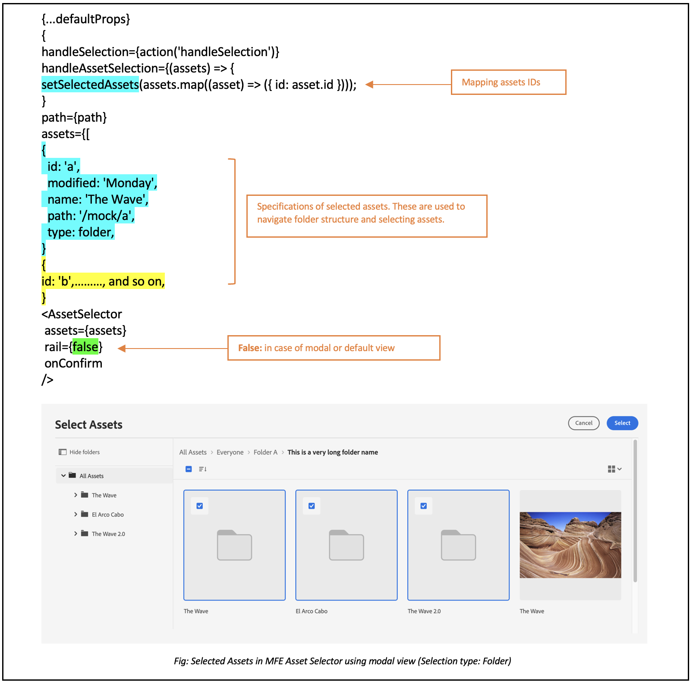

# Exempel på hur du använder egenskaper för resursväljare {#usage-examples}

Du kan definiera [egenskaperna](/help/assets/asset-selector-properties.md) för resursväljaren i filen **index.html** för att anpassa visningen av resursväljaren i programmet.

## Exempel 1: Resursväljaren i vyn Räler

Om värdet för AssetSelector `rail` är inställt på `false` eller inte nämns i egenskaperna visas resursväljaren som standard i modulvyn. Egenskapen `acvConfig` tillåter vissa ingående konfigurationer, som Dra och släpp. Gå till [aktivera eller inaktivera dra och släpp](asset-selector-customization.md#enable-disable-drag-and-drop) om du vill veta mer om hur egenskapen `acvConfig` används.

<!--
### Example 2: Use selectedAssets property in addition to the path property

Use the `path` property to define the folder name that displays automatically when the Asset Selector is rendered. In addition, use the `selectedAssets` property to define the IDs for the assets that you need to select within the folder. Moreover, when you want to display assets that are pre-defined within the folder, you can use selectedAssets property.

   
-->

## Exempel 2: Metadatapuposer

Använd olika egenskaper för att definiera metadata för en resurs som du vill visa med hjälp av en informationsikon. Info pover innehåller information om resursen eller mappen, inklusive namn, dimensioner, ändringsdatum, plats och beskrivning av en resurs. I exemplet nedan används olika egenskaper för att visa metadata för en resurs, till exempel anger egenskapen `repo:path` platsen för en resurs. <!--`repo` represents the repository from where the asset is showing, whereas, `path` represents the route from where the asset or folder is rendered.-->

## Exempel 3: Egen filteregenskap i skenvy

Förutom den facetterade sökningen kan du med Assets Selector anpassa olika attribut för att förfina din sökning från [!DNL Adobe Experience Manager] som ett [!DNL Cloud Service]-program. Lägg till följande kod för att lägga till anpassade sökfilter i programmet. I exemplet nedan filtrerar sökningen `Type Filter` resurstypen bland Bilder, Dokument eller Videor eller den filtertyp som du har lagt till för sökningen.

<!--

## Customization after integrating Asset Selector 

### Custom metadata

Assets display panel shows the out of the box metadata that can be displayed in the info of the asset. In addition to this, [!DNL Adobe Experience Manager] as a [!DNL Cloud Service] application allows configuration of the asset selector by adding custom metadata that is shown in info panel of the asset.
-->

>[!MORELIKETHIS]
>
>* [Anpassningar av resursväljare](/help/assets/asset-selector-customization.md)
>* [Överföring av resursväljare](/help/assets/asset-selector-upload.md)
>* [Egenskaper för resursväljare](/help/assets/asset-selector-properties.md)
>* [Integrera resursväljare med dynamiska media med OpenAPI-funktioner](/help/assets/integrate-asset-selector-dynamic-media-open-api.md)
