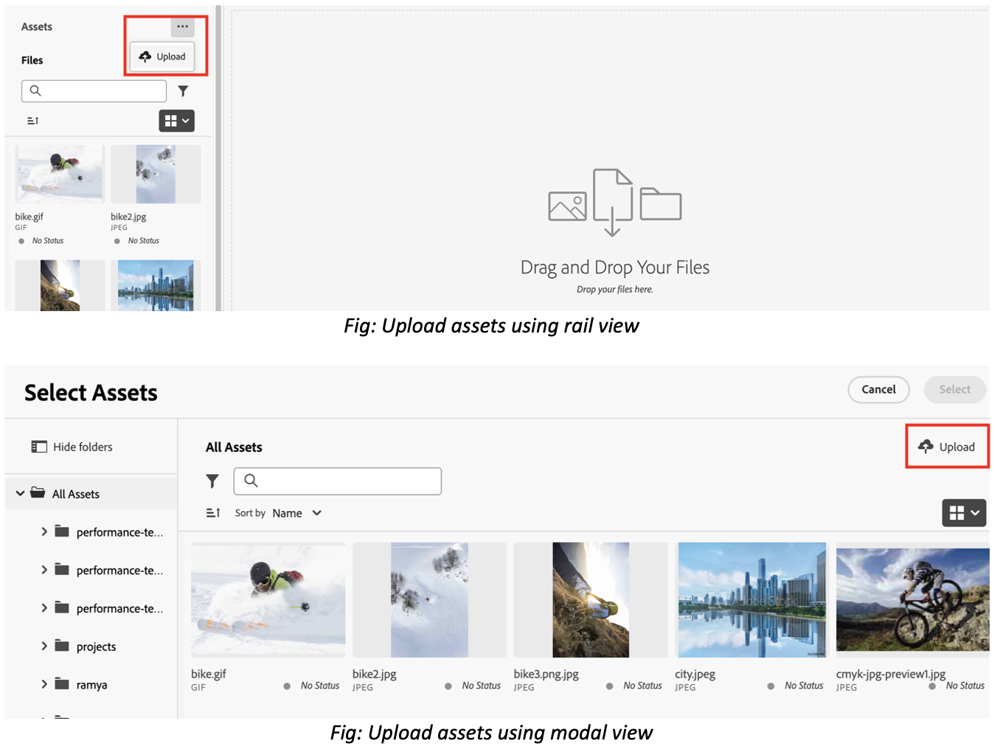

# Överför filer och mappar till resursväljaren {#upload-files-folders}

Du kan överföra filer eller mappar till resursväljaren från det lokala filsystemet. Om du vill överföra filer med det lokala filsystemet behöver du i allmänhet använda en överföringsfunktion från ett front-end-program för resursväljare.

## Överför resurser från det lokala filsystemet {#basic-upload}

Så här lägger du till resurser i Resursväljaren:

1. Om du använder vyn Räler går du till ellips och klickar sedan på  **[!UICONTROL Upload]**. Å andra sidan klickar du på  **[!UICONTROL Upload]** längst upp till höger om du vill visa modala data. Skärmen [!UICONTROL Upload Assets] visas.

   

   I avsnittet **[!UICONTROL Drag files or folders here]** kan du dessutom antingen dra resurserna från det lokala filsystemet eller klicka på **[!UICONTROL Browse]** för att manuellt välja filer eller mappar som är tillgängliga i det lokala filsystemet. Den här listan över filer som ingår i överföringen finns som en lista.

   

   Du kan också förhandsvisa markerade bilder med hjälp av miniatyrbilderna och klicka på X-ikonen för att ta bort en viss bild från listan. X-ikonen visas bara när du håller muspekaren över bildens namn eller storlek. Du kan också klicka på **[!UICONTROL Remove all]** om du vill ta bort alla objekt från överföringslistan.

1. Klicka på **[!UICONTROL Upload]** om du vill slutföra överföringsprocessen. Dina överförda resurser visas. Se [grundläggande överföring](/help/assets/asset-selector-customization.md#basic-upload) för den konfigurerbara koden.

## Överför resurser med metadata {#upload-assets-with-metadata}

Du kan lägga till metadata till resurserna när du överför dem direkt till programmet. Metadata innehåller olika fält som ämnesrad, produktinformation, kampanj och så vidare. För att göra detta används egenskapen `metadataSchema`. Gå till [egenskaper för resursväljare](/help/assets/asset-selector-properties.md) om du vill veta mer om egenskapen `metadataSchema`.

Se [Överför med metadata](/help/assets/asset-selector-customization.md#upload-with-metadata) för kodfragmentet som krävs för konfigurationen.

1. Definiera namnet på din överföring med fältet **[!UICONTROL Campaign name]**. Du kan använda ett befintligt namn eller skapa ett nytt. Med resursväljaren får du fler alternativ när du skriver namnet.

   Adobe rekommenderar att du anger värden i resten av fälten och skapar en förbättrad sökupplevelse för dina överförda resurser.

1. Definiera värden för fälten **[!UICONTROL Keywords]**, **[!UICONTROL Channels]**, **[!UICONTROL Timeframe]** och **[!UICONTROL Region]**. Genom att tagga och gruppera resurser efter nyckelord, kanaler och plats kan alla som använder ditt godkända företagsinnehåll hitta och ordna mediefilerna.

1. Klicka på **[!UICONTROL Upload]** om du vill överföra resurser till resursväljaren. [!UICONTROL Review details] bekräftelseruta visas. Klicka på [!UICONTROL Continue].

1. Assets börjar ladda upp. Klicka på [!UICONTROL New Upload] för att starta om överföringsproceduren. Klicka på [!UICONTROL Done] för att slutföra överföringen.

## Anpassad överföring {#customize-upload}

Med resursväljaren kan du lägga till ett anpassat överföringsformulär. Det finns flera anpassningar tillgängliga. Egenskapen [hideUploadButton](/help/assets/asset-selector-properties.md) gör till exempel att du kan dölja den överföringsknapp som visas som standard i programmet. I stället kan du anpassa den så att den återges utanför MFE-programmet enligt kraven. Se [anpassad överföring](/help/assets/asset-selector-customization.md#customized-upload) för konfigurationen.

>[!MORELIKETHIS]
>
>* [Exempel på resursväljare](/help/assets/asset-selector-examples.md)
>* [Integrera resursväljare med olika program](/help/assets/integrate-asset-selector.md)
>* [Egenskaper för resursväljare](/help/assets/asset-selector-properties.md)
