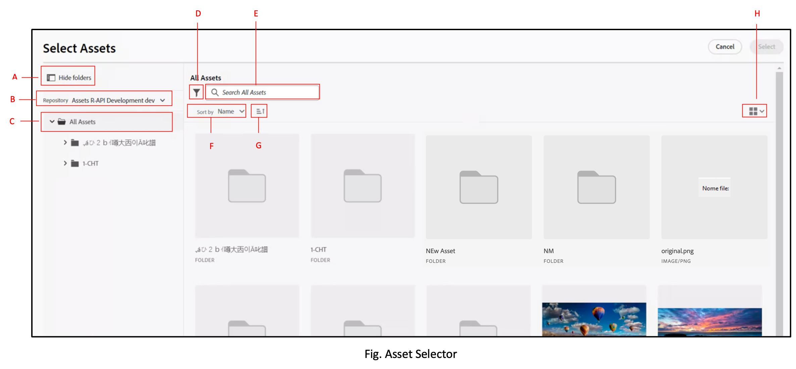
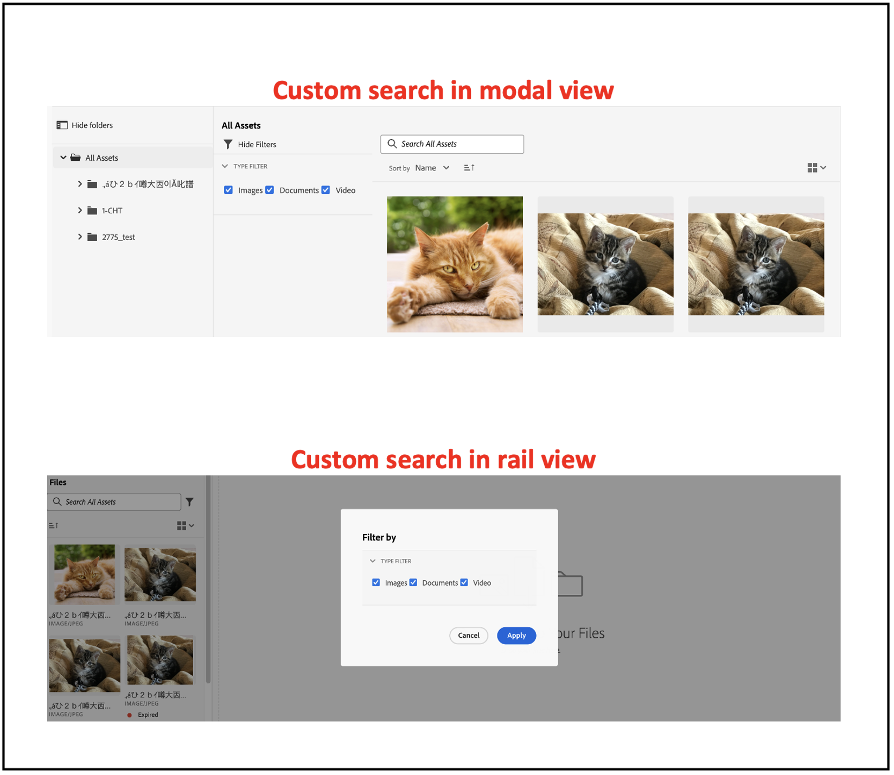

# Mikrofrontsväljare för mediefiler {#Overview}

Micro-Frontend Asset Selector har ett användargränssnitt som enkelt kan integreras med [!DNL Experience Manager Assets as a Cloud Service] -databas så att du kan bläddra bland eller söka efter digitala resurser som är tillgängliga i databasen och använda dem när du redigerar program.

Användargränssnittet Micro-FrontEnd är tillgängligt i ditt program med hjälp av paketet Resursväljare. Alla uppdateringar av paketet importeras automatiskt och den senaste distribuerade resursväljaren läses in automatiskt i programmet.


Resursväljaren har många fördelar, till exempel:

* Enkel integrering med alla Adobe- och andra program med Vanilla JavaScript-bibliotek.
* Enkelt att underhålla när uppdateringar av resursväljarpaketet automatiskt distribueras till resursväljaren som är tillgänglig för ditt program. Det finns inga uppdateringar som behövs i programmet för att läsa in de senaste ändringarna.
* Enkel anpassning eftersom det finns tillgängliga egenskaper som styr visningen av resursväljaren i programmet.

* Fulltextsökning, färdiga och anpassade filter för att snabbt navigera till material som ska användas i redigeringsmiljön.

* Möjlighet att växla databaser inom en IMS-organisation för val av resurser.

* Möjlighet att sortera resurser efter namn, dimensioner och storlek och visa dem i List-, Grid-, Gallery- eller Waterfall-vyn.

Utför följande uppgifter för att integrera och använda resursväljaren med [!DNL Experience Manager Assets as a Cloud Service] databas:

* [Integrera resursväljare med Vanilla JS](#integration-with-vanilla-js)
* [Definiera visningsegenskaper för resursväljare](#asset-selector-properties)
* [Använd resursväljare](#using-asset-selector)

## Integrera resursväljare med Vanilla JS {#integration-with-vanilla-js}

Du kan integrera alla [!DNL Adobe] eller program som inte är Adobe med [!DNL Experience Manager Assets] som [!DNL Cloud Service] arkivera och välja resurser inifrån programmet.

Integreringen görs genom att importera resursväljarpaketet och ansluta till Assets-as a Cloud Service med Vanilla JavaScript-biblioteket. Du måste redigera en `index.html` eller en lämplig fil i programmet till
* Definiera autentiseringsinformationen
* Åtkomst till den as a Cloud Service resurskatalogen
* Konfigurera visningsegenskaperna för resursväljaren

<!--
Asset Selector supports authentication to the [!DNL Experience Manager Assets] as a [!DNL Cloud Service] repository using Identity Management System (IMS) properties such as `imsScope` or `imsClientID`. Authentication using these IMS properties is referred to as SUSI (Sign Up Sign In) flow in this article.

You can perform authentication without defining some of the IMS properties, such as `imsScope` or `imsClientID`, if:

*   You are integrating an [!DNL Adobe] application on [Unified Shell](https://experienceleague.adobe.com/docs/experience-manager-cloud-service/content/overview/aem-cloud-service-on-unified-shell.html?lang=en).
*   You already have an IMS token generated for authentication.

Accessing [!DNL Experience Manager Assets] as a [!DNL Cloud Service] repository without defining `imsScope` or `imsClientID` IMS properties is referred to as a non-SUSI flow in this article.
-->

Du kan utföra autentisering utan att definiera några IMS-egenskaper om:

* Du integrerar en [!DNL Adobe] program på [Enhetligt gränssnitt](https://experienceleague.adobe.com/docs/experience-manager-cloud-service/content/overview/aem-cloud-service-on-unified-shell.html?lang=en).
* Du har redan en IMS-token genererad för autentisering.

## Förutsättningar {#prerequisites}

<!--
If your application requires user based authentication, out-of-the-box Asset Selector also supports a flow for authentication to the [!DNL Experience Manager Assets] as a [!DNL Cloud Service] repository using Identity Management System (IMS.)

You can use properties such as `imsScope` or `imsClientID` to retrieve `imsToken` automatically. You can use SUSI (Sign Up Sign In) flow and IMS properties. Also, you can obtain your own imsToken and pass it to Asset Selector by integrating within [!DNL Adobe] application on Unified Shell or if you already have an imsToken obtained via other methods (for example, using technical account). Accessing [!DNL Experience Manager Assets] as a [!DNL Cloud Service] repository without defining IMS properties (For example, `imsScope` and `imsClientID`) is referred to as a non-SUSI flow.
-->

Definiera förutsättningarna i `index.html` -filen eller en liknande fil i programimplementeringen för att definiera autentiseringsinformationen för att komma åt [!DNL Experience Manager Assets] som [!DNL Cloud Service] databas. Förutsättningarna är följande:
* imsOrg
* imsToken
* apikey

<!--
The prerequisites vary if you are authenticating using a SUSI flow or a non-SUSI flow.

**Non-SUSI flow**

*   imsOrg
*   imsToken
*   apikey

For more information on these properties, refer to [Asset Selector Properties](#asset-selector-properties).

**SUSI flow**

*   imsClientId
*   imsScope
*   redirectUrl
*   imsOrg
*   apikey

For more information on these properties, refer to [Example for the SUSI flow](#susi-vanilla) and [Asset Selector Properties](#asset-selector-properties).
-->

## Installation {#installation}

Resursväljare är tillgängliga via både ESM CDN (till exempel [esm.sh](https://esm.sh/)/[skypning](https://www.skypack.dev/)) och [UMD](https://github.com/umdjs/umd) version.

I webbläsare som använder **UMD-version** (rekommenderas):

```
<script src="https://experience.adobe.com/solutions/CQ-assets-selectors/assets/resources/assets-selectors.js"></script>

<script>
  const { renderAssetSelector } = PureJSSelectors;
</script>
```

I webbläsare med `import maps` support med **ESM CDN-version**:

```
<script type="module">
  import { AssetSelector } from 'https://experience.adobe.com/solutions/CQ-assets-selectors/assets/resources/@assets/selectors/index.js'
</script>
```

I Deno/Webpack Module Federation med **ESM CDN-version**:

```
import { AssetSelector } from 'https://experience.adobe.com/solutions/CQ-assets-selectors/assets/resources/@assets/selectors/index.js'
```

### Markerad resurstyp {#selected-asset-type}

Den valda resurstypen är en array med objekt som innehåller resursinformationen när resursen används `handleSelection`, `handleAssetSelection`och `onDrop` funktioner.

**Schemasyntax**

```
interface SelectedAsset {
    'repo:id': string;
    'repo:name': string;
    'repo:path': string;
    'repo:size': number;
    'repo:createdBy': string;
    'repo:createDate': string;
    'repo:modifiedBy': string; 
    'repo:modifyDate': string; 
    'dc:format': string; 
    'tiff:imageWidth': number;
    'tiff:imageLength': number;
    'repo:state': string;
    computedMetadata: Record<string, any>;
    _links: {
        'http://ns.adobe.com/adobecloud/rel/rendition': Array<{
            href: string;
            type: string;
            'repo:size': number;
            width: number;
            height: number;
            [others: string]: any;
        }>;
    };
}
```

I följande tabell beskrivs några av de viktiga egenskaperna för det valda resursobjektet.

| Egenskap | Typ | Förklaring |
|---|---|---|
| *repo:databaseId* | string | Unik identifierare för databasen där resursen lagras. |
| *repo:id* | string | Unik identifierare för tillgången. |
| *repo:assetClass* | string | Klassificeringen av resursen (till exempel bild eller video, dokument). |
| *repo:name* | string | Namnet på resursen, inklusive filtillägget. |
| *repo:storlek* | tal | Resursens storlek i byte. |
| *repo:sökväg* | string | Platsen för resursen i databasen. |
| *repo:överordnade* | `Array<string>` | En array med överordnade objekt för resursen i databasen. |
| *repo:läge* | string | Aktuell status för resursen i databasen (t.ex. aktiv, borttagen osv.). |
| *repo:createdBy* | string | Användaren eller systemet som skapade resursen. |
| *repa:createDate* | string | Datum och tid då tillgången skapades. |
| *repo:modifiedBy* | string | Den användare eller det system som senast ändrade resursen. |
| *repo:modifyDate* | string | Datum och tid då tillgången senast ändrades. |
| *dc:format* | string | Resursens format, t.ex. filtypen (t.ex. JPEG, PNG). |
| *tiff:imageWidth* | tal | Bredden på en resurs. |
| *tiff:imageLength* | tal | En tillgångs höjd. |
| *computedMetadata* | `Record<string, any>` | Ett objekt som representerar en bucket för alla resursens metadata av alla slag (databas, program eller inbäddade metadata). |
| *länkar* | `Record<string, any>` | Hypermedialänkar för den associerade resursen. Innehåller länkar för resurser som metadata och återgivningar. |
| *_links.http://ns.adobe.com/adobecloud/rel/rendition* | `Array<Object>` | En array med objekt som innehåller information om återgivningar av resursen. |
| *_links.http://ns.adobe.com/adobecloud/rel/rendition[].href* | string | URI:n till återgivningen. |
| *_links.http://ns.adobe.com/adobecloud/rel/rendition[].type* | string | Återgivningens MIME-typ. |
| *_links.http://ns.adobe.com/adobecloud/rel/rendition[].&#39;repo:size&#39;* | tal | Återgivningens storlek i byte. |
| *_links.http://ns.adobe.com/adobecloud/rel/rendition[].width* | tal | Återgivningens bredd. |
| *_links.http://ns.adobe.com/adobecloud/rel/rendition[].height* | tal | Återgivningens höjd. |

En fullständig lista över egenskaper och detaljerade exempel finns på [Exempel på resursväljarkod](https://github.com/adobe/aem-assets-selectors-mfe-examples).

<!--
### ImsAuthProps {#ims-auth-props}

The `ImsAuthProps` properties define the authentication information and flow that the Asset Selector uses to obtain an `imsToken`. By setting these properties, you can control how the authentication flow should behave and register listeners for various authentication events.

| Property Name | Description|
|---|---|
| `imsClientId`| A string value representing the IMS client ID used for authentication purposes. This value is provided by Adobe and is specific to your Adobe AEM CS organization.|
| `imsScope`| Describes the scopes used in authentication. The scopes determine the level of access that the application has to your organization resources. Multiple scopes can be separated by commas.|
| `redirectUrl` | Represents the URL where the user is redirected after authentication. This value is typically set to the current URL of the application. If a `redirectUrl` is not supplied, `ImsAuthService` will use the redirectUrl used to register the `imsClientId`|
| `modalMode`| A boolean indicating whether the authentication flow should be displayed in a modal (pop-up) or not. If set to `true`, the authentication flow is displayed in a pop-up. If set to `false`, the authentication flow is displayed in a full page reload. _Note:_ for better UX, you can dynamically control this value if the user has browser pop-up disabled. |
| `onImsServiceInitialized`| A callback function that is called when the Adobe IMS authentication service is initialized. This function takes one parameter, `service`, which is an object representing the Adobe IMS service. See [`ImsAuthService`](#imsauthservice-ims-auth-service) for more details.|
| `onAccessTokenReceived`| A callback function that is called when an `imsToken` is received from the Adobe IMS authentication service. This function takes one parameter, `imsToken`, which is a string representing the access token. |
| `onAccessTokenExpired`| A callback function that is called when an access token has expired. This function is typically used to trigger a new authentication flow to obtain a new access token. |
| `onErrorReceived`| A callback function that is called when an error occurs during authentication. This function takes two parameters: the error type and error message. The error type is a string representing the type of error and the error message is a string representing the error message. |

### ImsAuthService {#ims-auth-service}

`ImsAuthService` class handles the authentication flow for the Asset Selector. It is responsible for obtaining an `imsToken` from the Adobe IMS authentication service. The `imsToken` is used to authenticate the user and authorize access to the Adobe Experience Manager (AEM) CS Assets repository. ImsAuthService uses the `ImsAuthProps` properties to control the authentication flow and register listeners for various authentication events. You can use the convenient [`registerAssetsSelectorsAuthService`](#purejsselectorsregisterassetsselectorsauthservice) function to register the _ImsAuthService_ instance with the Asset Selector. The following functions are available on the `ImsAuthService` class. However, if you're using the _registerAssetsSelectorsAuthService_ function, you do not need to call these functions directly.

| Function Name | Description |
|---|---|
| `isSignedInUser` | Determines whether the user is currently signed in to the service and returns a boolean value accordingly.|
| `getImsToken`    | Retrieves the authentication `imsToken` for the currently signed-in user, which can be used to authenticate requests to other services such as generating asset _rendition.|
| `signIn`| Initiates the sign-in process for the user. This function uses the `ImsAuthProps` to show authentication in either a pop-up or a full page reload |
| `signOut`| Signs the user out of the service, invalidating their authentication token and requiring them to sign in again to access protected resources. Invoking this function will reload the current page.|
| `refreshToken`| Refreshes the authentication token for the currently signed-in user, preventing it from expiring and ensuring uninterrupted access to protected resources. Returns a new authentication token that can be used for subsequent requests. |
-->

### Exempel på icke-SUSI-flöde {#non-susi-vanilla}

I det här exemplet visas hur du använder resursväljaren med ett icke-SUSI-flöde när du kör ett [!DNL Adobe] program under Unified Shell eller när du redan har `imsToken` genereras för autentisering.

Inkludera paketet Resursväljare i koden med `script` -tagg, som visas i _rader 6 till 15_ i exemplet nedan. När skriptet har lästs in visas `PureJSSelectors` global variabel är tillgänglig för användning. Definiera resursväljaren [egenskaper](#asset-selector-properties) som visas i _raderna 16-23_. The `imsOrg` och `imsToken` båda egenskaperna krävs för autentisering i icke-SUSI-flöden. The `handleSelection` -egenskapen används för att hantera de valda resurserna. Om du vill återge resursväljaren anropar du `renderAssetSelector` funktionen enligt _rad 17_. Resursväljaren visas i `<div>` behållarelement, som visas i _raderna 21 och 22_.

Följ de här stegen för att använda resursväljaren med ett icke-SUSI-flöde i [!DNL Adobe] program.

```html {line-numbers="true"}
<!DOCTYPE html>
<html>
<head>
    <title>Asset Selector</title>
    <script src="https://experience.adobe.com/solutions/CQ-assets-selectors/assets/resources/assets-selectors.js"></script>
    <script>
        // get the container element in which we want to render the AssetSelector component
        const container = document.getElementById('asset-selector-container');
        // imsOrg and imsToken are required for authentication in non-SUSI flow
        const assetSelectorProps = {
            imsOrg: 'example-ims@AdobeOrg',
            imsToken: "example-imsToken",
            apiKey: "example-apiKey-associated-with-imsOrg",
            handleSelection: (assets: SelectedAssetType[]) => {},
        };
        // Call the `renderAssetSelector` available in PureJSSelectors globals to render AssetSelector
        PureJSSelectors.renderAssetSelector(container, assetSelectorProps);
    </script>
</head>

<body>
    <div id="asset-selector-container" style="height: calc(100vh - 80px); width: calc(100vw - 60px); margin: -20px;">
    </div>
</body>

</html>
```

Detaljerade exempel finns på [Exempel på resursväljarkod](https://github.com/adobe/aem-assets-selectors-mfe-examples).

<!--
### Example for the SUSI flow {#susi-vanilla}

Use this example `index.html` file for authentication if you are integrating your application using SUSI flow.

Access the Asset Selector package using the `Script` Tag, as shown in *line 9* to *line 11* of the example `index.html` file.

*Line 14* to *line 38* of the example describes the IMS flow properties, such as `imsClientId`, `imsScope`, and `redirectURL`. The function requires that you define at least one of the `imsClientId` and `imsScope` properties. If you do not define a value for `redirectURL`, the registered redirect URL for the client ID is used.

As you do not have an `imsToken` generated, use the `registerAssetsSelectorsAuthService` and `renderAssetSelectorWithAuthFlow` functions, as shown in line 40 to line 50 of the example `index.html` file. Use the `registerAssetsSelectorsAuthService` function before `renderAssetSelectorWithAuthFlow` to register the `imsToken` with the Asset Selector. [!DNL Adobe] recommends to call `registerAssetsSelectorsAuthService` when you instantiate the component.

Define the authentication and other Assets as a Cloud Service access-related properties in the `const props` section, as shown in *line 54* to *line 60* of the example `index.html` file.

The `PureJSSelectors` global variable, mentioned in *line 65*, is used to render the Asset Selector in the web browser.

Asset Selector is rendered on the `<div>` container element, as mentioned in *line 74* to *line 81*. The example uses a dialog to display the Asset Selector.

```html {line-numbers="true"}
<!DOCTYPE html>
<html>

<head>
    <meta http-equiv="X-UA-Compatible" content="IE=edge">
    <meta charset="utf-8">
    <title>Asset Selectors</title>
    <link rel="stylesheet" href="index.css">
    <script id="asset-selector"
        src="https://experience.adobe.com/solutions/CQ-assets-selectors/assets/resources/asset-selectors.js"></script>
    <script>

        const imsProps = {
            imsClientId: "<obtained from IMS team>",
            imsScope: "openid, <other scopes>",
            redirectUrl: window.location.href,
            modalMode: true, // false to open in a full page reload flow
            onImsServiceInitialized: (service) => {
                // invoked when the ims service is initialized and is ready
                console.log("onImsServiceInitialized", service);
            },
            onAccessTokenReceived: (token) => {
                console.log("onAccessTokenReceived", token);
            },
            onAccessTokenExpired: () => {
                console.log("onAccessTokenError");
                // re-trigger sign-in flow
            },
            onErrorReceived: (type, msg) => {
                console.log("onErrorReceived", type, msg);
            },
        }

        function load() {
            const registeredTokenService = PureJSSelectors.registerAssetsSelectorsAuthService(imsProps);
            imsInstance = registeredTokenService;
        };

        // initialize the IMS flow before attempting to render the asset selector
        load();
        

        //function that will render the asset selector
            const otherProps = {
            // any other props supported by asset selector
            }
            const assetSelectorProps = {
                "imsOrg": "imsorg",
                ...otherProps
            }
             // container element on which you want to render the AssetSelector/DestinationSelector component
            const container = document.getElementById('asset-selector');

            /// Use the PureJSSelectors in globals to render the AssetSelector/DestinationSelector component
            PureJSSelectors.renderAssetSelectorWithAuthFlow(container, assetSelectorProps, () => {
                const assetSelectorDialog = document.getElementById('asset-selector-dialog');
                assetSelectorDialog.showModal();
            });
        }
    </script>

</head>
<body class="asset-selectors">
    <div>
        <button onclick="renderAssetSelectorWithAuthFlowFlow()">Asset Selector - Select Assets with Ims Flow</button>
    </div>
        <dialog id="asset-selector-dialog">
            <div id="asset-selector" style="height: calc(100vh - 80px); width: calc(100vw - 60px); margin: -20px;">
            </div>
        </dialog>
    </div>
</body>

</html>

```
-->

## Använd egenskaper för resursväljare {#asset-selector-properties}

Du kan använda egenskaperna för resursväljaren för att anpassa hur resursväljaren återges. I följande tabell visas de egenskaper som du kan använda för att anpassa och använda resursväljaren.

| Egenskap | Typ | Obligatoriskt | Standard | Beskrivning |
|---|---|---|---|---|
| *järnväg* | boolesk | Nej | false | Om markerad `true`, kommer resursväljaren att återges i den vänstra vyn. Om den är markerad `false`, kommer resursväljaren att återges i modal vy. |
| *imsOrg* | string | Ja |  | IMS-ID (Adobe Identity Management System) som tilldelas vid etablering [!DNL Adobe Experience Manager] som [!DNL Cloud Service] för er organisation. The `imsOrg` Nyckeln krävs för att verifiera om den organisation som du använder är under Adobe IMS eller inte. |
| *imsToken* | string | Nej |  | IMS-innehavartoken används för autentisering. `imsToken` är inte nödvändigt om du använder SUSI-flödet. Det är dock nödvändigt om du använder ett icke-SUSI-flöde. |
| *apiKey* | string | Nej |  | API-nyckel som används för åtkomst till AEM. `apiKey` är inte nödvändigt om du använder SUSI-flödet. Det krävs dock i icke-SUSI-flöden. |
| *rootPath* | string | Nej | /content/dam/ | Mappsökväg där resursväljaren visar dina resurser. `rootPath` kan också användas i form av inkapsling. Med följande sökväg, till exempel `/content/dam/marketing/subfolder/`kan du inte bläddra igenom någon överordnad mapp, utan bara visa de underordnade mapparna. |
| *bana* | string | Nej |  | Sökväg som används för att navigera till en viss katalog med resurser när resursväljaren återges. |
| *filterSchema* | array | Nej |  | Modell som används för att konfigurera filteregenskaper. Detta är användbart när du vill begränsa vissa filteralternativ i Resursväljaren. |
| *filterFormProps* | Objekt | Nej |  | Ange de filteregenskaper som du behöver använda för att förfina sökningen. Exempel: MIME-typ JPG, PNG, GIF. |
| *selectedAssets* | Array `<Object>` | Nej |  | Ange valda resurser när resursväljaren återges. Det krävs en array med objekt som innehåller en id-egenskap för resurserna. Till exempel: `[{id: 'urn:234}, {id: 'urn:555'}]` En resurs måste vara tillgänglig i den aktuella katalogen. Om du behöver använda en annan katalog anger du ett värde för `path` också. |
| *acvConfig* | Objekt | Nej |  | Resurssamlingens visningsegenskap som innehåller objekt med anpassad konfiguration som åsidosätter standardvärden. |
| *i18nSymbols* | `Object<{ id?: string, defaultMessage?: string, description?: string}>` | Nej |  | Om OTB-översättningarna inte är tillräckliga för ditt programs behov kan du visa ett gränssnitt genom vilket du kan skicka dina egna anpassade lokaliserade värden via `i18nSymbols` prop. Om du skickar ett värde genom det här gränssnittet åsidosätts standardöversättningarna och i stället används dina egna.  Om du vill utföra åsidosättningen måste du skicka en giltig [Meddelandebeskrivning](https://formatjs.io/docs/react-intl/api/#message-descriptor) objekt till nyckeln för `i18nSymbols` som du vill åsidosätta. |
| *intl* | Objekt | Nej |  | Resursväljaren innehåller standardöversättningar, OOTB. Du kan välja översättningsspråk genom att ange en giltig språksträng via `intl.locale` prop. Till exempel: `intl={{ locale: "es-es" }}` </br></br> De språksträngar som stöds följer [ISO 639 - Koder](https://www.iso.org/iso-639-language-codes.html) för representation av namn på språkstandarder. </br></br> Lista över språkområden som stöds: Engelska - en-us (standard) spanska - es-es&#39; German - de-de&#39; French - fr-fr&#39; Italian - it-it-it&#39; Japanese - ja-jp&#39; Korean - ko-kr&#39; Portuguese - pt-br&#39; Chinese (Traditional) - zh-cn&#39; Chinese (Taiwan) - zh-tw |
| *databaseId* | string | Nej | &#39; | Databas från vilken resursväljaren läser in innehållet. |
| *additionalAemSolutions* | `Array<string>` | Nej | [ ] | Det gör att du kan lägga till en lista med ytterligare AEM. Om ingen information anges i den här egenskapen beaktas endast mediebibliotek eller AEM Assets-databaser. |
| *hideTreeNav* | boolesk | Nej |  | Anger om navigeringssidofältet för resursträd ska visas eller döljas. Den används endast i modal vy och därför har den här egenskapen ingen effekt i järnvägsvy. |
| *onDrop* |  -funktion | Nej |  | Egenskapen gör att en resurs kan släppas. |
| *dropOptions* | `{allowList?: Object}` | Nej |  | Konfigurerar släppningsalternativ med tillåtelselista. |
| *colorScheme* | string | Nej |  | Konfigurera tema (`light` eller `dark`) för resursväljaren. |
| *handleSelection* |  -funktion | Nej |  | Anropas med en array med tillgångsobjekt när resurser är markerade och `Select` klickar du på spärrknappen. Den här funktionen anropas bara i modal vy. För järnvägsvy använder du `handleAssetSelection` eller `onDrop` funktioner. Exempel: <pre>handleSelection=(assets: Tillgång[])=> {..}</pre> Se [Markerad resurstyp](#selected-asset-type) för mer information. |
| *handleAssetSelection* |  -funktion | Nej |  | Anropas med en array med objekt när resurserna markeras eller avmarkeras. Detta är användbart när du vill lyssna efter resurser när användaren väljer dem. Exempel: <pre>handleSelection=(assets: Tillgång[])=> {..}</pre> Se [Markerad resurstyp](#selected-asset-type) för mer information. |
| *onClose* |  -funktion | Nej |  | Anropas när `Close` knappen i modal vy trycks ned. Detta anropas bara `modal` visa och ignorera i `rail` vy. |
| *onFilterSubmit* |  -funktion | Nej |  | Anropas med filterobjekt när användaren ändrar olika filtervillkor. |
| *selectionType* | string | Nej | enkel | Konfiguration för `single` eller `multiple` urval av resurser i taget. |

## Exempel på hur du använder egenskaper för resursväljare {#usage-examples}

Du kan definiera resursväljaren [egenskaper](#asset-selector-properties) i `index.html` om du vill anpassa visningen av resursväljaren i programmet.

### Exempel 1: Resursväljaren i vyn Räler


Om värdet för AssetSelector `rail` är inställd på `false` eller inte omnämns i egenskaperna visas resursväljaren som standard i den modulala vyn.

<!--
### Example 2: Use selectedAssets property in addition to the path property

Use the `path` property to define the folder name that displays automatically when the Asset Selector is rendered. In addition, use the `selectedAssets` property to define the IDs for the assets that you need to select within the folder. Moreover, when you want to display assets that are pre-defined within the folder, you can use selectedAssets property.

   
-->

### Exempel 2: Metadatapposer

Använd olika egenskaper för att definiera metadata för en resurs som du vill visa med hjälp av en informationsikon. Info pover innehåller information om resursen eller mappen, inklusive namn, dimensioner, ändringsdatum, plats och beskrivning av en resurs. I exemplet nedan används olika egenskaper för att visa metadata för en resurs, till exempel `repo:path` -egenskapen anger platsen för en resurs. <!--`repo` represents the repository from where the asset is showing, whereas, `path` represents the route from where the asset or folder is rendered.-->


### Exempel 3: Egen filteregenskap i rälsvy

Förutom den facetterade sökningen kan du med Resursväljaren anpassa olika attribut för att förfina sökningen från [!DNL Adobe Experience Manager] som [!DNL Cloud Service] program. Du måste lägga till följande kod för att lägga till anpassade sökfilter i programmet. I exemplet nedan är `Type Filter` sökning som filtrerar resurstypen bland bilder, dokument eller videoklipp eller den filtertyp som du har lagt till för sökningen.


<!--

## Customization after integrating Asset Selector 

### Custom metadata

Assets display panel shows the out of the box metadata that can be displayed in the info of the asset. In addition to this, [!DNL Adobe Experience Manager] as a [!DNL Cloud Service] application allows configuration of the asset selector by adding custom metadata that is shown in info panel of the asset.
-->

<!-- Property details to be added here. Referred the ticket https://jira.corp.adobe.com/browse/ASSETS-19023-->

<!--
## Asset Selector Object Schema {#object-schema}

Schema describes the object properties associated with an asset selected using Asset Selector. It uses the combination of data types and their values to validate the object describing the selected Asset using an Asset Selector.

**Schema Syntax**
````
interface SelectedAsset {
    'repo:id': string;
    'repo:name': string;
    'repo:path': string;
    'repo:size': number;
    'repo:createdBy': string;
    'repo:createDate': string;
    'repo:modifiedBy': string; 
    'repo:modifyDate': string; 
    'dc:format': string; 
    'tiff:imageWidth': number;
    'tiff:imageLength': number;
    'repo:state': string;
    computedMetadata: Record<string, any>;
    _links: {
        'http://ns.adobe.com/adobecloud/rel/rendition': Array<{
            href: string;
            type: string;
            'repo:size': number;
            width: number;
            height: number;
            [others: string]: any;
        }>;
    };
}
````

**Query Parameters**

| Parameter | Type | Description |
|---|---|---|
| repo:id | string | ID of an Asset |
| repo:name | string | The name of an Asset |
| repo:path | string | The path of an Asset |
| repo:size | number | Size of an Asset (in bytes) |
| repo:createdBy | string | ID of a user who created an Asset |
| repo: createdDate | string | The timestamp when an asset was created |
| repo:modifiedBy | string | ID of a user who modified the asset recently |
| repo:modifyDate | string | The timestamp when the asset was last modified |
| dc:format | string | MIME type of an Asset |
| tiff:imageWidth | number | The width of an image type of Asset |
| tiff:imageLength | number | The height of an image type of Asset |
| repo:state | string | The `Approved`, `Rejected`, or `Expired`state of an Asset |
| computedMetadata | string | It is an object that represents a bucket for all the Asset's metadata of all kinds (repository, application or embedded metadata) |
| _links | string | It represents the collection of links used in the Asset Selector. The links are represented in the form of an array. The parameters of an array include: `href`, `type`, `repo:size`, `width`, `height`, etc.  |

For the detailed example of Object Schema, click 
-->

## Hantera urval av resurser med objektschema {#handling-selection}

The `handleSelection` -egenskapen används för att hantera ett eller flera urval av resurser i Resursväljaren. I exemplet nedan anges syntaxen för användning av `handleSelection`.


## Använda resursväljare {#using-asset-selector}

När resursväljaren har konfigurerats och du autentiserats för att använda resursväljaren med [!DNL Adobe Experience Manager] som [!DNL Cloud Service] kan du välja resurser eller utföra olika åtgärder för att söka efter dina resurser i databasen.



* **A**: [Visa/dölj panelen](#hide-show-panel)
* **B**: [Databasväxlare](#repository-switcher)
* **C**: [Resurser](#repository)
* **D**: [Filter](#filters)
* **E**: [Sökfältet](#search-bar)
* **F**: [Sortering](#sorting)
* **G**: [Sortera i stigande eller fallande ordning](#sorting)
* **H**: [Visa](#types-of-view)

### Visa/dölj panelen {#hide-show-panel}

Om du vill dölja mappar i den vänstra navigeringen klickar du på **[!UICONTROL Hide folders]** ikon. Om du vill ångra ändringarna klickar du på **[!UICONTROL Hide folders]** ikonen igen.

### Databasväxlare {#repository-switcher}

Med Resursväljaren kan du också växla databaser för val av resurser. Du kan välja vilken databas du vill använda i listrutan som finns i den vänstra panelen. De databasalternativ som är tillgängliga i listrutan baseras på `repositoryId` egenskap som definieras i `index.html` -fil. Den baseras på miljöer från den valda IMS-organisationen som den inloggade användaren har åtkomst till. Konsumenterna kan välja `repositoryID` och i så fall slutar resursväljaren återge repomkopplaren och återger resurser endast från den angivna databasen.
<!--
It is based on the `imsOrg` that is provided in the application. If you want to see the list of repositories, then `repositoryId` is required to view those specific repositories in your application.
-->

### Resurskatalog

Det är en samling resursmappar som du kan använda för att utföra åtgärder.

### Färdiga filter {#filters}

Resursväljaren innehåller även färdiga filteralternativ som kan förfina sökresultaten. Följande filter är tillgängliga:

* `File type`: innehåller mapp, fil, bilder, dokument eller video
* `MIME type`: innehåller JPG, GIF, PPTX, PNG, MP4, DOCX, TIFF, PDF, XLSX
* `Image Size`: innehåller minsta/högsta bredd, minsta/högsta höjd för bilden


### Anpassad sökning

Förutom textsökningen kan du med Resursväljaren söka efter resurser i filer med hjälp av anpassad sökning. Du kan använda anpassade sökfilter både i den modulala vyn och i vyn Rail.



Du kan också skapa standardsökfilter för att spara de fält som du ofta söker efter och använda dem senare. Om du vill skapa en anpassad sökning efter dina resurser kan du använda `filterSchema` -egenskap.

### Sökfältet {#search-bar}

Med Resursväljaren kan du utföra fullständig textsökning av resurser i den valda databasen. Om du till exempel skriver nyckelordet `wave` i sökfältet, alla resurser med `wave` nyckelord som nämns i någon av metadataegenskaperna visas.

### Sortering {#sorting}

Du kan sortera resurser i Resursväljaren efter namn, dimensioner eller storlek för en resurs. Du kan också sortera resurserna i stigande eller fallande ordning.

### Typer av vy {#types-of-view}

Med Resursväljaren kan du visa resursen i fyra olika vyer:

* **[!UICONTROL List View]**: I listvyn visas rullningsbara filer och mappar i en enda kolumn.
* **[!UICONTROL Grid View]**: I stödrastervyn visas rullningsbara filer och mappar i ett rutnät med rader och kolumner.
* **[!UICONTROL Gallery View]**: I gallerivyn visas filer eller mappar i en centrerad vågrät lista.
* **[!UICONTROL Waterfall View]**: I vattenfallsvyn visas filer eller mappar i form av en Bridge.

<!--
### Modes to view Asset Selector

Asset Selector supports two types of out of the box views:

**  Modal view or Inline view:** The modal view or inline view is the default view of Asset Selector that represents Assets folders in the front area. The modal view allows users to view assets in a full screen to ease the selection of multiple assets for import. Use `<AssetSelector rail={false}>` to enable modal view.

    

**  Rail view:** The rail view represents Assets folders in a left panel. The drag and drop of assets can be performed in this view. Use `<AssetSelector rail={true}>` to enable rail view.

    
-->
<!--

### Application Integration

Asset Selector is flexible and can be integrated within your existing [!DNL Adobe Experience Manager] as a [!DNL Cloud Service] application. It is accessible and localized to add, search, and select assets in your application. With Asset Selector you can:
*   **Configure** You can configure the files/folders that you want to show at the upfront. The assets that are chosen to view can be of any supported formats, for example, JPEG. It allows you to control the display of various text or symbols as per your choice.
*   **Perfect fit** Asset selector easily fits in your existing [!DNL Adobe Experience Manager] as a [!DNL Cloud Service] application and choose the way you want to view. The mode of view can be inline, rail, or modal view.
*   **Accessible** With Asset Selector, you can reach the desired asset in an easy manner.
*   **Localize** Assets can be availed for the various locales available as per Adobe's localization standards.
-->
<!--

### Support for multiple instances

The micro front-end design supports the display of multiple instances of Asset Selector on a single screen.


-->

<!--

### Controlled selection with multi-select

You can make default multi-selection of assets by specifying the assets to the component using `selectedAssets` property. You should specify an array of asset IDs. For example, `[{id: 'urn:234}, {id: 'urn:555'}].`
-->
<!--

### Action buttons

When you customize your application with Asset Selector based on ReactJS, you are provided with the following action buttons to perform various actions:
*   **Open in media library** Allows you to open the asset in media library.
*   **Upload** Allows you to upload an asset directly.
*   **Download** Downloads the asset in [!DNL Adobe Experience Manager] as a [!DNL Cloud Service].
-->
<!--

### Status of an asset

Asset Selector allows you to know the status of your uploaded assets. The status can be `Approved`, `Rejected`, or `Expired` of the asset. 
-->
<!--

### Localization

The integration of Asset Selector with [!DNL Adobe Experience Manager] as a [!DNL Cloud Service] allows localized content appear in your application.
-->