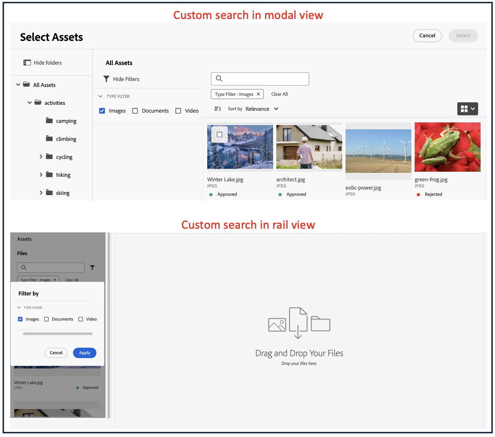

# Mikrofrontsväljare för mediefiler {#Overview}

Micro-Frontend Asset Selector har ett användargränssnitt som enkelt kan integreras med [!DNL Experience Manager Assets]-databasen så att du kan bläddra bland eller söka efter digitala resurser som är tillgängliga i databasen och använda dem i programutvecklingen.

Användargränssnittet Micro-FrontEnd är tillgängligt i ditt program med hjälp av paketet Resursväljare. Alla uppdateringar av paketet importeras automatiskt och den senaste distribuerade resursväljaren läses in automatiskt i programmet.


Resursväljaren har många fördelar, till exempel:

* Enkel integrering med något av [Adobe](#asset-selector-ims)- eller [icke-Adobe](#asset-selector-non-ims)-programmen som använder Vanilla JavaScript-biblioteket.
* Enkelt att underhålla när uppdateringar av Assets Selector-paketet automatiskt distribueras till resursväljaren som är tillgänglig för ditt program. Det finns inga uppdateringar som behövs i programmet för att läsa in de senaste ändringarna.
* Enkel anpassning eftersom det finns tillgängliga egenskaper som styr visningen av resursväljaren i programmet.
* Fulltextsökning, färdiga och anpassade filter för att snabbt navigera till material som ska användas i redigeringsmiljön.
* Möjlighet att växla databaser inom en IMS-organisation för val av resurser.
* Möjlighet att sortera resurser efter namn, dimensioner och storlek och visa dem i List-, Grid-, Gallery- eller Waterfall-vyn.

<!--Perform the following tasks to integrate and use Asset Selector with your [!DNL Experience Manager Assets] repository:

1. [Install Asset Selector](#installation)
2. [Integrate Asset Selector using Vanilla JS](#integration-using-vanilla-js)
3. [Use Asset Selector](#using-asset-selector)
-->

<!--
## Setting up Asset Selector {#asset-selector-setup}


-->

## Förutsättningar{#prereqs}

Du måste se till att följande kommunikationsmetoder används:

* Programmet körs på HTTPS.
* URL:en för programmet i IMS-klientens tillåtelselista för omdirigerings-URL:er.
* Inloggningsflödet för IMS konfigureras och återges med hjälp av en popup-meny i webbläsaren. Därför bör popup-fönster vara aktiverade eller tillåtna i målwebbläsaren.

Använd ovanstående krav om du behöver arbetsflöde för IMS-autentisering för resursväljaren. Om du redan är autentiserad med IMS-arbetsflödet kan du lägga till IMS-informationen i stället.

>[!IMPORTANT]
>
> Denna databas är avsedd att fungera som kompletterande dokumentation som beskriver tillgängliga API:er och användningsexempel för integrering av resursväljare. Innan du försöker installera eller använda resursväljaren måste du se till att din organisation har fått tillgång till resursväljaren som en del av Experience Manager Assets as a Cloud Service profil. Om du inte har etablerats kan du inte integrera eller använda dessa komponenter. Om du vill begära etablering bör din programadministratör skaffa en supportbiljett som är markerad som P2 från Admin Console och innehålla följande information:
>
>* Domännamn där det integrerande programmet finns.
>* Efter etableringen kommer din organisation att få `imsClientId`, `imsScope` och en `redirectUrl` som motsvarar den miljö som du begär och som är nödvändig för konfigurationen av resursväljaren. Utan dessa giltiga egenskaper kan du inte köra installationsstegen.

## Installation {#installation}

Resursväljaren är tillgänglig via både ESM CDN (till exempel version [esm.sh](https://esm.sh/)/[skypack](https://www.skypack.dev/)) och version [UMD](https://github.com/umdjs/umd).

I webbläsare som använder **UMD-version** (rekommenderas):

```
<script src="https://experience.adobe.com/solutions/CQ-assets-selectors/static-assets/resources/assets-selectors.js"></script>

<script>
  const { renderAssetSelector } = PureJSSelectors;
</script>
```

I webbläsare med `import maps`-stöd och **ESM CDN-version**:

```
<script type="module">
  import { AssetSelector } from 'https://experience.adobe.com/solutions/CQ-assets-selectors/static-assets/resources/@assets/selectors/index.js'
</script>
```

I Deno/Webpack Module Federation med **ESM CDN version**:

```
import { AssetSelector } from 'https://experience.adobe.com/solutions/CQ-assets-selectors/static-assets/resources/@assets/selectors/index.js'
```

## Integrera resursväljare med Vanilla JS {#integration-using-vanilla-js}

Du kan integrera alla [!DNL Adobe]- och andra program än Adobe med [!DNL Experience Manager Assets]-databasen och välja resurser inifrån programmet. Se [Integrering av resursväljare med olika program](#asset-selector-integration-with-apps).

Integreringen görs genom att du importerar resursväljarpaketet och ansluter till Assets as a Cloud Service med hjälp av Vanilla JavaScript-biblioteket. Redigera en `index.html` eller en lämplig fil i programmet till:

* Definiera autentiseringsinformationen
* Åtkomst till Assets as a Cloud Service-databasen
* Konfigurera visningsegenskaperna för resursväljaren

Du kan utföra autentisering utan att definiera några IMS-egenskaper om:

* Du integrerar ett [!DNL Adobe]-program i [Enhetligt gränssnitt](https://experienceleague.adobe.com/docs/experience-manager-cloud-service/content/overview/aem-cloud-service-on-unified-shell.html?lang=en).
* Du har redan en IMS-token genererad för autentisering.

## Integrera resursväljaren med olika program {#asset-selector-integration-with-apps}

Du kan integrera resursväljaren med olika program som:

* [Integrera resursväljare med ett  [!DNL Adobe] program](#adobe-app-integration-vanilla)
* [Integrera resursväljare med andra program än Adobe](#adobe-non-app-integration)
* [Integrering av Dynamic Media med OpenAPI-funktioner](#adobe-app-integration-polaris)

>[!BEGINTABS]

<!--Integration with an Adobe application content starts here-->

>[!TAB Integrering med ett Adobe-program]

### Förutsättningar{#prereqs-adobe-app}

Använd följande krav om du integrerar resursväljare med ett [!DNL Adobe]-program:

* [Kommunikationsmetoder](#prereqs)
* imsOrg
* imsToken
* apikey

### Integrera resursväljare med ett [!DNL Adobe]-program {#adobe-app-integration-vanilla}

I följande exempel visas hur resursväljaren används när ett [!DNL Adobe]-program körs under Enhetligt gränssnitt eller när `imsToken` redan har genererats för autentisering.

Inkludera paketet Resursväljare i koden med taggen `script`, vilket visas i _raderna 6-15_ i exemplet nedan. När skriptet har lästs in är den globala variabeln `PureJSSelectors` tillgänglig för användning. Definiera resursväljaren [egenskaper](#asset-selector-properties) så som visas på _raderna 16-23_. Egenskaperna `imsOrg` och `imsToken` krävs båda för autentisering i Adobe. Egenskapen `handleSelection` används för att hantera de valda resurserna. Om du vill återge resursväljaren anropar du funktionen `renderAssetSelector` så som anges på _rad 17_. Resursväljaren visas i behållarelementet `<div>`, vilket visas på _rader 21 och 22_.

Följ de här stegen för att använda resursväljaren med ditt [!DNL Adobe]-program.

```html {line-numbers="true"}
<!DOCTYPE html>
<html>
<head>
    <title>Asset Selector</title>
    <script src="https://experience.adobe.com/solutions/CQ-assets-selectors/assets/resources/assets-selectors.js"></script>
    <script>
        // get the container element in which we want to render the AssetSelector component
        const container = document.getElementById('asset-selector-container');
        // imsOrg and imsToken are required for authentication in Adobe application
        const assetSelectorProps = {
            imsOrg: 'example-ims@AdobeOrg',
            imsToken: "example-imsToken",
            apiKey: "example-apiKey-associated-with-imsOrg",
            handleSelection: (assets: SelectedAssetType[]) => {},
        };
        // Call the `renderAssetSelector` available in PureJSSelectors globals to render AssetSelector
        PureJSSelectors.renderAssetSelector(container, assetSelectorProps);
    </script>
</head>

<body>
    <div id="asset-selector-container" style="height: calc(100vh - 80px); width: calc(100vw - 60px); margin: -20px;">
    </div>
</body>

</html>
```

<!--For detailed example, visit [Asset Selector Code Example](https://github.com/adobe/aem-assets-selectors-mfe-examples).-->

+++**ImsAuthProps**
Egenskaperna `ImsAuthProps` definierar autentiseringsinformationen och det flöde som resursväljaren använder för att hämta en `imsToken` . Genom att ange dessa egenskaper kan du styra hur autentiseringsflödet ska fungera och registrera avlyssnare för olika autentiseringshändelser.

| Egenskapsnamn | Beskrivning |
|---|---|
| `imsClientId` | Ett strängvärde som representerar det IMS-klient-ID som används för autentisering. Detta värde tillhandahålls av Adobe och är specifikt för din Adobe AEM CS-organisation. |
| `imsScope` | Beskriver de scope som används vid autentisering. Omfattningarna avgör vilken åtkomstnivå programmet har till organisationens resurser. Flera omfång kan avgränsas med kommatecken. |
| `redirectUrl` | Representerar den URL där användaren omdirigeras efter autentiseringen. Det här värdet ställs vanligtvis in på programmets aktuella URL. Om `redirectUrl` inte anges använder `ImsAuthService` den redirectUrl som används för att registrera `imsClientId` |
| `modalMode` | Ett booleskt värde som anger om autentiseringsflödet ska visas i ett modalt (popup) eller inte. Om värdet är `true` visas autentiseringsflödet i ett popup-fönster. Om värdet är `false` visas autentiseringsflödet i en helsidesinläsning. _Obs!_ För bättre användargränssnitt kan du dynamiskt styra det här värdet om användaren har inaktiverat popup-fönster för webbläsare. |
| `onImsServiceInitialized` | En callback-funktion som anropas när Adobe IMS-autentiseringstjänsten initieras. Den här funktionen har en parameter, `service`, som är ett objekt som representerar Adobe IMS-tjänsten. Mer information finns i [`ImsAuthService`](#imsauthservice-ims-auth-service). |
| `onAccessTokenReceived` | En återanropsfunktion som anropas när en `imsToken` tas emot från Adobe IMS-autentiseringstjänsten. Den här funktionen tar en parameter, `imsToken`, som är en sträng som representerar åtkomsttoken. |
| `onAccessTokenExpired` | En återanropsfunktion som anropas när en åtkomsttoken har upphört att gälla. Den här funktionen används vanligtvis för att utlösa ett nytt autentiseringsflöde för att erhålla en ny åtkomsttoken. |
| `onErrorReceived` | En återanropsfunktion som anropas när ett fel inträffar under autentiseringen. Den här funktionen har två parametrar: feltypen och felmeddelandet. Feltypen är en sträng som representerar feltypen och felmeddelandet är en sträng som representerar felmeddelandet. |

+++

+++**ImsAuthService**
`ImsAuthService` -klassen hanterar autentiseringsflödet för resursväljaren. Det ansvarar för att erhålla en `imsToken` från Adobe IMS-autentiseringstjänsten. `imsToken` används för att autentisera användaren och auktorisera åtkomst till [!DNL Adobe Experience Manager] som en [!DNL Cloud Service] Assets-databas. ImsAuthService använder egenskaperna `ImsAuthProps` för att styra autentiseringsflödet och registrera avlyssnare för olika autentiseringshändelser. Du kan använda den praktiska funktionen [`registerAssetsSelectorsAuthService`](#purejsselectorsregisterassetsselectorsauthservice) för att registrera instansen _ImsAuthService_ med resursväljaren. Följande funktioner är tillgängliga för klassen `ImsAuthService`. Om du använder funktionen _registerAssetsSelectorsAuthService_ behöver du inte anropa dessa funktioner direkt.

| Funktionsnamn | Beskrivning |
|---|---|
| `isSignedInUser` | Avgör om användaren är inloggad på tjänsten och returnerar ett booleskt värde i enlighet med detta. |
| `getImsToken` | Hämtar autentiseringen `imsToken` för den inloggade användaren, som kan användas för att autentisera begäranden till andra tjänster, som att generera resursåtergivning. |
| `signIn` | Initierar inloggningsprocessen för användaren. Den här funktionen använder `ImsAuthProps` för att visa autentisering i antingen ett popup-fönster eller en helsidesinläsning |
| `signOut` | Signerar användaren från tjänsten, gör sin autentiseringstoken ogiltig och kräver att han/hon loggar in igen för att få åtkomst till skyddade resurser. Om du anropar den här funktionen läses den aktuella sidan in igen. |
| `refreshToken` | Uppdaterar autentiseringstoken för den inloggade användaren, vilket förhindrar att den upphör att gälla och säkerställer oavbruten åtkomst till skyddade resurser. Returnerar en ny autentiseringstoken som kan användas för efterföljande begäranden. |

+++

+++**IMS-tokenvalidering**

```
<script>
    const apiToken="<valid IMS token>";
    function handleSelection(selection) {
    console.log("Selected asset: ", selection);
    };
    function renderAssetSelectorInline() {
    console.log("initializing Asset Selector");
    const props = {
    "repositoryId": "delivery-p64502-e544757.adobeaemcloud.com",
    "apiKey": "ngdm_test_client",
    "imsOrg": "<IMS org>",
    "imsToken": apiToken,
    handleSelection,
    hideTreeNav: true
    }
    const container = document.getElementById('asset-selector-container');
    PureJSSelectors.renderAssetSelector(container, props);
    }
    $(document).ready(function() {
    renderAssetSelectorInline();
    });
</script>
```

+++

+++**Registrera återanrop till IMS-tjänsten**

```
// object `imsProps` to be defined as below 
let imsProps = {
imsClientId: <IMS Client Id>,
imsScope: "openid",
redirectUrl: window.location.href,
modalMode: true,
adobeImsOptions: {
modalSettings: {
allowOrigin: window.location.origin,
},
useLocalStorage: true,
},
onImsServiceInitialized: (service) => {
console.log("onImsServiceInitialized", service);
},
onAccessTokenReceived: (token) => {
console.log("onAccessTokenReceived", token);
},
onAccessTokenExpired: () => {
console.log("onAccessTokenError");
// re-trigger sign-in flow
},
onErrorReceived: (type, msg) => {
console.log("onErrorReceived", type, msg);
},
}
```

+++

<!--Integration with non-Adobe application content starts here-->

>[!TAB Integrering med ett program som inte är Adobe]

<!--### Integrate Asset Selector with a [!DNL non-Adobe] application {#adobe-non-app-integration}-->

### Förutsättningar {#prereqs-non-adobe-app}

Använd följande förutsättningar om du integrerar resursväljare med ett program som inte är Adobe:

* [Kommunikationsmetoder](#prereqs)
* imsClientId
* imsScope
* redirectUrl
* imsOrg
* apikey

Resursväljaren stöder autentisering till databasen [!DNL Experience Manager Assets] med hjälp av Identity Management System-egenskaper (IMS) som `imsScope` eller `imsClientID` när du integrerar den med ett program som inte är Adobe.

### Integrera resursväljare med andra program än Adobe {#adobe-non-app-integration}

Om du vill integrera resursväljaren med ett program som inte är Adobe måste du utföra olika valideringar, till exempel logga en supportanmälan och integrering.

+++**Konfigurera resursväljare för ett program som inte är Adobe**
Om du vill konfigurera resursväljaren för ett program som inte är Adobe måste du först logga en supportanmälan för etablering följt av integrationsstegen.

**Loggar en supportanmälan**
Steg för att logga en supportanmälan via Admin Console:

1. Lägg till **Resursväljaren med AEM Assets** i biljettens titel.

1. Ange följande information i beskrivningen:

   * [!DNL Experience Manager Assets] som en [!DNL Cloud Service]-URL (program-ID och miljö-ID).
   * Domännamn där webbprogrammet som inte kommer från Adobe finns.
+++

+++**Integreringssteg**
Använd den här `index.html` -exempelfilen för autentisering när resursväljaren integreras med ett program som inte är Adobe.

Gå till resursväljarpaketet med taggen `Script`, som visas på *rad 9* till *rad 11* i exempelfilen `index.html`.

*Rad 14* till *rad 38* i exemplet beskriver IMS-flödesegenskaperna, till exempel `imsClientId`, `imsScope` och `redirectURL`. Funktionen kräver att du definierar minst en av egenskaperna `imsClientId` och `imsScope`. Om du inte definierar ett värde för `redirectURL` används den registrerade omdirigerings-URL:en för klient-ID:t.

Eftersom du inte har skapat någon `imsToken` använder du funktionerna `registerAssetsSelectorsAuthService` och `renderAssetSelectorWithAuthFlow`, vilket visas på rad 40 till rad 50 i exempelfilen `index.html`. Använd funktionen `registerAssetsSelectorsAuthService` före `renderAssetSelectorWithAuthFlow` för att registrera `imsToken` med resursväljaren. [!DNL Adobe] rekommenderar att `registerAssetsSelectorsAuthService` anropas när du instansierar komponenten.

Definiera autentiseringen och andra Assets as a Cloud Service åtkomstrelaterade egenskaper i avsnittet `const props`, vilket visas på *rad 54* till *rad 60* i exempelfilen `index.html`.

Den globala variabeln `PureJSSelectors`, som omnämns i *rad 65*, används för att återge resursväljaren i webbläsaren.

Resursväljaren återges på behållarelementet `<div>`, vilket anges på *rad 74* till *rad 81*. I exemplet används en dialogruta för att visa resursväljaren.

```html {line-numbers="true"}
<!DOCTYPE html>
<html>

<head>
    <meta http-equiv="X-UA-Compatible" content="IE=edge">
    <meta charset="utf-8">
    <title>Asset Selectors</title>
    <link rel="stylesheet" href="index.css">
    <script id="asset-selector"
        src="https://experience.adobe.com/solutions/CQ-assets-selectors/assets/resources/asset-selectors.js"></script>
    <script>

        const imsProps = {
            imsClientId: "<obtained from IMS team>",
            imsScope: "openid, <other scopes>",
            redirectUrl: window.location.href,
            modalMode: true, // false to open in a full page reload flow
            onImsServiceInitialized: (service) => {
                // invoked when the ims service is initialized and is ready
                console.log("onImsServiceInitialized", service);
            },
            onAccessTokenReceived: (token) => {
                console.log("onAccessTokenReceived", token);
            },
            onAccessTokenExpired: () => {
                console.log("onAccessTokenError");
                // re-trigger sign-in flow
            },
            onErrorReceived: (type, msg) => {
                console.log("onErrorReceived", type, msg);
            },
        }

        function load() {
            const registeredTokenService = PureJSSelectors.registerAssetsSelectorsAuthService(imsProps);
            imsInstance = registeredTokenService;
        };

        // initialize the IMS flow before attempting to render the asset selector
        load();
        

        //function that will render the asset selector
            const otherProps = {
            // any other props supported by asset selector
            }
            const assetSelectorProps = {
                "imsOrg": "imsorg",
                ...otherProps
            }
             // container element on which you want to render the AssetSelector/DestinationSelector component
            const container = document.getElementById('asset-selector');

            /// Use the PureJSSelectors in globals to render the AssetSelector/DestinationSelector component
            PureJSSelectors.renderAssetSelectorWithAuthFlow(container, assetSelectorProps, () => {
                const assetSelectorDialog = document.getElementById('asset-selector-dialog');
                assetSelectorDialog.showModal();
            });
        }
    </script>

</head>
<body class="asset-selectors">
    <div>
        <button onclick="renderAssetSelectorWithAuthFlowFlow()">Asset Selector - Select Assets with Ims Flow</button>
    </div>
        <dialog id="asset-selector-dialog">
            <div id="asset-selector" style="height: calc(100vh - 80px); width: calc(100vw - 60px); margin: -20px;">
            </div>
        </dialog>
    </div>
</body>

</html>
```

+++

+++**Det går inte att komma åt leveransdatabasen**

>[!TIP]
>
>Om du har integrerat resursväljare med hjälp av arbetsflödet Registrera dig för inloggning men fortfarande inte kan komma åt leveransdatabasen, kontrollerar du att cookies i webbläsaren har rensats bort. Annars får du ett `invalid_credentials All session cookies are empty`-fel i konsolen.

+++

<!--Integration with Polaris application content starts here-->

>[!TAB Integrering för Dynamic Media med OpenAPI-funktioner]

### Förutsättningar {#prereqs-polaris}

Använd följande förutsättningar om du integrerar resursväljare med Dynamic Media med OpenAPI-funktioner:

* [Kommunikationsmetoder](#prereqs)
* För att få tillgång till Dynamic Media med OpenAPI-funktioner måste du ha licenser för:
   * Assets-arkiv (till exempel Experience Manager Assets as a Cloud Service).
   * AEM Dynamic Media.
* Endast [godkända resurser](#approved-assets.md) är tillgängliga för användning för att säkerställa varumärkets enhetlighet.

### Integrering av Dynamic Media med OpenAPI-funktioner{#adobe-app-integration-polaris}

Integreringen av resursväljaren med Dynamic Media OpenAPI-processen omfattar olika steg som skapar en anpassad URL för dynamiska media eller är klar att välja URL för dynamiska media osv.

+++**Integrera resursväljare för Dynamic Media med OpenAPI-funktioner**

Egenskaperna `rootPath` och `path` ska inte ingå i Dynamic Media med OpenAPI-funktioner. I stället kan du konfigurera egenskapen `aemTierType`. Här följer syntaxen för konfiguration:

```
aemTierType:[1: "delivery"]
```

Med den här konfigurationen kan du visa alla godkända resurser utan mappar eller som en platt struktur. Mer information finns i `aemTierType`-egenskapen under [Resursväljaregenskaper](#asset-selector-properties)

+++

+++**Skapa en dynamisk leverans-URL från godkända resurser**
När du har konfigurerat resursväljaren används ett objektschema för att skapa en dynamisk leverans-URL från de valda resurserna.
Ett schema med ett objekt från en array med objekt som tas emot när en resurs väljs:

```
{
"dc:format": "image/jpeg",
"repo:assetId": "urn:aaid:aem:xxxxxxxx-xxxx-xxxx-xxxx-xxxxxxxxxxxx",
"repo:name": "image-7.jpg",
"repo:repositoryId": "delivery-pxxxx-exxxxxx.adobe.com",
...
}
```

Alla markerade resurser bärs av funktionen `handleSelection` som fungerar som ett JSON-objekt. Exempel: `JsonObj`. Den dynamiska leverans-URL:en skapas genom att följande bärare kombineras:

| Objekt | JSON |
|---|---|
| Värd | `assetJsonObj["repo:repositoryId"]` |
| API-rot | `/adobe/dynamicmedia/deliver` |
| asset-id | `assetJsonObj["repo:assetId"]` |
| seo-name | `assetJsonObj["repo:name"].split(".").slice(0,-1).join(".")` |
| format | `.jpg` |

**Godkänd API-specifikation för resursleverans**

URL:
`https://<delivery-api-host>/adobe/dynamicmedia/deliver/<asset-id>/<seo-name>.<format>?<image-modification-query-parameters>`

Var,

* Värddatorn är `https://delivery-pxxxxx-exxxxxx.adobe.com`
* API-roten är `"/adobe/dynamicmedia/deliver"`
* `<asset-id>` är tillgångsidentifierare
* `<seo-name>` är namnet på en resurs
* `<format>` är utdataformatet
* `<image modification query parameters>` som stöd av den godkända resursens leverans-API-specifikation

**Godkänt leverans-API för resurser**

Den dynamiska leverans-URL:en har följande syntax:
`https://<delivery-api-host>/adobe/assets/deliver/<asset-id>/<seo-name>`, där,

* Värddatorn är `https://delivery-pxxxxx-exxxxxx.adobe.com`
* API-roten för ursprunglig återgivningsleverans är `"/adobe/assets/deliver"`
* `<asset-id>` är tillgångsidentifierare
* `<seo-name>` är namnet på resursen som kan ha ett tillägg eller inte

+++

+++**Klar att välja dynamisk leverans-URL**
Alla markerade resurser bärs av funktionen `handleSelection` som fungerar som ett JSON-objekt. Exempel: `JsonObj`. Den dynamiska leverans-URL:en skapas genom att följande bärare kombineras:

| Objekt | JSON |
|---|---|
| Värd | `assetJsonObj["repo:repositoryId"]` |
| API-rot | `/adobe/assets/deliver` |
| asset-id | `assetJsonObj["repo:assetId"]` |
| seo-name | `assetJsonObj["repo:name"]` |

Nedan visas två sätt att gå igenom JSON-objektet:


* **Miniatyrbild:** Miniatyrbilder kan vara bilder och resurser kan vara PDF, video, bilder och så vidare. Även om du kan använda attributen height och width för en resurs miniatyrbild som dynamisk leveransåtergivning.
Följande uppsättning återgivningar kan användas för resurser av typen PDF:
När du har valt en PDF-fil i en sidospark visas nedanstående information i urvalssammanhanget. Här nedan beskrivs hur du går igenom JSON-objektet:

  <!---->

  Du kan referera till `selection[0].....selection[4]` för arrayen med återgivningslänk från skärmbilden ovan. Nyckelegenskaperna för en av miniatyrbildsrenderingarna är till exempel:

  ```
  { 
      "height": 319, 
      "width": 319, 
      "href": "https://delivery-pxxxxx-exxxxx-cmstg.adobeaemcloud.com/adobe/assets/urn:aaid:aem:8560f3a1-d9cf-429d-a8b8-d81084a42d41/as/algorithm design.jpg?accept-experimental=1&width=319&height=319&preferwebp=true", 
      "type": "image/webp" 
  } 
  ```

På skärmbilden ovan måste leveransadressen för den ursprungliga återgivningen i PDF införlivas i målupplevelsen om PDF krävs och inte i miniatyrbilden. Exempel: `https://delivery-pxxxxx-exxxxx-cmstg.adobeaemcloud.com/adobe/assets/urn:aaid:aem:8560f3a1-d9cf-429d-a8b8-d81084a42d41/original/as/algorithm design.pdf?accept-experimental=1`

* **Video:** Du kan använda videospelarens URL för videomaterialet som använder en inbäddad iFrame. Du kan använda följande arrayåtergivningar i målupplevelsen:
  <!---->

  ```
  { 
      "height": 319, 
      "width": 319, 
      "href": "https://delivery-pxxxxx-exxxxx-cmstg.adobeaemcloud.com/adobe/assets/urn:aaid:aem:2fdef732-a452-45a8-b58b-09df1a5173cd/as/asDragDrop.2.jpg?accept-experimental=1&width=319&height=319&preferwebp=true", 
      "type": "image/webp" 
  } 
  ```

  Du kan referera till `selection[0].....selection[4]` för arrayen med återgivningslänk från skärmbilden ovan. Nyckelegenskaperna för en av miniatyrbildsrenderingarna är till exempel:

  Kodfragmentet i skärmbilden ovan är ett exempel på en videoresurs. Den innehåller en array med återgivningslänkar. `selection[5]` i utdraget är ett exempel på en miniatyrbild som kan användas som platshållare för videominiatyrbilden i målupplevelsen. `selection[5]` i återgivningens array är för videospelaren. Detta fungerar som HTML och kan anges som `src` för iframe. Den stöder strömning med adaptiv bithastighet, som är webboptimerad leverans av videon.

  I exemplet ovan är videospelarens URL `https://delivery-pxxxxx-exxxxx-cmstg.adobeaemcloud.com/adobe/assets/urn:aaid:aem:2fdef732-a452-45a8-b58b-09df1a5173cd/play?accept-experimental=1`

+++**Användargränssnittet Resursväljare för Dynamic Media med OpenAPI-funktioner**

Efter integrering med Adobe Micro-Frontend Asset Selector kan du bara se resursstrukturen för alla godkända resurser som är tillgängliga i resurskatalogen för Experience Manager.


* **A**: [Visa/Göm panel](#hide-show-panel)
* **B**: [Assets](#repository)
* **C**: [Sortering](#sorting)
* **D**: [Filter](#filters)
* **E**: [Sökfältet](#search-bar)
* **F**: [Sortera i stigande eller fallande ordning](#sorting)
* **G**: Avbryt markering
* **H**: Markera en eller flera resurser

+++

+++**Konfigurera anpassade filter**
Med resursväljaren för Dynamic Media med OpenAPI-funktioner kan du konfigurera anpassade egenskaper och de filter som baseras på dem. Egenskapen `filterSchema` används för att konfigurera sådana egenskaper. Anpassningen kan visas som `metadata.<metadata bucket>.<property name>.` som filtren kan konfigureras mot, där,

* `metadata` är information om en resurs
* `embedded` är den statiska parametern som används för konfiguration, och
* `<propertyname>` är det filternamn som du konfigurerar

Egenskaper som definieras på `jcr:content/metadata/`-nivå visas som `metadata.<metadata bucket>.<property name>.` för de filter som du vill konfigurera för konfigurationen.

I Resursväljaren för Dynamic Media med OpenAPI-funktioner konverteras till exempel en egenskap på `asset jcr:content/metadata/client_name:market` till `metadata.embedded.client_name:market` för filterkonfiguration.

En engångsaktivitet måste göras för att hämta namnet. Gör ett sök-API-anrop för resursen och hämta egenskapsnamnet (i huvudsak haken).

+++

>[!ENDTABS]

## Egenskaper för resursväljare {#asset-selector-properties}

Du kan använda egenskaperna för resursväljaren för att anpassa hur resursväljaren återges. I följande tabell visas de egenskaper som du kan använda för att anpassa och använda resursväljaren.

| Egenskap | Typ | Obligatoriskt | Standard | Beskrivning |
|---|---|---|---|---|
| *järnväg* | boolesk | Nej | false | Om den är markerad som `true` återges resursväljaren i en vänsterrälsvy. Om den är markerad som `false` återges resursväljaren i modal vy. |
| *imsOrg* | string | Ja | | IMS-ID (Adobe Identity Management System) som tilldelas när [!DNL Adobe Experience Manager] etableras som [!DNL Cloud Service] för din organisation. Nyckeln `imsOrg` krävs för att autentisera om organisationen du försöker få åtkomst till är under Adobe IMS eller inte. |
| *imsToken* | string | Nej | | IMS-innehavartoken används för autentisering. `imsToken` krävs om du använder ett [!DNL Adobe]-program för integreringen. |
| *apiKey* | string | Nej | | API-nyckel som används för åtkomst till AEM. `apiKey` krävs om du använder en [!DNL Adobe]-programintegrering. |
| *filterSchema* | array | Nej | | Modell som används för att konfigurera filteregenskaper. Detta är användbart när du vill begränsa vissa filteralternativ i Resursväljaren. |
| *filterFormProps* | Objekt | Nej | | Ange de filteregenskaper som du behöver använda för att förfina sökningen. Exempel: MIME-typ JPG, PNG, GIF. |
| *selectedAssets* | Matris `<Object>` | Nej |                 | Ange valt Assets när resursväljaren återges. Det krävs en array med objekt som innehåller en id-egenskap för resurserna. `[{id: 'urn:234}, {id: 'urn:555'}]` En resurs måste till exempel vara tillgänglig i den aktuella katalogen. Om du behöver använda en annan katalog anger du även ett värde för egenskapen `path`. |
| *acvConfig* | Objekt | Nej | | Resurssamlingens visningsegenskap som innehåller objekt med anpassad konfiguration som åsidosätter standardvärden. Den här egenskapen används också med egenskapen `rail` för att aktivera spårningsvisning av resursvyn. |
| *i18nSymboler* | `Object<{ id?: string, defaultMessage?: string, description?: string}>` | Nej |                 | Om OTB-översättningarna inte är tillräckliga för ditt programs behov kan du visa ett gränssnitt genom vilket du kan skicka dina egna anpassade, lokaliserade värden via `i18nSymbols`-proppen. Om du skickar ett värde genom det här gränssnittet åsidosätts standardöversättningarna och i stället används dina egna. Om du vill utföra åsidosättningen måste du skicka ett giltigt [Message Descriptor](https://formatjs.io/docs/react-intl/api/#message-descriptor)-objekt till nyckeln för `i18nSymbols` som du vill åsidosätta. |
| *intl* | Objekt | Nej | | Resursväljaren innehåller OOTB-standardöversättningar. Du kan välja översättningsspråk genom att ange en giltig språksträng via `intl.locale`-utkastet. Till exempel: `intl={{ locale: "es-es" }}` </br></br> De språksträngar som stöds följer [ ISO 639 - Koder ](https://www.iso.org/iso-639-language-codes.html) för att representera namn på språkstandarder. </br></br> Lista över språk som stöds: engelska - en-us (standard) spanska - es-es&#39; German - de-de&#39; French - fr-fr&#39; Italian - it-it&#39; Japanese - ja-jp&#39; Korean - ko-kr&#39; Portuguese - pt-br&#39; Chinese (Traditional) - zh-cn&#39; Chinese (Taiwan) - zh-tw |
| *databaseId* | string | Nej | &#39; | Databas från vilken resursväljaren läser in innehållet. |
| *additionalAemSolutions* | `Array<string>` | Nej | [ ] | Här kan du lägga till en lista med ytterligare AEM. Om ingen information anges i den här egenskapen beaktas endast mediebibliotek eller AEM Assets-databaser. |
| *hideTreeNav* | boolesk | Nej |  | Anger om navigeringssidofältet för resursträd ska visas eller döljas. Den används endast i modal vy och därför har den här egenskapen ingen effekt i järnvägsvy. |
| *onDrop* | Funktion | Nej | | Egenskapen gör att en resurs kan släppas. |
| *dropOptions* | `{allowList?: Object}` | Nej | | Konfigurerar släppningsalternativ med tillåtelselista. |
| *colorScheme* | string | Nej | | Konfigurera temat (`light` eller `dark`) för resursväljaren. |
| *handleSelection* | Funktion | Nej | | Anropas med en array med tillgångsobjekt när resurser har valts och knappen `Select` på spärren klickas. Den här funktionen anropas bara i modal vy. Använd funktionerna `handleAssetSelection` eller `onDrop` för spårvyn. Exempel: <pre>handleSelection=(assets: Asset[])=> {...}</pre> Mer information finns i [Markerad resurstyp](#selected-asset-type). |
| *handleAssetSelection* | Funktion | Nej | | Anropas med en array med objekt när resurserna markeras eller avmarkeras. Detta är användbart när du vill lyssna efter resurser när användaren väljer dem. Exempel: <pre>handleSelection=(assets: Asset[])=> {...}</pre> Mer information finns i [Markerad resurstyp](#selected-asset-type). |
| *onClose* | Funktion | Nej | | Anropas när knappen `Close` i modal vy trycks ned. Detta anropas bara i vyn `modal` och ignoreras i vyn `rail`. |
| *onFilterSubmit* | Funktion | Nej | | Anropas med filterobjekt när användaren ändrar olika filtervillkor. |
| *selectionType* | string | Nej | enkel | Konfiguration för `single` eller `multiple` urval av resurser åt gången. |
| *dragOptions.tillåtelselista* | boolesk | Nej | | Egenskapen används för att tillåta eller neka att resurser som inte kan markeras dras. |
| *aemTierType* | string | Nej | | Du kan välja om du vill visa resurser från leveransnivå, författarnivå eller både och. <br><br> Syntax: `aemTierType:[0: "author" 1: "delivery"` <br><br> Om till exempel båda `["author","delivery"]` används visas alternativ för både författare och leverans i databasväljaren. <br> Använd dessutom `["delivery"]` för leveransrelaterade resurser i Dynamic Media med OpenAPI-funktioner. |
| *handleNavigateToAsset* | Funktion | Nej | | Det är en återanropsfunktion som hanterar markering av en resurs. |
| *noWrap* | boolesk | Nej | | Egenskapen *noWrap* hjälper till att återge resursväljaren på sidopanelen. Om den här egenskapen inte nämns återges *dialogvyn* som standard. |
| *dialogSize* | liten, medelstor, stor, helskärmsbild eller helskärmsövergång | Sträng | Valfritt | Du kan styra layouten genom att ange dess storlek med de angivna alternativen. |
| *colorScheme* | ljus eller mörk | Nej | | Den här egenskapen används för att ange temat för ett resursväljarprogram. Du kan välja mellan ljust eller mörkt tema. |
| *filterRepoList* | Funktion | Nej |  | Du kan använda callback-funktionen `filterRepoList` som anropar Experience Manager-databasen och returnerar en filtrerad lista med databaser. |

<!--| *rootPath* | string | No | /content/dam/ | Folder path from which Asset Selector displays your assets. `rootPath` can also be used in the form of encapsulation. For example, given the following path, `/content/dam/marketing/subfolder/`, Asset Selector does not allow you to traverse through any parent folder, but only displays the children folders. |
| *path* | string | No | | Path that is used to navigate to a specific directory of assets when the Asset Selector is rendered. |-->

## Exempel på hur du använder egenskaper för resursväljare {#usage-examples}

Du kan definiera [egenskaperna](#asset-selector-properties) för resursväljaren i filen `index.html` om du vill anpassa visningen av resursväljaren i programmet.

### Exempel 1: Resursväljaren i vyn Räler


Om värdet för AssetSelector `rail` är inställt på `false` eller inte nämns i egenskaperna visas resursväljaren som standard i modulvyn. Egenskapen `acvConfig` används för att aktivera spårningsvyn för resursvyn. Gå till [aktivera eller inaktivera dra och släpp](#enable-disable-drag-and-drop) om du vill veta mer om hur egenskapen `acvConfig` används.

<!--
### Example 2: Use selectedAssets property in addition to the path property

Use the `path` property to define the folder name that displays automatically when the Asset Selector is rendered. In addition, use the `selectedAssets` property to define the IDs for the assets that you need to select within the folder. Moreover, when you want to display assets that are pre-defined within the folder, you can use selectedAssets property.

   
-->

### Exempel 2: Metadatapuposer

Använd olika egenskaper för att definiera metadata för en resurs som du vill visa med hjälp av en informationsikon. Info pover innehåller information om resursen eller mappen, inklusive namn, dimensioner, ändringsdatum, plats och beskrivning av en resurs. I exemplet nedan används olika egenskaper för att visa metadata för en resurs, till exempel anger egenskapen `repo:path` platsen för en resurs. <!--`repo` represents the repository from where the asset is showing, whereas, `path` represents the route from where the asset or folder is rendered.-->


### Exempel 3: Egen filteregenskap i skenvy

Förutom den facetterade sökningen kan du med Assets Selector anpassa olika attribut för att förfina din sökning från [!DNL Adobe Experience Manager] som ett [!DNL Cloud Service]-program. Lägg till följande kod för att lägga till anpassade sökfilter i programmet. I exemplet nedan filtrerar sökningen `Type Filter` resurstypen bland Bilder, Dokument eller Videor eller den filtertyp som du har lagt till för sökningen.


<!--

## Customization after integrating Asset Selector 

### Custom metadata

Assets display panel shows the out of the box metadata that can be displayed in the info of the asset. In addition to this, [!DNL Adobe Experience Manager] as a [!DNL Cloud Service] application allows configuration of the asset selector by adding custom metadata that is shown in info panel of the asset.
-->

## Funktionskodfragment{#code-snippets}

Definiera förutsättningarna i filen `index.html` eller en liknande fil i programimplementeringen för att definiera autentiseringsinformationen för åtkomst till databasen [!DNL Experience Manager Assets]. När du är klar kan du lägga till kodfragment efter dina behov.

### Anpassa filterpanelen {#customize-filter-panel}

Du kan lägga till följande kodfragment i objektet `assetSelectorProps` för att anpassa filterpanelen:

```
filterSchema: [
    {
    header: 'File Type',
    groupKey: 'TopGroup',
    fields: [
    {
    element: 'checkbox',
    name: 'type',
    options: [
    {
    label: 'Images',
    value: '<comma separated mimetypes, without space, that denote all images, for e.g., image/>',
    },
    {
    label: 'Videos',
    value: '<comma separated mimetypes, without space, that denote all videos for e.g., video/,model/vnd.mts,application/mxf>'
    }
    ]
    }
    ]
    },
    {
    fields: [
    {
    element: 'checkbox',
    name: 'type',
    options: [
    { label: 'JPG', value: 'image/jpeg' },
    { label: 'PNG', value: 'image/png' },
    { label: 'TIFF', value: 'image/tiff' },
    { label: 'GIF', value: 'image/gif' },
    { label: 'MP4', value: 'video/mp4' }
    ],
    columns: 3,
    },
    ],
    header: 'Mime Types',
    groupKey: 'MimeTypeGroup',
    },
    {
    fields: [
    {
    element: 'checkbox',
    name: 'property=metadata.application.xcm:keywords.value',
    options: [
    { label: 'Fruits', value: 'fruits' },
    { label: 'Vegetables', value: 'vegetables'}
    ],
    columns: 3,
    },
    ],
    header: 'Food Category',
    groupKey: 'FoodCategoryGroup',
    }
],
```

### Anpassa information i modal vy {#customize-info-in-modal-view}

Du kan anpassa informationsvyn för en resurs genom att klicka på ikonen  . Kör koden nedan:

```
// Create an object infoPopoverMap and set the property `infoPopoverMap` with it in assetSelectorProps
const infoPopoverMap = (map) => {
// for example, to skip `path` from the info popover view
let defaultPopoverData = PureJSSelectors.getDefaultInfoPopoverData(map);
return defaultPopoverData.filter((i) => i.label !== 'Path'
};
assetSelectorProps.infoPopoverMap = infoPopoverMap;
```

### Aktivera eller inaktivera dra och släpp-läge {#enable-disable-drag-and-drop}

Lägg till följande egenskaper i `assetSelectorProp` för att aktivera dra och släpp-läget. Om du vill inaktivera dra och släpp ersätter du parametern `true` med `false`.

```
rail: true,
acvConfig: {
dragOptions: {
allowList: {
'*': true,
},
},
selectionType: 'multiple'
}

// the drop handler to be implemented
function drop(e) {
e.preventDefault();
// following helps you get the selected assets – an array of objects.
const data = JSON.parse(e.dataTransfer.getData('collectionviewdata'));
}
```

### Val av Assets {#selection-of-assets}

Den valda resurstypen är en array med objekt som innehåller resursinformationen när funktionerna `handleSelection`, `handleAssetSelection` och `onDrop` används.

Utför följande steg för att konfigurera valet av en eller flera resurser:

```
acvConfig: {
selectionType: 'multiple' // 'single' for single selection
}
// the `handleSelection` callback, always gets you the array of selected assets
```

**Schemasyntax**

```
interface SelectedAsset {
    'repo:id': string;
    'repo:name': string;
    'repo:path': string;
    'repo:size': number;
    'repo:createdBy': string;
    'repo:createDate': string;
    'repo:modifiedBy': string; 
    'repo:modifyDate': string; 
    'dc:format': string; 
    'tiff:imageWidth': number;
    'tiff:imageLength': number;
    'repo:state': string;
    computedMetadata: Record<string, any>;
    _links: {
        'http://ns.adobe.com/adobecloud/rel/rendition': Array<{
            href: string;
            type: string;
            'repo:size': number;
            width: number;
            height: number;
            [others: string]: any;
        }>;
    };
}
```

I följande tabell beskrivs några av de viktiga egenskaperna för det valda resursobjektet.

| Egenskap | Typ | Beskrivning |
|---|---|---|
| *repo:databaseId* | string | Unik identifierare för databasen där resursen lagras. |
| *repo:id* | string | Unik identifierare för tillgången. |
| *repo:assetClass* | string | Klassificeringen av resursen (till exempel bild eller video, dokument). |
| *repo:name* | string | Namnet på resursen, inklusive filtillägget. |
| *repo:size* | tal | Resursens storlek i byte. |
| *repo:path* | string | Platsen för resursen i databasen. |
| *repo:överordnade* | `Array<string>` | En array med överordnade objekt för resursen i databasen. |
| *repo:state* | string | Aktuellt läge för resursen i databasen (t.ex. aktiv, borttagen och så vidare). |
| *repo:createdBy* | string | Användaren eller systemet som skapade resursen. |
| *repo:createDate* | string | Datum och tid då tillgången skapades. |
| *repo:modifiedBy* | string | Den användare eller det system som senast ändrade resursen. |
| *repo:modifyDate* | string | Datum och tid då tillgången senast ändrades. |
| *dc:format* | string | Resursens format, till exempel filtypen (till exempel JPEG, PNG och så vidare). |
| *tiff:imageWidth* | tal | Bredden på en resurs. |
| *tiff:imageLength* | tal | En tillgångs höjd. |
| *computedMetadata* | `Record<string, any>` | Ett objekt som representerar en bucket för alla resursens metadata av alla slag (databas, program eller inbäddade metadata). |
| *_links* | `Record<string, any>` | Hypermedialänkar för den associerade resursen. Innehåller länkar för resurser som metadata och återgivningar. |
| *_links.<http://ns.adobe.com/adobecloud/rel/rendition>* | `Array<Object>` | En array med objekt som innehåller information om återgivningar av resursen. |
| *_links.<http://ns.adobe.com/adobecloud/rel/rendition[].href>* | string | URI:n till återgivningen. |
| *_links.<http://ns.adobe.com/adobecloud/rel/rendition[].type>* | string | Återgivningens MIME-typ. |
| *_links.<http://ns.adobe.com/adobecloud/rel/rendition[].'repo:size>&#39;* | tal | Återgivningens storlek i byte. |
| *_links.<http://ns.adobe.com/adobecloud/rel/rendition[].width>* | tal | Återgivningens bredd. |
| *_links.<http://ns.adobe.com/adobecloud/rel/rendition[].height>* | tal | Återgivningens höjd. |

En fullständig lista över egenskaper och detaljerade exempel finns på [Exempel på resursväljarkod](https://github.com/adobe/aem-assets-selectors-mfe-examples).

### Sammanhangsberoende anropsfilter{#contextual-invocation-filter}

Med resursväljaren kan du lägga till ett taggväljarfilter. Den har stöd för en tagggrupp som kombinerar alla relevanta taggar till en viss tagggrupp. Dessutom kan du välja ytterligare taggar som motsvarar den resurs du söker efter. Dessutom kan du ange standardtagggrupper under det kontextuella anropsfiltret som du använder mest så att de är tillgängliga oavsett var du är.

> 
>
> * Du måste lägga till sammanhangsberoende kodfragment för att kunna aktivera taggningsfilter i sökningen.
> * Det är obligatoriskt att använda namnegenskapen som motsvarar tagggruppstypen `(property=xcm:keywords.id=)`.

Syntax:

```
const filterSchema=useMemo(() => {
    return: [
        {
            element: 'taggroup',
            name: 'property=xcm:keywords.id='
        },
    ];
}, []);
```

Om du vill lägga till tagggrupper på filterpanelen måste du lägga till minst en tagggrupp som standard. Använd dessutom kodfragmentet nedan för att lägga till de standardtaggar som är förmarkerade från tagggruppen.

```
export const WithAssetTags = (props) = {
const [selectedTags, setSelectedTags] = useState (
new Set(['orientation', 'color', 'facebook', 'experience-fragments:', 'dam', 'monochrome'])
const handleSelectTags = (selected) => {
setSelectedTags (new Set (selected)) ;
};
const filterSchema = useMemo ((); => {
    return {
        schema: [
            ｛
                fields: [
                    {
                    element: 'checkbox', 
                    name: 'property=xcm:keywords=', 
                    defaultValue: Array. from(selectedTags), 
                    options: assetTags, 
                    orientation: 'vertical',
                    },
                ],
    header: 'Asset Tags', 
    groupkey: 'AssetTagsGroup',
        ],
    },
｝；
}, [selectedTags]);
```


## Hantera urval av Assets med objektschema {#handling-selection}

Egenskapen `handleSelection` används för att hantera enstaka eller flera markeringar av Assets i Assets Selector. I exemplet nedan anges syntaxen för användning av `handleSelection`.


## Inaktivera val av Assets {#disable-selection}

Inaktivera markering används för att dölja eller inaktivera att resurser eller mappar kan markeras. Den döljer kryssrutan välj från kortet eller resursen som inte gör att den markeras. Om du vill använda den här funktionen kan du deklarera positionen för en resurs eller mapp som du vill inaktivera i en array. Om du till exempel vill inaktivera valet av en mapp som visas vid den första positionen kan du lägga till följande kod:
`disableSelection: [0]:folder`

Du kan förse arrayen med en lista med MIME-typer (till exempel bild, mapp, fil eller andra MIME-typer, till exempel image/jpeg) som du vill inaktivera. Mime-typerna som du deklarerar mappas till attributen `data-card-type` och `data-card-mimetype` för en resurs.

Dessutom kan Assets med inaktiverad markering dras. Om du vill inaktivera dra och släpp av en viss resurstyp kan du använda egenskapen `dragOptions.allowList`.

Syntaxen för inaktiverad markering är följande:

```
(args)=> {
    return(
        <ASDialogWrapper
            {...args}
            disableSelection={args.disableSelection}
            handleAssetSelection={action('handleAssetSelection')}
            handleSelection={action('handleSelection')}
            selectionType={args.selectionType}
        />
    );
}
```

>[!NOTE]
>
> Om det gäller en resurs är kryssrutan select dold, men om det gäller en mapp går det inte att markera mappen, men navigeringen för den aktuella mappen visas fortfarande.

## Använda resursväljare {#using-asset-selector}

När resursväljaren har konfigurerats och du är autentiserad att använda resursväljaren med din [!DNL Adobe Experience Manager] som ett [!DNL Cloud Service]-program, kan du välja resurser eller utföra olika åtgärder för att söka efter dina resurser i databasen.


* **A**: [Visa/Göm panel](#hide-show-panel)
* **B**: [Databasväljare](#repository-switcher)
* **C**: [Assets](#repository)
* **D**: [Filter](#filters)
* **E**: [Sökfältet](#search-bar)
* **F**: [Sortering](#sorting)
* **G**: [Sortera i stigande eller fallande ordning](#sorting)
* **H**: [Visa](#types-of-view)

### Visa/dölj panelen {#hide-show-panel}

Om du vill dölja mappar i den vänstra navigeringen klickar du på ikonen **[!UICONTROL Hide folders]**. Om du vill ångra ändringarna klickar du på ikonen **[!UICONTROL Hide folders]** igen.

### Databasväxlare {#repository-switcher}

Med Resursväljaren kan du också växla databaser för val av resurser. Du kan välja vilken databas du vill använda i listrutan som finns i den vänstra panelen. De databasalternativ som är tillgängliga i listrutan baseras på egenskapen `repositoryId` som är definierad i filen `index.html`. Den baseras på miljön från den valda IMS-organisationen som den inloggade användaren har åtkomst till. Konsumenterna kan skicka en föredragen `repositoryID` och i så fall slutar resursväljaren att återge repomkopplaren och återge resurser endast från den angivna databasen.
<!--
It is based on the `imsOrg` that is provided in the application. If you want to see the list of repositories, then `repositoryId` is required to view those specific repositories in your application.
-->

### Assets-databas

Det är en samling resursmappar som du kan använda för att utföra åtgärder.

### Färdiga filter {#filters}

Resursväljaren innehåller även färdiga filteralternativ som kan förfina sökresultaten. Följande filter är tillgängliga:

* `File type`: innehåller mapp, fil, bilder, dokument eller video
* `MIME type`: innehåller JPG, GIF, PPTX, PNG, MP4, DOCX, TIFF, PDF, XLSX
* `Image Size`: innehåller minsta/högsta bredd, minsta/högsta höjd för bilden

  

### Anpassad sökning

Förutom textsökningen kan du med Resursväljaren söka efter resurser i filer med hjälp av anpassad sökning. Du kan använda anpassade sökfilter både i den modulala vyn och i vyn Rail.



Du kan också skapa standardsökfilter för att spara de fält som du ofta söker efter och använda dem senare. Om du vill skapa en anpassad sökning efter dina resurser kan du använda egenskapen `filterSchema`.

### Sökfältet {#search-bar}

Med Resursväljaren kan du utföra fullständig textsökning av resurser i den valda databasen. Om du till exempel skriver nyckelordet `wave` i sökfältet visas alla resurser med nyckelordet `wave` som nämns i någon av metadataegenskaperna.

### Sortering {#sorting}

Du kan sortera resurser i Resursväljaren efter namn, dimensioner eller storlek för en resurs. Du kan också sortera resurserna i stigande eller fallande ordning.

### Typer av vy {#types-of-view}

Med Resursväljaren kan du visa resursen i fyra olika vyer:

* **[!UICONTROL List View]**: I listvyn visas rullningsbara filer och mappar i en enda kolumn.
* **[!UICONTROL Grid View]**: I stödrastervyn visas rullningsbara filer och mappar i ett rutnät med rader och kolumner.
* **[!UICONTROL Gallery View]**: I gallerivyn visas filer eller mappar i en centrerad vågrät lista.
* **[!UICONTROL Waterfall View]**: I vattenfallsvyn visas filer eller mappar i form av en Bridge.

<!--
### Support for multiple instances

The micro front-end design supports the display of multiple instances of Asset Selector on a single screen.


-->
<!--

### Application Integration

Asset Selector is flexible and can be integrated within your existing [!DNL Adobe Experience Manager] as a [!DNL Cloud Service] application. It is accessible and localized to add, search, and select assets in your application. With Asset Selector you can:
*   **Configure** You can configure the files/folders that you want to show at the upfront. The assets that are chosen to view can be of any supported formats, for example, JPEG. It lets you control the display of various text or symbols as per your choice.
*   **Perfect fit** Asset selector easily fits in your existing [!DNL Adobe Experience Manager] as a [!DNL Cloud Service] application and choose the way you want to view. The mode of view can be inline, rail, or modal view.
*   **Accessible** With Asset Selector, you can reach the desired asset in an easy manner.
*   **Localize** Assets can be availed for the various locales available as per Adobe's localization standards.
-->

<!--

### Controlled selection with multi-select

You can make default multi-selection of assets by specifying the assets to the component using `selectedAssets` property. You should specify an array of asset IDs. For example, `[{id: 'urn:234}, {id: 'urn:555'}].`
-->
<!--

### Action buttons

When you customize your application with Asset Selector based on ReactJS, you are provided with the following action buttons to perform various actions:
*   **Open in media library** Lets you open the asset in media library.
*   **Upload** Lets you upload an asset directly.
*   **Download** Downloads the asset in [!DNL Adobe Experience Manager] as a [!DNL Cloud Service].
-->
<!--

### Status of an asset

Asset Selector lets you know the status of your uploaded assets. The status can be `Approved`, `Rejected`, or `Expired` of the asset. 
-->
<!--

### Localization

The integration of Asset Selector with [!DNL Adobe Experience Manager] as a [!DNL Cloud Service] allows localized content appear in your application.
-->


<!--Best Practice-->
<!--
+++**Control default selection of the filter**
You can make the selection of filter default by implementing the following code snippet:

```
"defaultValue": [
    "image/*",
    "application/*"
],

{
    "label": "Documents",
    "value": "application/*"
}
```

+++
-->
