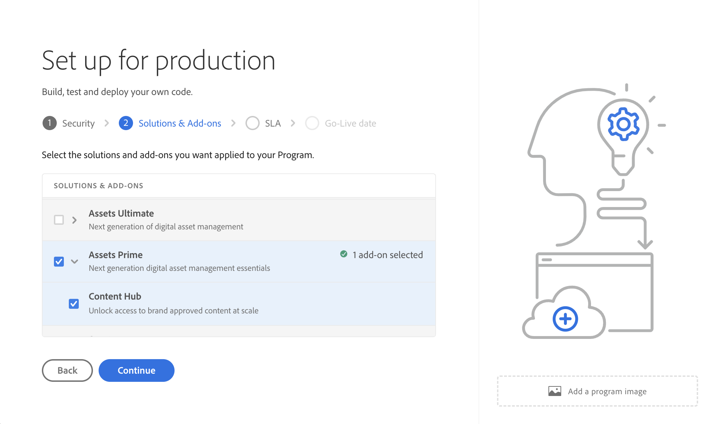

# [!DNL Assets] as a Cloud Service Prime  {#assets-prime}

Assets as a Cloud Service Prime innehåller ett lättviktigt DAM med vilket du kan utföra olika viktiga funktioner, som:

* **Resurshantering och bibliotekstjänster** &#x200B;: Verktyg som gör det möjligt för användare att importera, lagra, katalogisera, styra, hantera och styra ett varumärkes digitala resurser i ett centralt arkiv

* **Sök, identifiera och Collaboration**: Verktyg som gör att användare kan bläddra bland, upptäcka, dela och samarbeta med resurser som de behöver för att skapa avancerade kundupplevelser.

* **Säkerhet och Rights Management**: Verktyg för att hantera åtkomst, behörigheter, rättigheter och säkerhet för att säkerställa regelefterlevnad, konsekvens och varumärkesintegritet.

* **Creative Cloud Connections**: Verktyg som gör att marknadsförings- och kreativa team kan samarbeta med enklare åtkomst, kommentarer, granskningar och anteckningar för att uppdatera eller slutföra digitala resurser.

* **Experience Cloud Connections**: Verktyg som stöder inbyggd åtkomst till digitala resurser från andra Experience Cloud-program och -tjänster.

* **Distribution Portal Experience utan utökningsalternativ (Content Hub)**: Verktyg för att utöka åtkomsten till ett varumärkes godkända digitala resurser till utökade intressenter för att säkerställa enhetlig användning och varumärke.

* **Integrationer**: integreringar med andra program från Adobe och andra program än Adobe.

* **Dynamiska media (tillägg)**: Verktyg för att omvandla och leverera bilder, videor och annat framväxande innehåll för interaktiva multimedieupplevelser för alla typer av enheter i stor skala.

  >[!NOTE]
  >
  >Dynamic Media med OpenAPI-funktioner som ger dig tillgång till grundläggande bildmodifierare som rotering, beskärning (endast manuellt - ingen smart beskärning), bläddring, höjd, bredd, kvalitet, format och adaptiv videoströmning finns också i Assets Prime. Kontakta Adobe kontoteam för mer information.

1. [Skapa ett nytt program](/help/journey-onboarding/create-program.md).

I takt med att DAM-behoven växer och du behöver fler funktioner, som UI-utökningsmöjligheter, API-driven automatisering och anpassad koddistribution, måste du överväga att uppgradera till [Assets Ultimate](/help/assets/assets-ultimate-overview.md).

Den här artikeln innehåller ett komplett arbetsflöde för att aktivera Assets as a Cloud Service Prime.

## Aktivera Assets as a Cloud Service Prime{#enable-assets-prime}

Aktivera Assets Prime när du skapar ett nytt program med Cloud Manager. Utför följande steg:

1. Logga in på Cloud Manager som systemadministratör. Se till att du väljer rätt organisation när du loggar in.

   >[!NOTE]
   >
   >Se till att du har lagts till i rätt Cloud Manager-produktprofil för att lägga till ett nytt program. Mer information finns i [Rollbaserade behörigheter i Cloud Manager](/help/onboarding/cloud-manager-introduction.md#role-based-permissions).

1. [Skapa ett nytt program](/help/journey-onboarding/create-program.md).

   Välj **[!UICONTROL Assets Prime]** på fliken **[!UICONTROL Solutions & Add-ons]** när du skapar det nya programmet. Du kan också expandera **[!UICONTROL Assets Prime]** och välja **[!UICONTROL Content Hub]** för att aktivera [Content Hub](/help/assets/product-overview.md) för resursdistribution.

   

1. Klicka på **[!UICONTROL Create]** för att skapa programmet.

1. Klicka på programkortet och klicka på **[!UICONTROL Add Environment]**.

1. Ange miljönamnet, definiera en region och klicka på **[!UICONTROL Save]** för att skapa miljön.

   

>[!NOTE]
>
>Med Assets Prime kan du bara skapa en produktionsmiljö. Alternativet Lägg till miljö är inte längre tillgängligt när produktionsmiljön har skapats.

Assets Prime är nu aktiverat för Experience Manager Assets as a Cloud Service.

Systemadministratören får automatiskt behörighet som AEM-administratör och får ett e-postmeddelande där man kan navigera till Admin Console för att hantera produktprofiler.

Din AEM as a Cloud Service-instans på Admin Console innehåller följande produktprofiler:

* AEM-administratörer

* AEM-användare

* [Användare av AEM Assets Collaborator](#onboard-collaborator-users)

* [AEM Assets Power Users](#onboard-power-users)

Du kan börja lägga till användare eller användargrupper i produktprofilerna för AEM Assets Collaborator Users och AEM Assets Power Users. Mer information finns i [Anlita användare av AEM Assets Collaborator](#onboard-collaborator-users) och [Anlita AEM Assets Power-användare](#onboard-power-users).

Om du har aktiverat Content Hub för Assets as a Cloud Service skapas en ny instans i AEM Assets as a Cloud Service på Admin Console med suffixet `delivery`:

>[!NOTE]
>
>Om du har etablerat Content Hub före 14 augusti 2024 skapas den nya instansen med `contenthub` som suffix.

Observera att det inte finns någon `author` eller `publish` i instansnamnet för Content Hub.

Klicka på instansnamnet för att visa Content Hub-produktprofilen för `AEM Assets Limited Users`.

Du kan börja lägga till användare eller användargrupper i den här produktprofilen för att ge dem tillgång till Content Hub.

>[!NOTE]
>
>Om du har etablerat Content Hub före den 14 augusti 2024 har Content Hub produktprofil `contenthub` omnämns efter `Limited Users` i stället för `delivery`.

## Anlita användare av AEM Assets Collaborator {#onboard-collaborator-users}

AEM Assets Collaborator-användare kan arbeta med resurser från Experience Manager via integreringar av Assets som är tillgängliga för din organisation i andra Adobe-produkter och program som inte kommer från Adobe, skapa och redigera resurser med hjälp av inbyggda Adobe Express- och Firefly-mallar, varumärkeskit, Adobe Stock-resurser och så vidare, och få tillgång till och utnyttja godkända resurser från din organisation via AEM Assets Content Hub portal.

Anlita medarbetare:

1. Gå till Experience Manager Assets produktprofiler genom att klicka på AEM as a Cloud Service produktnamn i produktlistan i Admin Console.

1. Klicka på författarinstansen för AEM as a Cloud Service:
   

1. Klicka på produktprofilen för medarbetare och klicka på **[!UICONTROL Add users]** för att lägga till användaren i produktprofilen.
   

1. Klicka på **[!UICONTROL Save]** om du vill spara ändringarna.

Du kan även komma åt och visa de tjänster som tilldelats till Collaborator-användare, vilket visas i följande bild:

`Adobe Express` och `AEM Assets Collaborator Users` tjänster är aktiverade som standard. Du kan stänga av och sätta på enligt dina önskemål, men Adobe rekommenderar att du använder standardtjänsterna som är aktiverade för produktprofilerna.

## Införliva AEM Assets Power-användare {#onboard-power-users}

AEM Assets Power-användare har tillgång till alla AEM Assets-funktioner, inklusive hantering av resurser, behörigheter, metadata och övergripande styrning och automatisering av digitalt material, kan arbeta med resurser från Experience Manager via integreringar av Assets som är tillgängliga för din organisation i andra Adobe- och icke-Adobe-program, skapa och redigera resurser med hjälp av inbyggda Adobe Express- och Firefly-mallar, varumärkeskit, Adobe Stock-resurser och så vidare, samt få tillgång till och utnyttja godkända resurser från din organisation via AEM Assets Content Hub portal.

Så här skaffar du Power-användare:

1. Gå till Experience Manager Assets produktprofiler genom att klicka på AEM as a Cloud Service produktnamn i produktlistan i Admin Console.

1. Klicka på författarinstansen för AEM as a Cloud Service:
   

1. Klicka på Power users produktprofil och klicka på **[!UICONTROL Add users]** för att lägga till användaren i produktprofilen.
   

1. Klicka på **[!UICONTROL Save]** om du vill spara ändringarna.

Du kan även få åtkomst till och visa de tjänster som tilldelats till Power-användare, enligt bilden nedan:

`Adobe Express` och `AEM Assets Power Users` tjänster är aktiverade som standard. Du kan stänga av och sätta på enligt dina önskemål, men Adobe rekommenderar att du använder standardtjänsterna som är aktiverade för produktprofilerna.
