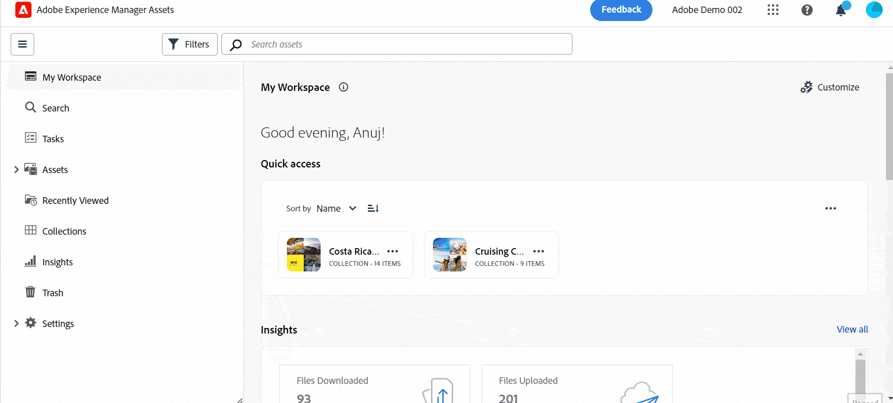

# Vi presenterar resursvyn {#assets-view}

I dagens snabba digitala första landskap, där det är viktigt att skapa och leverera innehåll i realtid, är en DAM-upplevelse (Digital Asset Management) som är utformad för att snabba upp marknadsföringen längre fram i kedjan oerhört viktig. Adobe, som använder sin expertis för att ge marknadsförare och kreatörer större frihet, introducerar en ny omvälvande användarupplevelse. Det här arbetsflödet i första hand revolutionerar hur företag hanterar sina dynamiska digitala resurser och ger marknadsförarna möjlighet att maximera effektiviteten när det gäller att hitta, samarbeta, personalisera och leverera resurser. Dessa smidiga arbetsflöden snabbar upp innehållets hastighet och lyfter era marknadsföringssatsningar till nya höjder.

Om du vill veta mer om de tillgängliga personliga upplevelserna för Assets as a Cloud Service kan du läsa [Introduktion till as a Cloud Service resurser](/help/assets/overview.md#persona-based-experiences).

## Hur får du åtkomst till resursvyn? {#access-assets-view}

Du kommer åt resursvyn på följande sätt:

<!--

* **Toggle in Admin view**

    * Log into [!DNL Experience Manager] using Cloud Manager.
    * Navigate to **[!UICONTROL Assets]** > **[!UICONTROL Files]**.
    * Click the profile icon on the top right corner.
    * Click **[!UICONTROL Switch View]** from the **[!UICONTROL Profile Settings]** section.
    Repeat these steps to switch back to the Admin view.

* **Product Switcher**
    * Log into [!DNL Experience Manager] and click .
    * Select **[!UICONTROL Experience Manager Assets]** to access the Assets view.
    * Select **[!UICONTROL Experience Manager]** to access the Admin view.

* **Quick Links** 
    * Log into experience.adobe.com.
    * Click **[!UICONTROL Experience Manager Assets]** to access the Assets view.
    * Click **[!UICONTROL Experience Manager Assets]** to access the Assets view.

    -->

## Varför vyn Resurser?

Resursvyn innehåller följande viktiga fördelar som inte är tillgängliga i administrationsvyn:

* [Kontrollpanelen Min arbetsyta för att leverera strömlinjeformade upplevelser](#my-workspace-for-streamlined-experience)
* [Sökning i första rummet för ökad effektivitet](#search-first)
* [Insikter för att fatta databaserade beslut](#insights-data)
* [Adobe Photoshop Express-integration snabbar upp samarbetet](#accelerate-collaboration)
* [Mappöverföringar för att konfigurera hierarkisk struktur för din organisation](#folder-uploads)
* [Prenumerera på databasinnehåll för effektiv resurshantering](#subscribe-content)
* [Mjuk borttagning av resurser för bättre kontroll till administratörer](#soft-delete-assets)

### Kontrollpanelen Min arbetsyta för att leverera strömlinjeformade upplevelser {#my-workspace-for-streamlined-experience}

Säg hej till en Digital Asset Management-lösning som förstår de olika behoven i olika organisationsroller. I den smidiga vyn Resurser prioriteras användarvänlighet och snabbhet, vilket passar marknadsförarnas önskemål om snygga och prydliga arbetsytor. Med en anpassningsbar användarspecifik kontrollpanel för Min arbetsyta kan marknadsförarna snabbt hitta, förhandsgranska, redigera, hantera och leverera resurser med enastående effektivitet. Anlita en oändlig tid på att leta efter specifika resurser och välkomna en smidig upplevelse som ger dig allt du behöver nära till hands.

### Insikter för att fatta databaserade beslut {#insights-data}

För att hålla jämna steg med innehållets hastighet är användbara insikter viktiga. Resursvyn ger avancerade insikter på arbetsytan Min arbetsyta och ger värdefulla data om resursprestanda, målgruppsanvändning och engagemang. Marknadsförarna kan fatta datadrivna beslut, optimera innehållsstrategier och förfina leveransen i efterföljande led för att få optimala resultat. Med tillgång till meningsfulla insikter kan företag ligga steget före konkurrenterna och få exceptionella resultat.

### Adobe Photoshop Express-integration snabbar upp samarbetet {#accelerate-collaboration}

Den nya upplevelsen innehåller en robust uppsättning samarbetsfunktioner, inklusive redigering i realtid med inbyggda Adobe Photoshop-funktioner, versionskontroller och anteckningsverktyg. Detta möjliggör smidigt samarbete mellan design-, design-, varumärkes- och marknadsföringsteam, så att de kan övervinna flaskhalsar och snabba upp processen för marknadsföringsåtgärder. Nu har marknadsförarna kraftfulla verktyg till sitt förfogande för att snabba upp projektleveransen och öka produktiviteten.

I den här videon ser du hur väl Assets-vyn har integrerats med Adobe Photoshop Express:

>[!VIDEO](https://video.tv.adobe.com/v/3420922)

De kommande versionerna av Assets as a Cloud Service skulle också innehålla [Integrering med Adobe Firefly via Adobe Express](https://firefly.adobe.com/?gclid=EAIaIQobChMIlZeKuNfj_wIVeyCtBh3e5g2cEAAYASAAEgL56_D_BwE&amp;sdid=JM4FW6VL&amp;mv=search&amp;mv2=paidsearch&amp;ef_id=EAIaIQobChMIlZeKuNfj_wIVeyCtBh3e5g2cEAAYASAAEgL56_D_BwE:G:s&amp;s_kwcid=AL!3085!3!652077237594!e!!g!adobe%20firefly!19870733758!148140507838).

### Mappöverföringar för att konfigurera hierarkisk struktur för din organisation {#folder-uploads}

Konfigurera snabbt en mappstruktur för organisationen med resursvyn genom att överföra mappar som finns i det lokala filsystemet. Du behöver inte skapa mappar under rotmappen och sedan överföra resurser till dessa mappar manuellt för att behålla den logiska hierarkiska strukturen. Alla mappar och resurser under rotmappen överförs automatiskt till Experience Manager Assets.

### Sökning i första rummet för ökad effektivitet {#search-first}

Utnyttja potentialen i organisationens digitala resursbibliotek med kraftfulla sökfunktioner. Du kan lägga ett bra bud på att navigera bland ett otal filer och mappar manuellt. Alla användare kan direkt hitta den perfekta bild, video eller det dokument ni behöver för att skapa fantastiska marknadsföringskampanjer, fängslande presentationer och engagerande innehåll. Med vår första sökmotor kan du enkelt navigera bland resurstyper, metadata, smarta taggar och till och med själva innehållet utan att kunna det exakta nyckelordet. Ge liv åt DAM:s framtid med Search-First och utnyttja hela potentialen i ert digitala resursbibliotek.

### Prenumerera på databasinnehåll för effektiv resurshantering {#subscribe-content}

I resursvyn kan du övervaka åtgärder som utförs på de resurser, mappar och samlingar som är tillgängliga i databasen. Du måste välja och prenumerera på det innehåll som meddelandena skickas till dig för. Du kan också konfigurera händelsetyperna, till exempel borttagning av ditt prenumererade innehåll, ändringar av det prenumererade innehållet och så vidare. Meddelandena skickas sedan bara till dig för de händelsetyperna.

### Mjuk borttagning av resurser för bättre kontroll till administratörer {#soft-delete-assets}

I papperskorgen som är tillgänglig i resursvyn visas de resurser som tagits bort från rotresursmappen. Du kan välja en resurs i papperskorgen om du vill återställa den till den ursprungliga platsen eller ta bort den permanent. Du kan också ange ett nyckelord eller använda standardfilter eller anpassade filter för att söka efter lämpliga resurser i papperskorgen.

Förutom dessa funktioner kan du även använda resursvyn för att utföra följande funktioner som inte är tillgängliga i administrationsvyn:

* Överför en ny version av en resurs med ett annat namn från det lokala filsystemet till resurskatalogen. Den överförda resursen är tillgänglig som en ny version med samma namn som den ursprungliga resursen.

* Byt namn på resurser och mappar som är tillgängliga i databasen.

Resursvyn är skräddarsydd för att effektivisera arbetsflöden, främja samarbete och snabba upp leveransen av resurser. Genom att anamma innehållets snabbhet kan marknadsförarna utnyttja hela potentialen i sitt digitala material och frigöra kreativiteten som aldrig förr.

Använd de här länkarna för att snabbt komma igång med resursvyn:

* [Min arbetsyta](/help/assets/my-workspace-assets-view.md)
* [Kom igång med resursvyn](/help/assets/get-started-assets-view.md)
