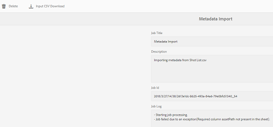

# Asynkrona åtgärder {#asynchronous-operations}

För att minska den negativa inverkan på prestandan bearbetar Adobe Experience Manager Assets vissa långvariga och resurskrävande resursoperationer asynkront.

Dessa åtgärder omfattar:

* Tar bort många resurser
* Flytta många resurser eller resurser med många referenser
* Exporterar/importerar resursmetadata i grupp.
* Hämtar resurser, som ligger över den angivna tröskelgränsen, från en fjärr-AEM-distribution.

Asynkron bearbetning innebär att du måste placera flera jobb i kö och sedan köra dem på ett seriellt sätt beroende på om det finns systemresurser tillgängliga.

Du kan visa status för asynkrona jobb från **[!UICONTROL Async Job Status]** sidan.

>[!NOTE]
>
>Som standard körs jobb i AEM Resurser parallellt. Om N är antalet processorkärnor kan N/2-jobb köras parallellt som standard. Om du vill använda anpassade inställningar för jobbkön ändrar du konfigurationen av standardkön för **asynkron åtgärd** från webbkonsolen. Mer information finns i [Kökonfigurationer](https://sling.apache.org/documentation/bundles/apache-sling-eventing-and-job-handling.html#queue-configurations).

## Övervaka status för asynkrona åtgärder {#monitoring-the-status-of-asynchronous-operations}

När AEM Resurser bearbetar en åtgärd asynkront får du ett meddelande i din inkorg <!-- and through email -->.

Om du vill visa status för asynkrona åtgärder i detalj går du till **[!UICONTROL Async Job Status]** sidan.

1. Tryck/klicka på AEM-logotypen och gå till **[!UICONTROL Assets]** > **[!UICONTROL Jobs]**.
1. Granska informationen om åtgärderna på **[!UICONTROL Async Job Status]** sidan.

   

   Om du vill kontrollera förloppet för en viss åtgärd kan du se värdet i **[!UICONTROL Status]** kolumnen. Beroende på förloppet visas ett av följande statusvärden:

   **[!UICONTROL Active]**: Åtgärden bearbetas

   **[!UICONTROL Success]**: Åtgärden har slutförts

   **[!UICONTROL Fail]** eller **[!UICONTROL Error]**: Det gick inte att bearbeta åtgärden

   **[!UICONTROL Scheduled]**: Åtgärden är schemalagd för bearbetning vid ett senare tillfälle

1. Om du vill avbryta en aktiv åtgärd markerar du den i listan och trycker/klickar på **[!UICONTROL Stop]** -ikonen i verktygsfältet.

   

1. Om du vill visa extra information, till exempel beskrivning och loggar, väljer du åtgärden och trycker/klickar på **[!UICONTROL Open]** -ikonen i verktygsfältet.

   

   Sidan med jobbinformation visas.

   

1. Om du vill ta bort åtgärden från listan väljer du **[!UICONTROL Delete]** den i verktygsfältet. Om du vill hämta information i en CSV-fil trycker/klickar du på **[!UICONTROL Download]** ikonen .

   >[!NOTE]
   >
   >Du kan inte ta bort ett jobb om dess status är aktiv eller köad.

## Tömmer slutförda jobb {#purging-completed-jobs}

AEM Assets kör ett rensningsjobb varje dag klockan 1:00 för att ta bort slutförda asynkrona jobb som är mer än en dag gamla.

Du kan ändra schemat för rensningsjobbet och hur länge detaljer om slutförda jobb behålls innan de tas bort. Du kan också konfigurera det maximala antalet slutförda jobb för vilka information sparas när som helst.

1. Tryck/klicka på AEM-logotypen och gå till **[!UICONTROL Tools]** > **[!UICONTROL Operations]** > **[!UICONTROL Web Console]**.
1. Öppna **[!UICONTROL Adobe CQ DAM Async Jobs Purge Scheduled]** jobbet.
1. Ange tröskelvärdet för antal dagar efter vilka slutförda jobb tas bort och det maximala antalet jobb för vilka information sparas i historiken.

   
   *Bild: Konfiguration för att schemalägga rensning av asynkrona jobb*

1. Spara ändringarna.

## Konfigurera tröskelvärden för asynkron bearbetning {#configuring-thresholds-for-asynchronous-processing}

Du kan konfigurera tröskelvärdet för antal resurser eller referenser för AEM Resurser för att bearbeta en viss åtgärd asynkront.

### Konfigurera tröskelvärden för asynkrona borttagningsåtgärder {#configuring-thresholds-for-asynchronous-delete-operations}

Om antalet resurser eller mappar som ska tas bort överstiger tröskelvärdet, utförs borttagningsåtgärden asynkront.

1. Tryck/klicka på AEM-logotypen och gå till **[!UICONTROL Tools]** > **[!UICONTROL Operations]** > **[!UICONTROL Web Console]**.
1. Öppna **[!UICONTROL Async Delete Operation Job Processing]** konfigurationen från webbkonsolen.
1. I **[!UICONTROL Threshold number of assets]** rutan anger du tröskelvärdet för antal resurser/mappar för asynkron bearbetning av borttagningsåtgärder.

   

1. Spara ändringarna.

### Konfigurera tröskelvärden för asynkrona flyttåtgärder {#configuring-thresholds-for-asynchronous-move-operations}

Om antalet resurser/mappar eller referenser som ska flyttas överstiger tröskelvärdet, utförs flyttåtgärden asynkront.

1. Tryck/klicka på AEM-logotypen och gå till **[!UICONTROL Tools]** > **[!UICONTROL Operations]** > **[!UICONTROL Web Console]**.
1. Öppna **[!UICONTROL Async Move Operation Job Processing]** konfigurationen från webbkonsolen.
1. I **[!UICONTROL Threshold number of assets/references]** rutan anger du tröskelvärdet för antal resurser/mappar eller referenser för asynkron bearbetning av flyttningsåtgärder.

   

1. Spara ändringarna.
