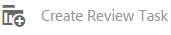

# Granska resurser i mappar och samlingar {#review-folder-assets-and-collections}

Med Adobe Experience Manager (AEM) Assets kan du ange ad hoc-granskningsarbetsflöden för resurser som finns i en mapp eller i en samling. Du kan dela det med granskare eller kreativa partners för att få feedback. Du kan antingen associera ett granskningsarbetsflöde med ett projekt eller skapa en oberoende granskningsåtgärd.

När du har delat resurserna kan granskarna godkänna eller avvisa dem. Meddelanden skickas i olika faser av arbetsflödet för att meddela avsedda mottagare om att olika uppgifter har slutförts. När du till exempel delar en mapp eller samling får granskaren ett meddelande om att en mapp/samling har delats för granskning.

När granskaren har slutfört granskningen (godkänner eller avvisar resurser) får du ett meddelande om slutförd granskning.

## Skapa en granskningsåtgärd för mappar {#creating-a-review-task-for-folders}

1. I Assets-användargränssnittet väljer du den mapp som du vill skapa en granskningsuppgift för.
1. I verktygsfältet trycker/klickar du på ikonen **[!UICONTROL Create Review Task]** för att öppna sidan **[!UICONTROL Review Task]**. Om du inte kan se ikonen i verktygsfältet trycker/klickar du på **[!UICONTROL More]** och väljer sedan ikonen.

   

1. (Valfritt) I **[!UICONTROL Project]** listan väljer du det projekt som du vill associera granskningsuppgiften med. Som standard är **[!UICONTROL None]** alternativet markerat. Om du inte vill associera något projekt med granskningsaktiviteten ska du behålla det här valet.

   >[!NOTE]
   >
   >Endast de projekt som du har redigerarbehörighet för (eller högre) visas i **[!UICONTROL Projects]** listan.

1. Ange ett namn för granskningsaktiviteten och välj en godkännare i **[!UICONTROL Assign To]** listan.

   >[!NOTE]
   >
   >Medlemmarna/grupperna i det valda projektet är tillgängliga som godkännare i **[!UICONTROL Assign To]** listan.

1. Ange en beskrivning, uppgiftsprioritet och förfallodatum för granskningsaktiviteten.

   

1. På fliken Avancerat anger du en etikett som ska användas för att skapa URI:n.

   

1. Tryck/klicka på **[!UICONTROL Submit]** och tryck/klicka sedan på **[!UICONTROL Done]** för att stänga bekräftelsemeddelandet. Ett meddelande om den nya uppgiften skickas till godkännaren.
1. Logga in på AEM Assets som godkännare och navigera till Assets UI. Om du vill godkänna resurser klickar/trycker du på **[!UICONTROL Notifications]** -ikonen och väljer sedan granskningsåtgärden i listan.

   

1. Granska informationen om granskningsuppgiften på sidan **[!UICONTROL Review Task]** och tryck/klicka sedan på **[!UICONTROL Review]**.
1. Markera resurser på sidan **[!UICONTROL Review Task]** och tryck/klicka på ikonen **[!UICONTROL Approve/Reject]** för att godkänna eller avvisa.

   

1. Tryck/klicka på ikonen **[!UICONTROL Complete]** i verktygsfältet. Skriv en kommentar i dialogrutan och tryck/klicka för **[!UICONTROL Complete]** att bekräfta.
1. Navigera till resursgränssnittet och öppna mappen. Ikonerna för godkännandestatus för resurserna visas både i kort- och listvyn.

   **Kortvy**

   

   **Listvy**

   

## Skapa en granskningsuppgift för samlingar {#creating-a-review-task-for-collections}

1. På sidan Samlingar väljer du den samling som du vill skapa en granskningsuppgift för.
1. I verktygsfältet trycker/klickar du på ikonen **[!UICONTROL Create Review Task]** för att öppna sidan **[!UICONTROL Review Task]**. Om du inte kan se ikonen i verktygsfältet trycker/klickar du på **[!UICONTROL More]** och väljer sedan ikonen.

   

1. (Valfritt) I **[!UICONTROL Project]** listan väljer du det projekt som du vill associera granskningsuppgiften med. Som standard är **[!UICONTROL None]** alternativet markerat. Om du inte vill associera något projekt med granskningsaktiviteten ska du behålla det här valet.

   >[!NOTE]
   >
   >Endast de projekt som du har redigerarbehörighet för (eller högre) visas i **[!UICONTROL Projects]** listan.

1. Ange ett namn för granskningsaktiviteten och välj en godkännare i **[!UICONTROL Assign To]** listan.

   >[!NOTE]
   >
   >Medlemmarna/grupperna i det valda projektet är tillgängliga som godkännare i **[!UICONTROL Assign To]** listan.

1. Ange en beskrivning, uppgiftsprioritet och förfallodatum för granskningsaktiviteten.

   

1. Tryck/klicka på **[!UICONTROL Submit]** och tryck/klicka sedan på **[!UICONTROL Done]** för att stänga bekräftelsemeddelandet. Ett meddelande om den nya uppgiften skickas till godkännaren.
1. Logga in på AEM Assets som godkännare och navigera till Assets-konsolen. Om du vill godkänna resurser trycker/klickar du på **[!UICONTROL Notifications]** -ikonen och väljer sedan granskningsåtgärden i listan.
1. Granska informationen om granskningsuppgiften på sidan **[!UICONTROL Review Task]** och tryck/klicka sedan på **[!UICONTROL Review]**.
1. Alla resurser i samlingen visas på granskningssidan. Select the assets and tap/click the **[!UICONTROL Approve/Reject]** icon to approve or reject assets, as appropriate.

   

1. Tryck/klicka på ikonen **[!UICONTROL Complete]** i verktygsfältet. Skriv en kommentar i dialogrutan och tryck/klicka för **[!UICONTROL Complete]** att bekräfta.
1. Navigera till samlingskonsolen och öppna samlingen. Ikonerna för godkännandestatus för resurserna visas både i kort- och listvyn.

   **Kortvy**

   

   **Listvy**

   

