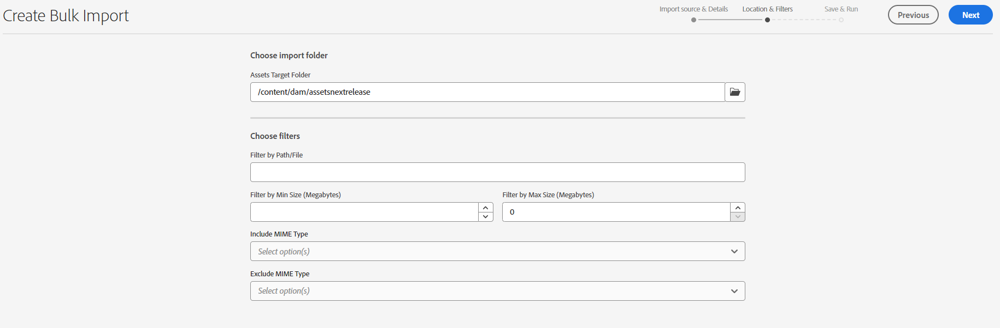

# Importera resurser gruppvis med hjälp av resursvyn  {#bulk-import-assets-view}

Vyn Importera satsvis i AEM Assets ger administratörer möjlighet att importera ett stort antal resurser från en datakälla till AEM Assets. Administratörerna behöver inte längre överföra enskilda resurser eller mappar till AEM Assets.

Du kan importera resurser från följande datakällor:

* Azure
* AWS
* Google Cloud
* Dropbox

## Förutsättningar {#prerequisites}

| Datakälla | Förutsättningar |
|-----|------|
| Azure | <ul> <li>Azure Storage-konto </li> <li> Azure Blob Container <li> Azure Access Key eller SAS-token baserat på autentiseringsläge </li></ul> |
| AWS | <ul> <li>AWS </li> <li> AWS Bucket <li> AWS Access Key </li><li> AWS Access Secret </li></ul> |
| Google Cloud | <ul> <li>GCP Bucket </li> <li> E-postadress för GCP-tjänstkonto <li> Privat nyckel för GCP-tjänstkonto</li></ul> |
| Dropbox | <ul> <li>Klient-ID för Dropbox </li> <li> Dropbox Client Secret</li></ul> |

Förutom dessa krav som baseras på datakällan måste du vara medveten om källmappsnamnet som finns i datakällan och som innehåller alla resurser som behöver importeras till AEM Assets.

## Skapa bulkimportkonfiguration {#create-bulk-import-configuration}

Så här skapar du en bulkimportkonfiguration:

1. Navigera till **[!UICONTROL Settings]** > **[!UICONTROL Bulk Import]** och klicka **[!UICONTROL Create Import]**.
1. Välj datakälla. De tillgängliga alternativen är Azure, AWS, Google Cloud och Dropbox.
1. Ange ett namn för bulkimportkonfigurationen i dialogrutan **[!UICONTROL Name]** fält.
1. Ange de specifika autentiseringsuppgifterna för datakällan, som anges i [Förutsättningar](#prerequisites).
1. Ange namnet på rotmappen som innehåller resurser i datakällan i **[!UICONTROL Source Folder]** fält.
1. (Valfritt) Välj **[!UICONTROL Delete source file after import]** om du vill ta bort originalfilerna från källdatalagret när filerna har importerats till Experience Manager Assets.
1. Välj **[!UICONTROL Import Mode]**. Välj **[!UICONTROL Skip]**, **[!UICONTROL Replace]**, eller **[!UICONTROL Create Version]**. Hoppa över är standardläget och i det här läget hoppar användaren över att importera en resurs om den redan finns.
   

1. (Valfritt) Ange den metadatafil som ska importeras, som finns i CSV-format, i fältet Metadatafil och klicka på **[!UICONTROL Next]** navigera till **[!UICONTROL Location & Filters]**.
1. Definiera en plats i DAM där resurser ska importeras med **[!UICONTROL Assets Target Folder]** anger du en sökväg. Till exempel, `/content/dam/imported_assets`.
1. (Valfritt) I dialogrutan **[!UICONTROL Choose Filters]** anger du den minsta filstorleken för resurser i MB som ska inkluderas i inmatningsprocessen i **[!UICONTROL Filter by Min Size]** fält.
1. (Valfritt) Ange den maximala filstorleken för resurser i MB för att inkludera dem i överföringsprocessen i **[!UICONTROL Filter by Max Size]** fält.
1. (Valfritt) Välj de MIME-typer som ska inkluderas i intagsprocessen med hjälp av **[!UICONTROL Include MIME Type]** fält. Du kan välja flera MIME-typer i det här fältet. Om du inte definierar något värde inkluderas alla MIME-typer i inmatningsprocessen.

1. (Valfritt) Välj de MIME-typer som ska exkluderas i intagsprocessen med hjälp av **[!UICONTROL Exclude MIME Type]** fält. Du kan välja flera MIME-typer i det här fältet. Om du inte definierar något värde inkluderas alla MIME-typer i inmatningsprocessen.

   

1. Klicka på **[!UICONTROL Next]**. Välj **[!UICONTROL Save & run import]** för att spara konfigurationen och köra bulkimporten. Välj **[!UICONTROL Save import]** för att spara konfigurationen så att du kan köra den senare.

   

1. Klicka **[!UICONTROL Save]** för att köra det valda alternativet.

## Visa befintliga bulkimportkonfigurationer {#view-import-configuration}

Om du väljer att spara konfigurationen efter att du har skapat den visas konfigurationen i **[!UICONTROL Saved Imports]** -fliken.

Om du väljer att spara och köra importen visas importkonfigurationen i dialogrutan **[!UICONTROL Executed Imports]** -fliken.

Om du schemalägger en import visas den i **[!UICONTROL Scheduled Imports]** -fliken.

## Redigera bulkimportkonfiguration {#edit-import-configuration}

Om du vill redigera konfigurationsinformationen klickar du på ... som motsvarar konfigurationsnamnet och klickar på **[!UICONTROL Edit]**. Du kan inte redigera titeln för konfigurationen och importdatakällan när du utför redigeringsåtgärden. Du kan redigera konfigurationen med hjälp av flikarna Körd, Schemalagd eller Sparad import.

## Schemalägg engångs- eller återkommande importer {#schedule-imports}

Så här schemalägger du en enstaka eller återkommande bulkimport:

1. klicka ... som motsvarar konfigurationsnamnet som finns i **[!UICONTROL Executed Imports]** eller **[!UICONTROL Saved Imports]** och klicka **[!UICONTROL Schedule]**. Du kan också schemalägga om en befintlig schemalagd import genom att navigera till **[!UICONTROL Scheduled Imports]** och klicka **[!UICONTROL Schedule]**.

1. Ställ in ett engångsintag eller schemalägg ett timschema, ett dagligt eller ett veckoschema. Klicka på **[!UICONTROL Submit]**.

   

## Utför en hälsokontroll vid import {#import-health-check}

Validera anslutningen till datakällan genom att klicka på ... som motsvarar konfigurationsnamnet och sedan klicka på **[!UICONTROL Check]**. Om anslutningen lyckas visas följande meddelande i Experience Manager Assets:

## Utför en torr körning innan du utför en import {#dry-run-bulk-import}

Klicka på ... som motsvarar konfigurationsnamnet och klicka på **[!UICONTROL Dry Run]** för att anropa en testkörning för massimportjobbet. Experience Manager Assets visar följande information om massimportjobbet:

## Köra en bulkimport {#run-bulk-import}

Om du har sparat importen när du skapade konfigurationen kan du navigera till fliken Sparad import, klicka på ... för konfigurationen och klicka på **[!UICONTROL Run]**.

Om du behöver utföra en import som redan har slutförts går du till fliken Executed Imports, klickar på ... som motsvarar konfigurationsnamnet och klickar på **[!UICONTROL Run]**.

## Stoppa eller schemalägg en pågående import {#schedule-stop-ongoing-report}

Du kan schemalägga eller stoppa en pågående bulkimport med dialogrutan för status vid bulkimport som visas på startsidan för massimport under en import.

Du kan också visa de resurser som har importerats till målmappen genom att klicka på **[!UICONTROL View Assets]**.

## Ta bort en bulkimportkonfiguration {#delete-bulk-import-configuration}

Klicka på ... som motsvarar konfigurationsnamnet som finns i **[!UICONTROL Executed Imports]**, **[!UICONTROL Scheduled Imports]**, eller **[!UICONTROL Saved Imports]** och klicka på **[!UICONTROL Delete]** om du vill ta bort konfigurationen för massimport.

## Navigera till resurser när du har utfört bulkimport {#view-assets-after-bulk-import}

Om du vill visa målplatsen för resurserna där resurserna importeras efter att du har kört massimportjobbet klickar du på ... som motsvarar konfigurationsnamnet och klickar sedan på **[!UICONTROL View Assets]**.

