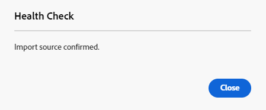

# Importera resurser gruppvis med hjälp av resursvyn  {#bulk-import-assets-view}

Vyn Importera satsvis i AEM Assets ger administratörer möjlighet att importera ett stort antal resurser från en datakälla till AEM Assets. Administratörerna behöver inte längre överföra enskilda resurser eller mappar till AEM Assets.

>[!NOTE]
>
>Massimporteraren i resursvyn använder samma serverdel som bulkimporteraren i administratörsvyn. Det erbjuder dock fler datakällor att importera från och en smidigare användarupplevelse.

Du kan importera resurser från följande datakällor:

* Azure
* AWS
* Google Cloud
* Dropbox
* OneDrive

## Förutsättningar {#prerequisites}

| Datakälla | Förutsättningar |
|-----|------|
| Azure | <ul> <li>Azure Storage-konto </li> <li> Azure Blob Container <li> Azure Access Key eller SAS-token baserat på autentiseringsläge </li></ul> |
| AWS | <ul> <li>AWS </li> <li> AWS Bucket <li> AWS Access Key </li><li> AWS Access Secret </li></ul> |
| Google Cloud | <ul> <li>GCP Bucket </li> <li> E-postadress för GCP-tjänstkonto <li> Privat nyckel för GCP-tjänstkonto</li></ul> |
| Dropbox | <ul> <li>Klient-ID för Dropbox (programnyckel) </li> <li> Dropbox Client Secret (apphemlighet)</li></ul> |
| OneDrive | <ul> <li>Klient-ID för OneDrive  </li> <li> OneDrive-klient-ID</li><li> OneDrive-klienthemlighet</li></ul> |

Förutom dessa krav som baseras på datakällan måste du vara medveten om källmappsnamnet som finns i datakällan och som innehåller alla resurser som behöver importeras till AEM Assets.

## Konfigurera utvecklarprogrammet Dropbox {#dropbox-developer-application}

Skapa och konfigurera utvecklarprogrammet för Dropbox innan du importerar resurser från ditt Dropbox-konto till AEM Assets.

Utför följande steg:

1. Logga in på [Dropbox](https://www.dropbox.com/developers) och klicka **[!UICONTROL Create apps]**.  Om du använder ett Enterprise Dropbox-konto måste du ha tillgång till rollen Innehållsadministratör.

1. I **[!UICONTROL Choose an API]** markerar du den enda tillgängliga alternativknappen.

1. I **[!UICONTROL Choose the type of access you need]** väljer du något av följande alternativ:

   * Välj **[!UICONTROL App folder]**, om du behöver åtkomst till en enda mapp som skapats i programmet på ditt Dropbox-konto.

   * Välj **[!UICONTROL Full Dropbox]**, om du behöver åtkomst till alla filer och mappar på ditt Dropbox-konto.

1. Ange ett namn för programmet och klicka på **[!UICONTROL Create app]**.

1. I **[!UICONTROL Settings]** lägger du till https://experience.adobe.com i **[!UICONTROL Redirect URIs]** -avsnitt.

1. Kopiera värdena för **[!UICONTROL App key]** och **[!UICONTROL App secret]** fält. Värdena krävs när verktyget för bulkimport konfigureras i AEM Assets.

1. På **[!UICONTROL Permissions]** lägger du till följande behörigheter i **[!UICONTROL Individual scopes]** -avsnitt.

   * account_info.read

   * files.metadata.read

   * files.content.read

   * files.content.write

1. Klicka **[!UICONTROL Submit]** för att spara ändringarna.

## Konfigurera OneDrive-utvecklarprogrammet {#onedrive-developer-application}

Skapa och konfigurera OneDrive-utvecklarprogrammet innan du importerar resurser från ditt OneDrive-konto till AEM Assets.

### Skapa ett program

1. Logga in på [OneDrive-konto](https://portal.azure.com/#view/Microsoft_AAD_RegisteredApps/ApplicationsListBlade) och klicka **[!UICONTROL New registration]**.

1. Ange ett namn för programmet, välj **[!UICONTROL Accounts in this organizational directory only (Adobe only - Single tenant)]** från **[!UICONTROL Supported account types]**.

1. Utför följande steg för att lägga till omdirigerings-URI:er:

   1. I **[!UICONTROL Select a platform]** listrutemeny, välja **[!UICONTROL Web]**.

   1. Lägg till https://experience.adobe.com i **[!UICONTROL Redirect URIs]** -avsnitt.
   <!-- Add the first URI and click **[!UICONTROL Configure]** to add it. You can add more by clicking **[!UICONTROL Add URI]** option available in the **[!UICONTROL Web]** section on the **[!UICONTROL Authentication]** page. -->

1. Klicka på **[!UICONTROL Register]**. Programmet har skapats.

1. Kopiera värdena för **[!UICONTROL Application (client) ID]** och **[!UICONTROL Directory (tenant) ID]** fält. Värdena krävs när verktyget för bulkimport konfigureras i AEM Assets.

1. Klicka **[!UICONTROL Add a certificate or secret]** motsvarar **[!UICONTROL Client credentials]** alternativ.

1. Klicka **[!UICONTROL New client secret]**, ange beskrivning av klienthemlighet, förfallodatum och klicka på **[!UICONTROL Add]**.

1. När du har skapat klienthemligheten kopierar du **[!UICONTROL Value]** fält (kopiera inte fältet för hemligt ID). Det krävs när bulkimport konfigureras i AEM Assets.

### Lägg till API-behörigheter

Utför följande steg för att lägga till API-behörigheter för programmet:

1. Klicka **[!UICONTROL API permissions]** i den vänstra rutan och klicka **[!UICONTROL Add a permission]**.
1. Klicka **[!UICONTROL Microsoft Graph]** > **[!UICONTROL Delegated permissions]**. The **[!UICONTROL Select Permission]** visas de tillgängliga behörigheterna.
1. Välj `offline_access` behörighet från `OpenId permissions` och `Files.ReadWrite.All` behörighet från `Files`.
1. Klicka **[!UICONTROL Add permissions]** för att spara uppdateringarna.

## Skapa bulkimportkonfiguration {#create-bulk-import-configuration}

Så här skapar du en bulkimportkonfiguration i [!DNL Experience Manager Assets]:

1. Klicka **[!UICONTROL Bulk Import]** i den vänstra rutan och klicka **[!UICONTROL Create Import]**.
1. Välj datakälla. De tillgängliga alternativen omfattar **[!UICONTROL Azure]**, **[!UICONTROL AWS]**, **[!UICONTROL Google Cloud]**, **[!UICONTROL Dropbox]** och **[!UICONTROL OneDrive]**.
1. Ange ett namn för bulkimportkonfigurationen i dialogrutan **[!UICONTROL Name]** fält.
1. Ange de specifika autentiseringsuppgifterna för datakällan, som anges i [Förutsättningar](#prerequisites).
1. Ange namnet på rotmappen som innehåller resurser i datakällan i **[!UICONTROL Source Folder]** fält.

   >[!NOTE]
   >
   >Om du använder Dropbox som datakälla anger du källmappens sökväg baserat på följande regler:
   >* Om du väljer **Full Dropbox** när du skapade programmet Dropbox och den mapp som innehåller resurserna finns på `https://www.dropbox.com/home/bulkimport-assets`och ange `bulkimport-assets` i **[!UICONTROL Source Folder]** fält.
   >* Om du väljer **App-mapp** när du skapade programmet Dropbox och den mapp som innehåller resurserna finns på `https://www.dropbox.com/home/Apps/BulkImportAppFolderScope/bulkimport-assets`och ange `bulkimport-assets` i **[!UICONTROL Source Folder]** fält, var `BulkImportAppFolderScope` refererar till programmets namn. `Apps` läggs till automatiskt efter `home` i detta fall.

1. (Valfritt) Välj **[!UICONTROL Delete source file after import]** om du vill ta bort originalfilerna från källdatalagret när filerna har importerats till Experience Manager Assets.
1. Välj **[!UICONTROL Import Mode]**. Välj **[!UICONTROL Skip]**, **[!UICONTROL Replace]**, eller **[!UICONTROL Create Version]**. Hoppa över är standardläget och i det här läget hoppar användaren över att importera en resurs om den redan finns.
   

1. (Valfritt) Ange den metadatafil som ska importeras, som finns i CSV-format, i **[!UICONTROL Metadata File]** fält. Källfilen för metadata måste finnas i källmappen. Klicka **[!UICONTROL Next]** navigera till **[!UICONTROL Location & Filters]**.
1. Definiera en plats i DAM där resurser ska importeras med **[!UICONTROL Assets Target Folder]** anger du en sökväg. Till exempel: `/content/dam/imported_assets`.
1. (Valfritt) I dialogrutan **[!UICONTROL Choose Filters]** anger du den minsta filstorleken för resurser i MB som ska inkluderas i inmatningsprocessen i **[!UICONTROL Filter by Min Size]** fält.
1. (Valfritt) Ange den maximala filstorleken för resurser i MB för att inkludera dem i överföringsprocessen i **[!UICONTROL Filter by Max Size]** fält.
1. (Valfritt) Välj de MIME-typer som ska inkluderas i intagsprocessen med hjälp av **[!UICONTROL Include MIME Type]** fält. Du kan välja flera MIME-typer i det här fältet. Om du inte definierar något värde inkluderas alla MIME-typer i inmatningsprocessen.

1. (Valfritt) Välj de MIME-typer som ska exkluderas i intagsprocessen med hjälp av **[!UICONTROL Exclude MIME Type]** fält. Du kan välja flera MIME-typer i det här fältet. Om du inte definierar något värde inkluderas alla MIME-typer i inmatningsprocessen.

   

1. Klicka på **[!UICONTROL Next]**. Välj något av följande alternativ efter dina önskemål:

   * **[!UICONTROL Save import]** för att spara konfigurationen så att du kan köra den senare.
   * **[!UICONTROL Save & run import]** för att spara konfigurationen och köra bulkimporten.
   * **[!UICONTROL Save & schedule import]** för att spara konfigurationen och schemalägga bulkimporten en senare gång. Du kan välja frekvens för bulkimporten och ange datum och tid för importen. Massimporten körs på det angivna datumet och den angivna tiden i den valda frekvensen.

   

1. Klicka **[!UICONTROL Save]** för att köra det valda alternativet.

### Hantera filnamn vid bulkimport {#filename-handling-bulkimport-assets-view}

När du importerar resurser eller mappar i grupp, [!DNL Experience Manager Assets] importerar hela strukturen för det som finns i importkällan. [!DNL Experience Manager] följer de inbyggda reglerna för specialtecken i resurs- och mappnamnen, och därför måste dessa filnamn saneras. För både mappnamn och resursnamn ändras inte titeln som definieras av användaren och lagras i `jcr:title`.

Vid bulkimport, [!DNL Experience Manager] leta efter de befintliga mapparna för att undvika att importera om resurserna och mapparna, och verifierar även rensningsreglerna som tillämpas i den överordnade mappen där importen sker. Om saneringsreglerna tillämpas i den överordnade mappen, tillämpas samma regler på importkällan. För ny import används följande saneringsregler för att hantera filnamnen på resurser och mappar.

Mer information om otillåtna namn, hantering av resursnamn och hantering av mappnamn vid bulkimport finns i [Hantera filnamn vid bulkimport i administratörsvyn](add-assets.md##filename-handling-bulkimport).

## Visa befintliga bulkimportkonfigurationer {#view-import-configuration}

Om du vill visa den befintliga bulkimporten väljer du **[!UICONTROL Bulk Imports]** i den vänstra rutan. Sidan för bulkimport visas med listan över **[!UICONTROL Executed Imports]**.  
Du kan även visa **[!UICONTROL Saved Imports]** och **[!UICONTROL Scheduled Imports]** i listrutan.

## Redigera bulkimportkonfiguration {#edit-import-configuration}

Om du vill redigera konfigurationsinformationen klickar du på  motsvarar konfigurationsnamnet och klicka på **[!UICONTROL Edit]**. Du kan inte redigera titeln för konfigurationen och importdatakällan när du utför redigeringsåtgärden. Du kan redigera konfigurationen med hjälp av flikarna Körd, Schemalagd eller Sparad import.

## Schemalägg engångs- eller återkommande importer {#schedule-imports}

Så här schemalägger du en enstaka eller återkommande bulkimport:

1. Klicka  motsvarar konfigurationsnamnet som finns i **[!UICONTROL Executed Imports]** eller **[!UICONTROL Saved Imports]** och klicka **[!UICONTROL Schedule]**. Du kan också schemalägga om en befintlig schemalagd import genom att navigera till **[!UICONTROL Scheduled Imports]** och klicka **[!UICONTROL Schedule]**.

1. Ställ in ett engångsintag eller schemalägg ett timschema, ett dagligt eller ett veckoschema. Klicka på **[!UICONTROL Submit]**.

   

## Utför en hälsokontroll vid import {#import-health-check}

Validera anslutningen till datakällan genom att klicka på  motsvarar konfigurationsnamnet och klicka sedan på **[!UICONTROL Check]**. Om anslutningen lyckas visas följande meddelande i Experience Manager Assets:

## Utför en torr körning innan du utför en import {#dry-run-bulk-import}

Klicka  motsvarar konfigurationsnamnet och klicka på **[!UICONTROL Dry Run]** för att anropa en testkörning för massimportjobbet. Experience Manager Assets visar följande information om massimportjobbet:

## Köra en bulkimport {#run-bulk-import}

Om du har sparat importen medan du skapade konfigurationen kan du navigera till fliken Sparad import och klicka på  ikon som motsvarar konfigurationen och klicka på **[!UICONTROL Run]**.

Om du behöver utföra en import som redan har slutförts går du till fliken Executed Imports och klickar på  motsvarar konfigurationsnamnet och klicka på **[!UICONTROL Run]**.

## Stoppa eller schemalägg en pågående import {#schedule-stop-ongoing-report}

Du kan schemalägga eller stoppa en pågående bulkimport med dialogrutan för status vid bulkimport som visas på startsidan för massimport under en import.

Du kan också visa de resurser som har importerats till målmappen genom att klicka på **[!UICONTROL View Assets]**.

## Ta bort en bulkimportkonfiguration {#delete-bulk-import-configuration}

Klicka  motsvarar konfigurationsnamnet som finns i **[!UICONTROL Executed Imports]**, **[!UICONTROL Scheduled Imports]**, eller **[!UICONTROL Saved Imports]** och klicka på **[!UICONTROL Delete]** om du vill ta bort konfigurationen för massimport.

## Navigera till resurser när du har utfört bulkimport {#view-assets-after-bulk-import}

Om du vill visa målplatsen för resurserna där resurserna importeras efter att du har kört massimportjobbet klickar du på  motsvarar konfigurationsnamnet och klicka sedan på **[!UICONTROL View Assets]**.

## Video: Massimportera resurser med hjälp av resursvyn

>[!VIDEO](https://video.tv.adobe.com/v/3428012)
