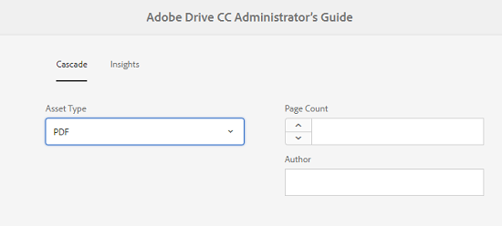

# Överlappande metadata {#cascading-metadata}

När användare hämtar metadatainformation för en resurs anger de information som finns i de olika tillgängliga fälten. Du kan visa specifika metadatafält eller fältvärden som är beroende av vilka alternativ som är markerade i de andra fälten. En sådan villkorlig visning av metadata kallas överlappande metadata. Du kan med andra ord skapa ett beroende mellan ett visst metadatafält/värde och ett eller flera fält och/eller deras värden.

Använd metadatamodeller för att definiera regler för visning av överlappande metadata. Om ditt metadataram t.ex. innehåller ett fält av resurstyp kan du definiera en relevant uppsättning fält som ska visas baserat på vilken typ av resurs som användaren väljer.

Här följer några exempel där du kan definiera överlappande metadata:

* Där användarplats krävs, visa relevanta stadsnamn baserat på användarens val av land och delstat.
* Läs in relevanta varumärkesnamn i en lista baserat på användarens val av produktkategori.
* Växla synlighet för ett visst fält baserat på värdet som anges i ett annat fält. Visa t.ex. separata leveransadressfält om användaren vill att leveransen ska ske till en annan adress.
* Ange ett fält som obligatoriskt baserat på det värde som anges i ett annat fält.
* Ändra alternativen som visas för ett visst fält baserat på värdet som anges i ett annat fält.
* Ange standardvärdet för metadata i ett visst fält baserat på det värde som anges i ett annat fält.

## Konfigurera överlappande metadata i [!DNL Experience Manager] {#configure-cascading-metadata-in-aem}

Tänk dig ett scenario där du vill visa överlappande metadata baserat på den typ av resurs som är markerad. Några exempel

* För en video visar du tillämpliga fält som format, kodek, längd och så vidare.
* För Word- eller PDF-dokument visas fält, t.ex. sidantal, författare osv.

Oavsett vilken resurstyp du väljer visas copyrightinformationen som ett obligatoriskt fält.

1. Välj [!DNL Experience Manager] logotyp och gå till **[!UICONTROL Tools]** > **[!UICONTROL Assets]** > **[!UICONTROL Metadata Schemas]**.
1. I **[!UICONTROL Schema Forms]** sida väljer du ett schemaformulär och väljer sedan **[!UICONTROL Edit]** i verktygsfältet för att redigera schemat.

   

1. (Valfritt) Skapa ett fält som ska villkoraliseras i metadataramedigeraren. Ange ett namn och en egenskapssökväg i dialogrutan **[!UICONTROL Settings]** -fliken.

   Om du vill skapa en flik väljer du `+` för att lägga till en flik och sedan lägga till ett metadatafält.

   

1. Lägg till ett listrutefält för resurstypen. Ange ett namn och en egenskapssökväg i dialogrutan **[!UICONTROL Settings]** -fliken. Lägg till en valfri beskrivning.

   

1. Nyckelvärdepar är de alternativ som ges till en formuläranvändare. Du kan ange nyckelvärdepar antingen manuellt eller från en JSON-fil.

   * Om du vill ange värden manuellt väljer du **[!UICONTROL Add Manually]** och markera **[!UICONTROL Add Choice]** och ange alternativets text och värde. Ange till exempel resurstyperna Video, PDF, Word och Bild.

   * Om du vill hämta värden från en JSON-fil dynamiskt väljer du **[!UICONTROL Add Through JSON Path]** och ange sökvägen till JSON-filen. [!DNL Experience Manager] hämtar nyckelvärdepar i realtid när formuläret presenteras för användaren.

   Båda alternativen utesluter varandra. Du kan inte importera alternativen från en JSON-fil och redigera manuellt.

   

   >[!NOTE]
   >
   >När du lägger till en JSON-fil visas inte nyckelvärdepar i metadataschredigeraren, men de är tillgängliga i det publicerade formuläret.

   >[!NOTE]
   >
   >När du lägger till alternativ och klickar på popup-fältet förvrängs gränssnittet och ikonen Ta bort för alternativen slutar att fungera. Klicka inte på listrutan förrän du har sparat ändringarna. Om du råkar ut för det här problemet sparar du schemat och öppnar det igen för att fortsätta redigera.

1. (Valfritt) Lägg till andra obligatoriska fält. Exempel: format, kodek och längd för resurstypen video.

   Lägg på samma sätt till beroende fält för andra resurstyper. Du kan till exempel lägga till fältantal och författare för dokumentresurser som PDF och Word.

   

1. Om du vill skapa ett beroende mellan fältet för resurstyp och andra fält väljer du det beroende fältet och öppnar **[!UICONTROL Rules]** -fliken.

   

1. Under **[!UICONTROL Requirement]** väljer du alternativet **[!UICONTROL Required, based on new rule]**.
1. Välj **[!UICONTROL Add Rule]** och väljer **[!UICONTROL Asset Type]** för att skapa ett beroende. Välj också det fältvärde som beroendet ska skapas på. I det här fallet väljer du **[!UICONTROL Video]**. Välj **[!UICONTROL Done]** för att spara ändringarna.

   

   >[!NOTE]
   >
   >Listruta med manuellt fördefinierade värden kan användas med regler. Listrutor med konfigurerad JSON-sökväg kan inte användas med regler som använder fördefinierade värden för att tillämpa villkor. Om värdena läses in från JSON vid körning går det inte att använda en fördefinierad regel.

1. Under **[!UICONTROL Visibility]** väljer du alternativet **[!UICONTROL Visible, based on new rule]**.

1. Välj **[!UICONTROL Add Rule]** och väljer **[!UICONTROL Asset Type]** för att skapa ett beroende. Välj också det fältvärde som beroendet ska skapas utifrån. I det här fallet väljer du **[!UICONTROL Video]**. Välj **[!UICONTROL Done]** för att spara ändringarna.

   

   >[!CAUTION]
   >
   >Om du vill återställa värdena väljer du var som helst i gränssnittet förutom värdena. Om värdena återställs markerar du värdena igen.

   >[!NOTE]
   >
   >Du kan använda villkoren **[!UICONTROL Requirement]** och **[!UICONTROL Visibility]** oberoende av varandra.

1. Du kan också skapa ett beroende mellan värdet Video i fältet Resurstyp och andra fält, till exempel Kodek och Varaktighet.
1. Upprepa stegen för att skapa beroende mellan dokumentresurser (PDF och Word) i dialogrutan [!UICONTROL Asset Type] fält och fält som [!UICONTROL Page Count] och [!UICONTROL Author].
1. Klicka på **[!UICONTROL Save]**. Använd metadatamatchemat på en mapp.

1. Navigera till mappen som du tillämpade metadatamodeller på och öppna egenskapssidan för en resurs. Beroende på vad du väljer i fältet Resurstyp visas relevanta överlappande metadatafält.

   
   *Bild: Cascading metadata for Video asset*

   
   *Bild: Överlappande metadata för dokumentresurs*

**Se även**

* [Översätt resurser](translate-assets.md)
* [HTTP API för Assets](mac-api-assets.md)
* [Resurser som stöds i filformat](file-format-support.md)
* [Söka efter resurser](search-assets.md)
* [Anslutna resurser](use-assets-across-connected-assets-instances.md)
* [Materialrapporter](asset-reports.md)
* [Metadata-scheman](metadata-schemas.md)
* [Hämta resurser](download-assets-from-aem.md)
* [Hantera metadata](manage-metadata.md)
* [Söka efter fasetter](search-facets.md)
* [Hantera samlingar](manage-collections.md)
* [Import av massmetadata](metadata-import-export.md)
