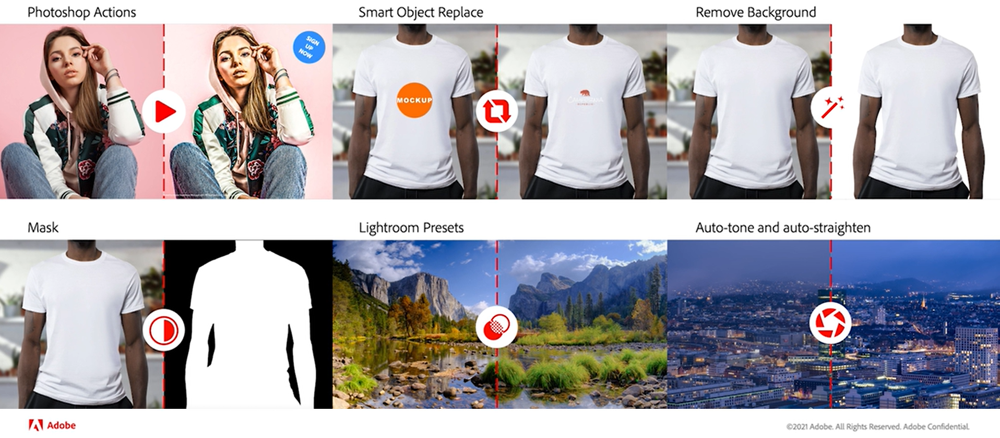

# Generera variationer av resurser med [!DNL Adobe Creative Cloud]-integrering {#content-automation}

Tillägget för innehållsautomatisering integrerar API:erna [!DNL Adobe Experience Manager Assets as a Cloud Service] och [!DNL Adobe Creative Cloud] för att bearbeta dina resurser i stor skala. [!DNL Experience Manager] använder molnbaserade   tillgångsmikrotjänster för att använda  [!DNL Adobe Creative Cloud] funktionerna och automatisera skapandet av resurser och mediehanteringen.

Om du vill redigera resurser i [!DNL Adobe Photoshop] och [!DNL Adobe Lightroom] behöver du inte hämta resurser från [!DNL Experience Manager Assets], redigera och överföra dem igen. Du behöver bara skapa och konfigurera en bearbetningsprofil i [!DNL Experience Manager], tillämpa profilen på en mapp och överföra resurserna till mappen. Dina överförda resurser bearbetas om baserat på bearbetningsprofilerna och du får variationer av dessa resurser. Den enhetliga och smidiga gruppbearbetningen sparar tid och ökar innehållets hastighet utan att man behöver ha superb kreativ kompetens. Utvecklare och partners kan också utöka sina tillgångsmikrotjänster med direkt åtkomst till dessa API:er och inkludera anpassad logik.

Användare kan skapa bearbetningsprofiler för att automatisera följande kreativa åtgärder för sina resurser:\

* **Automatisk ton**: Använder artificiell intelligens för att analysera bildens innehåll och gör intelligent ljus- och färgkorrigeringar baserat på bildens unika attribut.
* **Automatisk upprätt**: Använder artificiell intelligens för att analysera innehållet i bilden och korrigera skevade perspektiv i bilder. Om du till exempel vill skapa nivåhorisonter.
* **Lightroom-förinställningar**: Använder ett användardefinierat utseende på bilder för att få ett konsekvent utseende med anpassade förinställningar.
* **Bildurklipp**: Använder artificiell intelligens för att skapa markering runt utjämnade objekt och ta bort bakgrund med ett enda kommando.
* **Bildmask**: Använder artificiell intelligens för att skapa en mask runt salivobjekt med ett enda kommando.
* **Photoshop Actions**: Tillämpar en serie åtgärder (i Photoshop) på en fil eller en grupp med filer.
* **Ersättning** av smarta objekt: Gör personalisering i stor skala genom att låta dig växla bilder samtidigt som du behåller alla effekter och justeringar som används i en PSD-fil.

## Använd en bearbetningsprofil för att redigera flera kreativa resurser samtidigt {#process-assets}

Så här använder du bearbetningsprofiler för att automatiskt skapa variationer:

1. Kontakta [Adobe kundtjänst](https://experienceleague.adobe.com/#support) för att få licensen.

1. Navigera till **[!UICONTROL Tools]** > **[!UICONTROL Assets]** > **[!UICONTROL Processing Profiles]**.

1. Välj **[!UICONTROL Create]** och ange en **[!UICONTROL Name]**.

1. Välj fliken **[!UICONTROL Creative]**, ange utdatamapp och välj **[!UICONTROL Add New]** för att lägga till en kreativ konfiguration.

1. Ange **[!UICONTROL Rendition Name]** (eller utdatanamn), **[!UICONTROL Extension]** (eller filtyp), välj **[!UICONTROL Quality]** (eller utdataparametrar), välj **[!UICONTROL Includes]** och **[!UICONTROL Excludes]** MIME-typlistor (eller indatafiltret) och välj önskad kreativ åtgärd.
   

1. Vissa åtgärder kräver extra parametrar (resurs). Ange vid behov värden för de här extra parametrarna.

1. Lägg till fler kreativa åtgärder som en del av samma bearbetningsprofil eller Spara profilen.

1. Använd bearbetningsprofilen på en mapp. På en mapps **[!UICONTROL Properties]**-sida väljer du **[!UICONTROL Asset Processing]** och väljer den bearbetningsprofil som ska användas.

När bearbetningsprofilen har tillämpats på en DAM-mapp kör alla resurser som har överförts eller uppdaterats i den här mappen de definierade åtgärderna förutom standardbearbetningen. Undermapparna ärver samma profiler som de överordnade mapparna. Användare kan åsidosätta detta arv.

Om du vill bearbeta befintliga resurser markerar du resurserna, väljer alternativet **[!UICONTROL Reprocess]** och väljer sedan önskad bearbetningsprofil.

## Tips och begränsningar {#limitations-best-practices}

* [!DNL Experience Manager] begränsar bearbetningen av resurser till 300 begäranden per minut och 700 begäranden per minut per organisation.
* Filstorleken är begränsad till 4 GB för [!DNL Adobe Photoshop] API-åtgärder och 1 GB för [!DNL Adobe Lightroom]-åtgärder.

>[!MORELIKETHIS]
>
>* [Konfigurera och använda resursmikrotjänster via bearbetningsprofiler](/help/assets/asset-microservices-configure-and-use.md).
>* [Integrera  [!DNL Experience Manager] med [!DNL Creative Cloud]](/help/assets/aem-cc-integration-best-practices.md).
>* [Tillgångsinmatning och bearbetning med tillgångsmikrotjänster: En översikt](/help/assets/asset-microservices-overview.md).

