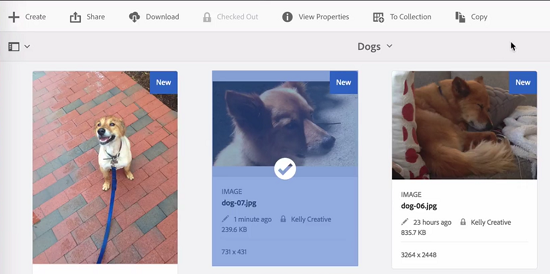

# Checka in och checka ut filer i [!DNL Experience Manager] DAM {#check-in-and-check-out-files-in-assets}

[!DNL Adobe Experience Manager Assets] Med kan du checka ut resurser för redigering och checka in dem igen när du har gjort ändringarna. När du har checkat ut en resurs kan bara du redigera, kommentera, publicera, flytta eller ta bort resursen. När du checkar ut en resurs låses den. Andra användare kan inte utföra någon av dessa åtgärder på resursen förrän du checkar in resursen igen på [!DNL Assets]. De kan dock fortfarande ändra metadata för den låsta resursen.

Om du vill kunna checka ut/in resurser måste du ha skrivbehörighet för dem.

Den här funktionen förhindrar att andra användare åsidosätter ändringar som gjorts av en författare där flera användare samarbetar i redigeringsarbetsflöden mellan team.

## Checka ut resurser {#checking-out-assets}

1. Från [!DNL Assets] väljer du den resurs du vill checka ut i användargränssnittet. Du kan också välja flera resurser att checka ut.

1. Klicka på **[!UICONTROL Checkout]** i verktygsfältet. The **[!UICONTROL Checkout]** alternativ växlar till **[!UICONTROL Checkin]**.
Logga in som en annan användare om du vill kontrollera om andra användare kan redigera den utcheckade resursen. Ikonen  visas på miniatyrbilden för den resurs som du har checkat ut.

   

   Markera resursen. Observera att verktygsfältet inte visar några alternativ som gör att du kan redigera, kommentera, publicera eller ta bort resursen.

   

   Om du vill redigera metadata för den låsta resursen klickar du på **[!UICONTROL View Properties]**.

1. Klicka **[!UICONTROL Edit]** om du vill öppna resursen i redigeringsläge.

1. Redigera resursen och spara ändringarna. Beskär till exempel bilden och spara. Du kan också välja att anteckna eller publicera resursen.

1. Välj den redigerade resursen i [!DNL Assets] och klicka **[!UICONTROL Checkin]** i verktygsfältet. Den ändrade resursen checkas in i [!DNL Assets] och är tillgänglig för andra användare för redigering.

## Tvingad incheckning {#forced-check-in}

Administratörer kan checka in resurser som är utcheckade av andra användare.

1. Logga in på [!DNL Assets] som administratör.
1. Från [!DNL Assets] användargränssnittet väljer en eller flera resurser som har checkats ut av andra användare.

   

1. Klicka på **[!UICONTROL Release Lock]** i verktygsfältet. Resursen checkas in igen och är tillgänglig för redigering för andra användare.

## God praxis och begränsningar {#tips-limitations}

* Du kan ta bort en *mapp* som innehåller utcheckade resursfiler. Innan du tar bort en mapp kontrollerar du att inga digitala resurser är utcheckade av användarna.

**Se även**

* [Översätt resurser](translate-assets.md)
* [HTTP API för Assets](mac-api-assets.md)
* [Resurser som stöds i filformat](file-format-support.md)
* [Söka efter resurser](search-assets.md)
* [Anslutna resurser](use-assets-across-connected-assets-instances.md)
* [Materialrapporter](asset-reports.md)
* [Metadata-scheman](metadata-schemas.md)
* [Hämta resurser](download-assets-from-aem.md)
* [Hantera metadata](manage-metadata.md)
* [Söka efter fasetter](search-facets.md)
* [Hantera samlingar](manage-collections.md)
* [Import av massmetadata](metadata-import-export.md)

>[!MORELIKETHIS]
>
>* [Förstå in- och utcheckning [!DNL Experience Manager] datorprogram](https://experienceleague.adobe.com/docs/experience-manager-desktop-app/using/using.html#how-app-works2)
>* [Videosjälvstudiekurs för att förstå hur du checkar in och checkar ut [!DNL Assets]](https://experienceleague.adobe.com/docs/experience-manager-learn/assets/collaboration/check-in-and-check-out.html)

