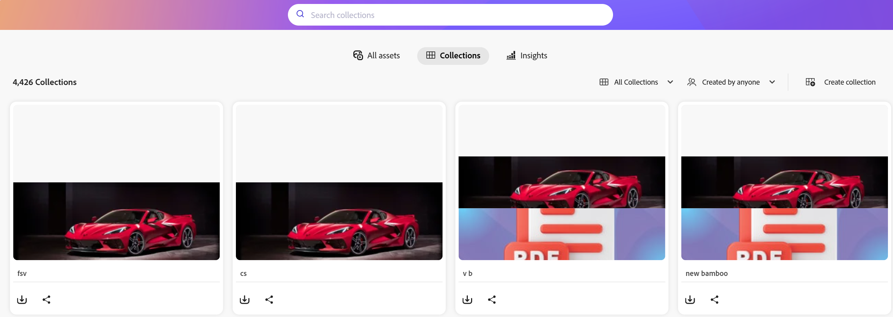

# Hantera samlingar i [!DNL Content Hub] {#manage-collections}

<table>
    <tr>
        <td>
            <i>Nytt</i> <a href="/help/assets/dynamic-media/dm-prime-ultimate.md"><b>Dynamic Media Prime och Ultimate</b></a>
        </td>
        <td>
            <i>Nytt</i> <a href="/help/assets/assets-ultimate-overview.md"><b>AEM Assets Ultimate</b></a>
        </td>
        <td>
            <i>Nytt</i> <a href="/help/assets/integrate-aem-assets-edge-delivery-services.md"><b>AEM Assets-integrering med Edge Delivery Services</b></a>
        </td>
        <td>
            <i>Nytt</i> <a href="/help/assets/aem-assets-view-ui-extensibility.md"><b>UI-utökningsbarhet</b></a>
        </td>
          <td>
            <i>Nytt</i> <a href="/help/assets/dynamic-media/enable-dynamic-media-prime-and-ultimate.md"><b>Aktivera Dynamic Media Prime och Ultimate</b></a>
        </td>
    </tr>
    <tr>
        <td>
            <a href="/help/assets/search-best-practices.md"><b>Sök efter bästa praxis</b></a>
        </td>
        <td>
            <a href="/help/assets/metadata-best-practices.md"><b>Metadata - bästa praxis</b></a>
        </td>
        <td>
            <a href="/help/assets/product-overview.md"><b>Content Hub</b></a>
        </td>
        <td>
            <a href="/help/assets/dynamic-media-open-apis-overview.md"><b>Dynamiska media med OpenAPI-funktioner</b></a>
        </td>
        <td>
            <a href="https://developer.adobe.com/experience-cloud/experience-manager-apis/"><b>AEM Assets-dokumentation för utvecklare</b></a>
        </td>
    </tr>
</table>

<!--  -->

>[!AVAILABILITY]
>
>Content Hub Guide finns nu i PDF-format. Ladda ned hela guiden och använd Adobe Acrobat AI Assistant för att besvara dina frågor.
>
>[!BADGE Content Hub Guide PDF]{type=Informative url="https://helpx.adobe.com/content/dam/help/en/experience-manager/aem-assets/content-hub.pdf"}

En samling refererar till en uppsättning resurser som kan delas mellan användare. En samling kan innehålla resurser från olika platser och samtidigt bevara sin referensintegritet.

Med [!DNL Content Hub] kan du skapa offentliga samlingar. Dessa samlingar är tillgängliga för alla behöriga användare, vilket skapar ett delat utrymme där flera användare effektivt kan komma åt och använda innehåll. Samlingar främjar samarbete och användning av resurser för ökad effektivitet och bekvämlighet. På samlingens webbsida kan du:

* **Skapa**: Skapa en eller flera samlingar.
* **Visa**: Visa resurserna och deras egenskaper.
* **Dela**: Dela resurser som en länk med andra.
* **Hämta**: Hämta resurserna.
* **Ta bort**: Ta bort specifika resurser från en samling.
* **Ta bort**: Ta bort hela samlingen.

Det hjälper användarna att enkelt komma åt och hantera de olika resurserna som är tillgängliga i [!DNL Content Hub].

## Förutsättningar {#prerequisites}

[Content Hub-användare](deploy-content-hub.md#onboard-content-hub-users) kan utföra de åtgärder som nämns i den här artikeln.

## Skapa samlingar{#create-collections}

Du kan välja att [skapa en ny samling](#create-new-collection) eller [lägga till resurser i en befintlig samling](#add-assets-to-existing-collection) när du hanterar styrning.

### Skapa en ny samling{#create-new-collection}

Följ stegen nedan för att styra åtkomsten när du skapar samlingar:

1. Gå till fliken **[!DNL Collections]** och klicka på **[!UICONTROL Create Collection]**. Fönstret Ny samling visas.

1. Lägg till **[!UICONTROL Title]** och **[!UICONTROL Description]** för samlingen.

   

1. Välj åtkomstkontrolltyp i listrutan **[!UICONTROL Who can access]**. Följande alternativ är tillgängliga:

   | Åtkomstmetod | Åtkomsttyp | Beskrivning |
   |---|---|---|
   | **Endast du och administratörer kan redigera** | Privat | Endast författare och administratörer kan redigera och komma åt den här samlingen. |
   | **Alla kan visa** | Offentlig | Alla kan komma åt den här samlingen, men bara skapare och administratörer kan redigera. |
   | **Alla kan visa och redigera** | Offentlig | Samlingen är öppen för alla, med fullständig åtkomst och redigeringsbehörighet utan begränsningar. |

   >[!NOTE]
   >
   > Administratören för [!DNL Content Hub] kan visa alla alternativ som är tillgängliga i listrutan **[!UICONTROL Who can access]**, medan du för vanliga användare måste [ange och konfigurera](configure-content-hub-ui-options.md) vilka alternativ som de kan komma åt.

1. Klicka på **[!UICONTROL Create]**. När du är klar kan du [lägga till resurser i samlingen](#add-assets-to-existing-collection).

>[!VIDEO](https://video.tv.adobe.com/v/3463336)

<!--
>[!NOTE]
>
>Collections governance is a limited availability feature. You can get it enabled  by creating a support ticket. Once enabled, you need to [Configure Collections in Content Hub](configure-content-hub-ui-options.md#configure-collections-content-hub).-->

<!--To create a new collection, navigate to the **[!UICONTROL Collections]** tab and click **[!UICONTROL Create new collection]**. Enter the **[!UICONTROL Title]** and provide an optional **[!UICONTROL Description]** for the assets. Click **[!UICONTROL Create]**.
          
-->

### Lägga till resurser i en befintlig samling{#add-assets-to-existing-collection}

Om du vill lägga till resurser i en befintlig samling markerar du de resurser du behöver lägga till i samlingen. Klicka på **[!UICONTROL Add to collection]**. Du uppmanas att välja samlingen.

Välj den samling där du vill lägga till resursen. Du kan också söka i den befintliga samlingen med hjälp av sökfältet.  Markera den eller de samlingar som du vill lägga till resurserna i och klicka på **[!UICONTROL Add to collection]**.

## Visa samlingar{#view-collections}

Navigera till fliken **[!UICONTROL Collections]** och sök efter samlingsnamnet. Du kan använda filter för att förfina sökresultaten genom att välja specifika villkor, vilket hjälper dig att snabbt hitta de mest relevanta samlingarna.

Klicka på samlingens namn om du vill visa en lista med resurser som är tillgängliga i en samling. Du kan också använda filter i en samling för att begränsa resursresultaten. Klicka på resursen som du vill visa i en samling. [!DNL Content Hub] visar detaljerad vy för resursen. [Se resursinformation](asset-properties-content-hub.md).

### Vyn Filtrera samlingar {#filter-collections-view}

Med Content Hub kan du filtrera samlingsvyn för att enkelt hitta exakt det du söker efter genom att begränsa alternativen baserat på dina önskemål. Kontrollera [konfigurationen av samlingar i Content Hub](configure-content-hub-ui-options.md#configure-collections-content-hub).

Om du vill filtrera vyn av samlingar går du till fliken **[!DNL Collections]** och navigerar till listrutan Samlingar. Välj bland följande alternativ:

* **[!UICONTROL All Collections]:** Välj det här alternativet om du vill visa och redigera alla samlingar, inklusive de som är privata eller delade med dig.
* **[!UICONTROL Only me]:** Välj det här alternativet om du vill visa samlingar som är tillgängliga för dig.
* **[!UICONTROL Anyone can view]:** Med det här alternativet kan du filtrera samlingar som är tillgängliga för alla men bara kan redigeras av den som skapat dem.
* **[!UICONTROL Anyone can edit]:** Välj det här alternativet om du vill filtrera samlingar som är tillgängliga och redigerbara av alla.

  

Om du dessutom vill filtrera samlingsvyn baserat på åtkomstbehörigheter går du till fliken **[!DNL Collections]** och navigerar till något av följande alternativ:

* **[!UICONTROL Created by anyone]:** Det här filtret begränsar dig till att visa samlingar som har skapats av användare.

* **[!UICONTROL Created by me]:** Det här filtret begränsar dig till att visa samlingar som du har skapat.

  

<!--

* **A**: Details and metadata of the asset 
* **B**: Zoom In or Zoom Out the asset 
* **C**: Reset Zoom view 
* **D**: View the previous or next asset 
* **E**: Download the asset 
* **F**: Open the asset in Adobe Express 
* **G**: Hide the metadata of the asset 
* **H**: Share the asset as a link 
-->

## Hämta resurser som är tillgängliga i en samling{#download-assets-within-collection}

Om du vill hämta resurser som är tillgängliga i en samling går du till fliken **[!UICONTROL Collections]**.\
Klicka på ikonen  på samlingskortet.

Alla resurser i samlingen hämtas.

Du kan också öppna samlingen för att hämta resurserna individuellt. Klicka på samlingen som innehåller de resurser du behöver för att hämta. Markera resurserna och klicka på **[!UICONTROL Download]**.

Lär dig hur du [hämtar en resurs från  [!DNL Content Hub]](download-assets-content-hub.md).

## Dela resurser som är tillgängliga i en samling {#share-assets-available-within-collection}

Du kan också dela de tillgängliga resurserna i en samling. Se till att [aktivera delning av offentlig länk i Content Hub](configure-content-hub-ui-options.md#enable-public-link-sharing). Gå till fliken **[!UICONTROL Collections]**. Välj ikonen  på samlingskortet. Delningslänken kopieras. Du kan dela den kopierade länken med mottagaren. Läs mer om att [dela resurser i  [!DNL Content Hub]](share-assets-content-hub.md).

Content Hub Collections innehåller omfattande styrningsverktyg för effektiv filhantering, inklusive anpassningsbara delningsbehörigheter och samarbetsfunktioner. De här inställningarna ger allt från skrivskyddad åtkomst till fullständig administrativ kontroll och har stöd för finstyrning framför resursdistribution. När du delar en resurs antingen individuellt eller som en del av en samling bestäms omfattningen av åtkomsten av samlingens aktuella åtkomstnivå som tilldelats användaren. Du kan också inte dela en privat samling.

## Redigera information om en samling {#edit-details-of-collection}

Om du vill redigera **[!UICONTROL Title]** och **[!UICONTROL Description]** för en samling klickar du på samlingens namn och sedan på ikonen  . [!UICONTROL Collection Details]-skärmen visas. Du kan redigera **[!UICONTROL Title]** och **[!UICONTROL Description]** för en samling. Klicka på **[!UICONTROL Save Changes]** för att bekräfta ändringarna. Du kan dessutom uppdatera åtkomsten till samlingen via dialogrutan Redigera samling, beroende på konfigurationen.

## Ta bort resurser från en samling{#remove-assets-from-a-collection}

Följande användare kan ta bort en eller flera resurser från en samling:

* En administratör
* En ägare till samlingen
* En icke-admin-användare med redigeringsbehörighet

Om du vill ta bort resurser från en samling klickar du på samlingen som du vill ta bort resurser från, markerar resurserna och klickar på **[!UICONTROL Remove from collection]**.

Du uppmanas att bekräfta borttagningen av resursen. Klicka på **[!UICONTROL Remove]**.\
De markerade resurserna har tagits bort från samlingen.

## Ta bort en samling{#delete-collection}

Endast administratörer och skapare kan ta bort en samling. Om du vill ta bort en samling går du till fliken **[!UICONTROL Collections]** och klickar på samlingen som du vill ta bort. Klicka på ikonen  för att ta bort samlingen.

