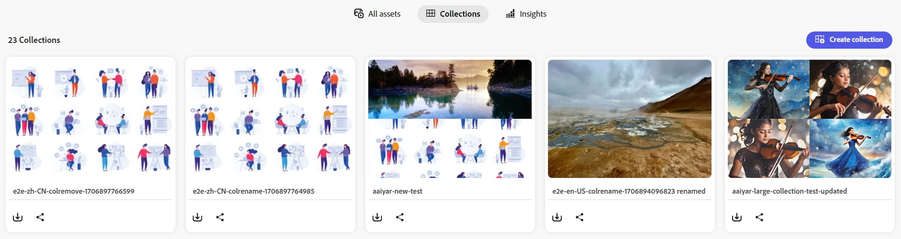

# Hantera samlingar i [!DNL Content Hub] {#manage-collections}

| [Sök efter bästa praxis](/help/assets/search-best-practices.md) | [Metadata - bästa praxis](/help/assets/metadata-best-practices.md) | [Content Hub](/help/assets/product-overview.md) | [Dynamic Media med OpenAPI-funktioner](/help/assets/dynamic-media-open-apis-overview.md) | [AEM Assets-dokumentation för utvecklare](https://developer.adobe.com/experience-cloud/experience-manager-apis/) |
| ------------- | --------------------------- |---------|----|-----|

<!--  -->

En samling refererar till en uppsättning resurser som kan delas mellan användare. En samling kan innehålla resurser från olika platser och samtidigt bevara sin referensintegritet.

Med [!DNL Content Hub] kan du skapa offentliga samlingar. Dessa samlingar är tillgängliga för alla behöriga användare, vilket skapar ett delat utrymme där flera användare effektivt kan komma åt och använda innehåll. Samlingar främjar samarbete och användning av resurser för ökad effektivitet och bekvämlighet. På samlingens webbsida kan du:

* **Skapa**: Skapa en eller flera samlingar.
* **Visa**: Visa resurserna och deras egenskaper.
* **Dela**: Dela resurser som en länk med andra.
* **Hämta**: Hämta resurserna.
* **Ta bort**: Ta bort specifika resurser från en samling.
* **Ta bort**: Ta bort hela samlingen.

Det hjälper användarna att enkelt komma åt och hantera de olika resurserna som är tillgängliga i [!DNL Content Hub].

## Förutsättningar {#prerequisites}

[Content Hub-användare](deploy-content-hub.md#onboard-content-hub-users) kan utföra åtgärder som nämns i den här artikeln.

## Skapa samlingar{#create-collections}

Du kan välja att [skapa en ny samling](#create-new-collection) eller [lägga till resurser i en befintlig samling](#add-assets-to-existing-collection).

### Skapa en ny samling{#create-new-collection}

Markera de resurser som du behöver lägga till i en samling och klicka på **[!UICONTROL Add To collection]**.

Om du vill skapa en ny samling går du till fliken **[!UICONTROL Collections]** och klickar på **[!UICONTROL Create new collection]**. Ange **[!UICONTROL Title]** och ange en valfri **[!UICONTROL Description]** för resurserna. Klicka på **[!UICONTROL Create]**.

### Lägga till resurser i en befintlig samling{#add-assets-to-existing-collection}

Om du vill lägga till resurser i en befintlig samling markerar du de resurser du behöver lägga till i samlingen. Klicka på **[!UICONTROL Add to collection]**. Du uppmanas att välja samlingen.

Välj den samling där du vill lägga till resursen. Du kan också söka i den befintliga samlingen med hjälp av sökfältet.  Markera den eller de samlingar som du vill lägga till resurserna i och klicka på **[!UICONTROL Add to collection]**.

## Visa samlingar{#view-collections}

Navigera till fliken **[!UICONTROL Collections]** och sök efter samlingsnamnet. Klicka på samlingens namn om du vill visa en lista med resurser som är tillgängliga i en samling. Du kan också använda filter i en samling för att begränsa resursresultaten.

Klicka på resursen som du vill visa i en samling. [!DNL Content Hub] visar detaljerad vy för resursen. [Se resursinformation](asset-properties-content-hub.md).

<!--

* **A**: Details and metadata of the asset 
* **B**: Zoom In or Zoom Out the asset 
* **C**: Reset Zoom view 
* **D**: View the previous or next asset 
* **E**: Download the asset 
* **F**: Open the asset in Adobe Express 
* **G**: Hide the metadata of the asset 
* **H**: Share the asset as a link 
-->

## Hämta resurser som är tillgängliga i en samling{#download-assets-within-collection}

Om du vill hämta resurser som är tillgängliga i en samling går du till fliken **[!UICONTROL Collections]**.\
Klicka på ikonen  på samlingskortet.

Alla resurser i samlingen hämtas.

Du kan också öppna samlingen för att hämta resurserna individuellt. Klicka på samlingen som innehåller de resurser du behöver för att hämta. Markera resurserna och klicka på **[!UICONTROL Download]**.

Lär dig hur du [hämtar en resurs från  [!DNL Content Hub]](download-assets-content-hub.md).

## Dela resurser som är tillgängliga i en samling {#share-assets-available-within-collection}

Du kan också dela de tillgängliga resurserna i en samling. Gå till fliken **[!UICONTROL Collections]**. Välj ikonen  på samlingskortet. Delningslänken kopieras. Du kan dela den kopierade länken med mottagaren. Läs mer om att [dela resurser i  [!DNL Content Hub]](share-assets-content-hub.md).

## Redigera information om en samling {#edit-details-of-collection}

Om du vill redigera **[!UICONTROL Title]** och **[!UICONTROL Description]** för en samling klickar du på samlingens namn och sedan på ikonen  . [!UICONTROL Collection Details]-skärmen visas. Du kan redigera **[!UICONTROL Title]** och **[!UICONTROL Description]** för en samling. Klicka på **[!UICONTROL Save Changes]** för att bekräfta ändringarna.

## Ta bort resurser från en samling{#remove-assets-from-a-collection}

Du kan ta bort en eller flera resurser från en samling. Om du vill ta bort resurser från en samling klickar du på samlingen som du vill ta bort resurser från, markerar resurserna och klickar på **[!UICONTROL Remove from collection]**.

Du uppmanas att bekräfta borttagningen av resursen. Klicka på **[!UICONTROL Remove]**.\
De markerade resurserna har tagits bort från samlingen.

## Ta bort en samling{#delete-collection}

Om du vill ta bort en samling går du till fliken **[!UICONTROL Collections]** och klickar på samlingen som du vill ta bort. Klicka på ikonen  för att ta bort samlingen.
