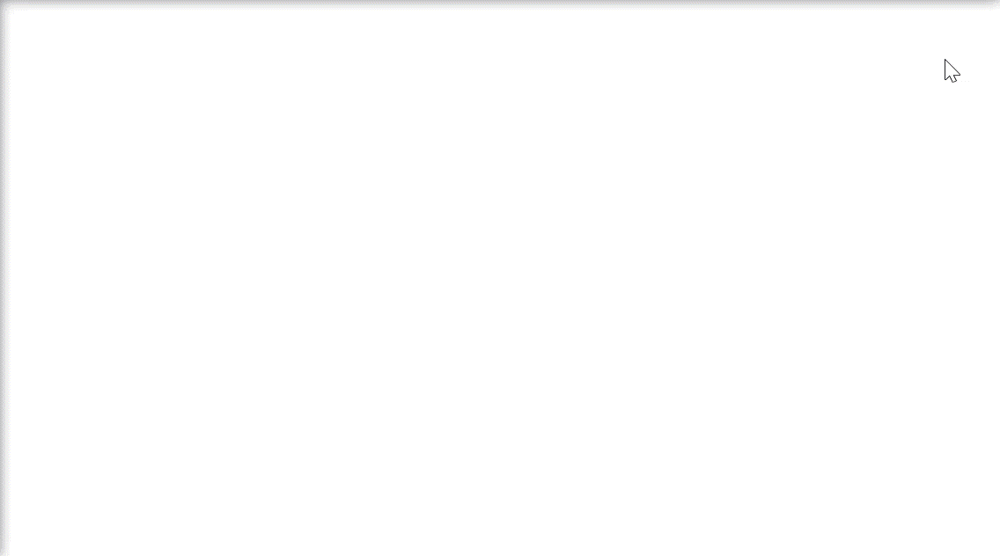
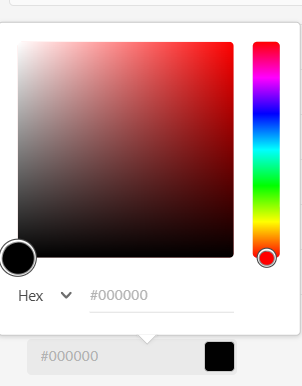

# Färgtaggar för bilder {#color-tag-images}

Experience Manager Assets använder Adobe Sensei AI-funktioner för att skilja mellan färger i en bild och tillämpa dem som taggar automatiskt vid intag. Dessa taggar möjliggör förbättrad sökning baserat på bildens färgkomposition.

Du kan konfigurera antalet färger, inom ett intervall av en till fyrtio, som är taggade till en bild så att du kan söka efter bilder baserade på dessa färger senare. Experience Manager Assets använder märkorden baserat på färgmängden i en bild. Du kan också konfigurera visningsformatet för en färgtagg.

>[!NOTE]
>
>Den här funktionen är tillgänglig i betaversionskanalen. Se [Dokumentation för prerelease Channel](https://experienceleague.adobe.com/docs/experience-manager-cloud-service/content/release-notes/prerelease.html?lang=en#enable-prerelease) om du vill ha information om hur du aktiverar funktionen för din miljö.

I följande bild visas de åtgärder du utför för att konfigurera och hantera färgtaggning för bilder i Experience Manager Assets:

## Filformat som stöds {#supported-file-formats-color-tags}

| Filformat | Tillägg | MIME-typ | Indatafärgrymd | Största tillåtna källfilsstorlek | Maximal filstorlek som stöds |
|---|---|---|---|---|---|
| JPEG | .jpg, .jpeg | image/jpeg | sRGB | 15 GB | 20000px X 20000px |
| PNG | .png | bild/png | sRGB | 15 GB | 20000px X 20000px |
| TIFF | .tif, .tiff | bild/tiff | sRGB | 4 GB (begränsat av formatspecifikationer | 20000px X 20000px |
| PSD | .psd | image/vnd.adobe.photoshop | sRGB | 2 GB (begränsat av formatspecifikationer) | 20000px X 20000px |
| GIF | .gif | image/gif | sRGB | 15 GB | 20000px X 20000px |
| BMP | .bmp | image/bmp | sRGB | 4 GB (begränsat av formatspecifikationer) | 20000px X 20000px |

## Hantera egenskaper för färgtaggning {#manage-color-tagging-properties}

Så här hanterar du färgtaggningsegenskaperna för bilder:

1. Navigera till **[!UICONTROL Tools > Assets > Color Tagging]**.

   

1. Ange ett visningsformat för färgtaggen i **[!UICONTROL Display Format]** fält. Möjliga alternativ är färgnamn, RGB eller HEX.

1. Ange antalet färger som ska taggas för bilderna i **[!UICONTROL Limit]** fält. Dessa färger visas när du visar en bilds egenskaper.  I det här fältet kan du definiera ett tal mellan ett och fyrtio. Standardvärdet för det här fältet är tio färger.

1. Ange den lägsta färgtäckningsprocenten för att inkludera en färgtagg i sökresultaten i **[!UICONTROL Coverage/Dominance Threshold %]** fält. Om den röda färgmängden i en bild till exempel är tio procent och du anger nio procent i det här fältet, inkluderas bilden när du söker efter bilder med röd färg. Om täckningen för den röda färgen i en bild är tio procent och du definierar elva procent i det här fältet tas bilden inte med när du söker efter bilder med röd färg.

   I det här fältet kan du ange valfritt tal mellan fem och hundra. Standardvärdet är elva.

   >[!NOTE]
   >
   >Adobe rekommenderar att du använder ett värde som ligger nära standardvärdet i det här fältet. Om du anger ett högt siffervärde för det här fältet (till exempel större än 25) kan det returnera väldigt få sökresultat. På samma sätt kan ett lågt siffervärde (till exempel mindre än 6) returnera för många sökresultat, vilket kanske inte är användbart.

1. Klicka på **[!UICONTROL Save]**.

   >[!VIDEO](https://video.tv.adobe.com/v/340108)

### Inaktivera färgtaggning {#disable-color-tagging}

Färgtaggning för bilder är aktiverat som standard. Du kan inaktivera färgtaggning på mappnivå. Alla underordnade mappar ärver egenskaperna för färgtaggning från den överordnade mappen.

Så här inaktiverar du färgtaggning på mappnivå:

1. Navigera till **[!UICONTROL Adobe Experience Manager > Assets > Files]**.

1. Markera mappen och klicka på **[!UICONTROL Properties]**.

1. I **[!UICONTROL Asset Processing]** flik, navigera till **[!UICONTROL Color Tags for images]** mapp. Välj något av följande värden i listrutan:

   * Ärvd - Mappen ärver aktiverings- eller inaktiveringsalternativen från den överordnade mappen.

   * Aktivera - Aktiverar färgtaggning för den valda mappen.

   * Inaktivera - Inaktiverar färgtaggning för den valda mappen.

   

## Konfigurera metadatamatchemat för att lägga till komponenten för smarta färgtaggar {#configure-metadata-schema}

Metadata-scheman innehåller specifika fält för specifik information som ska fyllas i. Den innehåller även layoutinformation för att visa metadatafält på ett användarvänligt sätt. Metadataegenskaperna innehåller titel, beskrivning, MIME-typer, taggar med mera. Du kan använda [!UICONTROL Metadata Schema Forms] redigeraren för att ändra befintliga scheman eller lägga till anpassade metadatamatcheman.

>[!NOTE]
>
>Fältet för smart färgtagg är tillgängligt i standardmetadataschemat. Om du använder ett anpassat metadatamatchema konfigurerar du schemat så att fältet för smarta färgtaggar läggs till.

Så här lägger du till komponenten Smarta färgtaggar i Formulärredigeraren för metadataschning:

1. Navigera till **[!UICONTROL Tools > Assets > Metadata Schemas]**.

1. Markera schemanamnet och klicka på **[!UICONTROL Edit]**.

1. Dra **[!UICONTROL Smart Color Tags]** från **[!UICONTROL Build Form]** till **[!UICONTROL Metadata Schema Form Editor]**.

1. Klicka på **[!UICONTROL Smart Color Tag Field]** i **[!UICONTROL Metadata Schema Form Editor]**.

1. Ange ett lämpligt värde i dialogrutan **[!UICONTROL Field Label]** i **[!UICONTROL Settings]**  -fliken.

1. Klicka på **[!UICONTROL Save]**.

   >[!VIDEO](https://video.tv.adobe.com/v/340124)

## Visa smarta färgtaggar för bilder {#view-color-tags}

Så här visar du smarta färgtaggar för bilder:

1. Navigera till **[!UICONTROL Adobe Experience Manager > Assets > Files]**.

1. Klicka på lämplig mapp och markera bilden.

1. Välj **[!UICONTROL Properties]** och visa taggarna i **[!UICONTROL Smart Color Tags]** fält.

   

   Håll muspekaren över en färgtagg för att visa **[!UICONTROL Coverage/Dominance Threshold %]** av en färg i en bild.

## Konfigurera AEM Assets-färgpredikat {#configure-search-predicate}

Du kan konfigurera sökfilter för bilder. Du kan sedan basera sökvillkoren på en viss färg för att filtrera resultaten.

>[!NOTE]
>
>Konfigurera AEM Assets färgpredikat endast om du inte använder standardsökformuläret.

Om du vill konfigurera sökfiltret skapar du ett predikat för resursfärg med hjälp av Resursens administratörssökspår.

Så här konfigurerar du sökfiltret:

1. Navigera till **[!UICONTROL Tools > General > Search Forms]**.

1. Välj **[!UICONTROL Assets Admin Search Rail]** och klicka **[!UICONTROL Edit]**.

1. Dra **[!UICONTROL Asset Color Predicate]** från **[!UICONTROL Select Predicate]** till **[!UICONTROL Search Form Editor]**.

1. Ange ett lämpligt värde i dialogrutan **[!UICONTROL Field Label]** i **[!UICONTROL Settings]**  -fliken.

1. Klicka **[!UICONTROL Done]** för att spara inställningarna.

   >[!VIDEO](https://video.tv.adobe.com/v/340110)

## Söka efter bilder baserat på färger {#search-images-based-on-colors}

>[!VIDEO](https://video.tv.adobe.com/v/340761)

När alla egenskaper för färgtaggning har konfigurerats och [konfigurera Assets-färgpredikat](#search-images-based-on-colors)kan du söka efter bilder baserat på en färg som ett filter.

Så här söker du efter bilder baserat på färger:

1. Navigera till **[!UICONTROL Assets > Files]**.

1. Välj **[!UICONTROL Filter]** i listrutan.
   

1. Välj [AEM Assets färgpredikat](#configure-search-predicate).

1. Välj lämplig färg genom att dra färgväljaren. Den valda färgen visas i det skrivskyddade fältet under färgväljaren. Du kan välja RGB eller HEX som visningsformat för färgen.

   

   Du kan filtrera bilder baserat på valet av en färg. De bilder som har den valda färgen som en av de smarta färgtaggarna och ovanför [Tröskelvärde för täckning/dominans %](#manage-color-tagging-settings) visas i den högra rutan.

1. Klicka på x i sökfältet för att ta bort filtret.

