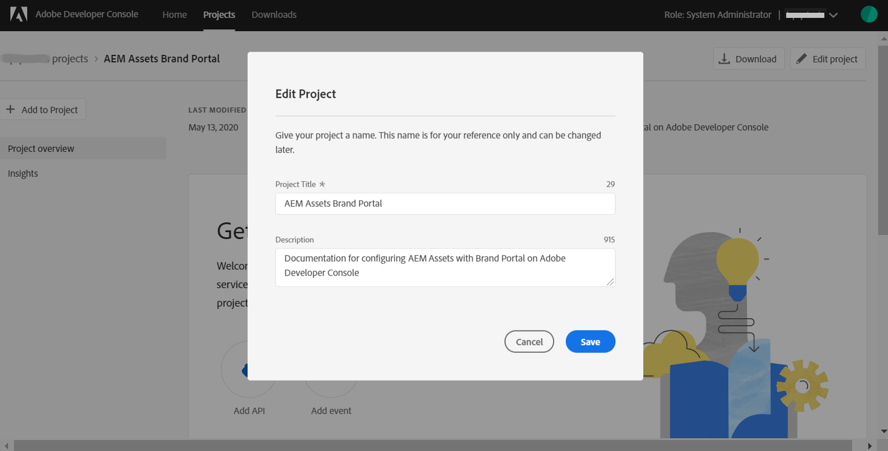

# Konfigurera AEM Assets med varumärkesportalen {#configure-aem-assets-with-brand-portal}

Adobe Experience Manager (AEM) Assets konfigureras med Brand Portal via Adobe Developer Console, som anskaffar en IMS-token för auktorisering av din varumärksportal.

**Hur konfigurationen fungerar?**

Konfigurationen av molninstansen AEM Assets med en Brand Portal-klientorganisation (organisation) kräver konfigurationer i båda, AEM Assets molninstans samt i Adobe Developer Console.

1. Skapa ett IMS-konto och generera ett offentligt certifikat (offentlig nyckel) i molninstansen i AEM Assets.
1. Skapa ett projekt för din varumärksportal (organisation) i Adobe Developer Console.
1. Under projektet konfigurerar du ett API med den offentliga nyckeln för att skapa en JWT-anslutning (Service Account).
1. Hämta tjänstkontots autentiseringsuppgifter och information om JWT-nyttolast.
1. Konfigurera IMS-kontot med tjänstkontots inloggningsuppgifter och JWT-nyttolast i molninstansen i AEM Assets.
1. Konfigurera molntjänsten Brand Portal i molninstansen AEM Assets med hjälp av IMS-kontot och brandportalslutpunkten (organisations-URL).
1. Testa konfigurationen genom att publicera en resurs från AEM Assets molninstansen till varumärkesportalen.

>[!NOTE]
>
>En innehavare av en varumärkesportal får endast konfigureras med en molninstans i AEM Assets.
>
>Konfigurera inte en Brand Portal-klientorganisation med flera AEM Assets-molninstanser.

## Förutsättningar {#prerequisites}

Du behöver följande för att konfigurera AEM Assets med varumärkesportalen:

* En AEM Assets-molninstans som körs.
* Varumärkesportalens klientorganisations-URL.
* En användare med systemadministratörsbehörighet på IMS-organisationen för varumärkesportalens klient.

**Kontakta kundtjänst** om du vill ha fler frågor.

## Skapa en konfiguration {#create-new-configuration}

Utför följande steg i den angivna sekvensen för att konfigurera AEM Assets molninstans med varumärkesportalen.

1. [Hämta ett offentligt certifikat](#public-certificate)
1. [Skapa JWT-anslutning (Service Account)](#createnewintegration)
1. [Konfigurera IMS-konto](#create-ims-account-configuration)
1. [Konfigurera molntjänsten](#configure-the-cloud-service)
1. [Testa konfigurationen](#test-configuration)

### Skapa IMS-konfigurationen {#create-ims-configuration}

IMS-konfigurationen autentiserar din klient för varumärkesportalen med AEM Assets molninstansen.

IMS-konfigurationen har två steg:

* [Hämta ett offentligt certifikat](#public-certificate)
* [Konfigurera IMS-konto](#create-ims-account-configuration)

### Hämta ett offentligt certifikat {#public-certificate}

Med ett offentligt certifikat kan du autentisera din profil på Adobe Developer Console.

1. Logga in på din AEM Assets-molninstans.

1. From the **Tools**  panel, navigate to **[!UICONTROL Security]** > **[!UICONTROL Adobe IMS Configurations]**.

   

1. Klicka på på sidan Adobe IMS-konfigurationer **[!UICONTROL Create]**.

1. Du omdirigeras till **[!UICONTROL Adobe IMS Technical Account Configuration]** sidan. By default, the **Certificate** tab opens.

   Välj molnlösning **[!UICONTROL Adobe Brand Portal]**.

1. Markera kryssrutan **[!UICONTROL Create new certificate]** och ange ett **alias** för certifikatet. Aliaset används som namn på dialogrutan.

1. Klicka på **[!UICONTROL Create certificate]**. Klicka sedan på **[!UICONTROL OK]** i dialogrutan för att generera det offentliga certifikatet.

   

1. Click **[!UICONTROL Download Public Key]** and save the certificate (.crt) file on your machine.

   Certifikatfilen används i ytterligare steg för att konfigurera API:t för din innehavare av varumärkesportalen och generera autentiseringsuppgifter för tjänstkontot i Adobe Developer Console.

   

1. Klicka på **[!UICONTROL Next]**.

   På fliken **Konto** skapar du Adobe IMS-kontot, men för det behöver du inloggningsuppgifterna för tjänstkontot som genereras i Adobe Developer Console. Håll den här sidan öppen tills vidare.

   Öppna en ny flik och [skapa en JWT-anslutning i Adobe Developer Console](#createnewintegration) för att hämta autentiseringsuppgifter och JWT-nyttolast för konfigurering av IMS-kontot.

### Skapa JWT-anslutning (Service Account) {#createnewintegration}

I Adobe Developer Console konfigureras projekt och API:er på organisationsnivå (varumärksportal-klientnivå). När du konfigurerar ett API skapas en JWT-anslutning (Service Account) i Adobe Developer Console. Det finns två metoder för att konfigurera API, genom att generera ett nyckelpar (privata och offentliga nycklar) eller genom att överföra en offentlig nyckel. Om du vill konfigurera AEM Assets molninstans med Brand Portal måste du generera ett offentligt certifikat (offentlig nyckel) i molninstansen AEM Assets och skapa autentiseringsuppgifter i Adobe Developer Console genom att överföra den offentliga nyckeln. Den här offentliga nyckeln används för att konfigurera API för den valda Brand Portal-organisationen och genererar autentiseringsuppgifter och JWT-nyttolast för tjänstkontot. Dessa autentiseringsuppgifter används vidare för att konfigurera IMS-kontot i molninstansen i AEM Assets. När IMS-kontot har konfigurerats kan du konfigurera molntjänsten Brand Portal i molninstansen för AEM Assets.

Utför följande steg för att generera autentiseringsuppgifter för tjänstkontot och JWT-nyttolast:

1. Logga in på Adobe Developer Console med systemadministratörsbehörighet för IMS-organisationen (innehavaren av varumärkesportalen). Standardwebbadressen är

   [https://www.adobe.com/go/devs_console_ui](https://www.adobe.com/go/devs_console_ui)

   >[!NOTE]
   >
   >Se till att du har valt rätt IMS-organisation (innehavaren av varumärkesportalen) i listrutan (organisationslistan) i det övre högra hörnet.

1. Klicka på **[!UICONTROL Create new project]**. Ett tomt projekt skapas för din organisation.

   Klicka **[!UICONTROL Edit project]** för att uppdatera **[!UICONTROL Project Title]** och **[!UICONTROL Description]** klicka sedan på **[!UICONTROL Save]**.

   

1. Klicka på fliken Projektöversikt **[!UICONTROL Add API]**.

   

1. I fönstret Lägg till ett API väljer du **[!UICONTROL AEM Brand Portal]** och klickar **[!UICONTROL Next]**.

   Se till att du har tillgång till tjänsten AEM Brand Portal.

1. Klicka på i fönstret Konfigurera API **[!UICONTROL Upload your public key]**. Klicka sedan på **[!UICONTROL Select a File]** och överför det publika certifikatet (.crt-filen) som du har hämtat i avsnittet [Hämta publika certifikat](#public-certificate) .

   Klicka på **[!UICONTROL Next]**.

   

1. Verifiera det offentliga certifikatet och klicka på **[!UICONTROL Next]**.

1. Select the default product profile **[!UICONTROL Assets Brand Portal]** and click **[!UICONTROL Save configuration]**.

   <!-- 
   In Brand Portal, a default profile is created for each organization. The Product Profiles are created in admin console for assigning users to groups (based on the roles and permissions). For configuration with Brand Portal, the OAuth token is created at organization level. Therefore, you must configure the default Product Profile for your organization. 
   -->

   

1. När API:t har konfigurerats omdirigeras du till API-översikten. Klicka på i den vänstra navigeringen under **[!UICONTROL Credentials]** på **[!UICONTROL Service Account (JWT)]**.

   >[!NOTE]
   >
   >Du kan visa autentiseringsuppgifterna och utföra andra åtgärder (generera JWT-tokens, kopiera autentiseringsuppgifter, hämta klienthemlighet o.s.v.) efter behov.

1. Kopiera från **[!UICONTROL Client Credentials]** fliken **[!UICONTROL client ID]**.

   Klicka på **[!UICONTROL Retrieve Client Secret]** och kopiera **[!UICONTROL client secret]**.

   

1. Navigate to the **[!UICONTROL Generate JWT]** tab and copy the **[!UICONTROL JWT Payload]**.

Nu kan du använda klient-ID (API-nyckel), klienthemlighet och JWT-nyttolast för att [konfigurera IMS-kontot](#create-ims-account-configuration) i AEM Assets molninstansen.

<!--
1. Click **[!UICONTROL Create Integration]**.

1. Select **[!UICONTROL Access an API]**, and click **[!UICONTROL Continue]**.

   

1. Create a new integration page opens. 
   
   Select your organization from the drop-down list.

   In **[!UICONTROL Experience Cloud]**, Select **[!UICONTROL AEM Brand Portal]** and click **[!UICONTROL Continue]**. 

   If the Brand Portal option is disabled for you, ensure that you have selected correct organization from the drop-down box above the **[!UICONTROL Adobe Services]** option. If you do not know your organization, contact your administrator.

   

1. Specify a name and description for the integration. Click **[!UICONTROL Select a File from your computer]** and upload the `AEM-Adobe-IMS.crt` file downloaded in the [obtain public certificates](#public-certificate) section.

1. Select the profile of your organization. 

   Or, select the default profile **[!UICONTROL Assets Brand Portal]** and click **[!UICONTROL Create Integration]**. The integration is created.

1. Click **[!UICONTROL Continue to integration details]** to view the integration information. 

   Copy the **[!UICONTROL API Key]** 
   
   Click **[!UICONTROL Retrieve Client Secret]** and copy the Client Secret key.

   

1. Navigate to **[!UICONTROL JWT]** tab, and copy the **[!UICONTROL JWT payload]**.

   The API Key, Client Secret key, and JWT payload information will be used to create IMS account configuration.

-->

### Konfigurera IMS-konto {#create-ims-account-configuration}

Kontrollera att du har utfört följande steg:

* [Hämta ett offentligt certifikat](#public-certificate)
* [Skapa JWT-anslutning (Service Account)](#createnewintegration)

Utför följande steg för att konfigurera det IMS-konto som du har skapat i [erhålla ett offentligt certifikat](#public-certificate).

1. Öppna IMS-konfigurationen och gå till **[!UICONTROL Accounts]** fliken. Du höll sidan öppen medan du [hämtade det offentliga certifikatet](#public-certificate).

1. Ange en **[!UICONTROL Title]** för IMS-kontot.

   Ange URL:en [https://ims-na1.adobelogin.com/](https://ims-na1.adobelogin.com/) i **[!UICONTROL Authorization Server]**.

   Klistra in klient-ID i API-nyckel, klienthemlighet och JWT-nyttolast som du kopierade när du [skapade JWT-anslutningen](#createnewintegration).

   Klicka på **[!UICONTROL Create]**.

   IMS-kontot är konfigurerat.

   

1. Select the IMS account configuration and click **[!UICONTROL Check Health]**.

   Klicka **[!UICONTROL Check]** i dialogrutan. När konfigurationen är klar visas ett meddelande om att *token har hämtats*.

   

>[!CAUTION]
>
>Du får bara ha en IMS-konfiguration. Skapa inte flera IMS-konfigurationer.
>
>Kontrollera att IMS-konfigurationen klarar hälsokontrollen. Om konfigurationen inte godkänns i hälsokontrollen är den ogiltig. Du måste ta bort den och skapa en ny, giltig konfiguration.

### Konfigurera molntjänsten{#configure-the-cloud-service}

Så här konfigurerar du molntjänsten Brand Portal:

1. Logga in på din AEM Assets-molninstans.

1. From the **Tools**  panel, navigate to **[!UICONTROL Cloud Services]** > **[!UICONTROL AEM Brand Portal]**.

1. Klicka på **[!UICONTROL Create]** på sidan Varumärksportal-konfigurationer.

1. Ange en **[!UICONTROL Title]** för konfigurationen.

   Välj den IMS-konfiguration som du skapade när du [konfigurerade IMS-kontot](#create-ims-account-configuration).

   In the **[!UICONTROL Service URL]**, enter your Brand Portal tenant (organization URL).

   

1. Klicka på **[!UICONTROL Save and Close]**. Molnkonfigurationen har skapats. AEM Assets-molninstansen är nu konfigurerad med varumärkesportalens klient.

### Testa konfigurationen {#test-configuration}

Utför följande steg för att validera konfigurationen:

1. Logga in på din AEM Assets-molninstans.

1. From the **Tools**  panel, navigate to **[!UICONTROL Deployment]** > **[!UICONTROL Distribution]**.

   

1. På sidan Distribution ser du att en Brand Portal-distributionsagent `bpdistributionagent0` har skapats för **[!UICONTROL Publish to Brand Portal]**.

   Klicka på **[!UICONTROL Publish to Brand Portal]**.

   

   >[!NOTE]
   >
   >Som standard skapas en distributionsagent för varumärkesportalens klient.

1. På sidan för distributionsagenten kan du se distributionsköerna på fliken **[!UICONTROL Status]** .

   En distributionsagent har två köer:
   * **processing-queue**: för distribution av resurser till varumärkesportalen.

   * **error-queue**: för resurser där distributionen misslyckades.
   >[!NOTE]
   >
   >Vi rekommenderar att du regelbundet granskar felen och rensar **error-queue**.

   

1. Kontrollera anslutningen mellan AEM Assets och varumärkesportalen genom att klicka på **[!UICONTROL Test Connection]**.

   

   Ett meddelande visas längst ned på sidan om att testpaketet har levererats.

   >[!NOTE]
   >
   >Undvik att inaktivera distributionsagenten eftersom det kan göra att distributionen av resurserna (i kön) misslyckas.

Din AEM Assets-molninstans har konfigurerats med varumärkesportalen och du kan nu:

* [Publicera resurser från AEM Assets till varumärkesportalen](publish-to-brand-portal.md)
* [Publicera mappar från AEM Assets till varumärkesportalen](publish-to-brand-portal.md#publish-folders-to-brand-portal)
* [Publicera samlingar från AEM Assets till varumärkesportalen](publish-to-brand-portal.md#publish-collections-to-brand-portal)

Förutom ovanstående kan du även publicera metadatascheman, bildförinställningar, sökfasetter och taggar från AEM Assets till varumärkesportalen.

* [Publicera förinställningar, scheman och fasetter på varumärkesportalen](https://docs.adobe.com/content/help/en/experience-manager-brand-portal/using/publish/publish-schema-search-facets-presets.html)
* [Publicera taggar på varumärkesportalen](https://docs.adobe.com/content/help/en/experience-manager-brand-portal/using/publish/brand-portal-publish-tags.html)

Mer information finns i [dokumentationen till varumärkesportalen](https://docs.adobe.com/content/help/en/experience-manager-brand-portal/using/home.html).

## Distributionsloggar {#distribution-logs}

Du kan kontrollera loggarna för detaljerad information om de åtgärder som utförs av distributionsagenten.

Vi har till exempel publicerat en resurs från AEM Assets till varumärkesportalen för att validera konfigurationen.

1. Följ stegen (från 1 till 4) som visas i avsnittet [Testa konfiguration](#test-configuration) och navigera till distributionsagentsidan.

1. Klicka på **[!UICONTROL Logs]** för att visa distributionsloggarna. Bearbetnings- och felloggarna visas här.

   

Distributionsagenten genererar följande loggar:

* INFO: En systemgenererad logg som utlöses när en konfiguration aktiverar distributionsagenten.
* DSTRQ1 (Begäran 1): Utlöses vid testanslutning.

Följande begärande- och svarsloggar genereras när resursen publiceras:

**Begäranden från distributionsagenten**:
* DSTRQ2 (Begäran 2): Begäran om publicering av resurser utlöses.
* DSTRQ3 (Begäran 3): Systemet utlöser en annan begäran om att publicera mappen där resursen finns och replikerar mappen i varumärkesportalen.

**Svar från distributionsagenten**:
* queue-bpdistributionagent0 (DSTRQ2): Resursen publiceras på varumärkesportalen.
* queue-bpdistributionagent0 (DSTRQ3): Systemet replikerar mappen som innehåller resursen i varumärkesportalen.

I exemplet ovan utlöses ytterligare en begäran och ett svar. Systemet kunde inte hitta den överordnade mappen (dvs. Lägg till sökväg) i varumärkesportalen eftersom resursen publicerades för första gången. Därför utlöses en ytterligare begäran om att skapa en överordnad mapp med samma namn i varumärkesportalen där resursen publiceras.

>[!NOTE]
>
>Ytterligare en begäran skapas om den överordnade mappen inte finns i varumärkesportalen (som i exemplet ovan) eller om den överordnade mappen har ändrats i AEM Assets.

<!--

## Additional information {#additional-information}

Go to `/system/console/slingmetrics` for statistics related to the distributed content:

1. **Counter metrics**
   * sling: `mac_sync_request_failure`
   * sling: `mac_sync_request_received`
   * sling: `mac_sync_request_success`

1. **Time metrics**
   * sling: `mac_sync_distribution_duration`
   * sling: `mac_sync_enqueue_package_duration`
   * sling: `mac_sync_setup_request_duration`

-->

<!--
   Comment Type: draft

   <li> </li>
   -->

<!--
   Comment Type: draft

   <li>Step text</li>
   -->
