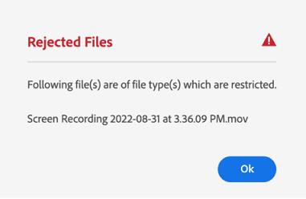
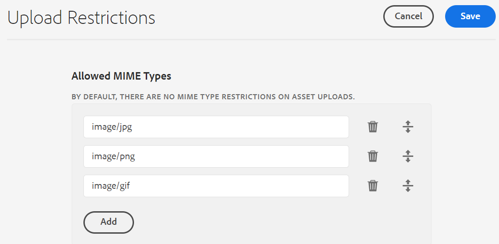

# Konfigurera överföringsbegränsningar för resurser {#configure-asset-upload-restrictions}

Du kan konfigurera Adobe Experience Manager Assets att begränsa vilken typ av resurser som användare kan överföra baserat på MIME-typen.

>[!IMPORTANT]
>
>Som standard tillåter Experience Manager Assets användare att överföra resurser av alla MIME-typer. Du kan dock konfigurera inställningarna så att användarna endast kan överföra filer av särskilda MIME-typer.

## Förutsättningar {#prerequisites-asset-upload-restrictions}

Du måste ha administratörsbehörighet för att konfigurera överföringsbegränsningar för resurser.

## Använd begränsningar för överföringar av resurser {#apply-restrictions-asset-uploadsssssss}

Så här konfigurerar du [!DNL Experience Manager] för att begränsa användare till att överföra filer av specifika MIME-typer:

1. Navigera till **[!UICONTROL Tools > Assets > Assets Configurations]**.

1. Klicka på **[!UICONTROL Upload Restrictions]**.

1. Klicka på **[!UICONTROL Add]** för att definiera de tillåtna MIME-typerna.

1. Ange MIME-typen i textrutan. Du kan klicka på **[!UICONTROL Add]** igen om du vill ange fler tillåtna MIME-typer. Du kan också klicka på ikonen  om du vill ta bort en MIME-typ från listan.

1. Klicka på **[!UICONTROL Save]**.

**Exempel 1: Tillåt överföring av alla bilder och PDF-filer till Experience Manager Assets**

Om du vill tillåta överföring av bilder i alla format och PDF-filer till Experience Manager Assets gör du följande inställningar:

`image/*` som MIME-typ tillåter överföring av bilder i alla format. `application/pdf` som MIME-typ tillåter överföring av PDF-filer till Experience Manager Assets.

Om du försöker överföra en fil som inte finns med i listan över tillåtna MIME-typer visas följande felmeddelande i Experience Manager Assets:

`Screen Recording 2022-08-31 at 3.36.09 PM.mov` refererar till ett filnamn som inte ingår i de tillåtna MIME-typerna.

**Exempel 2: Tillåt överföring av specifika bildformat till Experience Manager Assets**

Om du vill lägga till särskilda bildformat i de tillåtna MIME-typerna och begränsa överföringen av alla andra resursformat, gör du följande inställningar:

Baserat på inställningarna i bilden kan du överföra bilder i formaten .JPG, .PNG och .GIF till Experience Manager Assets.

**Se även**

* [Översätt Assets](translate-assets.md)
* [ASSETS HTTP API](mac-api-assets.md)
* [Filformat som stöds av Assets](file-format-support.md)
* [Sök resurser](search-assets.md)
* [Anslutna resurser](use-assets-across-connected-assets-instances.md)
* [Resursrapporter](asset-reports.md)
* [Metadata-scheman](metadata-schemas.md)
* [Hämta resurser](download-assets-from-aem.md)
* [Hantera metadata](manage-metadata.md)
* [Sök efter ansikten](search-facets.md)
* [Hantera samlingar](manage-collections.md)
* [Import av massmetadata](metadata-import-export.md)
* [Publicera Assets till AEM och Dynamic Media](/help/assets/publish-assets-to-aem-and-dm.md)
