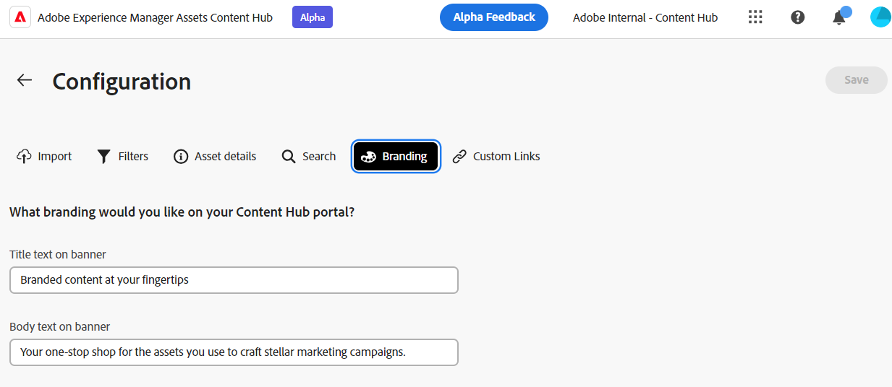

# Konfigurera Content Hub användargränssnitt {#configure-content-hub-user-interface}

<!--  -->

Med Experience Manager Assets kan administratörer konfigurera de alternativ som finns i Content Hub användargränssnitt. Baserat på de konfigurationsalternativ som valts av administratörer kan Content Hub-användare visa fält på Content Hub. Konfigurationsalternativen är:

* Filter som är tillgängliga för användare när de söker efter resurser.

* Tillgångsinformation eller egenskaper som är tillgängliga för varje resurs.

* Metadatafält som är tillgängliga för användare när resurser läggs till i Content Hub.

* Metadatafält för resurser som är tillgängliga för sökning i Content Hub.

* Varumärkesinnehåll som du behöver visa för din organisation.

* Alla anpassade länkar som du behöver inkludera på Content Hub förutom resurser, samlingar och insikter.

## Förutsättningar {#prerequisites-configuration-ui}

[Content Hub-administratörer](/help/assets/deploy-content-hub.md#step-3-onboard-content-hub-administrator) kan lägga till resurser i Content Hub och kan även ange konfigurationsalternativ för andra användare i organisationen.

## Få åtkomst till konfigurationsalternativ på Content Hub {#access-configuration-options-content-hub}

Så här öppnar du konfigurationsalternativ på Content Hub:

1. Klicka på användarikonen i den högra rutan.

1. I **[!UICONTROL Product Settings]** avsnitt, markera **[!UICONTROL Configurations]**.

   

## Hantera konfigurationsalternativ på Content Hub {#manage-configuration-options}

Hantera följande konfigurationsalternativ för dina användare:

* [Importera](#configure-import-options-content-hub)

* [Filter](#configure-filters-content-hub)

* [Resursinformation](#configure-asset-details-content-hub)

* [Sök](#configure-metadata-search-content-hub)

* [Varumärke](#configure-branding-content-hub)

* [Anpassade länkar](#configure-custom-links-content-hub)

### Importera {#configure-import-options-content-hub}

Du kan konfigurera metadatafält som visas för användarna när du överför eller importerar resurser till Content Hub-portalen, till exempel kampanjnamn, nyckelord, kanaler, tidsram, region och så vidare. Gör så här:

1. På [Konfigurationer](#access-configuration-options-content-hub) användargränssnitt, klicka **[!UICONTROL Import]**.

1. Klicka på **[!UICONTROL Add metadata]**.

1. Ange en etikett för egenskapen och mappa den till en egenskap med **[!UICONTROL Metadata]** och välj indatatyp för de nya resursens metadata.

1. Klicka på **[!UICONTROL Required field]** växla för att göra det nya metadatafältet obligatoriskt att ange för användare när nya resurser överförs.

1. Klicka på **[!UICONTROL Confirm]**. De nya metadata visas i listan över befintliga resursegenskaper.

1. Klicka **[!UICONTROL Save]** för att tillämpa ändringarna.

Du kan också klicka , som är tillgängligt bredvid varje tillgänglig egenskap, för att redigera etiketterna, gör dessa fält obligatoriska eller icke-obligatoriska för användare när resurser överförs med **[!UICONTROL Required field]** eller klicka på ikonen Ta bort om du vill ta bort en metadataegenskap.

Klicka på **[!UICONTROL Auto-approval]** växla om du vill att alla resurser som du lägger till i Experience Manager Assets-databasen ska godkännas automatiskt så att de blir tillgängliga i Content Hub direkt. Annars måste DAM-författare eller -administratörer manuellt godkänna mediefilerna för att göra dem tillgängliga på Content Hub. Växlingsknappen är som standard inställd på Av.

Klicka **[!UICONTROL Save]** efter att ha gjort alla ändringar för att tillämpa ändringarna.

Metadata är aktiverade i konfigurationsanvändargränssnittet på sidan för överföring av resurser:

### Filter {#configure-filters-content-hub}

I Content Hub kan administratörer konfigurera filter som visas när de söker efter resurser. Utför följande steg för att lägga till ett nytt filter:

1. På [Konfigurationer](#access-configuration-options-content-hub) användargränssnitt, klicka **[!UICONTROL Filters]**.

1. Klicka på **[!UICONTROL Add filters]**.

1. Ange en etikett för filtret, mappa det till en egenskap med **[!UICONTROL Metadata]** och välj indatatyp för det nya filtret.
1. Klicka på **[!UICONTROL Confirm]**. Det nya filtret visas i listan över befintliga filter.

1. Klicka **[!UICONTROL Save]** om du vill använda ändringarna så att det nya filtret visas på söksidan när du filtrerar resurser.

Du kan också klicka , som finns bredvid varje tillgängligt filter, för att redigera etiketterna eller klicka på borttagningsikonen för att ta bort ett befintligt filter. Klicka **[!UICONTROL Save]** efter att ha gjort alla ändringar för att tillämpa ändringarna.

De filter som är aktiverade i konfigurationsanvändargränssnittet visas på söksidan:

### Resursinformation {#configure-asset-details-content-hub}

Du kan också konfigurera resursegenskaperna som visas för varje resurs, till exempel filnamn, titel, format, storlek och så vidare. Gör så här:

1. På [Konfigurationer](#access-configuration-options-content-hub) användargränssnitt, klicka **[!UICONTROL Asset details]**.

1. Klicka på **[!UICONTROL Add metadata]**.

1. Ange en etikett för egenskapen och mappa den till en egenskap med **[!UICONTROL Metadata]** och välj indatatyp för de nya resursens metadata.
1. Klicka på **[!UICONTROL Confirm]**. De nya metadata visas i listan över befintliga resursegenskaper.

1. Klicka **[!UICONTROL Save]** om du vill använda ändringarna så att den nya egenskapen visas på sidan med resursinformation.

Du kan också klicka , som finns bredvid varje tillgänglig egenskap, om du vill redigera etiketterna eller klicka på borttagningsikonen om du vill ta bort alla befintliga resursdetaljer. Klicka **[!UICONTROL Save]** efter att ha gjort alla ändringar för att tillämpa ändringarna.

De egenskaper som är aktiverade i konfigurationsanvändargränssnittet visas på sidan Resursinformation:

### Sök {#configure-metadata-search-content-hub}

Administratörer kan definiera metadatafält som söks igenom när en användare anger ett sökvillkor i Content Hub. Utför följande steg:

1. På [Konfigurationer](#access-configuration-options-content-hub) användargränssnitt, klicka **[!UICONTROL Add metadata]**.

1. Ange metadatafältet och klicka på **[!UICONTROL Confirm]**.

1. Klicka **[!UICONTROL Save]** om du vill använda ändringarna så att den nya metadataegenskapen visas i listan med metadatafält.

Du kan också klicka , som finns bredvid varje tillgänglig metadataegenskap, om du vill redigera egenskapen eller klicka på borttagningsikonen om du vill ta bort en befintlig egenskap. Klicka **[!UICONTROL Save]** efter att ha gjort alla ändringar för att tillämpa ändringarna.

### Varumärke {#configure-branding-content-hub}

Administratörer kan också anpassa rubrik och brödtext på banderollen på Content Hub-portalen efter varumärkeskraven. Gör så här:

1. På [Konfigurationer](#access-configuration-options-content-hub) användargränssnitt, klicka **[!UICONTROL Branding]**.

1. Ange text i **[!UICONTROL Title text on banner]** och **[!UICONTROL Body text on banner]** fält.

1. Klicka **[!UICONTROL Save]** för att tillämpa ändringarna.

De varumärkningsuppdateringar som är aktiverade på skärmen för användargränssnittet för konfiguration på bannern för Content Hub-portalen:

### Anpassade länkar {#configure-custom-links-content-hub}

Du kan även lägga till anpassade flikar utöver standardflikarna **[!UICONTROL All Assets]**, **[!UICONTROL Collections]** och **[!UICONTROL Insights]** på Content Hub-portalen under banderollen. Gör så här:

1. På [Konfigurationer](#access-configuration-options-content-hub) användargränssnitt, klicka **[!UICONTROL Custom Links]**.

1. Klicka på **[!UICONTROL Add link]**.

1. Ange text i **[!UICONTROL Label]** och **[!UICONTROL URL]** fält. Etiketten som du definierar visas som en flik och när du klickar på etiketten navigerar du till den URL som definieras i dialogrutan **[!UICONTROL URL]** fält.

1. Klicka på **[!UICONTROL Confirm]**.

1. Klicka **[!UICONTROL Save]** för att tillämpa ändringarna.

Du kan också klicka , som finns bredvid varje URL-adress, om du vill redigera länkarna eller klicka på borttagningsikonen om du vill ta bort en befintlig URL-adress. Klicka **[!UICONTROL Save]** efter att ha gjort alla ändringar för att tillämpa ändringarna.

Den anpassade länken visas som en ny flik bredvid fliken Insikter på Content Hub hemsida.

