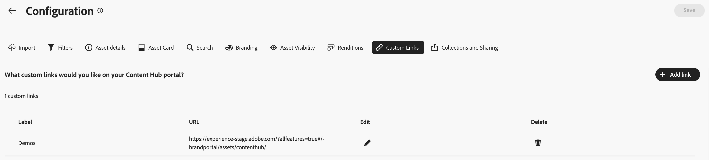

# Konfigurera Content Hub användargränssnitt {#configure-content-hub-user-interface}

>[!CONTEXTUALHELP]
>id="configure_content_hub"
>title="Konfigurera Content Hub användargränssnitt"
>abstract="Med Experience Manager Assets kan administratörer konfigurera de alternativ som finns i Content Hub användargränssnitt. Baserat på de konfigurationsalternativ som valts av administratörer kan Content Hub-användare visa fält på Content Hub. Konfigurationsalternativen inkluderar metadata vid import av resurser, filter, resursegenskaper, metadata vid sökning av resurser, anpassad varumärkning och eventuella anpassade länkar."
>additional-url="https://images-tv.adobe.com/mpcv3/4477/74a81d1c-0cfe-41f4-8a06-18ff70604e45_1732023385.854x480at800_h264.mp4" text="Titta på videon"

<!--  -->

Med Experience Manager Assets kan administratörer konfigurera de alternativ som finns i Content Hub användargränssnitt. Baserat på de konfigurationsalternativ som valts av administratörer kan Content Hub-användare visa fält på Content Hub. Konfigurationsalternativen är:

* Filter som är tillgängliga för användare när de söker efter resurser.

* Tillgångsinformation eller egenskaper som är tillgängliga för varje resurs.

* Metadatafält som är tillgängliga för användare när resurser läggs till i Content Hub.

* Metadatafält för resurser som är tillgängliga för sökning i Content Hub.

* Varumärkesinnehåll som du behöver visa för din organisation.

* Alla anpassade länkar som du behöver inkludera på Content Hub förutom resurser, samlingar och insikter.

## Förutsättningar {#prerequisites-configuration-ui}

[Content Hub-administratörer](/help/assets/deploy-content-hub.md#step-3-onboard-content-hub-administrator) kan ange konfigurationsalternativ för andra användare i organisationen.

## Få åtkomst till konfigurationsalternativ på Content Hub {#access-configuration-options-content-hub}

Så här öppnar du konfigurationsalternativ på Content Hub:

1. Klicka på användarikonen i den högra rutan.

1. Välj **[!UICONTROL Product Settings]** i avsnittet **[!UICONTROL Configurations]**.

   

## Hantera konfigurationsalternativ på Content Hub {#manage-configuration-options}

Som administratör hanterar du följande konfigurationsalternativ för dina användare:

* [Importera](#configure-import-options-content-hub)

* [Filter](#configure-filters-content-hub)

* [Resursinformation](#configure-asset-details-content-hub)
* [Tillgångskort](#asset-card)

* [Sök](#configure-metadata-search-content-hub)

* [Varumärke](#configure-branding-content-hub)

* [Assets har gått ut](#expired-assets-content-hub)

* [Återgivningar](#renditions-content-hub)

* [Anpassade länkar](#configure-custom-links-content-hub)

* [Samlingar och delning](#configure-collections-content-hub)

<!--* [Enable public link sharing](#enable-public-link-sharing)-->

### Importera {#configure-import-options-content-hub}

Du kan konfigurera metadatafält som visas för användarna när du överför eller importerar resurser till Content Hub-portalen, till exempel kampanjnamn, nyckelord, kanaler, tidsram, region och så vidare. Gör så här:

1. Klicka på [ i användargränssnittet för ](#access-configuration-options-content-hub)konfigurationer **[!UICONTROL Import]**.

1. Klicka på **[!UICONTROL Add metadata]**.

1. Ange en etikett för egenskapen, mappa den till en egenskap med hjälp av fältet **[!UICONTROL Metadata]** och välj indatatypen för de nya metadata för resursen.

1. Klicka på växlingsknappen **[!UICONTROL Required field]** för att göra det nya metadatafältet obligatoriskt att ange för användare när nya resurser överförs.

1. Klicka på **[!UICONTROL Confirm]**. De nya metadata visas i listan över befintliga resursegenskaper.

1. Klicka på **[!UICONTROL Save]** för att tillämpa ändringarna.

På samma sätt kan du klicka på  , som är tillgänglig bredvid varje tillgänglig egenskap, om du vill redigera etiketterna, göra dessa fält obligatoriska eller icke-obligatoriska för användare när de överför resurser med hjälp av växlingsknappen **[!UICONTROL Required field]** eller klicka på ikonen Ta bort om du vill ta bort en metadataegenskap.

Klicka på växlingsknappen **[!UICONTROL Auto-approval]** om du vill att alla resurser som du lägger till i Experience Manager Assets-databasen ska godkännas automatiskt så att de är tillgängliga i Content Hub direkt. Annars måste DAM-författare eller -administratörer manuellt godkänna mediefilerna för att göra dem tillgängliga på Content Hub. Växlingsknappen är som standard inställd på Av.

Klicka på **[!UICONTROL Save]** när du har gjort alla ändringar för att tillämpa ändringarna.

Metadata är aktiverade i konfigurationsanvändargränssnittet på sidan för överföring av resurser:

### Filter {#configure-filters-content-hub}

I Content Hub kan administratörer konfigurera filter som visas när de söker efter resurser. Utför följande steg för att lägga till ett nytt filter:

1. Klicka på [ i användargränssnittet för ](#access-configuration-options-content-hub)konfigurationer **[!UICONTROL Filters]**.

1. Klicka på **[!UICONTROL Add filters]**.

1. Ange en etikett för filtret, mappa det till en egenskap med fältet **[!UICONTROL Metadata]** och välj indatatypen för det nya filtret.
1. Klicka på **[!UICONTROL Confirm]**. Det nya filtret visas i listan över befintliga filter.

1. Klicka på **[!UICONTROL Save]** om du vill använda ändringarna så att det nya filtret visas på söksidan när du filtrerar resurser.

   >[!NOTE]
   >
   >Det nya filtret visas bara på söksidan om det finns minst en resurs i databasen som matchar filtervillkoren.

På samma sätt kan du klicka på ikonen , som finns bredvid varje tillgängligt filter, för att redigera etiketterna eller klicka på ikonen Ta bort för att ta bort befintliga filter. Klicka på **[!UICONTROL Save]** när du har gjort alla ändringar för att tillämpa ändringarna.

De filter som är aktiverade i konfigurationsanvändargränssnittet visas på söksidan:

#### Masssökning {#bulk-search-configuration}

Om du vill aktivera sökning av flera resurser samtidigt i [!DNL Content Hub] ska du utföra följande steg:

1. Klicka på [ i användargränssnittet för ](#access-configuration-options-content-hub)konfigurationer **[!UICONTROL Filters]**.

1. Klicka på ikonen som finns bredvid varje tillgängligt filter.

1. Aktivera växlingen **[!UICONTROL Bulk Search]**. Standardavgränsarna `[ , | \t | \r\n | \r | \n ]` visas automatiskt. Dessutom kan du lägga till ytterligare avgränsare. Om du vill göra det anger du avgränsare i indatarutan avgränsade med `pipe symbol (|)`.

   

1. Klicka på **[!UICONTROL Confirm]** om du vill spara ändringarna. Se [Masssökning i Content Hub](search-assets-content-hub.md#bulk-search) in action.

### Resursinformation {#configure-asset-details-content-hub}

Du kan också konfigurera resursegenskaperna som visas för varje resurs, till exempel filnamn, titel, format, storlek och så vidare. Gör så här:

1. Klicka på [ i användargränssnittet för ](#access-configuration-options-content-hub)konfigurationer **[!UICONTROL Asset details]**.

1. Klicka på **[!UICONTROL Add metadata]**.

1. Ange en etikett för egenskapen, mappa den till en egenskap med hjälp av fältet **[!UICONTROL Metadata]** och välj indatatypen för de nya metadata för resursen.
1. Klicka på **[!UICONTROL Confirm]**. De nya metadata visas i listan över befintliga resursegenskaper.

1. Klicka på **[!UICONTROL Save]** för att tillämpa ändringarna så att den nya egenskapen visas på sidan med resursinformation.

På samma sätt kan du klicka på ikonen , som finns bredvid varje tillgänglig egenskap, för att redigera etiketterna eller klicka på ikonen Ta bort för att ta bort alla befintliga resursdetaljer. Klicka på **[!UICONTROL Save]** när du har gjort alla ändringar för att tillämpa ändringarna.

De egenskaper som är aktiverade i konfigurationsanvändargränssnittet visas på sidan Resursinformation:

### Tillgångskort {#asset-card}

Du kan också konfigurera de viktigaste metadataegenskaperna som du behöver visa på **resurskortet** upp till högst sex fält.

Utför följande steg för att konfigurera metadataegenskaperna så att de visas i **[!UICONTROL Asset card]** :

1. Klicka på [Resurskort](#access-configuration-options-content-hub) i användargränssnittet för **konfigurationer**.
2. Klicka på **Lägg till metadata**. Dialogrutan **Lägg till metadata för resurskort** visas.
3. Ange metadatanamnet i fältet **Etikett** och välj en metadataegenskap i fältet **Metadata**.
4. Klicka på **Bekräfta** och sedan på **Spara** för att tillämpa ändringarna så att den nya egenskapen visas på sidan med resursinformation.
   
På samma sätt klickar du på  som är tillgänglig bredvid varje tillgänglig egenskap, om du vill göra nödvändiga ändringar eller på  om du vill ta bort en befintlig metadataegenskap. Klicka på **Spara** när du har gjort alla ändringar för att tillämpa ändringarna.

### Sök {#configure-metadata-search-content-hub}

Administratörer kan definiera metadatafält som söks igenom när en användare anger ett sökvillkor i Content Hub. Utför följande steg:

1. Klicka på [ i användargränssnittet för ](#access-configuration-options-content-hub)konfigurationer **[!UICONTROL Add metadata]**.

1. Ange metadatafältet och klicka på **[!UICONTROL Confirm]**.

1. Klicka på **[!UICONTROL Save]** för att tillämpa ändringarna så att den nya metadataegenskapen visas i listan med metadatafält.

På samma sätt kan du klicka på ikonen , som finns bredvid varje tillgänglig metadataegenskap, om du vill redigera egenskapen eller klicka på ikonen Ta bort om du vill ta bort en befintlig egenskap. Klicka på **[!UICONTROL Save]** när du har gjort alla ändringar för att tillämpa ändringarna.

### Varumärke {#configure-branding-content-hub}

Som administratör anpassar du din [!DNL Content Hub]-portal så att den uppfyller dina varumärkeskrav.

På sidan  **[!UICONTROL Branding]** använder du avsnitten **[!UICONTROL Banner]**, **[!UICONTROL Colors]** och **[!UICONTROL Banner image]** för att utföra följande anpassningar:

1. [Ändra logotypbilden från avsnittet [!UICONTROL Logo image]](#Change-the-logo-image)
1. [Ändra banderollbilden från avsnittet [!UICONTROL Banner image]](#Change-the-banner-image)
1. [Uppdatera rubrik och brödtext på banderollen och ändra textfärgen i avsnittet [!UICONTROL Banner]](#Add-title-and-body-text-to-your-banner-and-change-the-text-color)
1. [Ändra primär och sekundär färg från avsnittet [!UICONTROL Colors] för att använda ett färgschema som är anpassat till ditt varumärkes tema](#Change-the-primary-and-secondary-color)

Välj alternativet **[!UICONTROL Reset Defaults]** om du vill återställa ändringarna och standardtemat.

#### Ändra logotypbilden{#change-the-logo-image}

Utför följande steg på sidan  **[!UICONTROL Branding]** för att ändra logotypbilden för din [!DNL Content Hub]-distribution:

1. Klicka på  **[!UICONTROL Select Image]** om du vill välja en logotypbild med dialogrutan för resursväljaren. Resursväljaren visar endast godkända bilder.
1. Markera bilden, klicka på **[!UICONTROL Select]** och sedan på **[!UICONTROL Save]** för att visa den som logotypbild för din [!DNL Content Hub]-distribution.
   

#### Ändra banderollbilden{#Change-the-banner-image}

Utför följande steg på sidan  **[!UICONTROL Branding]** för att ändra banderollbilden för din [!DNL Content Hub]-distribution:

1. Klicka på  **[!UICONTROL Select from gallery]** om du vill välja en banderollbild med dialogrutan för resursväljaren. Resursväljaren visar endast godkända bilder.
1. Markera bilden, klicka på **[!UICONTROL Select]** och sedan på **[!UICONTROL Save]** för att visa den som en banderollbild för din [!DNL Content Hub]-distribution.
   

>[!NOTE]
>
> * Den rekommenderade storleken för **banderollbild** är `height = 200 to 450px` och `width = 1920 to 2560px`.
> * Den rekommenderade storleken för **logotypbild** är `height = 80 to 120px` och `width = 120 to 200px`.
> * MIME-typerna **som stöds** för både Banner- och Logo-bilder är `'JPG', value: 'image/jpeg'`, `'PNG', value: 'image/png'`, `'WEBP', value: 'image/webp'`, `'TIFF', value: 'image/tiff'`, `'SVG', value: 'image/svg+xml'`, `'GIF', value: 'image/gif'`.

#### Lägg till rubrik och brödtext i bannern och ändra textfärgen{#Add-title-and-body-text-to-your-banner-and-change-the-text-color}

På sidan  **[!UICONTROL Branding]** använder du respektive fält i avsnittet **[!UICONTROL Banner]** för att lägga till rubrik och brödtext i din banderoll.
Klicka på den fyrkantiga rutan bredvid **[!UICONTROL Banner text color]** om du vill välja en textfärg i färgväljaren för din banderolltext eller ange färgens hexadecimala kod i fältet bredvid färgväljarens fyrkantiga ruta.

#### Ändra primär- och sekundärfärg{#Change-the-primary-and-secondary-color}

På sidan  **[!UICONTROL Branding]** använder du avsnittet **[!UICONTROL Colors]** för att ange primära och sekundära färger genom att antingen välja dem med färgväljaren eller definiera färgens hexadecimala kod. De här färgerna anger bakgrund, text och ikonfärger för gränssnittselement så att användargränssnittet i [!DNL Content Hub] anpassas efter ditt varumärkes tema.

**[!UICONTROL Primary color]:** Det primära färgschemat används för markeringsåtgärder, interaktiva element som kryssrutor, sökfält och växlingsknappar över [!DNL Content Hub] inklusive [!DNL Content Hub] startsida och [!UICONTROL Configuration] -sida. Det gäller även åtgärdsalternativ som är tillgängliga på primära [!DNL Content Hub]-gränssnitt, till exempel alternativ som är tillgängliga på **[!UICONTROL All Assets]**- och **[!UICONTROL Collections]**-sidor.

**[!UICONTROL Secondary color]:** På hemsidan [!DNL Content Hub] gäller det sekundära färgschemat för gränssnittsalternativ och inmatningsfält som är tillgängliga i dialogrutor. Det gäller för alla alternativ på konfigurationsmenyn som är tillgängliga på sidan [!UICONTROL Configuration] förutom markeringsåtgärder, kryssrutor, sökfält och växlingsreglage.

### Synlighet för resurs{#asset-visibility-content-hub}

Administratörer kan kontrollera om utgångna resurser behöver vara synliga på Content Hub. Om de utgångna resurserna blir synliga kan de även definiera om användare kan hämta dem.

Utgångna mediefiler visas inte i Content Hub som standard.

Gör så här:

1. Klicka på [ i användargränssnittet för ](#access-configuration-options-content-hub)konfigurationer **[!UICONTROL Asset Visibility]**.

1. Aktivera alternativet **[!UICONTROL Visible]** i avsnittet **[!UICONTROL Allow users to view expired assets]** för att göra alla förfallna resurser synliga på Content Hub.

1. När du har aktiverat synlighet för resurser kan du aktivera eller inaktivera möjligheten att hämta utgångna resurser med hjälp av växlingsknappen **[!UICONTROL Allow users to download expired assets]**.
1. Aktivera växlingsknappen **[!UICONTROL Allow users to view assets approved for delivery]** för att visa alla resurser som har godkänts för leverans i Content Hub.
1. Klicka på **[!UICONTROL Save]** för att tillämpa ändringarna.

   

När du har aktiverat synlighet för resurser kan du visa de förfallna resurserna på Content Hub, enligt bilden nedan:

Om administratören har aktiverat nedladdning kan Content Hub-användarna även hämta dem, vilket är markerat i bilden.

Om synligheten för utgångna resurser är aktiverad markeras även resurser som förfaller inom 15 dagar med meddelandet `Expiring in n days` på tillgångskortet.

### Återgivningar {#renditions-content-hub}

Återgivningar är anpassade versioner av digitala resurser, som bilder, dokument och så vidare, som utformats för olika enheter och plattformar för att ge optimala prestanda. Se mer om [återgivningar i Adobe Experience Manager Assets](https://experienceleague.adobe.com/en/docs/experience-manager-cloud-service/content/assets/assets-view/renditions).

Gör så här:

Klicka på [ i användargränssnittet för ](#access-configuration-options-content-hub)konfigurationer **[!UICONTROL Renditions]**. Följande alternativ är tillgängliga:

* Aktivera växlingsknappen [!UICONTROL Enable availability of renditions] för att göra alla återgivningar synliga på Content Hub.

* Aktivera eller inaktivera **[!UICONTROL Allow users to download original assets]** för att kontrollera tillgängligheten för hämtning av originalresurser.

  

Mer information om hur du visar och hämtar återgivningar i Content Hub finns i [Hämta resurser i Content Hub](/help/assets/download-assets-content-hub.md).

### Anpassade länkar {#configure-custom-links-content-hub}

Du kan även lägga till anpassade flikar utöver standardflikarna **[!UICONTROL All Assets]**, **[!UICONTROL Collections]** och **[!UICONTROL Insights]** på Content Hub-portalen precis nedanför banderollen. Gör så här:

1. Klicka på [ i användargränssnittet för ](#access-configuration-options-content-hub)konfigurationer **[!UICONTROL Custom Links]**.

1. Klicka på **[!UICONTROL Add link]**.

1. Ange text i fälten **[!UICONTROL Label]** och **[!UICONTROL URL]**. Etiketten som du definierar visas som en flik och när du klickar på etiketten navigerar du till den URL som definierats i fältet **[!UICONTROL URL]**.

1. Klicka på **[!UICONTROL Confirm]**.

1. Klicka på **[!UICONTROL Save]** för att tillämpa ändringarna.

På samma sätt kan du klicka på ikonen , som finns bredvid varje URL, om du vill redigera länkarna eller klicka på ikonen Ta bort om du vill ta bort en befintlig URL. Klicka på **[!UICONTROL Save]** när du har gjort alla ändringar för att tillämpa ändringarna.

Den anpassade länken visas som en ny flik bredvid fliken Insikter på Content Hub hemsida.

### Samlingar och delning {#configure-collections-content-hub}

Administratörer kan definiera användarbehörigheter när de skapar samlingar. Så här aktiverar du de här inställningarna:

1. Klicka på [ i användargränssnittet för ](#access-configuration-options-content-hub)konfigurationer **[!UICONTROL Collections]**.

1. Aktivera växlingsknappen **[!UICONTROL Enable Public Link]** för att tillåta att offentliga länkar skapas som externa användare kan använda för att komma åt och hämta resurser utan att logga in på Content Hub.

1. Aktivera växlingsknappen **[!UICONTROL View Only Collections]** för att tillåta samlingar som är tillgängliga för alla men bara kan redigeras av skaparen och administratören.

1. Aktivera växlingsknappen **[!UICONTROL Public Collections]** för att tillåta samlingar som är tillgängliga och redigerbara av alla. Om **[!UICONTROL View Only Collections]**- och **[!UICONTROL Public Collections]**-växlarna är inaktiverade kan icke-adminanvändare som standard bara skapa privata samlingar.

1. Klicka på **[!UICONTROL Save]** för att tillämpa ändringarna.

   

<!--
### Enable public link sharing {#enable-public-link-sharing}

Enable the following setting on the Configurations user interface to allow Content Hub users to generate a public link:

1. On the [Configurations](#access-configuration-options-content-hub) user interface, click **[!UICONTROL Collections and Sharing]**.

1. Enable the **[!UICONTROL Enable Public Link]** toggle and click **[!UICONTROL Save]** to apply the changes.

    

-->

Läs mer om att [dela resurser i  [!DNL Content Hub]](share-assets-content-hub.md).

