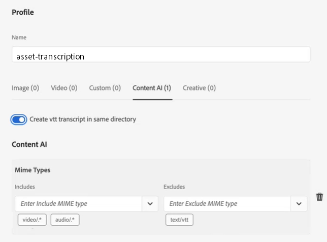

# Konfigurera transkription i [!DNL Experience Manager Assets] {#configure-transcription-service}

Transkription är processen att översätta ljudet från en ljud- eller videofil till text (tal till text) med hjälp av taligenkänningstekniken.
[!DNL Adobe Experience Manager Assets] är konfigurerad med [!DNL Azure Media Services] som automatiskt genererar textutskrift av det talade språket i en ljud- eller videofil som stöds i WebVTT-formatet (.vtt). När ett ljud- eller videomaterial bearbetas i [!DNL Experience Manager Assets], genererar transkriberingstjänsten automatiskt texttranskriberingen av ljud- eller videoresursen och lagrar den på samma plats i resurskatalogen där den ursprungliga resursen finns. The [!DNL Experience Manager Assets] Med transkriberingstjänsten kan marknadsförarna effektivt hantera sitt ljud- och videomaterial med ökad upptäckbarhet av textinnehållet samt öka avkastningen på dessa resurser genom hjälpmedel och lokalisering.

Transcript är textversioner av talt innehåll. Ett exempel är en film som du tittar på på en OTT-plattform som ofta innehåller bildtexter eller undertexter som hjälper till med tillgängligheten eller som konsumerar innehållet på andra språk. Eller alla ljud- och videofiler som används i marknadsförings-, utbildnings- eller underhållningssyfte. De här upplevelserna börjar med en transkription som sedan formateras eller översätts på lämpligt sätt. Att transkribera ljud eller video är en tidskrävande och felbenägen process när den utförs manuellt. Det är också en utmaning att skala den manuella processen, med tanke på det ständigt ökande behovet av ljud- och videoinnehåll. [!DNL Experience Manager Assets] använder Azure:s AI-baserade transkription, som tillåter storskalig bearbetning av ljud- och videoresurser och genererar texttranskriberingarna (.vtt-filer) tillsammans med tidsstämpelsinformationen. Utöver Assets stöds även transkriberingsfunktionen i Dynamic Media.

transkriberingsfunktionen är tillgänglig utan kostnad i [!DNL Experience Manager Assets]. Administratörerna kräver dock att användarens Azure-autentiseringsuppgifter konfigurerar transkriberingstjänsten i [!DNL Experience Manager Assets]. Du kan också [hämta autentiseringsuppgifter för testversionen](https://azure.microsoft.com/en-us/pricing/details/media-services/) direkt från Microsoft® och upplev ljud- och videomaterial i Assets.

## Förutsättningar för transkribering {#prerequisites}

1. En igång [!DNL Experience Manager Assets as a Cloud Service] -instans.
1. Följande Azure-autentiseringsuppgifter krävs för konfiguration i [!DNL Experience Manager Assets]:

   * Klient-ID (API-nyckel)
   * Klienthemlig nyckel
   * Klientslutpunkt (domän)
   * Mediekonto
   * Resursgrupp
   * Prenumerations-ID

   Se [Azure-dokumentation](https://docs.microsoft.com/en-us/azure/media-services/latest/access-api-howto?tabs=portal) för att få inloggningsuppgifter för åtkomst till Azure Media Services API.

1. Kontrollera att Azure-kontot har tillräcklig kredit för att behandla nya begäranden.

## Konfigurera transkription i [!DNL Experience Manager Assets] {#configure-transcription}

Följande konfigurationer krävs för att aktivera transkriberingsfunktionen i [!DNL Experience Manager Assets]:

1. [Konfigurera Azure Media Services](#configure-azure-media-service)
1. [Konfigurera Bearbetningsprofil för ljud-/videotranskription](#configure-processing-profile-for-transcription)

### Konfigurera Azure Media Services {#configure-azure-media-services}

[!DNL Experience Manager Assets] använder [!DNL Azure Media Services] som automatiskt genererar textutskrifter av det talade språket på ett [ljud- eller videofil som stöds](#supported-file-formats-for-transcription) i WebVTT-format (.vtt). Administratörerna kan konfigurera [!DNL Azure Media Services] in [!DNL Experience Manager Assets] med Azure-inloggningsuppgifterna. The [transkriberingskrav](#transcription-prerequisites) listan [!DNL Azure] autentiseringsuppgifter som krävs för konfigurationen. Om du inte har [!DNL Azure] konto och autentiseringsuppgifter, se [Dokumentation för Azure Media Services](https://azure.microsoft.com/en-us/pricing/details/media-services/) för att få inloggningsuppgifter för testversionen.

Gå till **[!UICONTROL Tools]** > **[!UICONTROL Cloud Services]** > **[!UICONTROL Azure Media Services Configuration]**. Välj en mapp (plats) i den vänstra listen och klicka på [!UICONTROL Create] för att konfigurera anslutningen till [!DNL Azure] konto. Den här mappen är platsen där din [!DNL Azure] molnkonfigurationen lagras i Experience Manager Assets. Ange [!DNL Azure] inloggningsuppgifter och klicka på **[!UICONTROL Save & Close]**.

### Konfigurera bearbetningsprofil för transkription {#configure-processing-profile}

När [!DNL Azure Media Services] är konfigurerat i Experience Manager Assets är nästa steg att skapa en mediebearbetningsprofil för att generera en AI-baserad transkription av ljud- och videoresurserna. Den AI-baserade bearbetningsprofilen genererar transkriberingar av [ljud- eller videoresurs som stöds](#supported-file-formats-for-transcription) som en återgivning i Experience Manager Assets och lagrar utskriften (.vtt-filen) i samma mapp som den ursprungliga resursen finns i. Det är därför enklare för användarna att söka efter och hitta resursen och dess utskrivna återgivning.

Gå till **[!UICONTROL Tools]** > **[!UICONTROL Assets]** > **[!UICONTROL Processing Profiles]** och klicka på **[!UICONTROL Create]** om du vill skapa en AI-baserad bearbetningsprofil för att generera transkription av dina ljud- och videofiler. Som standard visas bara tre flikar på sidan Bearbetningsprofil (Bild, Video och Anpassad). En **[!UICONTROL Content AI]** -fliken visas om du har konfigurerat [!DNL Azure Media Services] i [!DNL Experience Manager Assets] -instans. Verifiera [!DNL Azure] om du inte ser **[!UICONTROL Content AI]** när du skapar en bearbetningsprofil.

I **[!UICONTROL Content AI]** klickar du på **[!UICONTROL Add New]** för att konfigurera transkription. Här kan du inkludera och exkludera filformat (MIME-typer) för att generera transkript genom att välja filtyper i listrutan. I följande bild inkluderas alla ljud- och videofiler som stöds och textfilerna exkluderas.

Aktivera **[!UICONTROL Create VTT transcript in same directory]** växla för att skapa och lagra den transkriberade återgivningen (.vtt-fil) i samma mapp som den ursprungliga resursen finns i. De andra återgivningarna genereras också av standardarbetsflödet för DAM-resurshantering oavsett den här inställningen.

I följande bild visas en anpassad videoprofil som har skapats i Experience Manager Assets.

Videoprofilen innehåller även följande anpassade konfigurationer. Se [bearbeta profildokumentation](/help/assets/asset-microservices-configure-and-use.md) om du vill ha mer information om hur du skapar en anpassad bearbetningsprofil.

Låt oss nu konfigurera transkriberingen i den här videoprofilen. Navigera till **[!UICONTROL Content AI]** och klicka på **[!UICONTROL Add New]** -knappen. Inkludera alla ljud- och videofiler och exkludera bild- och programfilerna. Aktivera **[!UICONTROL Create VTT transcript in same directory]** växla och spara konfigurationen.

När bearbetningsprofilen har konfigurerats för transkription av ljud- och videofiler kan du använda den här bearbetningsprofilen för mappar på något av följande sätt:

* Välj en bearbetningsprofildefinition i **[!UICONTROL Tools]** > **[!UICONTROL Assets]** > **[!UICONTROL Processing Profiles]** och använda **[!UICONTROL Apply Profile to Folder(s)]** åtgärd. I innehållsläsaren kan du navigera till en viss mapp, välja en mapp och bekräfta programmet för profilen.
* Välj en mapp i Assets-användargränssnittet och klicka på **[!UICONTROL Properties]** åtgärd för att öppna mappegenskaper. Klicka på **[!UICONTROL Asset Processing]** och väljer lämplig bearbetningsprofil för mappen på **[!UICONTROL Processing Profile]** lista. Spara ändringarna genom att klicka på **[!UICONTROL Save & Close]**.

   

* Användarna kan välja mappar eller specifika resurser i Assets-användargränssnittet för att tillämpa en bearbetningsprofil och sedan välja **[!UICONTROL Reprocess Assets]** från de tillgängliga alternativen överst.

>[!TIP]
>Endast en bearbetningsprofil kan användas för en mapp.
>
>När en bearbetningsprofil har tillämpats på en mapp bearbetas alla nya resurser som har överförts (eller uppdaterats) i den här mappen eller någon av dess undermappar med hjälp av den extra bearbetningsprofilen som har konfigurerats. Den här bearbetningen är utöver standardprofilen.

>[!NOTE]
>
>En bearbetningsprofil som tillämpas på en mapp fungerar för hela trädet, men kan åsidosättas om en annan profil tillämpas på en undermapp.
>
>När resurser överförs till en mapp kommunicerar Experience Manager med mappens egenskaper för att identifiera bearbetningsprofilen. Om ingen används kontrolleras en överordnad mapp i hierarkin för att en bearbetningsprofil ska användas.

## Generera transkriberingar av ljud- eller videomaterial {#generate-transcription}

När du bearbetar en videoresurs kan du [AI-baserad bearbetningsprofil](#configure-processing-profile-for-transcription) genererar automatiskt transkript (.vtt-fil) som en återgivning tillsammans med den ursprungliga resursen i samma mapp.

Du kan också se den transkriberade återgivningen genom att gå till återgivningarna av den ursprungliga videoresursen. Så här öppnar du **[!UICONTROL Renditions]** markerar du den ursprungliga videoresursen och öppnar den vänstra listen. Du ser att den krypterade återgivningen (.vtt-fil) är synlig under **[!UICONTROL TRANSCRIPTVTT]** huvud.

Du kan hämta transkriberingen (.vtt-textfilen) direkt från mappen som en separat resursåtergivning, eller från **[!UICONTROL Renditions]** panelen för den ursprungliga resursen genom att hämta alla återgivningar av resursen.

För närvarande stöder inte Experience Manager förhandsgranskning av eller redigering av VTT-filer i sin helhet. Du kan dock hämta transkriberingen och använda valfri textredigerare för att redigera eller verifiera transkriberingen. I transkriften visas det talade språket som en text vid den angivna tidsstämpeln i videon med transkriberingens konfidensgrad (precision).

## Använda transkription i Dynamic Media {#using-transcription-in-dynamic-media}

Om du har [konfigurerad Dynamic Media](/help/assets/dynamic-media/config-dm.md) i din Experience Manager Assets-instans kan du publicera resursen (ljud- eller videofilen) och dess transkript (.vtt-fil) till Dynamic Media. På så sätt publiceras den ursprungliga resursen (ljud- eller videofilen) och dess transkriberade återgivning (.vtt-filen) till Dynamic Media i samma mapp. Dynamic Media-administratören kan [aktivera CC-undertexter](/help/assets/dynamic-media/video.md#adding-captions-to-video) för ljud- eller videofilen med hjälp av transkriptrenderingen (.vtt-fil).

Se även:

* [Videosjälvstudiekurs om hur du lägger till CC-undertexter i Dynamic Media-videon](https://experienceleague.adobe.com/docs/experience-manager-learn/assets/dynamic-media/dynamic-media-overview-feature-video-use.html#add-cc-closed-captioning-to-dynamic-media-video)
* [Publicera Dynamic Media-videor på YouTube](/help/assets/dynamic-media/video.md#publishing-videos-to-youtube)

I följande bild återspeglar webbadressen bildtextdelen som refererar till utskriften (.vtt-filen). Videon visar det talade språket (transkriberad text) som **[!UICONTROL Closed Caption]** vid den angivna tidsstämpeln i videon. Användaren kan aktivera eller inaktivera bildtexten med **[!UICONTROL CC]** -knappen.

## Filformat som stöds för transkription {#supported-file-format}

Följande ljud- och videofilformat stöds för transkription:

| Ljud-/videoformat som stöds | Tillägg |
|----|----|
| FLV (med H.264- och AAC-kodekar) | (.flv) |
| MXF | (.mxf) |
| MPEG2-PS, MPEG2-TS, 3GP | (.ts, .ps, .3gp, .3gpp, .mpg) |
| Windows Media Video (WMV)/ASF | (.wmv, .asf) |
| AVI (okomprimerad 8 bitar/10 bitar) | (.avi) |
| MP4 | (.mp4, .m4a, .m4v) |
| Microsoft® Digital Video Recording (DVR-MS) | (.dvr-ms) |
| Matroska/WebM | (.mkv) |
| WAVE/WAV | (.wav) |
| QuickTime | (.mov) |

>[!NOTE]
>
>Resurser (ljud- eller videofiler) av programtyp stöds inte för transkription.

## Kända begränsningar {#known-limitations}

* transkriberingsfunktionen stöds för videoklipp med en varaktighet på upp till 10 minuter.
* Videotiteln får inte innehålla fler än 80 tecken.
* Filstorleken som stöds är upp till 15 GB.
* Den maximala bearbetningstiden som stöds är 60 minuter.
* I en betald [!DNL Azure] kan du överföra upp till 50 filmer per minut. I ett testversionskonto kan du dock överföra upp till fem filmer per minut.

## Felsökningstips {#troubleshooting}

Logga in på [!DNL Azure Media Services] konto med samma inloggningsuppgifter (som du har använt för konfigurationen) för att verifiera status för begäran. Kontakt [!DNL Azure] om din begäran inte kan behandlas.
