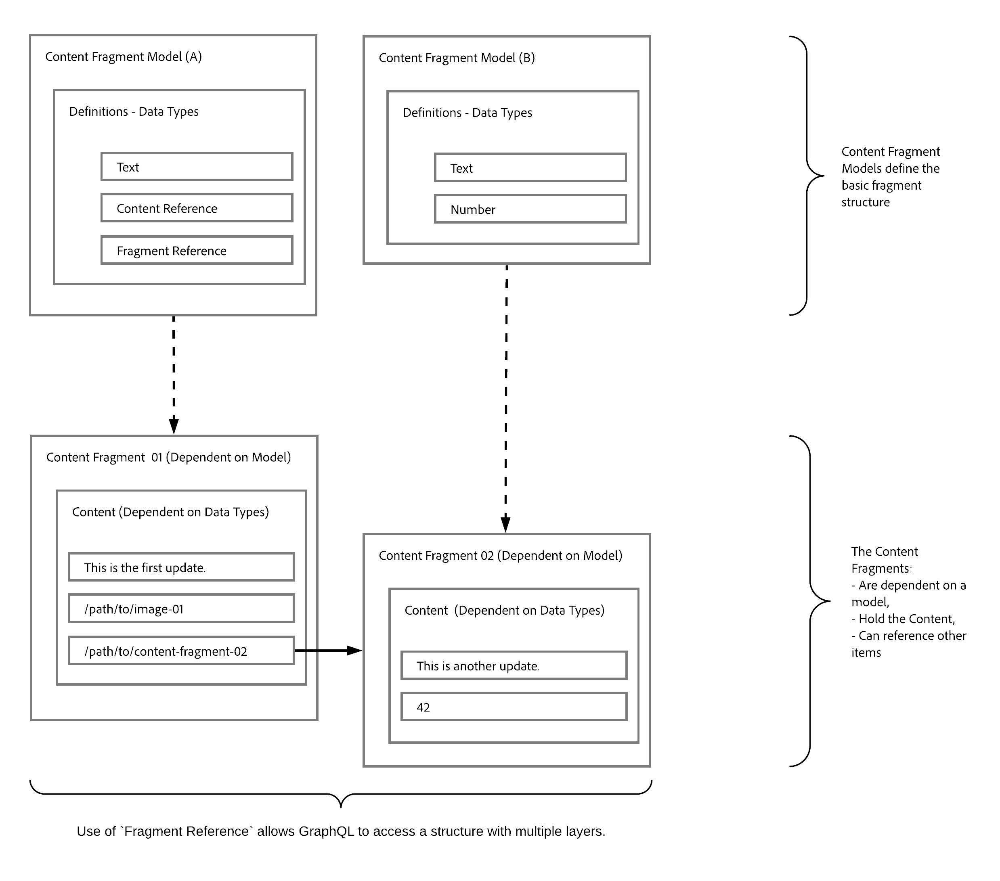

# Headless Content Delivery using Content Fragments with GraphQL {#headless-content-delivery-using-content-fragments-with-graphQL}

Med Adobe Experience Manager (AEM) som Cloud Service kan du använda innehållsfragment tillsammans med det AEM GraphQL-API:t (en anpassad implementering baserad på standard GraphQL) för att leverera strukturerat innehåll som ska användas i dina program. Möjligheten att anpassa en enda API-fråga gör att du kan hämta och leverera det specifika innehåll som du vill ha/behöver återge (som svar på en enskild API-fråga).

>[!NOTE]
>
>Se [Headless och AEM](/help/implementing/developing/headless/introduction.md) för en introduktion till Headless Development för AEM Sites som Cloud Service.

>[!NOTE]
>
>GraphQL används för närvarande i två (separata) scenarier i Adobe Experience Manager (AEM) som en Cloud Service:
>
>* [AEM Commerce använder data från en e-handelsplattform via GraphQL](/help/commerce-cloud/architecture/magento.md).
>* [AEM Content Fragments fungerar tillsammans med det AEM GraphQL-API:t (en anpassad implementering som baseras på standard GraphQL) för att leverera strukturerat innehåll som kan användas i dina program](/help/assets/content-fragments/graphql-api-content-fragments.md).

## Headless CMS {#headless-cms}

Ett CMS-system (Headless Content Management System) är:

* &quot;*Ett headless content management-system, eller headless CMS, är ett CMS-system (content management system) som byggs från grunden som en innehållsdatabas som gör innehåll tillgängligt via ett API för visning på valfri enhet.*

   Se [Wikipedia](https://en.wikipedia.org/wiki/Headless_content_management_system).

När det gäller utveckling av innehållsfragment i AEM innebär detta att:

* Du kan använda Innehållsfragment för att skapa innehåll som inte primärt är avsett att publiceras direkt (1:1) på formaterade sidor.

* Innehållet i dina innehållsfragment kommer att struktureras på ett förutbestämt sätt, enligt modellerna för innehållsfragment. Detta förenklar åtkomsten för dina program, som kommer att bearbeta innehållet ytterligare.

## GraphQL - en översikt {#graphql-overview}

GraphQL är:

* &quot;*..ett frågespråk för API:er och en körningsmiljö för att utföra dessa frågor med dina befintliga data.*&quot;.

   Se [GraphQL.org](https://graphql.org)

Med [AEM GraphQL API](#aem-graphql-api) kan du utföra (komplexa) frågor på dina [innehållsfragment](/help/assets/content-fragments/content-fragments.md); där varje fråga följer en viss modelltyp. Det returnerade innehållet kan sedan användas av dina program.

## AEM GraphQL API {#aem-graphql-api}

För Adobe Experience som Cloud Experience har en anpassad implementering av standard-API:t GraphQL utvecklats. Mer information finns i [AEM GraphQL API för användning med innehållsfragment](/help/assets/content-fragments/graphql-api-content-fragments.md).

Implementeringen av AEM GraphQL API baseras på Java-biblioteken [GraphQL](https://graphql.org/code/#java).

## Innehållsfragment för användning med AEM GraphQL API {#content-fragments-use-with-aem-graphql-api}

[Content ](#content-fragments) Fragmentscan kan användas som bas för GraphQL för AEM frågor som:

* Med dem kan du utforma, skapa, strukturera och publicera sidoberoende innehåll.
* [Modeller för innehållsfragment](#content-fragments-models) tillhandahåller den struktur som krävs med hjälp av definierade datatyper.
* Du kan använda [fragmentreferensen](#fragment-references) när du definierar en modell för att definiera ytterligare lager i strukturen.

### Innehållsfragment {#content-fragments}

Innehållsfragment:

* Innehåller strukturerat innehåll.

* De baseras på en [modell för innehållsfragment](#content-fragments-models), som fördefinierar strukturen för det resulterande fragmentet.

### Modeller för innehållsfragment {#content-fragments-models}

Dessa [modeller för innehållsfragment](/help/assets/content-fragments/content-fragments-models.md):

* Används för att generera [scheman](https://graphql.org/learn/schema/) en gång **Enabled**.

* Ange de datatyper och fält som krävs för GraphQL. De ser till att programmet bara begär det som är möjligt och får det som förväntas.

* Datatypen **[Fragmentreferenser](#fragment-references)** kan användas i din modell för att referera till ett annat innehållsfragment, vilket innebär att ytterligare strukturnivåer införs.

### Fragmentreferenser {#fragment-references}

**[Fragmentreferens](/help/assets/content-fragments/content-fragments-models.md#fragment-reference-nested-fragments)**:

* Är av särskilt intresse tillsammans med GraphQL.

* Är en specifik datatyp som kan användas när en innehållsfragmentmodell definieras.

* Refererar till ett annat fragment, beroende på en viss innehållsfragmentmodell.

* Gör att du kan hämta strukturerade data.

   * När det definieras som en **multifeed** kan flera delfragment refereras (hämtas) av det primära fragmentet.

### JSON Preview {#json-preview}

Om du vill ha hjälp med att designa och utveckla dina modeller för innehållsfragment kan du förhandsgranska [JSON-utdata](/help/assets/content-fragments/content-fragments-json-preview.md).

## Lära sig att använda GraphQL med AEM - exempelinnehåll och frågor {#learn-graphql-with-aem-sample-content-queries}

Se [Lära dig använda GraphQL med AEM - Sample Content and Queries](/help/assets/content-fragments/content-fragments-graphql-samples.md) för en introduktion till att använda det AEM GraphQL API:t.

## Självstudiekurs - Komma igång med AEM Headless och GraphQL

Söker du en praktisk självstudiekurs? Ta en titt på [Komma igång med AEM Headless och GraphQL](https://experienceleague.adobe.com/docs/experience-manager-learn/getting-started-with-aem-headless/graphql/overview.html) heltäckande självstudiekurs som visar hur du bygger upp och visar innehåll med AEM GraphQL API:er och som används av en extern app i ett headless CMS-scenario.