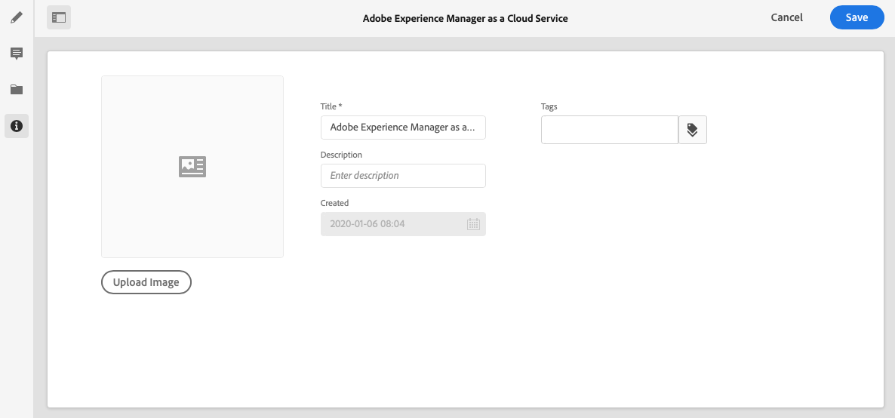

# Metadata – fragmentegenskaper{#metadata-fragment-properties}

## Redigera egenskaper/Metadata {#editing-properties-meta-data}

Du kan visa och redigera metadata (egenskaper) för innehållsfragment:

1. I konsolen **Resurser** navigerar du till platsen för innehållsfragmentet.
2. Antingen:

   * Välj [**Visa egenskaper** för att öppna dialogrutorna](/help/assets/manage-digital-assets.md#editing-properties). När du har öppnat för visning kan du även redigera.
   * Öppna [innehållsfragmentet för Edit](/help/assets/content-fragments/content-fragments-managing.md#opening-the-fragment-editor) och välj **Metadata** på sidopanelen.

   

3. Fliken **Grundläggande** innehåller alternativ som du kan visa eller redigera:

   * Miniatyrbild som du kan **överföra bild** för
   * **Content Fragment** Modelement anger den modell som används för att skapa det aktuella fragmentet
   * **Titel**
   * **Beskrivning**
   * **Taggar**
   * Skapat (endast visning)
   
