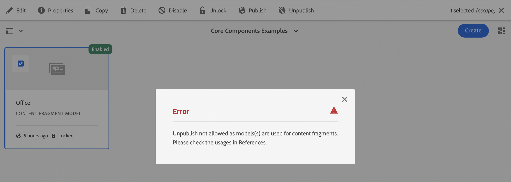

# Modeller för innehållsfragment {#content-fragment-models}

>[!NOTE]
>
>The [Locked (Published) Content Fragment Models](#locked-published-content-fragment-models) feature is in beta.

Content Fragment Models i AEM definierar innehållsstrukturen för dina [innehållsfragment,](/help/assets/content-fragments/content-fragments.md) fungerar som en grund för ditt headless-innehåll.

To use Content Fragment Models you:

1. [Enable Content Fragment Model functionality for your instance](/help/assets/content-fragments/content-fragments-configuration-browser.md)
1. [Skapa](#creating-a-content-fragment-model) och  [konfigurera](#defining-your-content-fragment-model) modeller för innehållsfragment
1. [Aktivera ](#enabling-disabling-a-content-fragment-model) modeller för innehållsfragment för användning när du skapar innehållsfragment för användning när du skapar innehållsfragment
1. [Tillåt dina modeller för innehållsfragment på ](#allowing-content-fragment-models-assets-folder) mapparna Resurser genom att konfigurera  **profiler**.

## Creating a Content Fragment Model {#creating-a-content-fragment-model}

1. Navigera till **Verktyg**, **Resurser** och öppna sedan **Modeller för innehållsfragment**.
1. Navigera till den mapp som passar din [konfiguration](/help/assets/content-fragments/content-fragments-configuration-browser.md).
1. Använd **Skapa** för att öppna guiden.

   >[!CAUTION]
   >
   >Om [användningen av innehållsfragmentmodeller inte har aktiverats](/help/assets/content-fragments/content-fragments-configuration-browser.md) är alternativet **Skapa** inte tillgängligt.

1. Ange **modelltitel**. You can also add **Tags**, a **Description**, and select **Enable model** to [enable the model](#enabling-disabling-a-content-fragment-model) if required.

   

1. Use **Create** to save the empty model. Ett meddelande visar att åtgärden lyckades, du kan välja **Öppna** om du vill redigera modellen direkt eller **Klar** om du vill återgå till konsolen.

## Definiera innehållsfragmentmodellen {#defining-your-content-fragment-model}

The content fragment model effectively defines the structure of the resulting content fragments using a selection of **[Data Types](#data-types)**. Med modellredigeraren kan du lägga till instanser av datatyperna och sedan konfigurera dem för att skapa de obligatoriska fälten:

>[!CAUTION]
>
>Om du redigerar en befintlig innehållsfragmentmodell kan det påverka beroende fragment.

1. Navigera till **Verktyg**, **Resurser** och öppna sedan **Modeller för innehållsfragment**.

1. Navigera till mappen som innehåller innehållsfragmentmodellen.
1. Öppna önskad modell för **Redigera**; använd snabbåtgärden eller välj modell och sedan åtgärden från verktygsfältet.

   När du har öppnat modellredigeraren visas följande:

   * vänster: fält har redan definierats
   * höger: **Datatyper** som är tillgängliga för att skapa fält (och **egenskaper** som kan användas när fälten har skapats)

   >[!NOTE]
   >
   >När ett fält är **obligatoriskt** markeras den **etikett** som visas i den vänstra rutan med en asterisk (*****).


1. **Lägga till ett fält**

   * Dra en obligatorisk datatyp till önskad plats för ett fält:

      

   * Once a field has been added to the model, the right panel will show the **Properties** that can be defined for that particular data type. Här definierar du vad som krävs för fältet.

      * Många egenskaper är självförklarande. Mer information finns i [Egenskaper](#properties).
      * Om du skriver en **fältetikett** slutförs **egenskapsnamnet** automatiskt, om det är tomt, och den kan uppdateras manuellt senare.

      Till exempel:

      


1. **Ta bort ett fält**

   Markera det obligatoriska fältet och klicka/tryck sedan på papperskorgsikonen. Du ombeds bekräfta åtgärden.

   

1. Lägg till alla obligatoriska fält och definiera de relaterade egenskaperna efter behov. Till exempel:

   

1. Välj **Spara** om du vill behålla definitionen.

## Datatyper {#data-types}

Det finns ett urval datatyper som du kan använda för att definiera din modell:

* **Enkelradig text**
   * Lägg till ett eller flera fält på en textrad, maxlängden kan definieras
* **Flerradstext**
   * Ett textområde som kan vara RTF, Oformaterad text eller Markering
* **Siffra**
   * Lägg till ett eller flera numeriska fält
* **Boolesk**
   * Lägg till en boolesk kryssruta
* **Datum och tid**
   * Lägg till ett datum och/eller en tid
* **Uppräkning**
   * Lägga till en uppsättning kryssrutor, alternativknappar eller listrutefält
* **Tags**
   * Tillåter fragmentförfattare att komma åt och markera taggområden
* **Innehållsreferens**
   * References other content, of any type; can be used to [create nested content](#using-references-to-form-nested-content)
   * Om det finns referenser till en bild kan du välja att visa en miniatyrbild
* **Fragmentreferens**
   * References other content fragments; can be used to [create nested content](#using-references-to-form-nested-content)
   * Datatypen kan konfigureras så att fragmentförfattare kan:
      * Redigera det refererade fragmentet direkt.
      * Skapa ett nytt innehållsfragment, baserat på lämplig modell
* **JSON Object**
   * Gör att innehållsfragmentets författare kan ange JSON-syntax i motsvarande element i ett fragment.
      * För att AEM ska kunna lagra direkt JSON som du har kopierat/klistrat in från en annan tjänst.
      * JSON skickas och skrivs ut som JSON i GraphQL.
      * Innehåller JSON-syntaxmarkering, automatisk komplettering och felmarkering i innehållsfragmentredigeraren.
* **Platshållare för flik**
   * Allows the introduction of tabs for use when editing the Content Fragment content.
Detta visas som en avgränsare i modellredigeraren, som avgränsar avsnitt i listan med innehållsdatatyper. Varje instans representerar början på en ny flik.
I fragmentredigeraren visas varje instans som en flik.

      >[!NOTE]
      This data type is purely used for formatting, it is ignored by the AEM GraphQL schema.

## Egenskaper {#properties}

Många egenskaper är självförklarande, för vissa egenskaper finns ytterligare information nedan:

* **Återge**
somDe olika alternativen för att realisera/återge fältet i ett fragment. Detta gör ofta att du kan ange om författaren ska se en enda instans av fältet eller om den ska kunna skapa flera instanser.

* **Field**
LabelAnge en 
**Fältetiketter** genererar automatiskt ett  **egenskapsnamn** som sedan kan uppdateras manuellt om det behövs.

* ****
ValidationBasic-validering är tillgänglig via mekanismer som egenskapen  **** Required. Vissa datatyper har ytterligare valideringsfält. Mer information finns i [Validering](#validation).

* För datatypen **Flerradig text** går det att definiera **standardtypen** som endera:

   * **RTF-text**
   * **Markdown**
   * **Oformaterad text**

   Om inget anges används standardvärdet **RTF** för det här fältet.

   Om du ändrar **standardtypen** i en innehållsfragmentmodell börjar detta bara gälla för ett befintligt, relaterat innehållsfragment efter att fragmentet har öppnats i redigeraren och sparats.

* ****
UniqueContent (för det specifika fältet) måste vara unikt för alla innehållsfragment som skapas från den aktuella modellen.

   Detta används för att säkerställa att innehållsförfattare inte kan upprepa innehåll som redan har lagts till i ett annat fragment av samma modell.

   Ett **enradigt textfält** med namnet `Country` i modellen för innehållsfragment kan till exempel inte ha värdet `Japan` i två beroende innehållsfragment. En varning kommer att skickas när ett försök görs att utföra den andra instansen.

   >[!NOTE]
   Uniqueness is ensured per language root.

   >[!NOTE]
   Variationer kan ha samma *unika*-värde som varianter av samma fragment, men inte samma värde som används i andra variationer av fragment.

* Mer information om den specifika datatypen och dess egenskaper finns i **[Innehållsreferens](#content-reference)**.

* Mer information om den specifika datatypen och dess egenskaper finns i **[Fragmentreferens (kapslade fragment)](#fragment-reference-nested-fragments)**.

<!--
* **Translatable**
  Checking the **Translatable** checkbox on a field in the Content Fragment Model editor will:

  * Ensure the field's property name is added to the translation configuration, context `/content/dam/<sites-configuration>`, if not already present. 
  * For GraphQL: set a `<translatable>` property on the Content Fragment field to `yes`, to allow GraphQL query filter for JSON output with only translatable content.
-->

## Validering {#validation}

Olika datatyper kan nu definiera valideringskrav för när innehåll anges i det resulterande fragmentet:

* **Enkelradig text**
   * Jämför med ett fördefinierat regex.
* **Siffra**
   * Kontrollera om det finns specifika värden.
* **Innehållsreferens**
   * Testa för specifika typer av innehåll.
   * Det går endast att referera till resurser med en angiven filstorlek eller mindre.
   * Det går endast att referera till bilder inom ett fördefinierat intervall med bredd och/eller höjd (i pixlar).
* **Fragmentreferens**
   * Testa om det finns en specifik innehållsfragmentmodell.

## Använda referenser till kapslat innehåll {#using-references-to-form-nested-content}

Innehållsfragment kan skapa kapslat innehåll med någon av följande datatyper:

* **[Innehållsreferens](#content-reference)**
   * ger en enkel referens till annat innehåll, av alla typer.
   * Kan konfigureras för en eller flera referenser (i det resulterande fragmentet).

* **[Fragmentreferens](#fragment-reference-nested-fragments)**  (kapslade fragment)
   * Refererar till andra fragment, beroende på vilka specifika modeller som anges.
   * Gör att du kan ta med/hämta strukturerade data.

      >[!NOTE]
      This method is of particular interest in conjunction with [Headless Content Delivery using Content Fragments with GraphQL](/help/assets/content-fragments/content-fragments-graphql.md).
   * Can be configured for one or multiple references (in the resulting fragment)..

>[!NOTE]
AEM har ett upprepningsskydd för:
* Content References
This prevents the user from adding a reference to the current fragment. Detta kan leda till en tom dialogruta för fragmentreferensväljaren.
* Fragmentreferenser i GraphQL
Om du skapar en djup fråga som returnerar flera innehållsfragment som refereras av varandra, returneras null vid den första förekomsten.


### Innehållsreferens {#content-reference}

Med innehållsreferensen kan du återge innehåll från en annan källa; till exempel bild- eller innehållsfragment.

In addition to standard properties you can specify:

* **Rotsökväg** för refererat innehåll
* De innehållstyper som kan refereras
* Limitations for file sizes
* Om det refereras till en bild:
   * Visa miniatyrbild
   * Bildbegränsningar för höjd och bredd


### Fragmentreferens (kapslade fragment) {#fragment-reference-nested-fragments}

The Fragment Reference references one, or more, content fragments. Den här funktionen är särskilt intressant när du hämtar innehåll som ska användas i appen, eftersom den gör det möjligt att hämta strukturerade data med flera lager.

Till exempel:

* En modell som definierar detaljer för en anställd. bland annat följande:
   * En referens till modellen som definierar arbetsgivaren (företaget)

```xml
type EmployeeModel {
    name: String
    firstName: String
    company: CompanyModel
}

type CompanyModel {
    name: String
    street: String
    city: String
}
```

>[!NOTE]
This is of particular interest in conjunction with [Headless Content Delivery using Content Fragments with GraphQL](/help/assets/content-fragments/content-fragments-graphql.md).

Förutom standardegenskaper kan du definiera:

* **Återge som**:

   * **multifield**  - fragmentförfattaren kan skapa flera, enskilda, referenser

   * **fragmentreferens**  - gör att fragmentförfattaren kan välja en enskild referens till ett fragment

* **Du kan välja**
flera modeller av modelltyp. När du redigerar innehållsfragmentet måste alla refererade fragment ha skapats med dessa modeller.

* **Rotsökväg**
Anger en rotsökväg för alla fragment som refereras.

* **Tillåt skapande av fragment**

   Detta gör att fragmentförfattaren kan skapa ett nytt fragment baserat på lämplig modell.

   * **fragmentreferenssammansatt**  - gör att fragmentförfattaren kan skapa en sammansatt bild genom att välja flera fragment

   

>[!NOTE]
Det finns en mekanism för återkommande skydd. Användaren kan inte välja det aktuella innehållsfragmentet i fragmentreferensen. Detta kan leda till en tom dialogruta för fragmentreferensväljaren.
Det finns också ett upprepningsskydd för fragmentreferenser i GraphQL. Om du skapar en djup fråga i två innehållsfragment som refererar till varandra returneras null.

## Content Fragment Model - egenskaper {#content-fragment-model-properties}

Du kan redigera **egenskaperna** för en modell för innehållsfragment:

* **Grundläggande**
   * **Modelltitel**
   * **Taggar**
   * **Beskrivning**
   * **Överför bild**

## Aktivera eller inaktivera en innehållsfragmentmodell {#enabling-disabling-a-content-fragment-model}

För fullständig kontroll över användningen av dina modeller för innehållsfragment har de en status som du kan ange.

### Aktivera en innehållsfragmentmodell {#enabling-a-content-fragment-model}

När en modell har skapats måste den aktiveras så att den:

* Kan markeras när du skapar ett nytt innehållsfragment.
* Kan refereras inifrån en Content Fragment-modell.
* Finns för GraphQL, så att schemat genereras.

Så här aktiverar du en modell som har flaggats som antingen:

* **Utkast** : mew (aldrig aktiverad).
* **Inaktiverad** : har specifikt inaktiverats.

Du använder alternativet **Aktivera** från antingen:

* Det övre verktygsfältet när den obligatoriska modellen är markerad.
* Motsvarande snabbåtgärd (mouse-over the required Model).


### Inaktivera en innehållsfragmentmodell {#disabling-a-content-fragment-model}

En modell kan också inaktiveras så att:

* Modellen är inte längre tillgänglig som grund för att skapa *nya* innehållsfragment.
* Men:
   * The GraphQL schema keeps being generated and is still queryable (to avoid impacting JSON API).
   * Any Content Fragments based of the model can still be queried and returned from the GraphQL endpoint.
* The model cannot be referenced anymore, but existing references are kept untouched, and can still be queried and returned from the GraphQL endpoint.

To disable a Model that is flagged as **Enabled** you use the **Disable** option from either:

* Det övre verktygsfältet när den obligatoriska modellen är markerad.
* Motsvarande snabbåtgärd (mouse-over the required Model).


## Allowing Content Fragment Models on your Assets Folder {#allowing-content-fragment-models-assets-folder}

Om du vill implementera innehållsstyrning kan du konfigurera **principer** i resursmappen för att styra vilka innehållsfragmentmodeller som tillåts för att skapa fragment i den mappen.

>[!NOTE]
Mekanismen liknar [att tillåta sidmallar](/help/sites-cloud/authoring/features/templates.md#allowing-a-template-author) för en sida och dess underordnade sidor i en sidas avancerade egenskaper.

Så här konfigurerar du **principer** för **Tillåtna modeller för innehållsfragment**:

1. Navigera och öppna **Egenskaper** för mappen Resurser.

1. Öppna fliken **Profiler** där du kan konfigurera:

   * **Ärvs från`<folder>`**

      Profiler ärvs automatiskt när nya underordnade mappar skapas; principen kan konfigureras om (och arvet brytas) om undermapparna måste tillåta modeller som skiljer sig från den överordnade mappen.

   * **Tillåtna modeller för innehållsfragment efter sökväg**

      Multiple models can be allowed.

   * **Allowed Content Fragment Models by Tag**

      Flera modeller kan tillåtas.
   

1. **** Spara eventuella ändringar.

De Content Fragment-modeller som tillåts för en mapp löses enligt följande:
* **Profiler** för **Tillåtna modeller för innehållsfragment**.
* Om den är tom kan du försöka identifiera principen med arvsreglerna.
* Om arvskedjan inte ger något resultat ska du titta på **Cloud Servicens**-konfigurationen för den mappen (även först direkt och sedan via arv).
* Om inget av ovanstående ger några resultat finns det inga tillåtna modeller för den mappen.

## Ta bort en innehållsfragmentmodell {#deleting-a-content-fragment-model}

>[!CAUTION]
Om du tar bort en innehållsfragmentmodell kan det påverka beroende fragment.

Så här tar du bort en innehållsfragmentmodell:

1. Navigera till **Verktyg**, **Resurser** och öppna sedan **Modeller för innehållsfragment**.

1. Navigera till mappen som innehåller innehållsfragmentmodellen.
1. Markera modellen följt av **Ta bort** från verktygsfältet.

   >[!NOTE]
   Om det refereras till modellen visas en varning. Vidta lämpliga åtgärder.

## Publicera en innehållsfragmentmodell {#publishing-a-content-fragment-model}

Modeller för innehållsfragment måste publiceras när/innan beroende innehållsfragment publiceras.

Så här publicerar du en innehållsfragmentmodell:

1. Navigera till **Verktyg**, **Resurser** och öppna sedan **Modeller för innehållsfragment**.

1. Navigera till mappen som innehåller innehållsfragmentmodellen.
1. Välj modell följt av **Publicera** i verktygsfältet.
Publiceringsstatusen anges i konsolen.

   >[!NOTE]
   Om du publicerar ett innehållsfragment för vilket modellen ännu inte har publicerats, visas detta i en urvalslista och modellen publiceras med fragmentet.

## Avpublicera en innehållsfragmentmodell {#unpublishing-a-content-fragment-model}

Modeller för innehållsfragment kan avpubliceras om de inte refereras av några fragment.

Så här avpublicerar du en innehållsfragmentmodell:

1. Navigera till **Verktyg**, **Resurser** och öppna sedan **Modeller för innehållsfragment**.

1. Navigera till mappen som innehåller innehållsfragmentmodellen.
1. Markera modellen, följt av **Avpublicera** från verktygsfältet.
Publiceringsstatusen anges i konsolen.

Om du försöker avpublicera en modell som för närvarande används av ett eller flera fragment visas en felvarning om detta:



Meddelandet föreslår att du kontrollerar panelen [Referenser](/help/sites-cloud/authoring/getting-started/basic-handling.md#references) för att ytterligare undersöka:


## Låsta (publicerade) modeller för innehållsfragment {#locked-published-content-fragment-models}

>[!NOTE]
Funktionen Låsta (publicerade) modeller för innehållsfragment är i betaversion.

Den här funktionen tillhandahåller styrning för publicerade modeller för innehållsfragment.

### Utmaningen {#the-challenge}

* Content Fragment Models bestämmer schemat för GraphQL-frågor i AEM.

   * AEM GraphQL-scheman skapas så snart en Content Fragment Model skapas, och de kan finnas både i författar- och publiceringsmiljöer.

   * Publiceringsscheman är de viktigaste eftersom de utgör grunden för leverans av innehåll i innehållsfragment i JSON-format.

* Problem kan uppstå när modeller för innehållsfragment ändras, eller med andra ord redigeras. Det innebär att schemat ändras, vilket i sin tur kan påverka befintliga GraphQL-frågor.

* Att lägga till nya fält i en innehållsfragmentmodell bör (vanligtvis) inte ha några skadliga effekter. However, modifying existing data fields (for example, their name) or deleting field definitions, will break existing GraphQL queries when they are requesting these fields.

### Krav {#the-requirements}

* To make users aware of the risks when editing models that are already used for live content delivery - in other words, models that have been published).

* För att undvika oönskade ändringar.

Någon av dessa kan göra att frågor bryts om de ändrade modellerna publiceras på nytt.

### Lösningen {#the-solution}

För att åtgärda dessa problem är Content Fragment Models *låst* i READ-ONLY-läge när de har skapats - så snart de har publicerats. This is indicated by **Locked**:


När modellen är **låst** (i läget SKRIVSKYDDAD) kan du se innehållet och strukturen i modellerna, men du kan inte redigera dem.

You can manage **Locked** models from either the console, or the model editor:

* Konsol

   I konsolen kan du hantera läget SKRIVSKYDDAD med åtgärderna **Lås upp** och **Lås** i verktygsfältet:

   

   * Du kan **Lås upp** en modell om du vill aktivera redigeringar.

      Om du väljer **Lås upp** visas en varning och du måste bekräfta åtgärden **Lås upp**:
      

      Du kan sedan öppna modellen för redigering.

   * Du kan även **låsa** modellen efteråt.
   * Om du publicerar om modellen återställs den omedelbart till läget **Låst** (SKRIVSKYDDAT).

* Modellredigerare

   * När du öppnar en låst modell får du en varning och tre åtgärder: **Avbryt**, **Visa skrivskyddat**, **Redigera**:

      

   * Om du väljer **Visa skrivskyddat** kan du se modellens innehåll och struktur:

      

   * Om du väljer **Redigera** kan du redigera och spara dina uppdateringar:

      

      >[!NOTE]
      Det kan fortfarande finnas en varning överst, men det är när modellen redan används av befintliga innehållsfragment.

   * **** Avbryt återgår till konsolen.
