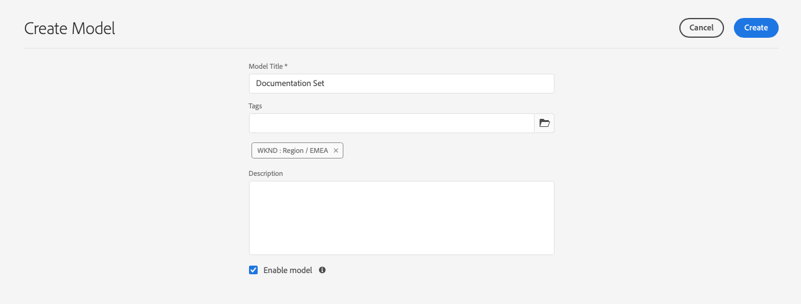

# Modeller för innehållsfragment {#content-fragment-models}

Modeller för innehållsfragment definierar innehållsstrukturen för dina [innehållsfragment](/help/assets/content-fragments/content-fragments.md).

Så här använder du modeller för innehållsfragment:

1. [Aktivera funktionen Content Fragment Model för instansen](/help/assets/content-fragments/content-fragments-configuration-browser.md)
1. [Skapa](#creating-a-content-fragment-model) och  [konfigurera](#defining-your-content-fragment-model) modeller för innehållsfragment
1. [Aktivera ](#enabling-disabling-a-content-fragment-model) modeller för innehållsfragment för användning när du skapar innehållsfragment för användning när du skapar innehållsfragment
1. [Tillåt dina modeller för innehållsfragment på ](#allowing-content-fragment-models-assets-folder) mapparna Resurser genom att konfigurera  **profiler**.

## Skapa en innehållsfragmentmodell {#creating-a-content-fragment-model}

1. Navigera till **Verktyg**, **Resurser** och öppna sedan **Modeller för innehållsfragment**.
1. Navigera till den mapp som passar din [konfiguration](/help/assets/content-fragments/content-fragments-configuration-browser.md).
1. Använd **Skapa** för att öppna guiden.

   >[!CAUTION]
   >
   >Om [användningen av innehållsfragmentmodeller inte har aktiverats](/help/assets/content-fragments/content-fragments-configuration-browser.md) är alternativet **Skapa** inte tillgängligt.

1. Ange **modelltitel**. Du kan också lägga till **taggar**, en **beskrivning** och välja **Aktivera modell** till [aktivera modellen](#enabling-disabling-a-content-fragment-model) om det behövs.

   

1. Använd **Skapa** för att spara den tomma modellen. Ett meddelande visar att åtgärden lyckades, du kan välja **Öppna** om du vill redigera modellen direkt eller **Klar** om du vill återgå till konsolen.

## Definiera innehållsfragmentmodellen {#defining-your-content-fragment-model}

Modellen för innehållsfragment definierar effektivt strukturen för de resulterande innehållsfragmenten med en **[datatyper](#data-types)**. Med modellredigeraren kan du lägga till instanser av datatyperna och sedan konfigurera dem för att skapa de obligatoriska fälten:

>[!CAUTION]
>
>Om du redigerar en befintlig innehållsfragmentmodell kan det påverka beroende fragment.

1. Navigera till **Verktyg**, **Resurser** och öppna sedan **Modeller för innehållsfragment**.

1. Navigera till mappen som innehåller innehållsfragmentmodellen.
1. Öppna önskad modell för **Redigera**; använd snabbåtgärden eller välj modell och sedan åtgärden från verktygsfältet.

   När du har öppnat modellredigeraren visas följande:

   * vänster: fält har redan definierats
   * höger: **Datatyper** som är tillgängliga för att skapa fält (och **egenskaper** som kan användas när fälten har skapats)

   >[!NOTE]
   >
   >När ett fält är **obligatoriskt** markeras den **etikett** som visas i den vänstra rutan med en asterisk (*****).

   

1. **Lägga till ett fält**

   * Dra en obligatorisk datatyp till önskad plats för ett fält:

      

   * När ett fält har lagts till i modellen visar den högra panelen de **egenskaper** som kan definieras för den aktuella datatypen. Här definierar du vad som krävs för fältet.

      * Många egenskaper är självförklarande. Mer information finns i [Egenskaper](#properties).
      * Om du skriver en **fältetikett** slutförs **egenskapsnamnet** automatiskt, om det är tomt, och den kan uppdateras manuellt senare.

      Till exempel:

      


1. **Ta bort ett fält**

   Markera det obligatoriska fältet och klicka/tryck sedan på papperskorgsikonen. Du ombeds bekräfta åtgärden.

   

1. Lägg till alla obligatoriska fält och definiera de relaterade egenskaperna efter behov. Till exempel:

   

1. Välj **Spara** om du vill behålla definitionen.

## Datatyper {#data-types}

Det finns ett urval datatyper som du kan använda för att definiera din modell:

* **Enkelradig text**
   * Lägg till ett eller flera fält på en textrad, maxlängden kan definieras
* **Flerradstext**
   * Ett textområde som kan vara RTF, Oformaterad text eller Markering
* **Siffra**
   * Lägg till ett eller flera numeriska fält
* **Boolesk**
   * Lägg till en boolesk kryssruta
* **Datum och tid**
   * Lägg till ett datum och/eller en tid
* **Uppräkning**
   * Lägga till en uppsättning kryssrutor, alternativknappar eller listrutefält
* **Taggar**
   * Tillåter fragmentförfattare att komma åt och markera taggområden
* **Innehållsreferens**
   * Hänvisningar till annat innehåll, oavsett typ. kan användas för att [skapa kapslat innehåll](#using-references-to-form-nested-content)
* **Fragmentreferens**
   * Hänvisar till andra innehållsfragment. kan användas för att [skapa kapslat innehåll](#using-references-to-form-nested-content)
   * Datatypen kan konfigureras så att fragmentförfattare kan:
      * Redigera det refererade fragmentet direkt.
      * Skapa ett nytt innehållsfragment, baserat på lämplig modell
* **JSON-objekt**
   * Gör att innehållsfragmentets författare kan ange JSON-syntax i motsvarande element i ett fragment.
      * För att AEM ska kunna lagra direkt JSON som du har kopierat/klistrat in från en annan tjänst.
      * JSON skickas och skrivs ut som JSON i GraphQL.
      * Innehåller JSON-syntaxmarkering, automatisk komplettering och felmarkering i innehållsfragmentredigeraren.

## Egenskaper {#properties}

Många egenskaper är självförklarande, för vissa egenskaper finns ytterligare information nedan:

* **Återge**
somDe olika alternativen för att realisera/återge fältet i ett fragment. Detta gör ofta att du kan ange om författaren ska se en enda instans av fältet eller om den ska kunna skapa flera instanser.

* **Field**
LabelAnge en 
**Fältetiketter** genererar automatiskt ett  **egenskapsnamn** som sedan kan uppdateras manuellt om det behövs.

* **Validering av**
Basic är tillgängligt med hjälp av mekanismer som  **** egenskapen Required. Vissa datatyper har ytterligare valideringsfält. Mer information finns i [Validering](#validation).

* För datatypen **Flerradig text** går det att definiera **standardtypen** som endera:

   * **RTF-text**
   * **Markdown**
   * **Oformaterad text**

   Om inget anges används standardvärdet **RTF** för det här fältet.

   Om du ändrar **standardtypen** i en innehållsfragmentmodell börjar detta bara gälla för ett befintligt, relaterat innehållsfragment efter att fragmentet har öppnats i redigeraren och sparats.

* **Unikt**
innehåll (för det specifika fältet) måste vara unikt för alla innehållsfragment som skapas från den aktuella modellen.

   Detta används för att säkerställa att innehållsförfattare inte kan upprepa innehåll som redan har lagts till i ett annat fragment av samma modell.

   Ett **enradigt textfält** med namnet `Country` i modellen för innehållsfragment kan till exempel inte ha värdet `Japan` i två beroende innehållsfragment. En varning kommer att skickas när ett försök görs att utföra den andra instansen.

   >[!NOTE]
   Unikitet säkerställs per språkrot.

   >[!NOTE]
   Variationer kan ha samma *unika*-värde som varianter av samma fragment, men inte samma värde som används i andra variationer av fragment.

* ****
TranslatableMarkera kryssrutan &quot;Translatable&quot; för ett fält i CF-modellredigeraren

   * Kontrollera att fältets egenskapsnamn har lagts till i översättningskonfiguration, kontext `/content/dam/<tenant>`, om det inte redan finns.
   * För GraphQL: Ange en `<translatable>`-egenskap i fältet Innehållsfragment till `yes`, så att GraphQL-frågefilter tillåts för JSON-utdata med endast översättningsbart innehåll.

* Mer information om den specifika datatypen och dess egenskaper finns i **[Fragmentreferens (kapslade fragment)](#fragment-reference-nested-fragments)**.

## Validering {#validation}

Olika datatyper kan nu definiera valideringskrav för när innehåll anges i det resulterande fragmentet:

* **Enkelradig text**
   * Jämför med ett fördefinierat regex.
* **Siffra**
   * Kontrollera om det finns specifika värden.
* **Innehållsreferens**
   * Testa för specifika typer av innehåll.
   * Det går endast att referera till resurser med en angiven filstorlek eller mindre.
   * Det går endast att referera till bilder inom ett fördefinierat intervall med bredd och/eller höjd (i pixlar).
* **Fragmentreferens**
   * Testa om det finns en specifik innehållsfragmentmodell.

<!--
  * Only predefined file types can be referenced.
  * No more than the predefined number of assets can be referenced. 
  * No more than the predefined number of fragments can be referenced.
-->

## Använda referenser till kapslat innehåll {#using-references-to-form-nested-content}

Innehållsfragment kan skapa kapslat innehåll med någon av följande datatyper:

* **[Innehållsreferens](#content-reference)**
   * ger en enkel referens till annat innehåll, av alla typer.
   * Kan konfigureras för en eller flera referenser (i det resulterande fragmentet).

* **[Fragmentreferens](#fragment-reference-nested-fragments)**  (kapslade fragment)
   * Refererar till andra fragment, beroende på vilka specifika modeller som anges.
   * Gör att du kan ta med/hämta strukturerade data.

      >[!NOTE]
      Den här metoden är av särskilt intresse i samband med [leverans av Headless-innehåll med innehållsfragment med GraphQL](/help/assets/content-fragments/content-fragments-graphql.md).
   * Kan konfigureras för en eller flera referenser (i det resulterande fragmentet).

>[!NOTE]
AEM har ett upprepningsskydd för:
* Innehållsreferenser
Detta förhindrar att användaren lägger till en referens till det aktuella fragmentet. Detta kan leda till en tom dialogruta för fragmentreferensväljaren.

* Fragmentreferenser i GraphQL
Om du skapar en djup fråga som returnerar flera innehållsfragment som refereras av varandra, returneras null vid den första förekomsten.


### Innehållsreferens {#content-reference}

Med innehållsreferensen kan du återge innehåll från en annan källa; till exempel bild- eller innehållsfragment.

Förutom standardegenskaper kan du ange:

* **Rotsökväg** för refererat innehåll.
* De innehållstyper som kan refereras.
* Begränsningar för filstorlekar.
* Bildbegränsningar.
   <!-- Check screenshot - might need update -->
   

### Fragmentreferens (kapslade fragment) {#fragment-reference-nested-fragments}

Fragmentreferensen refererar till ett eller flera innehållsfragment. Den här funktionen är särskilt intressant när du hämtar innehåll som ska användas i appen, eftersom den gör det möjligt att hämta strukturerade data med flera lager.

Till exempel:

* En modell som definierar detaljer för en anställd. bland annat följande:
   * En referens till modellen som definierar arbetsgivaren (företaget)

```xml
type EmployeeModel {
    name: String
    firstName: String
    company: CompanyModel
}

type CompanyModel {
    name: String
    street: String
    city: String
}
```

>[!NOTE]
Detta är särskilt intressant i samband med [Headless Content Delivery med hjälp av Content Fragments with GraphQL](/help/assets/content-fragments/content-fragments-graphql.md).

Förutom standardegenskaper kan du definiera:

* **Återge som**:

   * **multifield**  - fragmentförfattaren kan skapa flera, enskilda, referenser

   * **fragmentreferens**  - gör att fragmentförfattaren kan välja en enskild referens till ett fragment

* **Du kan välja**
flera modeller av modelltyp. När du redigerar innehållsfragmentet måste alla refererade fragment ha skapats med dessa modeller.

* **Rotsökväg**
Anger en rotsökväg för alla fragment som refereras.

* **Tillåt skapande av fragment**

   Detta gör att fragmentförfattaren kan skapa ett nytt fragment baserat på lämplig modell.

   * **fragmentreferenssammansatt**  - gör att fragmentförfattaren kan skapa en sammansatt bild genom att välja flera fragment

   <!-- Check screenshot - might need update -->
   

>[!NOTE]
Det finns en mekanism för återkommande skydd. Användaren kan inte välja det aktuella innehållsfragmentet i fragmentreferensen. Detta kan leda till en tom dialogruta för fragmentreferensväljaren.
Det finns också ett upprepningsskydd för fragmentreferenser i GraphQL. Om du skapar en djup fråga i två innehållsfragment som refererar till varandra returneras null.

## Aktivera eller inaktivera en innehållsfragmentmodell {#enabling-disabling-a-content-fragment-model}

För fullständig kontroll över användningen av dina modeller för innehållsfragment har de en status som du kan ange.

### Aktivera en innehållsfragmentmodell {#enabling-a-content-fragment-model}

När en modell har skapats måste den aktiveras så att den:

* Kan markeras när du skapar ett nytt innehållsfragment.
* Kan refereras inifrån en Content Fragment-modell.
* Finns för GraphQL, så att schemat genereras.

Så här aktiverar du en modell som har flaggats som antingen:

* **Utkast** : mew (aldrig aktiverad).
* **Inaktiverad** : har specifikt inaktiverats.

Du använder alternativet **Aktivera** från antingen:

* Det övre verktygsfältet när den obligatoriska modellen är markerad.
* Motsvarande snabbåtgärd (mouse-over the required Model).


### Inaktivera en innehållsfragmentmodell {#disabling-a-content-fragment-model}

En modell kan också inaktiveras så att:

* Modellen är inte längre tillgänglig som grund för att skapa *nya* innehållsfragment.
* Men:
   * GraphQL-schemat genereras och är fortfarande frågningsbart (för att inte påverka JSON API).
   * Alla innehållsfragment som är baserade på modellen kan fortfarande efterfrågas och returneras från GraphQL-slutpunkten.
* Det går inte att referera till modellen längre, men befintliga referenser behålls orörda och kan fortfarande frågas och returneras från GraphQL-slutpunkten.

Om du vill inaktivera en modell som är flaggad som **Aktiverad** använder du alternativet **Inaktivera** från antingen:

* Det övre verktygsfältet när den obligatoriska modellen är markerad.
* Motsvarande snabbåtgärd (mouse-over the required Model).


## Tillåta modeller för innehållsfragment i resursmappen {#allowing-content-fragment-models-assets-folder}

Om du vill implementera innehållsstyrning kan du konfigurera **principer** i resursmappen för att styra vilka innehållsfragmentmodeller som tillåts för att skapa fragment i den mappen.

>[!NOTE]
Mekanismen liknar [att tillåta sidmallar](/help/sites-cloud/authoring/features/templates.md#allowing-a-template-author) för en sida och dess underordnade sidor i en sidas avancerade egenskaper.

Så här konfigurerar du **principer** för **Tillåtna modeller för innehållsfragment**:

1. Navigera och öppna **Egenskaper** för mappen Resurser.

1. Öppna fliken **Profiler** där du kan konfigurera:

   * **Ärvs från`<folder>`**

      Profiler ärvs automatiskt när nya underordnade mappar skapas; principen kan konfigureras om (och arvet brytas) om undermapparna måste tillåta modeller som skiljer sig från den överordnade mappen.

   * **Tillåtna modeller för innehållsfragment efter sökväg**

      Flera modeller kan tillåtas.

   * **Tillåtna modeller för innehållsfragment efter tagg**

      Flera modeller kan tillåtas.
   

1. **** Spara ändringar.

De Content Fragment-modeller som tillåts för en mapp löses enligt följande:
* **Profiler** för **Tillåtna modeller för innehållsfragment**.
* Om den är tom kan du försöka identifiera principen med arvsreglerna.
* Om arvskedjan inte ger något resultat ska du titta på **Cloud Servicens**-konfigurationen för den mappen (även först direkt och sedan via arv).
* Om inget av ovanstående ger några resultat finns det inga tillåtna modeller för den mappen.

## Ta bort en innehållsfragmentmodell {#deleting-a-content-fragment-model}

>[!CAUTION]
Om du tar bort en innehållsfragmentmodell kan det påverka beroende fragment.

Så här tar du bort en innehållsfragmentmodell:

1. Navigera till **Verktyg**, **Resurser** och öppna sedan **Modeller för innehållsfragment**.

1. Navigera till mappen som innehåller innehållsfragmentmodellen.
1. Markera modellen följt av **Ta bort** från verktygsfältet.

   >[!NOTE]
   Om det refereras till modellen visas en varning. Vidta lämpliga åtgärder.

## Publicera en innehållsfragmentmodell {#publishing-a-content-fragment-model}

Modeller för innehållsfragment måste publiceras när/innan beroende innehållsfragment publiceras.

Så här publicerar du en innehållsfragmentmodell:

1. Navigera till **Verktyg**, **Resurser** och öppna sedan **Modeller för innehållsfragment**.

1. Navigera till mappen som innehåller innehållsfragmentmodellen.
1. Välj modell följt av **Publicera** i verktygsfältet.
Publiceringsstatusen anges i konsolen.

   >[!NOTE]
   Om du publicerar ett innehållsfragment för vilket modellen ännu inte har publicerats, visas detta i en urvalslista och modellen publiceras med fragmentet.

## Avpublicera en innehållsfragmentmodell {#unpublishing-a-content-fragment-model}

Modeller för innehållsfragment kan avpubliceras om de inte refereras av några fragment.

Så här avpublicerar du en innehållsfragmentmodell:

1. Navigera till **Verktyg**, **Resurser** och öppna sedan **Modeller för innehållsfragment**.

1. Navigera till mappen som innehåller innehållsfragmentmodellen.
1. Markera modellen, följt av **Avpublicera** från verktygsfältet.
Publiceringsstatusen anges i konsolen.
