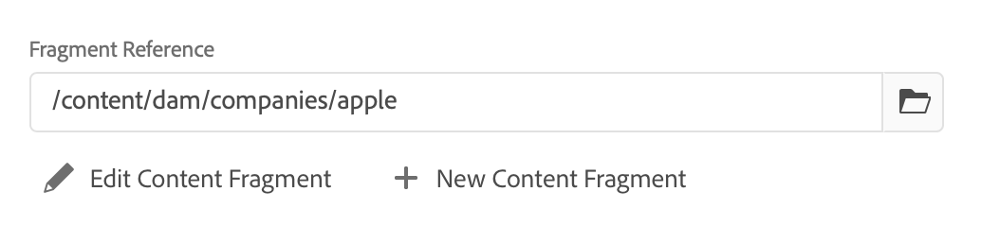
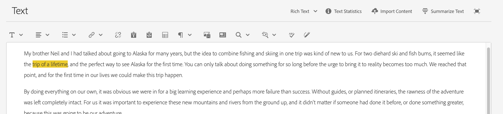
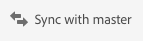

# Variationer – redigera innehållsfragment{#variations-authoring-fragment-content}

 Variationer är en viktig egenskap i AEM innehållsfragment, eftersom de gör det möjligt att skapa och redigera kopior av det överordnad innehållet för användning i specifika kanaler och/eller scenarier, vilket gör headless-innehållsleverans ännu mer flexibel.

På fliken **Variationer** kan du:

* [Ange ](#authoring-your-content) innehållet för fragmentet,
* [Skapa och hantera ](#managing-variations) variationer av  **** Mastercontent,

Utför en rad andra åtgärder beroende på vilken datatyp som redigeras. till exempel:

* [Infoga visuella resurser i fragmentet](#inserting-assets-into-your-fragment)  (bilder)

* Välj mellan [RTF](#rich-text), [Oformaterad text](#plain-text) och [Markering](#markdown) för redigering

* [Överför innehåll](#uploading-content)

* [Visa nyckelstatistik](#viewing-key-statistics)  (om flerradig text)

* [Sammanfatta text](#summarizing-text)

* [Synkronisera varianter med Överordnad innehåll](#synchronizing-with-master)

>[!CAUTION]
>
>När ett fragment har publicerats och/eller refererats visar AEM en varning när en författare öppnar fragmentet för redigering igen. Detta är för att varna för att ändringar i avsnittet även påverkar de refererade sidorna.

## Redigera ditt innehåll {#authoring-your-content}

När du öppnar ditt innehållsfragment för redigering är fliken **Variationer** öppen som standard. Här kan du skapa innehållet, för Överordnad eller andra varianter som du har. Det strukturerade fragmentet innehåller olika fält, av olika datatyper, som har definierats i innehållsmodellen.

Till exempel:

Du kan:

* gör redigeringar direkt på fliken **Variationer**

   * varje datatyp har olika redigeringsalternativ

* för **Flerradiga textfält** kan du även öppna fullskärmsredigeraren[för att:](#full-screen-editor)

   * välj [Format](#formats)
   * se fler redigeringsalternativ (för [RTF](#rich-text)-format)
   * få åtkomst till ett intervall med [åtgärder](#actions)

* För **fragmentreferensfält** kan alternativet **[Redigera innehållsfragment](#fragment-references-edit-content-fragment)** vara tillgängligt, beroende på modelldefinitionen.

### Helskärmsredigeraren {#full-screen-editor}

När du redigerar ett textfält med flera rader kan du öppna redigeraren i helskärmsläge; tryck eller klicka i den faktiska texten och välj sedan följande åtgärdsikon:

Då öppnas textredigeraren i helskärmsläge:

Textredigeraren i helskärmsläge innehåller:

* Åtkomst till olika [åtgärder](#actions)
* Beroende på [format](#formats), ytterligare formateringsalternativ ([RTF](#rich-text))

### Åtgärder {#actions}

Följande åtgärder är också tillgängliga (för alla [format](#formats)) när helskärmsredigeraren (d.v.s. flerradig text) är öppen:

* Välj [format](#formats) ([RTF](#rich-text), [Oformaterad text,](#plain-text) [Markering](#markdown))

* [Överför innehåll](#uploading-content)

* [Visa textstatistik](#viewing-key-statistics)

* [Synkronisera med Överordnad](#synchronizing-with-master)  (när du redigerar en variant)

* [Sammanfatta text](#summarizing-text)

### Format {#formats}

Vilka alternativ du kan använda för att redigera text med flera rader beror på vilket format du har valt:

* [RTF-text](#rich-text)
* [Oformaterad text](#plain-text)
* [Markdown](#markdown)

Formatet kan väljas när helskärmsredigeraren används.

### RTF-text {#rich-text}

Med textredigering kan du formatera:

* Fet
* Kursiv
* Understrykning
* Justering: vänster, mitten, höger
* Punktlista
* Numrerad lista
* Indrag: öka, minska
* Skapa/bryt hyperlänkar
* Klistra in text/text från Word
* Infoga en tabell
* Styckeformat: Stycke, Rubrik 1/2/3
* [Infoga resurs](#inserting-assets-into-your-fragment)
* Öppna helskärmsredigeraren, där följande formateringsalternativ är tillgängliga:
   * Sökning
   * Sök/ersätt
   * Stavningskontroll
   * [Anteckningar](/help/assets/content-fragments/content-fragments-variations.md#annotating-a-content-fragment)
* [Infoga innehållsfragment](#inserting-content-fragment-into-your-fragment); som är tillgängliga när  **textfältet för** flera rader har konfigurerats med  **Tillåt fragmentreferens**.

[åtgärderna](#actions) är även tillgängliga från helskärmsredigeraren.

### Oformaterad text {#plain-text}

Med oformaterad text kan du snabbt lägga in innehåll utan formaterings- eller markeringsinformation. Du kan även öppna fullskärmsredigeraren för ytterligare [åtgärder](#actions).

>[!CAUTION]
>
>Om du väljer **Oformaterad text** kan du förlora formatering, markdown-kod och/eller resurser som du har infogat i **RTF** eller **Markdown-kod**.

### Markdown {#markdown}

>[!NOTE]
>
>Mer information finns i dokumentationen för [Markdown](/help/assets/content-fragments/content-fragments-markdown.md).

På så sätt kan du formatera texten med hjälp av markeringar. Du kan definiera:

* Rubriker
* Stycken och radbrytningar
* Länkar
* Bilder
* Blockcitat
* Listor
* Betoning
* Kodblock
* Backslash Escapes

Du kan även öppna fullskärmsredigeraren för ytterligare [åtgärder](#actions).

>[!CAUTION]
>
>Om du växlar mellan **RTF** och **Markdown-kod** kan du få oväntade effekter med Blockcitattecken och Kodblock, eftersom dessa båda format kan hanteras på olika sätt.

### Fragmentreferenser {#fragment-references}

Om innehållsfragmentmodellen innehåller fragmentreferenser kan fragmentförfattarna ha ytterligare alternativ:

* [Redigera innehållsfragment](#fragment-references-edit-content-fragment)
* [Nytt innehållsfragment](#fragment-references-new-content-fragment)

#### Redigera innehållsfragment {#fragment-references-edit-content-fragment}

Alternativet **Redigera innehållsfragment** öppnar det fragmentet på en ny redigeringsflik (inom samma webbläsarflik).

Om du väljer den ursprungliga fliken igen (till exempel **Little Pony Inc.**) stängs den sekundära fliken (i det här fallet **Adam Smith**).

#### Nytt innehållsfragment {#fragment-references-new-content-fragment}

Med alternativet **Nytt innehållsfragment** kan du skapa ett helt nytt fragment. För att uppnå detta öppnas en variant av guiden Skapa innehållsfragment i redigeraren.

Sedan kan du skapa ett nytt fragment genom att:

1. Navigera till och markera önskad mapp.
1. Välj **Nästa**.
1. Ange egenskaper. till exempel **Titel**.
1. Välj **Skapa**.
1. Äntligen:
   1. **** Donewill return (to the original fragment) and reference the new fragment.
   1. **Öppna** refererar till det nya fragmentet samt öppnar det nya fragmentet, för redigering, på en ny flik i webbläsaren.

### Visar nyckelstatistik {#viewing-key-statistics}

När helskärmsredigeraren är öppen visar åtgärden **Textstatistik** information om texten.

Till exempel:

### Överför innehåll {#uploading-content}

För att underlätta redigeringen av innehållsfragment kan du överföra text, förberedd i en extern redigerare och lägga till den direkt i fragmentet.

### Sammanfatta text {#summarizing-text}

Att sammanfatta text är utformat för att hjälpa användare att minska längden på texten till ett fördefinierat antal ord, samtidigt som man behåller huvudpunkterna och den övergripande innebörden.

>[!NOTE]
>
>På en mer teknisk nivå behåller systemet meningarna som det klassificerar som att det ger det *bästa förhållandet mellan informationstäthet och unikhet* enligt specifika algoritmer.

>[!CAUTION]
>
>Innehållsfragmentet måste ha en giltig språkmapp (ISO-kod) som överordnad. används för att fastställa vilken språkmodell som ska användas.
>
>Till exempel `en/` som i följande sökväg:
>
>  `/content/dam/my-brand/en/path-down/my-content-fragment`

>[!CAUTION]
Engelska finns i körklart skick.
Andra språk är tillgängliga som språkmodellpaket från paketresurs:
* [Franska (fr)](https://www.adobeaemcloud.com/content/marketplace/marketplaceProxy.html?packagePath=/content/companies/public/adobe/packages/cq630/product/smartcontent-model-fr)
* [German (de)](https://www.adobeaemcloud.com/content/marketplace/marketplaceProxy.html?packagePath=/content/companies/public/adobe/packages/cq630/product/smartcontent-model-de)
* [Italienska (it)](https://www.adobeaemcloud.com/content/marketplace/marketplaceProxy.html?packagePath=/content/companies/public/adobe/packages/cq630/product/smartcontent-model-it)
* [Spanska (es)](https://www.adobeaemcloud.com/content/marketplace/marketplaceProxy.html?packagePath=/content/companies/public/adobe/packages/cq630/product/smartcontent-model-es)

1. Välj **Överordnad** eller önskad variant.
1. Öppna fullskärmsredigeraren.

1. Välj **Sammanfatta text** i verktygsfältet.

   

1. Ange målantalet ord och välj **Start**:
1. Den ursprungliga texten visas sida vid sida med den föreslagna sammanfattningen:

   * Alla meningar som ska tas bort markeras med rött, med genomstrykning.
   * Klicka på en markerad mening om du vill behålla den i det sammanfattande innehållet.
   * Klicka på en mening som inte är markerad för att ta bort den.

1. Välj **Sammanfattning** för att bekräfta ändringarna.

1. Den ursprungliga texten visas sida vid sida med den föreslagna sammanfattningen:

   * Alla meningar som ska tas bort markeras med rött, med genomstrykning.
   * Klicka på en markerad mening om du vill behålla den i det sammanfattande innehållet.
   * Klicka på en mening som inte är markerad för att ta bort den.
   * Sammanfattningsstatistiken visas: **Faktiskt** och **Mål**-
   * Du kan **förhandsgranska** ändringarna.

   

### Kommentera ett innehållsfragment {#annotating-a-content-fragment}

Så här kommenterar du ett fragment:

1. Välj **Överordnad** eller önskad variant.

1. Öppna fullskärmsredigeraren.

1. Ikonen **Anteckning** är tillgänglig i det övre verktygsfältet. Du kan markera text om det behövs.

   

1. En dialogruta öppnas. Här kan du ange din anteckning.

   

1. Välj **Använd** i dialogrutan.

   

   Om anteckningen tillämpades på den markerade texten förblir den texten markerad.

   

1. Stäng helskärmsredigeraren, anteckningarna är fortfarande markerade. Om du väljer det här alternativet öppnas en dialogruta där du kan redigera kommentaren ytterligare.

1. Välj **Spara**.

1. Stäng helskärmsredigeraren, anteckningarna är fortfarande markerade. Om du väljer det här alternativet öppnas en dialogruta där du kan redigera kommentaren ytterligare.

   

### Visa, redigera, ta bort anteckningar {#viewing-editing-deleting-annotations}

Anteckningar:

* Indikeras av markeringen på texten, både i helskärmsläge och i normalt läge i redigeraren. Du kan sedan visa, redigera och/eller ta bort all information i en anteckning genom att klicka på den markerade texten, som öppnar dialogrutan igen.

   >[!NOTE]
   En nedrullningsbar väljare tillhandahålls om flera anteckningar har tillämpats på ett textstycke.

* När du tar bort hela texten som kommentaren användes på tas även anteckningen bort.

* Kan listas och tas bort genom att välja fliken **Anteckningar** i fragmentredigeraren.

   

* Kan visas och tas bort i [tidslinjen](/help/assets/content-fragments/content-fragments-managing.md#timeline-for-content-fragments) för det valda fragmentet.

### Infoga resurser i fragment {#inserting-assets-into-your-fragment}

Om du vill skapa innehållsfragment enklare kan du lägga till [resurser](/help/assets/manage-digital-assets.md) (bilder) direkt i fragmentet.

De läggs till i fragmentets styckesekvens utan formatering. formatering kan göras när [fragmentet används/refereras på en sida](/help/sites-cloud/authoring/fundamentals/content-fragments.md).

>[!CAUTION]
Dessa resurser kan inte flyttas eller tas bort på en referenssida. Detta måste göras i fragmentredigeraren.
Formatering av resursen (t.ex. storlek) måste dock göras i [sidredigeraren](/help/sites-cloud/authoring/fundamentals/content-fragments.md). Representationen av resursen i fragmentredigeraren är endast till för att skapa innehållsflödet.

>[!NOTE]
Det finns olika metoder för att lägga till [bilder](/help/assets/content-fragments/content-fragments.md#fragments-with-visual-assets) till fragmentet och/eller sidan.

1. Placera markören på den plats där du vill lägga till bilden.
1. Använd ikonen **Infoga resurs** för att öppna sökdialogrutan.

   

1. I dialogrutan kan du antingen:

   * navigera till den nödvändiga resursen i DAM
   * söka efter resursen i DAM

   Välj önskad resurs genom att klicka på miniatyrbilden.

1. Använd **Välj** för att lägga till resursen i innehållsfragmentets styckesystem på den aktuella platsen.

   >[!CAUTION]
   Om du efter att ha lagt till en resurs ändrar formatet till:
   * **Oformaterad text**: Resursen kommer att förloras helt från fragmentet.
   * **Markdown-kod**: Resursen visas inte, men finns fortfarande kvar när du återgår till **RTF**.

### Infoga ett innehållsfragment i fragmentet {#inserting-content-fragment-into-your-fragment}

Om du vill skapa innehållsfragment enklare kan du även lägga till ytterligare ett innehållsfragment i fragmentet.

De kommer att läggas till som en referens på din aktuella plats i fragmentet.

>[!NOTE]
Det här alternativet är tillgängligt när din **flerradstext** har konfigurerats med **Tillåt fragmentreferens**.

>[!CAUTION]
Dessa resurser kan inte flyttas eller tas bort på en referenssida. Detta måste göras i fragmentredigeraren.
Formatering av resursen (t.ex. storlek) måste dock göras i [sidredigeraren](/help/sites-cloud/authoring/fundamentals/content-fragments.md). Representationen av resursen i fragmentredigeraren är endast till för att skapa innehållsflödet.

>[!NOTE]
Det finns olika metoder för att lägga till [bilder](/help/assets/content-fragments/content-fragments.md#fragments-with-visual-assets) till fragmentet och/eller sidan.

1. Placera markören på den plats där du vill lägga till fragmentet.
1. Använd ikonen **Infoga innehållsfragment** för att öppna sökdialogrutan.

   

1. I dialogrutan kan du antingen:

   * navigera till det nödvändiga fragmentet i resursmappen
   * sök efter fragmentet

   När du har hittat fragmentet väljer du det genom att klicka på miniatyrbilden.

1. Använd **Välj** om du vill lägga till en referens till det valda innehållsfragmentet i det aktuella innehållsfragmentet (på den aktuella platsen).

   >[!CAUTION]
   Om du efter att ha lagt till en referens till ett annat fragment ändrar formatet till:
   * **Oformaterad text**: referensen tas bort helt från fragmentet.
   * **Markering**: referensen kvarstår.

## Hantera variationer {#managing-variations}

### Skapa en variant {#creating-a-variation}

Med variationer kan du ta **Överordnad**-innehållet och ändra det efter syfte (om det behövs).

Så här skapar du en ny variant:

1. Öppna fragmentet och se till att sidopanelen är synlig.
1. Välj **Variationer** i ikonfältet på sidpanelen.
1. Välj **Skapa variant**.
1. En dialogruta öppnas där du anger **titel** och **beskrivning** för den nya varianten.
1. Välj **Lägg till**. **Fragmentmastern** kopieras till den nya varianten, som nu är öppen för [redigering](#editing-a-variation).

   >[!NOTE]
   När du skapar en ny variant är det alltid **Överordnad** som kopieras, inte varianten som är öppen.

### Redigera en variant {#editing-a-variation}

Du kan ändra variantinnehållet efter antingen:

* [Skapa din variation](#creating-a-variation).
* Öppna ett befintligt fragment och välj sedan önskad variation på sidopanelen.

### Byta namn på en variant {#renaming-a-variation}

Så här byter du namn på en befintlig variant:

1. Öppna fragmentet och välj **Variationer** på sidpanelen.
1. Välj önskad variant.
1. Välj **Byt namn** i listrutan **Åtgärder**.

1. Ange den nya **titeln** och/eller **beskrivningen** i dialogrutan som visas.

1. Bekräfta åtgärden **Byt namn**.

>[!NOTE]
Detta påverkar bara variationen **Titel**.

### Tar bort en variant {#deleting-a-variation}

Så här tar du bort en befintlig variant:

1. Öppna fragmentet och välj **Variationer** på sidpanelen.
1. Välj önskad variant.
1. Välj **Ta bort** i listrutan **Åtgärder**.

1. Bekräfta åtgärden **Ta bort** i dialogrutan.

>[!NOTE]
Du kan inte ta bort **Överordnad**.

### Synkroniserar med Överordnad {#synchronizing-with-master}

**Masterfilen är en** integrerad del av ett innehållsavdrag och innehåller per definition den överordnad kopian av innehållet, medan varianterna innehåller de individuella uppdaterade och anpassade versionerna av det innehållet. När Överordnad uppdateras är det möjligt att dessa ändringar också är relevanta för variationerna och därför måste spridas till dem.

När du redigerar en variant har du tillgång till åtgärden för att synkronisera det aktuella elementet i variationen med Överordnad. På så sätt kan du automatiskt kopiera ändringar som gjorts Överordnad till den önskade variationen.

>[!CAUTION]
Synkronisering är bara tillgängligt för att kopiera ändringar *från **mastern**till varianten*.
Endast det aktuella elementet i variationen kommer att synkroniseras.
Synkronisering fungerar bara på datatypen **Flerradig text**.
Du kan inte överföra ändringar *från en variant till **mastern***.

1. Öppna ditt innehållsfragment i fragmentredigeraren. Kontrollera att **Överordnad** har redigerats.

1. Välj en specifik variant och sedan lämplig synkroniseringsåtgärd från antingen:

   * den nedrullningsbara listrutan **Åtgärder** - **Synkronisera aktuellt element med överordnad**

      

   * verktygsfältet i fullskärmsredigeraren - **Synkronisera med överordnad**

      

1. Överordnad och variationen visas sida vid sida:

   * grönt anger innehåll som lagts till (i varianten)
   * rött anger att innehållet har tagits bort (från varianten)
   * blå anger ersatt text

   

1. Välj **Synkronisera**. Variationen uppdateras och visas.
