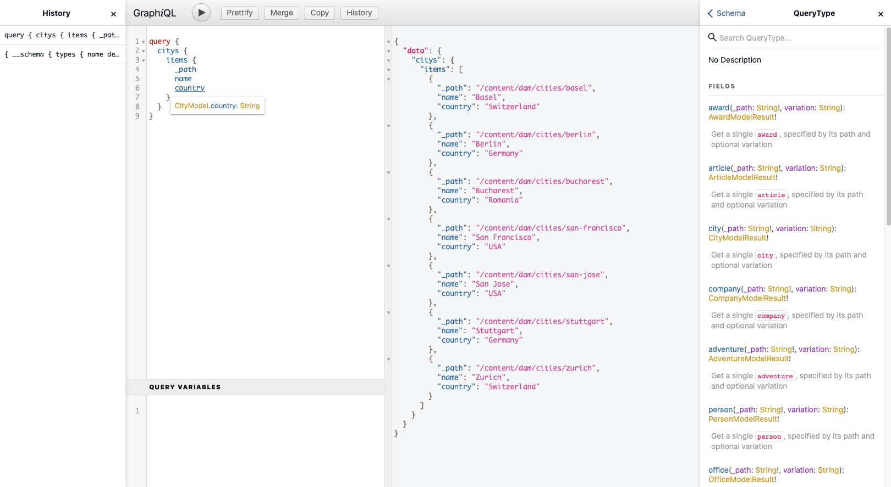
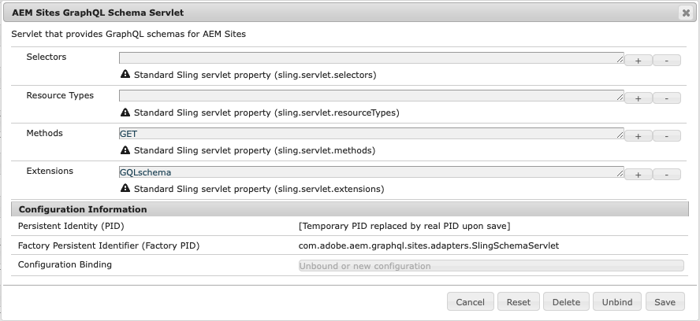

# AEM GraphQL API för användning med innehållsfragment {#graphql-api-for-use-with-content-fragments}

>[!CAUTION]
>
>AEM GraphQL API, för Content Fragment Delivery, släpps i början av 2021.
>
>Den relaterade dokumentationen är redan tillgänglig för förhandsgranskning.

Adobe Experience Manager som en Cloud Service (AEM) GraphQL API som används med innehållsfragment är till stor del baserat på den öppna källkods-API:n GraphQL.

Genom att använda GraphQL API i AEM kan du effektivt leverera innehållsfragment till JavaScript-klienter i Headless CMS-implementeringar:

* Undvika iterativa API-begäranden som REST,
* se till att leveransen begränsas till de specifika kraven,
* Det är möjligt att leverera exakt det som behövs för återgivning som svar på en enda API-fråga.

## GraphQL API {#graphql-api}

*&quot;GraphQL är ett datameddelande och en specifikation som utvecklats internt av Facebook 2012 innan den öppnats offentligt 2015. Det är ett alternativ till REST-baserade arkitekturer i syfte att öka utvecklarnas produktivitet och minimera mängden data som överförs. GraphQL används i produktion av hundratals organisationer av alla storlekar...&quot;* Se [GraphQL Foundation](https://foundation.graphql.org/).

Mer information om GraphQL API finns i följande avsnitt (bland många andra resurser):

* Vid [graphql.org](https://graphql.org):

   * [Introduktion till GraphQL](https://graphql.org/learn)

   * [GraphQL-specifikationen](http://spec.graphql.org/)

* Vid [graphql.com](https://graphql.com):

   * [Stödlinjer](https://www.graphql.com/guides/)

   * [Tutorials](https://www.graphql.com/tutorials/)

   * [Fallstudier](https://www.graphql.com/case-studies/)

GraphQL för AEM är baserad på standardbiblioteket GraphQL Java Library. Se:

* [graphQL.org - Java](https://graphql.org/code/#java)

* [GraphQL Java vid GitHub](https://github.com/graphql-java)

## GraphiQL-gränssnitt {#graphiql-interface}

AEM Graph API innehåller en implementering av standardgränssnittet [GraphiQL](https://graphql.org/learn/serving-over-http/#graphiql). På så sätt kan du direkt mata in och testa frågor.

Till exempel:

* `http://localhost:4502/content/graphiql.html`

Detta innehåller funktioner som syntaxmarkering, automatisk komplettering, autoförslag, samt historik och onlinedokumentation:



## Användningsexempel för redigerings- och publiceringsmiljöer {#use-cases-author-publish-environments}

Användningsexempel kan bero på vilken typ av AEM som en Cloud Service-miljö:

* Publiceringsmiljö. används för att:
   * Frågedata för JS-program (standardfall)

* Författarmiljö; används för att:
   * Fråga efter data för&quot;innehållshanteringssyften&quot;:
      * GraphQL i AEM som en Cloud Service är för närvarande ett skrivskyddat API.
      * REST API kan användas för CR(u)D-åtgärder.

## Schemagenerering {#schema-generation}

GraphQL är ett starkt typbestämt API, vilket innebär att data måste vara tydligt strukturerade och ordnade efter typ.

GraphQL-specifikationen innehåller en serie riktlinjer för hur du skapar ett robust API för att förhöra data i en viss instans. För att göra detta måste klienten hämta [schemat](#schema-generation), som innehåller alla typer som krävs för en fråga.

För innehållsfragment baseras GraphQL-scheman (struktur och typer) på [modeller för innehållsfragment](/help/assets/content-fragments/content-fragments-models.md) och deras datatyper.

Om en användare till exempel har skapat en innehållsfragmentmodell med namnet `Article`, genererar AEM objektet `article` som är av typen `ArticleModel`. Fälten i den här typen motsvarar fälten och datatyperna som definieras i modellen.

1. En innehållsfragmentmodell:

   

1. Motsvarande GraphQL-schema (utdata från automatisk GraphiQL-dokumentation):
   

   Detta visar att den genererade typen `ArticleModel` innehåller flera [fält](#fields).

   * Tre av dem har kontrollerats av användaren: `author`, `main` och `linked_article`.

   * De andra fälten lades till automatiskt av AEM och representerar användbara metoder för att tillhandahålla information om ett visst innehållsfragment. i det här exemplet är `_path`, `_metadata`, `_variations`. Dessa [hjälpfält](#helper-fields) har markerats med en föregående `_` för att skilja mellan vad som har definierats av användaren och vad som har genererats automatiskt.

1. När en användare har skapat ett innehållsfragment baserat på artikelmodellen kan det sedan förfrågas via GraphQL. Se till exempel [Exempelfrågor](/help/assets/content-fragments/content-fragments-graphql-samples.md#graphql-sample-queries) (baserat på en [innehållsfragmentstruktur för GraphQL](/help/assets/content-fragments/content-fragments-graphql-samples.md#content-fragment-structure-graphql)).

Schemat är flexibelt i GraphQL för AEM. Det innebär att den genereras automatiskt varje gång en innehållsfragmentmodell skapas, uppdateras eller tas bort. Cacheminnen för dataschemat uppdateras också när du uppdaterar en innehållsfragmentmodell.

Tjänsten Sites GraphQL lyssnar (i bakgrunden) efter ändringar som gjorts i en innehållsfragmentmodell. När uppdateringar upptäcks återskapas endast den delen av schemat. Denna optimering sparar tid och ger stabilitet.

Om du till exempel:

1. Installera ett paket som innehåller `Content-Fragment-Model-1` och `Content-Fragment-Model-2`:

   1. GraphQL-typer för `Model-1` och `Model-2` genereras.

1. Ändra sedan `Content-Fragment-Model-2`:

   1. Endast GraphQL-typen `Model-2` uppdateras.

   1. `Model-1` kommer att vara detsamma.

>[!NOTE]
>
>Detta är viktigt att notera om du vill göra satsvisa uppdateringar på modeller för innehållsfragment via REST-API:t, eller på annat sätt.

Schemat hanteras via samma slutpunkt som GraphQL-frågorna, med klienten som hanterar det faktum att schemat anropas med tillägget `GQLschema`. Om du till exempel utför en enkel `GET`-begäran på `/content/graphql/endpoint.GQLschema` resulterar det i utdata från schemat med innehållstypen: `text/x-graphql-schema;charset=iso-8859-1`.

## fält {#fields}

Inom schemat finns det enskilda fält av två baskategorier:

* Fält som du genererar.

   Ett urval av [fälttyper](#field-types) används för att skapa fält baserat på hur du konfigurerar innehållsfragmentmodellen. Fältnamnen hämtas från fältet **Egenskapsnamn** i **datatypen**.

   * Det finns också egenskapen **Återge som** som ska beaktas, eftersom användare kan konfigurera vissa datatyper; t.ex. som en enda rad eller som ett multifält.

* GraphQL för AEM genererar även ett antal [hjälpfält](#helper-fields).

   Dessa används för att identifiera ett innehållsfragment eller för att få mer information om ett innehållsfragment.

### Fälttyper {#field-types}

GraphQL för AEM stöder en lista med typer. Alla Content Fragment Model-datatyper som stöds och motsvarande GraphQL-typer visas:

| Content Fragment Model - datatyp | GraphQL-typ | Beskrivning |
|--- |--- |--- |
| Enkelradstext | Sträng, [Sträng] |  Används för enkla strängar som författarnamn, platsnamn osv. |
| Flerradstext | Sträng |  Används för att skriva ut text, t.ex. brödtexten i en artikel |
| Siffra |  Float, [Float] | Används för att visa flyttal och reguljära tal |
| Boolesk |  Boolesk |  Används för att visa kryssrutor → enkla sant/falskt-satser |
| Datum och tid | Kalender |  Används för att visa datum och tid i ett ISO 8086-format |
| Uppräkning |  Sträng |  Används för att visa ett alternativ från en lista med alternativ som definieras när modellen skapas |
|  Taggar |  [Sträng] |  Används för att visa en lista över strängar som representerar taggar som används i AEM |
| Innehållsreferens |  Sträng |  Används för att visa sökvägen till en annan resurs i AEM |
| Fragmentreferens |  *En modelltyp* |  Används för att referera till ett annat innehållsfragment av en viss modelltyp, som definieras när modellen skapades |

### Hjälpfält {#helper-fields}

Förutom datatyperna för användargenererade fält genererar GraphQL för AEM även ett antal *hjälpfält*-fält för att hjälpa till att identifiera ett innehållsfragment eller för att ge ytterligare information om ett innehållsfragment.

#### Sökväg {#path}

Sökvägsfältet används som en identifierare i GraphQL. Den representerar sökvägen till Content Fragment-resursen i AEM. Vi har valt detta som identifierare för ett innehållsfragment eftersom det:

* är unikt inom AEM,
* kan enkelt hämtas.

I följande kod visas sökvägarna för alla innehållsfragment som har skapats baserat på innehållsfragmentmodellen `Person`.

```xml
{
  persons {
    items {
      _path
    }
  }
}
```

Om du vill hämta ett enstaka innehållsfragment av en viss typ måste du också bestämma sökvägen först. till exempel:

```xml
{
    person(_path="/content/dam/path/to/fragment/john-doe") {
        _path
        name
        first-name
    }
}
```

Se [Exempelfråga - Ett enkelt stadsfragment](/help/assets/content-fragments/content-fragments-graphql-samples.md#sample-single-city-fragment).

#### Metadata {#metadata}

Via GraphQL visar AEM även metadata för ett innehållsfragment. Metadata är den information som beskriver ett innehållsfragment, till exempel titeln på ett innehållsfragment, miniatyrsökvägen, beskrivningen av ett innehållsfragment och datumet då det skapades, bland annat.

Eftersom metadata genereras via Schemaredigeraren och därför inte har någon specifik struktur, implementerades GraphQL-typen `TypedMetaData` för att visa metadata för ett innehållsfragment. `TypedMetaData` visar informationen som grupperats med följande skalära typer:

| Fält |
|--- |
| `stringMetadata:[StringMetadata]!` |
| `stringArrayMetadata:[StringArrayMetadata]!` |
| `intMetadata:[IntMetadata]!` |
| `intArrayMetadata:[IntArrayMetadata]!` |
| `floatMetadata:[FloatMetadata]!` |
| `floatArrayMetadata:[FloatArrayMetadata]!` |
| `booleanMetadata:[BooleanMetadata]!` |
| `booleanArrayMetadata:[booleanArrayMetadata]!`  |
| `calendarMetadata:[CalendarMetadata]!` |
| `calendarArrayMetadata:[CalendarArrayMetadata]!` |

Varje skalär typ representerar antingen ett namn/värde-par eller en array med namn/värde-par, där värdet för det paret är av den typ som det grupperades i.

Om du till exempel vill hämta titeln för ett innehållsfragment vet vi att den här egenskapen är en String-egenskap, så vi frågar efter alla strängmetadata:

Så här frågar du efter metadata:

```xml
{
  person(_path: "/content/dam/path/to/fragment/john-doe") {
    _path
    _metadata {
      stringMetadata {
        name
        value
      }
    }
  }
}
```

Du kan visa alla metadata för GraphQL-typer om du visar det genererade GraphQL-schemat. Alla modelltyper har samma `TypedMetaData`.

>[!NOTE]
>
>**Skillnad mellan normala metadata och arraymetadata**
>Kom ihåg att både `StringMetadata` och `StringArrayMetadata` hänvisar till vad som lagras i databasen, inte till hur du hämtar dem.
>
>Om du till exempel anropar fältet `stringMetadata` får du en array med alla metadata som lagrats i databasen som `String`. Om du anropar `stringArrayMetadata` får du en array med alla metadata som lagrats i databasen som `String[]`.

Se [Exempelfråga för metadata - Visa en lista över metadata för utmärkelser med namnet GB](/help/assets/content-fragments/content-fragments-graphql-samples.md#sample-metadata-awards-gb).

#### Variationer {#variations}

Fältet `_variations` har implementerats för att förenkla frågor om variationerna som ett innehållsfragment har. Till exempel:

```xml
{
  person(_path: "/content/dam/path/to/fragment/john-doe") {
    _variations
  }
}
```

Se [Exempelfråga - Alla städer med en namngiven variant](/help/assets/content-fragments/content-fragments-graphql-samples.md#sample-cities-named-variation).

<!--
## Security Considerations {#security-considerations}
-->

## GraphQL-variabler {#graphql-variables}

GraphQL tillåter att variabler placeras i frågan. Mer information finns i [GraphQL-dokumentationen för GraphiQL](https://graphql.org/learn/queries/#variables).

Om du till exempel vill hämta alla innehållsfragment av typen `Article` som har en viss variation kan du ange variabeln `variation` i GraphiQL:


```xml
### query
query GetArticlesByVariation($variation: String!) {
    articles(variation: $variation) {
        items {
            _path
            author
        }
    }
}
 
### in query variables
{
    "variation": "uk"
}
```

## GraphQL-direktiv {#graphql-directives}

I GraphQL finns det en möjlighet att ändra frågan baserat på variabler, så kallade GraphQL-direktiv.

Där kan du till exempel inkludera fältet `adventurePrice` i en fråga för alla `AdventureModels`, baserat på variabeln `includePrice`.


```xml
query getAdventureByType($includePrice: Boolean!) {
  adventures {
    items {
      adventureType
      adventurePrice @include(if: $includePrice)
    }
  }
}
 
### in query variables
{
    "includePrice": true
}
```

## Beständiga frågor (cachelagring) {#persisted-queries-caching}

När en fråga har förberetts med en begäran om POST kan den köras med en GET-begäran som kan cachas av HTTP-cacher eller ett CDN.

Detta är nödvändigt eftersom POST-frågor vanligtvis inte cachelagras, och om GET med frågan används som parameter finns det en stor risk för att parametern blir för stor för HTTP-tjänster och mellanhänder.

Här följer de steg som krävs för att behålla en given fråga:

>[!NOTE]
>Innan detta kan ske måste **GraphQL Persistence Queries** vara aktiverat för att konfigurationen ska bli korrekt. Mer information finns i [Aktivera funktionen för innehållsfragment i konfigurationsläsaren](/help/assets/content-fragments/content-fragments-configuration-browser.md#enable-content-fragment-functionality-in-configuration-browser).

1. Förbered frågan genom att PUTing den till den nya slutpunkts-URL:en `/graphql/persist.json/<config>/<persisted-label>`.

   Skapa till exempel en beständig fråga:

   ```xml
   $ curl -X PUT \
       -H 'authorization: Basic YWRtaW46YWRtaW4=' \
       -H "Content-Type: application/json" \
       "http://localhost:4502/graphql/persist.json/wknd/plain-article-query" \
       -d \
   '{
     articleList {
       items{
           _path
           author
           main {
               json
           }
       }
     }
   }'
   ```

1. Kontrollera svaret nu.

   Kontrollera till exempel om åtgärden lyckades:

   ```xml
   {
     "action": "create",
     "configurationName": "wknd",
     "name": "plain-article-query",
     "shortPath": "/wknd/plain-article-query",
     "path": "/conf/wknd/settings/graphql/persistentQueries/plain-article-query"
   }
   ```

1. Du kan sedan spela upp den beständiga frågan igen genom att GETa URL:en `/graphql/execute.json/<shortPath>`.

   Använd till exempel den beständiga frågan:

   ```xml
   $ curl -X GET \
       http://localhost:4502/graphql/execute.json/wknd/plain-article-query
   ```

1. Uppdatera en beständig fråga genom POSTing till en redan befintlig frågesökväg.

   Använd till exempel den beständiga frågan:

   ```xml
   $ curl -X POST \
       -H 'authorization: Basic YWRtaW46YWRtaW4=' \
       -H "Content-Type: application/json" \
       "http://localhost:4502/graphql/persist.json/wknd/plain-article-query" \
       -d \
   '{
     articleList {
       items{
           _path
           author
           main {
               json
           }
         referencearticle {
           _path
         }
       }
     }
   }'
   ```

1. Skapa en omsluten vanlig fråga.

   Till exempel:

   ```xml
   $ curl -X PUT \
       -H 'authorization: Basic YWRtaW46YWRtaW4=' \
       -H "Content-Type: application/json" \
       "http://localhost:4502/graphql/persist.json/wknd/plain-article-query-wrapped" \
       -d \
   '{ "query": "{articleList { items { _path author main { json } referencearticle { _path } } } }"}'
   ```

1. Skapa en omsluten oformaterad fråga med cachekontroll.

   Till exempel:

   ```xml
   $ curl -X PUT \
       -H 'authorization: Basic YWRtaW46YWRtaW4=' \
       -H "Content-Type: application/json" \
       "http://localhost:4502/graphql/persist.json/wknd/plain-article-query-max-age" \
       -d \
   '{ "query": "{articleList { items { _path author main { json } referencearticle { _path } } } }", "cache-control": { "max-age": 300 }}'
   ```

1. Skapa en beständig fråga med parametrar:

   Till exempel:

   ```xml
   $ curl -X PUT \
       -H 'authorization: Basic YWRtaW46YWRtaW4=' \
       -H "Content-Type: application/json" \
       "http://localhost:4502/graphql/persist.json/wknd/plain-article-query-parameters" \
       -d \
   'query GetAsGraphqlModelTestByPath($apath: String!, $withReference: Boolean = true) {
     articleByPath(_path: $apath) {
       item {
         _path
           author
           main {
           plaintext
           }
           referencearticle @include(if: $withReference) {
           _path
           }
         }
       }
     }'
   ```

1. Kör en fråga med parametrar.

   Till exempel:

   ```xml
   $ curl -X POST \
       -H 'authorization: Basic YWRtaW46YWRtaW4=' \
       -H "Content-Type: application/json" \
       "http://localhost:4502/graphql/execute.json/wknd/plain-article-query-parameters;apath=%2fcontent2fdam2fwknd2fen2fmagazine2falaska-adventure2falaskan-adventures;withReference=false"
   
   $ curl -X GET \
       "http://localhost:4502/graphql/execute.json/wknd/plain-article-query-parameters;apath=%2fcontent2fdam2fwknd2fen2fmagazine2falaska-adventure2falaskan-adventures;withReference=false"
   ```

1. Om du vill köra frågan vid publicering måste det relaterade beständiga trädet replikeras

   * Använda en POST för replikering:

      ```xml
      $curl -X POST   http://localhost:4502/bin/replicate.json \
        -H 'authorization: Basic YWRtaW46YWRtaW4=' \
        -F path=/conf/wknd/settings/graphql/persistentQueries/plain-article-query \
        -F cmd=activate
      ```

   * Använda ett paket:
      1. Skapa en ny paketdefinition.
      1. Inkludera konfigurationen (till exempel `/conf/wknd/settings/graphql/persistentQueries`).
      1. Bygg paketet.
      1. Replikera paketet.
   * Använda replikerings-/distributionsverktyget.
      1. Gå till distributionsverktyget.
      1. Välj trädaktivering för konfigurationen (till exempel `/conf/wknd/settings/graphql/persistentQueries`).
   * Använda ett arbetsflöde (via konfiguration för att starta arbetsflöde):
      1. Definiera en startregel för arbetsflöde för att köra en arbetsflödesmodell som skulle återge konfigurationen för olika händelser (till exempel skapa, ändra).


1. När frågekonfigurationen är publicerad gäller samma principer, bara med publiceringsslutpunkten.

   >[!NOTE]
   >
   >För anonym åtkomst förutsätter systemet att åtkomstkontrollistan tillåter &quot;alla&quot; att ha åtkomst till frågekonfigurationen.
   >
   >Om så inte är fallet kommer det inte att kunna köras.

   >[!NOTE]
   >
   >Alla semikolon (&quot;;&quot;) i URL:erna måste kodas.
   >
   >Som i begäran att köra en beständig fråga:
   >
   >
   ```xml
   >curl -X GET \ "http://localhost:4502/graphql/execute.json/wknd/plain-article-query-parameters%3bapath=%2fcontent2fdam2fwknd2fen2fmagazine2falaska-adventure2falaskan-adventures;withReference=false"
   >```

## Frågar GraphQL-slutpunkten från en extern webbplats {#query-graphql-endpoint-from-external-website}

>[!NOTE]
>
>En detaljerad översikt över CORS resursdelningsprincip i AEM finns i [Förstå korsdomänsresursdelning (CORS)](https://experienceleague.adobe.com/docs/experience-manager-learn/foundation/security/understand-cross-origin-resource-sharing.html?lang=en#understand-cross-origin-resource-sharing-(cors)).

För att en tredje parts webbplats ska kunna använda JSON-utdata måste en CORS-princip konfigureras i kundens Git-databas. Detta görs genom att en lämplig OSGi CORS-konfigurationsfil läggs till för den önskade slutpunkten. Den här konfigurationen bör ange ett betrott webbplatsnamn (eller regex) som åtkomst ska beviljas för.

* Åtkomst till GraphQL-slutpunkten:

   * legering: [din domän] eller alloworiginregexp: [din domänregex]
   * metoder som stöds: [POST]
   * tillåtna banor: [&quot;/apps/graphql-enablement/content/endpoint.gql(/persisted)?&quot;]

* Åtkomst till den beständiga slutpunkten för GraphQL-frågor:

   * legering: [din domän] eller alloworiginregexp: [din domänregex]
   * metoder som stöds: [GET]
   * tillåtna banor: [&quot;/graphql/execute.json/.*&quot;]

>[!CAUTION]
>
>Det är kundens ansvar att
>
>* endast ge åtkomst till betrodda domäner
>* inte använda jokertecken [*] syntax; som visar GraphQL-slutpunkterna för hela världen.


## Filtrerar {#filtering}

Du kan också använda filtrering i GraphQL-frågor för att returnera specifika data.

Vid filtrering används en syntax som baseras på logiska operatorer och uttryck.

Se till exempel:

* information om [GraphQL för AEM tillägg](/help/assets/content-fragments/content-fragments-graphql-samples.md#graphql-some-extensions)

* [Exempelinnehåll och ](/help/assets/content-fragments/content-fragments-graphql-samples.md#content-fragment-structure-graphql) struktur som förberetts för användning i exempelfrågor

* [Exempelfrågor med detta exempelinnehåll och -struktur](/help/assets/content-fragments/content-fragments-graphql-samples.md#graphql-sample-queries-sample-content-fragment-structure)

* [Exempelfrågor baserade på WKND-projektet](/help/assets/content-fragments/content-fragments-graphql-samples.md#sample-queries-using-wknd-project)

## Behörigheter {#permission}

Behörigheterna är de som krävs för åtkomst av resurser.

<!-- to be addressed later -->

<!-- 
## Authentication {#authentication}
-->

<!-- to be addressed later -->

<!-- 
## Caching {#caching}
-->

<!-- to be addressed later -->

<!--
## Sorting {#sorting}
-->

<!-- to be addressed later -->

<!--
## Paging {#paging}
-->

## Slutpunkter {#end-points}

Slutpunkten är den bana som används för att komma åt GraphQL för AEM. Med den här sökvägen kan du (eller din app):

* få tillgång till GraphQL-schemat,
* skicka GraphQL-frågor,
* ta emot svar (på GraphQL-frågor).

Om du vill ha åtkomst till GraphQL-servlets i AEM måste du konfigurera en slutpunkt. Detta omfattar även två OSGi-konfigurationer.

1. Sling-schemaservern som svarar på begäranden om att hämta GraphQL-schemat:

   

   * **Väljare** (`sling.servlet.selectors`) måste lämnas tomma.

   * **Resurstyper** (`sling.servlet.resourceTypes`) Definiera den resurstyp som GraphQL-servern ska lyssna på.
Till exempel:
      `graphql-enablement/components/endpoint`.

   * **Metoder** (`sling.servlet.methods^)

      HTTP-metoden som serverleten ska lyssna på; vanligtvis `GET`.

   * **Tillägg** (`sling.servlet.extensions`)

      Ange det tillägg som schemaservleten ska svara på. I det här fallet är det `GQLschema`, som ska vara kompatibelt med GraphQL-specifikationerna.

2. Servern som svarar på grafikförfrågningar:

   

   * **Väljare** (`sling.servlet.selectors`) måste lämnas tomma.

   * **Resurstyp** (`sling.servlet.resourceTypes`) Resurstypen som GraphQL-servern ska svara på.
Till exempel, `graphql-enablement/components/endpoint`.

   * **Methods** (`sling.servlet.methods`) HTTP-metoderna som GraphQL-servern ska svara på, vanligtvis  `GET` och  `POST`.

   * **Extensions** (`sling.servlet.extensions`) Tillägget som ska avlyssna GraphQL-begäranden, vanligtvis  `gql`.

3. Nu måste du skapa en slutpunkt - en nod för sling:resourceType som definieras i dessa konfigurationer.
Om du till exempel vill skapa en slutpunkt för hämtning av GraphQL-schemat skapar du en ny nod under `/apps/<my-site>/graphql`:

   * Namn: `endpoint`
   * Primär typ: `nt:unstructured`
   * sling:resourceType: `graphql-enablement/components/endpoint`

## Vanliga frågor {#faqs}

Frågor som har uppstått:

1. **Fråga**: &quot;*Hur skiljer sig GraphQL API för AEM från Query Builder API?*&quot;

   * **S**: &quot;*AEM GraphQL API ger total kontroll över JSON-utdata och är en branschstandard för att fråga efter innehåll.
AEM planerar att investera i AEM GraphQL API.*&quot;