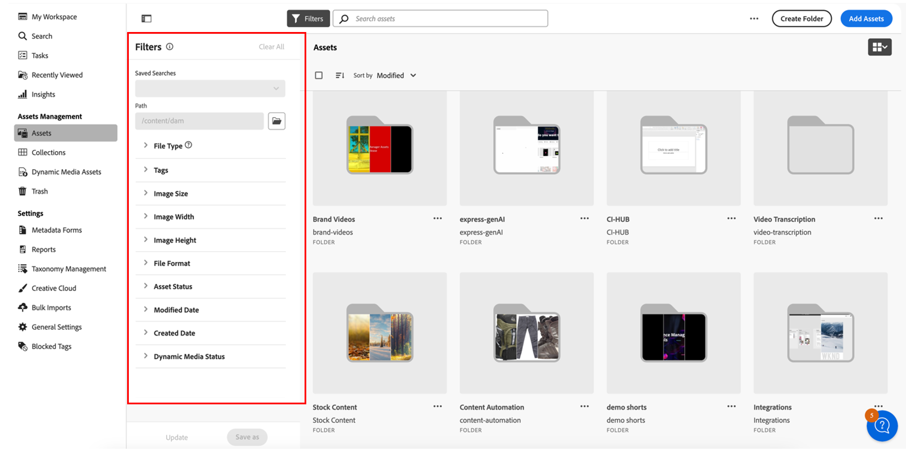

<table>
    <tr>
        <td>
            <i>Nytt</i> <a href="/help/assets/dynamic-media/dm-prime-ultimate.md"><b>Dynamic Media Prime och Ultimate</b></a>
        </td>
        <td>
            <i>Nytt</i> <a href="/help/assets/assets-ultimate-overview.md"><b>AEM Assets Ultimate</b></a>
        </td>
        <td>
            <i>Nytt</i> <a href="/help/assets/integrate-aem-assets-edge-delivery-services.md"><b>AEM Assets-integrering med Edge Delivery Services</b></a>
        </td>
        <td>
            <i>Nytt</i> <a href="/help/assets/aem-assets-view-ui-extensibility.md"><b>UI-utökningsbarhet</b></a>
        </td>
          <td>
            <i>Nytt</i> <a href="/help/assets/dynamic-media/enable-dynamic-media-prime-and-ultimate.md"><b>Aktivera Dynamic Media Prime och Ultimate</b></a>
        </td>
    </tr>
    <tr>
        <td>
            <a href="/help/assets/search-best-practices.md"><b>Sök efter bästa praxis</b></a>
        </td>
        <td>
            <a href="/help/assets/metadata-best-practices.md"><b>Metadata - bästa praxis</b></a>
        </td>
        <td>
            <a href="/help/assets/product-overview.md"><b>Content Hub</b></a>
        </td>
        <td>
            <a href="/help/assets/dynamic-media-open-apis-overview.md"><b>Dynamiska media med OpenAPI-funktioner</b></a>
        </td>
        <td>
            <a href="https://developer.adobe.com/experience-cloud/experience-manager-apis/"><b>AEM Assets-dokumentation för utvecklare</b></a>
        </td>
    </tr>
</table>

# Anpassa sökfilter {#customize-search-filters}

Med sökfilter kan du förfina sökresultaten baserat på olika parametrar som datum, filtyp, taggar och relevans, vilket förbättrar precisionen i sökfrågor. Genom att använda filter kan du snabbt gå igenom de mest relevanta resultaten effektivt. Detta sparar inte bara tid utan förbättrar också den övergripande sökupplevelsen genom att skräddarsy resultaten efter specifika inställningar och behov.
Se mer om [sökning](search-assets-view.md).

Anpassa sökfilter AEM Assets kan bara mappas till poster i ditt sökbara egenskapsindex. Se till att alla anpassade metadata inkluderas innan du konfigurerar din anpassade filterupplevelse. [!DNL Assets view] hjälper till att anpassa sökfilter för att effektivisera sökprocessen. Så här anpassar du AEM Assets anpassade sökfilter:

1. Navigera till **[!UICONTROL Settings]** > **[!UICONTROL General Settings]**.
1. Gå till fliken **[!UICONTROL Search]**. Klicka på **[!UICONTROL Customize]** om du vill konfigurera sökformuläret.

   

1. Formuläret [!UICONTROL Configure Filters] visas. Se till att du är i redigeringsläge så att du kan göra ändringar i mallen. Du kan växla till [!UICONTROL Preview mode] om du vill se förhandsgranskningen av ett befintligt sökformulär.
1. Släpp filterelement från [anpassade filter](#available-custom-filters) på arbetsytan. Du kan dra och släppa komponenten för att ändra ordning om det behövs.

   >[!VIDEO](https://video.tv.adobe.com/v/3443080)

1. Klicka på **[!UICONTROL Preview mode]** om du vill granska ändringarna.
1. Klicka på **[!UICONTROL Confirm]** om du vill spara.

## Tillgängliga anpassade filter {#available-custom-filters}

I Assets-vyn finns följande anpassade filter som kan konfigureras om efter behov:

* [Filterelement](#filter-elements)
* [Förkonfigurerade filter](#preconfigured-filters)

### Filterelement {#filter-elements}

Egna filter Med AEM Assets kan du använda en samling filterelement på arbetsytan för anpassade sökfilter. Dessa element kan konfigureras om baserat på användbarheten för sökegenskapsattribut. Du kan dock anpassa [filteregenskaperna](#filter-properties) efter dina behov. Följande filterelement är tillgängliga i [!DNL Assets view]:

<table>
    <tr>
        <th>Filterelement</th>
        <th>Beskrivning</th>
        <th>Egenskaper</th>
    </tr>
    <tr>
        <td>Text</td>
        <td>Ett textfält är ett inmatningsområde där du kan skriva information om filtret.</td>
        <td>
            <ul>
                <li>Etikett
                <li>Metadata
                <li>Värden
                <li>Beskrivning
            </ul>
        </td>
    </tr>
    <tr>
        <td>Alternativ</td>
        <td>Alternativen avser de tillgängliga alternativen för att välja ett önskat objekt i en lista.</td>
        <td>
            <ul>
                <li>Etikett
                <li>Metadata
                <li>Värden
                <li>Alternativ
                <li>Beskrivning
            </ul>
        </td>
    </tr>
    <tr>
        <td>Boolean</td>
        <td>Ett booleskt värde representerar ett sant värde. Den kan användas där du vill vara specifik och välja ett av alternativen.</td>
        <td>
            <ul>
                <li>Etikett
                <li>Metadata
                <li>Beskrivning
            </ul>
        </td>
    </tr>
    <tr>
        <td>Nummer</td>
        <td>Använd det här filterelementet för att representera ett numeriskt värde.</td>
        <td>
            <ul>
                <li>Etikett
                <li>Metadata
                <li>Markeringstyp
                <li>Stepper
                <li>Stepper-värde
                <li>Beskrivning
            </ul>
        </td>
    </tr>
    <tr>
        <td>Listruta</td>
        <td>Välj bland olika alternativ som visas i en lista med alternativ.</td>
        <td>
            <ul>
                <li>Etikett
                <li>Metadata
                <li>Alternativ
                <li>Värden
                <li>Beskrivning
            </ul>
        </td>
    </tr>
    <tr>
        <td>Datum</td>
        <td>Används för att ange datumet.</td>
        <td>
            <ul>
                <li>Etikett
                <li>Metadata
                <li>Markeringstyp
                <li>Beskrivning
            </ul>
        </td>
    </tr>
    <tr>
        <td>Sökvägsläsare</td>
        <td>Används för att navigera i filer eller mappar i Experience Manager-databasen.</td>
        <td>
            <ul>
                <li>Etikett
                <li>Metadata
                <li>Banutforskaren
                <li>Beskrivning
            </ul>
        </td>
    </tr>
    <tr>
        <td>Taggar</td>
        <td>Används för att välja taggar bland de tillgängliga alternativen. Taggar ger mer specifik information om resurserna och gör det lättare att hitta dem. Taggar som redan används för de markerade resurserna visas på panelen <b>Egenskaper</b>. Om du lagrar taggar på en anpassad metadataegenskap och använder rotsökvägen för att begränsa den till en hierarki, kan du använda samma konfiguration i sökfiltren. Om du inte kan hitta de relevanta taggarna skapar du dem och tilldelar till de valda resurserna. Mer information om hur du skapar och tilldelar taggar till resurser finns i <a href = "tagging-management-assets-view.md"> Hantera taggar i Assets-vyn </a> .</td>
        <td>
            <ul>
                <li>Etikett
                <li>Metadata
                <li>Taggväljaren
                <li>Beskrivning
            </ul>
        </td>
    </tr>
    <tr>
        <td>Användare</td>
        <td>Används för att ange typ av användare bland administratörer, vanliga användare och konsumentanvändare.</td>
        <td>
            <ul>
                <li>Etikett
                <li>Metadata
                <li>Beskrivning
            </ul>
        </td>
    </tr>
</table>

### Förkonfigurerade filter {#preconfigured-filters}

De förkonfigurerade filtren är förinställda inställningar som gör att du kan använda dem direkt på arbetsytan. Du kan dock anpassa [filteregenskaperna](#filter-properties) efter dina behov. Följande filter är förkonfigurerade i [!DNL Assets view]:

<table>
    <tr>
        <th>Förkonfigurerade filter</th>
        <th>Beskrivning</th>
        <th>Egenskaper</th>
    </tr>
    <tr>
        <td>Filtyp</td>
        <td>Filtrera sökresultaten efter de filtyper som stöds, "Bilder", "Dokument" och "Videor".</td>
        <td>
            <ul>
                <li>Etikett
                <li>Metadata
                <li>Markeringstyp
                <li>Alternativ
                <li>Värden
                <li>Beskrivning
            </ul>
        </td>
    </tr>
    <tr>
        <td>Filformat</td>
        <td>Assets-vyn har stöd för alla binära filformat med grundläggande tjänster, som lagring, överföring, kopiering, flyttning, borttagning och tillägg av metadata.</td>
        <td>
            <ul>
                <li>Etikett
                <li>Metadata
                <li>Markeringstyp
                <li>Beskrivning
            </ul>
        </td>
    </tr>
    <tr>
        <td>Bildstorlek</td>
        <td>Ange en eller flera av de minsta och högsta måtten för att filtrera bilder. Storleken anges i pixeldimensioner och är inte bildens filstorlek.</td>
        <td>
            <ul>
                <li>Etikett
                <li>Metadata
                <li>Markeringstyp
                <li>Stepper
                <li>Stepper-värde
                <li>Beskrivning
            </ul>
        </td>
    </tr>
    <tr>
        <td>Bildbredd</td>
        <td>Bildens lodräta mått.</td>
        <td>
            <ul>
                <li>Etikett
                <li>Metadata
                <li>Markeringstyp
                <li>Stepper
                <li>Stepper-värde
                <li>Beskrivning
            </ul>
        </td>
    </tr>
    <tr>
        <td>Bildhöjd</td>
        <td>En bilds vågräta dimensioner.</td>
        <td>
            <ul>
                <li>Etikett
                <li>Metadata
                <li>Markeringstyp
                <li>Stepper
                <li>Stepper-värde
                <li>Beskrivning
            </ul>
        </td>
    </tr>
    <tr>
        <td>Skapad den</td>
        <td>Datumintervall när resurser skapades.</td>
        <td>
            <ul>
                <li>Etikett
                <li>Metadata
                <li>Markeringstyp
                <li>Beskrivning
            </ul>
        </td>
    </tr>
    <tr>
        <td>Ändrat den</td>
        <td>Datumintervall när resurser ändrades.</td>
        <td>
            <ul>
                <li>Etikett
                <li>Metadata
                <li>Markeringstyp
                <li>Beskrivning
            </ul>
        </td>
    </tr>
    <tr>
        <td>Resursstatus</td>
        <td>I Assets-vyn kan du ange status för resurser som är tillgängliga i databasen. Ange en resursstatus som bättre styr och hanterar nedströmsanvändningen av digitala resurser. Välj mellan <b>Godkänd, Avvisad eller Ingen status</b>.</td>
        <td>
            <ul>
                <li>Etikett
                <li>Metadata
                <li>Markeringstyp
                <li>Beskrivning
            </ul>
        </td>
    </tr>
    <tr>
        <td>Smarta taggar</td>
        <td>Filtrera resurser med smarta taggar som lagts till i Experience Manager-databasen.</td>
        <td>
            <ul>
                <li>Etikett
                <li>Metadata
                <li>Markeringstyp
                <li>Support för Delimeter
                <li>Beskrivning
            </ul>
        </td>
    </tr>
    <tr>
        <td>Dynamisk mediestatus</td>
        <td>Välj status för en resurs mellan publicerad eller opublicerad.</td>
        <td>
            <ul>
                <li>Etikett
                <li>Metadata
                <li>Markeringstyp
                <li>Alternativ
                <li>Värden
                <li>Beskrivning
            </ul>
        </td>
    </tr>
    <tr>
        <td>Utgångsdatum</td>
        <td>Filterresurser som anger ett datumintervall efter vilket resurserna inte längre är giltiga eller behövs. </td>
        <td>
            <ul>
                <li>Etikett
                <li>Metadata
                <li>Markeringstyp
                <li>Beskrivning
            </ul>
        </td>
    </tr>
    <tr>
        <td>Taggar (taxonomi)</td>
        <td>Det är ett system för att ordna och klassificera digitala resurser med hjälp av taggar, som i huvudsak skapar en hierarkisk struktur med nyckelord som gör det möjligt för användare att enkelt söka efter relevant innehåll genom att lägga till särskilda taggar för varje resurs. </td>
        <td>
            <ul>
                <li>Etikett
                <li>Metadata
                <li>Taggväljaren
                <li>Beskrivning
            </ul>
        </td>
    </tr>
</table>

#### Filteregenskaper {#filter-properties}

Varje filterelement är associerat med en uppsättning egenskaper. AEM Assets anpassade sökfilter använder följande egenskaper i filtret och förkonfigurerade element:

<table>
    <tr>
        <th>Egenskaper</th>
        <th>Värden</th>
        <th>Beskrivning</th>
    </tr>
    <tr>
        <td>Etikett</td>
        <td>Text</td>
        <td>Det är en identifierare för det filter som du använder.</td>
    </tr>
    <tr>
        <td>Metadata</td>
        <td>Listruta</td>
        <td>Egenskapen metadata används för att mappa godkända metadata från Adobe Experience Manager Assets-databasen. Du kan välja metadatavärdet i listrutan som ska mappas med filterelementet. </td>
    </tr>
    <tr>
        <td>Markeringstyp</td> 
        <td>En, Flera, Exakt eller Intervall </td>
        <td>
            <ul>
                <li><b>Ett urval</b> gör att du kan välja ett objekt åt gången, vilket är idealiskt för distinkta val.
                <li><b>Flera markeringar</b> gör att du kan välja flera objekt samtidigt, vilket är användbart när du vill markera flera alternativ. 
                <li>Med <b>Exakt markering</b> kan du välja ett exakt enskilt objekt bland olika alternativ.
                <li>Med <b>intervallmarkering</b> kan du välja en kontinuerlig uppsättning värden inom ett definierat intervall, vilket är användbart när du vill välja ett datumintervall eller numeriska värden.
            </ul>
        </td>   
    </tr>
    <tr>
        <td>Alternativ</td>
        <td>Manuell, JSON-sökväg eller CSV-överföring</td>
        <td>
            <ul>
                <li>Välj <b>Manuell</b> om du vill lägga till alternativ manuellt. 
                <li>Välj <b>JSON-sökväg</b> om du vill lägga till alternativ från JSON-filen. 
                <li>Välj <b>CSV-överföring</b> om du vill importera en CSV-fil som innehåller värden som ska läggas till i alternativen.
            </ul>
        </td>
    </tr>
    <tr>
       <td>Värden</td>
        <td>Lägg till eller redigera</td>
        <td>
        <ul>
        <li>Klicka på <b>lägg till</b> om du vill lägga till ett nytt värde. 
        <li>Klicka på  ✎ för att redigera etiketten. 
        <li>Klicka på ?? om du vill ta bort alternativvärdet. 
        <li>Klicka på <b>Redigera</b> om du vill ändra redigeringsalternativen. 
        <li>Du kan också ändra alternativsekvensen genom att hålla ned dem.
        </td>
    </tr>
    <tr>
        <td>Support för Delimeter</td>
        <td>Aktivera eller inaktivera</td>
        <td>En avgränsare är en symbol som används för att avgränsa distinkta element i text. Till exempel kommatecken, mellanslag eller semikolon.</td>
    </tr>
    <tr>
        <td>Stepper</td>
        <td>Värde</td>
        <td>Aktivera knappen Stepper till nummerfältet för att öka eller minska värdet vid varje klick. </td>
    </tr>
    <tr>
        <td>Stepper-värde </td>
        <td>Nummer</td>
        <td>Det anger värdet för ökning/minskning när du använder stegknappen. Det visas när nummerlistan är aktiverad.</td>
    </tr>
    <tr>
        <td>Beskrivning</td>
        <td>Text</td>
        <td>Lägg till en detaljerad förklaring om du vill ha mer information om filterelementet.</td>
    </tr>
</table>

## Ta bort ett filterelement {#delete-a-filter-element}

Så här tar du bort ett sökfilter:

1. Navigera till **[!UICONTROL Settings]** > **[!UICONTROL General Settings]**.
1. Gå till fliken **[!UICONTROL Search]**. Klicka på **[!UICONTROL Customize]** om du vill konfigurera sökformuläret.
1. Formuläret [!UICONTROL Configure Filters] visas. Se till att du är i redigeringsläge så att du kan göra ändringar i mallen.
1. Markera det filterelement som du vill ta bort. Välj till exempel **[!UICONTROL Image height]**.
1. Klicka på **[!UICONTROL Delete Category]** för att ta bort filterelementet. Elementet **[!UICONTROL Image height]** har tagits bort från arbetsytan.
1. Klicka på **[!UICONTROL Confirm]** för att spara formuläret.

## Använda anpassade sökfilter{#using-custom-search-filters}

När du har konfigurerat sökfiltren kan du använda dem för att söka efter resurser i databasen.

>[!MORELIKETHIS]
>
>* [Söka efter resurser](search-assets-view.md)
