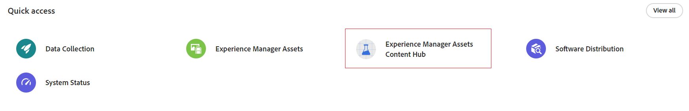
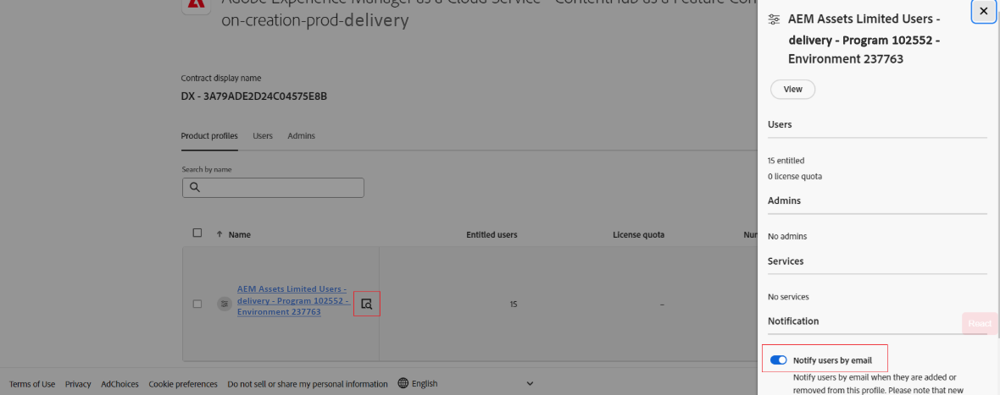

# Distribuera Content Hub {#deploy-content-hub}

Content Hub ingår i Experience Manager Assets as a Cloud Service för att demokratisera tillgången till varumärkesinnehåll för organisationer och deras affärspartners.

Resurserna som är markerade Godkänd på Experience Manager Assets as a Cloud Service kan distribueras på Content Hub.

Den här artikeln innehåller ett komplett arbetsflöde för att ge Content Hub åtkomst till användare, inklusive variationer av behörigheter baserat på deras behov.

I den här videon får du lära dig hur du aktiverar Content Hub för Experience Manager Assets:

>[!VIDEO](https://video.tv.adobe.com/v/3472939/?captions=swe&learn=on){transcript=true}

De olika behörigheterna för Content Hub omfattar:

* [Content Hub-användare](#onboard-content-hub-users): Få åtkomst till varumärkesgodkända resurser på Content Hub-portalen.

* [Content Hub-administratörer](#onboard-content-hub-administrator): Åtkomst till [användargränssnittet för konfiguration](/help/assets/configure-content-hub-ui-options.md) på Content Hub förutom åtkomst till varumärkesgodkända resurser, överföring av resurser till Content Hub, Adobe Express-integrering för redigering av bilder (om du har Adobe Express-berättiganden).

* [Content Hub-användare med behörighet att lägga till resurser](#onboard-content-hub-users-add-assets): Möjlighet att [överföra resurser till Content Hub](/help/assets/upload-brand-approved-assets.md) utöver åtkomst till varumärkesgodkända resurser på Content Hub-portalen.

* [Content Hub-användare med behörighet att mixa om resurser till nya varianter](#onboard-content-hub-users-remix-assets): [Adobe Express Integration](/help/assets/edit-images-content-hub.md) (om du har Adobe Express-berättiganden) förutom tillgång till varumärkesgodkända resurser på Content Hub-portalen.

* [Experience Manager Assets-användare](#experience-manager-assets-users): Möjlighet att godkänna resurser på Experience Manager Assets as a Cloud Service för att göra dessa resurser tillgängliga på Content Hub.

>[!NOTE]
>
>Du kan komma åt och använda Content Hub med upp till 250 Content Hub Limited-användare för Assets Ultimate och 50 Content Hub-användare för Assets Prime. Kontakta Adobe om du har ytterligare frågor.

I följande tabell sammanfattas tillgängliga Content Hub-användartyper, vilka behörigheter de har och vilka produktprofiler som krävs för att få dessa behörigheter:

| Användarroll | Content Hub | Content Hub-användare med rättigheter att lägga till resurser | Content Hub-användare som har rätt att mixa om resurser | Content Hub-administratörer |
|---------------|----------|----------|-------------------------|---|
| **Funktioner** |  |  |  |  |
| Få tillgång till varumärkesgodkända resurser på Content Hub-portalen | ✓ | ✓ | ✓ | ✓ |
| Överför resurser från Content Hub Portal | - | ✓ | ✓ | ✓ |
| Använd Adobe Express-integrering för att redigera bilder | - | - | ✓ | - |
| Åtkomst till Content Hub konfigurationsgränssnitt | - | - | - | ✓ |
| **Användaren måste finnas i dessa produktprofiler (Admin Console)** |  |  |  |  |
| AEM > Delivery instance > AEM Assets Limited Users | ✓ | ✓ | ✓ | ✓ |
| AEM > Production Author instance > AEM Users | - | ✓ | ✓ | - |
| AEM > Production Author instance > AEM Administrators | - | - | - | ✓ |
| Adobe Express | - | - | ✓ | - |
| **Mer information** | Se [Content Hub-användare](#onboard-content-hub-users) | Se [Content Hub-användare med behörighet att lägga till resurser](#onboard-content-hub-users-add-assets) | Se [Content Hub-användare med behörighet att mixa om resurser till nya varianter](#onboard-content-hub-users-remix-assets) | Se [Content Hub-administratörer](#onboard-content-hub-administrator) |

>[!NOTE]
>
>[Experience Manager Assets-användare](#experience-manager-assets-users) kan godkänna resurser i en Experience Manager Assets as a Cloud Service-miljö och göra dessa resurser tillgängliga i Content Hub. Dessa användare måste läggas till i AEM > Production Author instance > AEM Users produktprofil med Admin Console.

## Steg 1: Aktivera Content Hub för Experience Manager Assets med Cloud Manager {#enable-content-hub}

För att få tillgång till Content Hub-portalen måste administratörer först aktivera Content Hub för Experience Manager Assets as a Cloud Service med Cloud Manager.

### Behörigheter {#permissions-edit-program}

Du måste ha rollen Business Owner för att kunna redigera program i Cloud Manager. Mer information finns i [Redigera program](/help/implementing/cloud-manager/getting-access-to-aem-in-cloud/editing-programs.md).

Så här aktiverar du Content Hub för Experience Manager Assets:

1. Logga in på Cloud Manager. Se till att du väljer rätt organisation när du loggar in. Cloud Manager listar alla program.

1. Gå till Experience Manager Assets as a Cloud Service, klicka på ikonen Fler alternativ (..) och välj **[!UICONTROL Edit Program]**.

   

1. I dialogrutan [!UICONTROL Edit Program] väljer du fliken **[!UICONTROL Solutions & Add-ons]**.

1. Expandera **[!UICONTROL Assets]** och välj **[!UICONTROL Content Hub]**.
   

   >[!NOTE]
   >
   >Om **[!UICONTROL Update]** inte har aktiverats för dig när du har valt Content Hub kontrollerar du att du har angett Go-Live-inställningar för programmet.

1. Klicka på **[!UICONTROL Update]**.

Content Hub är nu aktiverat för Experience Manager Assets as a Cloud Service. När du har aktiverat Content Hub i en produktionsmiljö kan du inte inaktivera det via självbetjäning.

Om du inte har använt Experience Manager Assets tidigare klickar du på **[!UICONTROL Add Program]**, anger programinformation (Programnamn, konfigurera för produktion) och klickar på **[!UICONTROL Continue]**. Du kan sedan välja **[!UICONTROL Assets]** och **[!UICONTROL Content Hub]** på fliken **[!UICONTROL Solutions & Add-ons]**.

### Aktivera Content Hub för lägre miljöer {#enable-content-hub-lower-environments}

Följande Content Hub-krediter är tillgängliga baserat på AEM Assets-licens:

* Assets Ultimate: 3 Content Hub-krediter

* Assets Prime: 1 Content Hub-kredit

* Befintliga Assets som molntjänstkunder: 1 Content Hub-kredit

Du använder en kredit för att aktivera Content Hub i varje miljö, till exempel Production, Development eller Stage.

Så här aktiverar du Content Hub för lägre miljöer:

1. [Aktivera Content Hub för Experience Manager Assets med Cloud Manager](#enable-content-hub).

1. Klicka på programkortet för att visa en lista över tillgängliga miljöer (produktion, utveckling eller scen).

1. Klicka på den miljö som du vill aktivera. Avsnittet **[!UICONTROL Content Hub]** visar `Content Hub is available for activation`.

   

1. Klicka på **[!UICONTROL Click to activate]**. Bekräfta genom att klicka på **[!UICONTROL Activate]** igen.

   Content Hub är aktiverat för den valda miljön.

### Content Hub instans och produktprofil på Admin Console{#content-hub-instance-product-profile}

När du har [aktiverat Content Hub för Assets as a Cloud Service med Cloud Manager](#enable-content-hub) skapas en ny instans i AEM Assets as a Cloud Service på Admin Console med suffixet `delivery`:

>[!NOTE]
>
>Om du har etablerat Content Hub före 14 augusti 2024 skapas den nya instansen med `contenthub` som suffix.

Observera att det inte finns någon `author` eller `publish` i instansnamnet för Content Hub.

Klicka på instansnamnet för att visa Content Hub produktprofil.

>[!NOTE]
>
>Om du har etablerat Content Hub före den 14 augusti 2024 har Content Hub produktprofil `contenthub` omnämns efter `Limited Users` i stället för `delivery`.

## Steg 2: Integrera Content Hub-administratören {#onboard-content-hub-administrator}

Content Hub-administratörer har tillgång till [användargränssnittet för konfiguration](/help/assets/configure-content-hub-ui-options.md) på Content Hub, förutom tillgång till resurser som godkänts av varumärket, överföring av resurser till Content Hub, Adobe Express-integrering för redigering av bilder (om du har Adobe Express-berättiganden).

Så här skaffar du Content Hub-administratören:

1. [Öppna och klicka på Content Hub användarproduktprofil](#content-hub-instance-product-profile).

1. Klicka på **[!UICONTROL Add users]** om du vill lägga till användare eller användargrupper i produktprofilen.

1. Klicka på **[!UICONTROL Save]** om du vill spara ändringarna.

1. När du har lagt till användaren i Content Hub produktprofil kan du få tillgång till Experience Manager Assets produktprofiler genom att klicka på AEM as a Cloud Service produktnamn i produktlistan för Admin Console.

1. Klicka på författarinstansen för AEM as a Cloud Service:
   

   Admin Console visar två produktprofiler för AEM as a Cloud Service: Administratörer och Användare.
1. Klicka på produktprofilen Administratörer och klicka på **[!UICONTROL Add users]** för att lägga till användaren i produktprofilen.
   

1. Klicka på **[!UICONTROL Save]** om du vill spara ändringarna.

## Steg 3: Införliva Content Hub-användare {#onboard-content-hub-users}

Content Hub-användare har åtkomst till resurser som är tillgängliga på portalen, men kan inte lägga till nya resurser eller ändra befintliga resurser.

Anlita Content Hub-användare:

1. [Öppna och klicka på Content Hub användarproduktprofil](#content-hub-instance-product-profile).

1. Klicka på **[!UICONTROL Add users]** om du vill lägga till användare eller användargrupper i produktprofilen.

1. Klicka på **[!UICONTROL Save]** om du vill spara ändringarna.

Dessa användare har nu tillgång till de resurser som finns på Content Hub-portalen.

>[!NOTE]
>
>Du kan använda alla avancerade företagsfunktioner som synkronisering med externa identitetsleverantörer.

### Hur kommer jag åt Content Hub? {#access-content-hub}

Du kommer åt Content Hub på följande sätt:

* Öppna Content Hub via följande länk:

  `https://experience.adobe.com/#/assets/contenthub`

* Logga in på `experience.adobe com` och klicka på **[!UICONTROL Experience Manager Assets Content Hub]** som finns i avsnittet **[!UICONTROL Quick access]**:
  

* Logga in på `experience.adobe com` och klicka på **[!UICONTROL Experience Manager Assets Content Hub]** i produktväljaren:
  

### Inaktivera e-postmeddelanden för användare {#disable-email-notifications}

Om administratörer måste inaktivera e-postmeddelanden som skickas till användare när de läggs till i Content Hub produktprofil:

Klicka på sökikonen bredvid produktprofilens namn och inaktivera växlingsknappen **[!UICONTROL Notify users by email]**.

## Steg 4: Införliva Content Hub-användare med rättigheter att lägga till resurser (valfritt) {#onboard-content-hub-users-add-assets}

Content Hub-användare med behörighet att lägga till resurser kan [överföra nya varumärkesgodkända resurser till Content Hub](/help/assets/upload-brand-approved-assets.md).

Så här integrerar du Content Hub-användare med rättigheter att lägga till användare:

1. [När du har lagt till användaren i Content Hub produktprofil](#onboard-content-hub-users) får du tillgång till Experience Manager Assets produktprofiler genom att klicka på AEM as a Cloud Service produktnamn i produktlistan för Admin Console.

1. Klicka på författarinstansen för AEM as a Cloud Service:
   

   Admin Console visar två produktprofiler för AEM as a Cloud Service: Administratörer och Användare.
1. Klicka på produktprofilen Användare och klicka på **[!UICONTROL Add users]** för att lägga till användaren i produktprofilen.
   

1. Klicka på **[!UICONTROL Save]** om du vill spara ändringarna.

## Steg 4: Införliva Content Hub-användare med rätt att mixa om resurser till nya varianter (valfritt) {#onboard-content-hub-users-remix-assets}

Content Hub-användare med behörighet att mixa om resurser till nya varianter kan [ändra befintliga resurser med Adobe Express och spara resursen i databasen](/help/assets/edit-images-content-hub.md). Det går bara att redigera resurser med Adobe Express om användaren har behörighet för Adobe Express.

Så här integrerar du Content Hub-användare med rättigheter att mixa om resurser till nya varianter:

1. [När du har lagt till användaren i Content Hub produktprofil](#onboard-content-hub-users) får du tillgång till Experience Manager Assets produktprofiler genom att klicka på AEM as a Cloud Service produktnamn i produktlistan för Admin Console.

1. Klicka på författarinstansen för AEM as a Cloud Service:
   

   Admin Console visar två produktprofiler för AEM as a Cloud Service: Administratörer och Användare.
1. Klicka på produktprofilen Användare och klicka på **[!UICONTROL Add users]** för att lägga till användaren i produktprofilen.
   

1. Klicka på **[!UICONTROL Save]** om du vill spara ändringarna.

## Experience Manager Assets {#experience-manager-assets-users}

Experience Manager Assets-användare kan godkänna mediefiler på AEM as a Cloud Service så att de är tillgängliga på Content Hub.

Så här konfigurerar du Experience Manager Assets-användare:

1. Gå till Experience Manager Assets produktprofiler genom att klicka på AEM as a Cloud Service produktnamn i produktlistan i Admin Console.

1. Klicka på författarinstansen för AEM as a Cloud Service:
   

   Admin Console visar två produktprofiler för AEM as a Cloud Service: Administratörer och Användare.
1. Klicka på produktprofilen Användare och klicka på **[!UICONTROL Add users]** för att lägga till användaren i produktprofilen.
   

1. Klicka på **[!UICONTROL Save]** om du vill spara ändringarna.

   >[!NOTE]
   >
   > Du behöver inte läggas till i [Content Hub-produktprofilen](#onboard-content-hub-users) för Experience Manager Assets-användare.

## Aktivera Content Hub för befintliga Assets as a Cloud Service-kunder {#enable-content-hub-exisitng-cs-customers}

Befintliga Assets as a Cloud Service-kunder har 250 användare av Content Hub Limited som ingår i licensen. Aktivera Content Hub genom att utföra följande steg:

1. [Aktivera Content Hub för Experience Manager Assets med Cloud Manager](#enable-content-hub).

1. [Anlita Content Hub Limited-användare](#onboard-content-hub-users). Dessa användare har åtkomst till resurser som är tillgängliga på portalen, men kan inte lägga till nya resurser eller ändra befintliga resurser.

1. Om användarna behöver lägga till resurser på Content Hub-portalen lägger du till dem i produktprofilen för `AEM Users`. Mer information finns i [Anlita Content Hub-användare med behörighet att lägga till resurser](#onboard-content-hub-users-add-assets).

1. Om användarna behöver komma åt användargränssnittet för Content Hub-konfigurationen lägger du till dem i produktprofilen för `AEM Administrators`. Mer information finns i [Anlita Content Hub-administratör](#onboard-content-hub-administrator).

Om användarna inte får de behörigheter de behöver även efter att ha lagt till dem i produktprofilerna kontaktar du Adobe.

## Frågor och svar {#faqs-deploy-content-hub}

### Hur får användare tillgång till Content Hub och vilka behörigheter kan tilldelas?

Användare kan läggas till i Content Hub via Adobe Admin Console genom att tilldela dem till relevant produktprofil för Content Hub.

Följande behörigheter är tillgängliga för användarna:

* Content Hub-användare har tillgång till varumärkesgodkända mediefiler på Content Hub-portalen.

* Content Hub-administratörer har tillgång till användargränssnittet för konfiguration på Content Hub, förutom tillgång till varumärkesgodkända mediefiler, överföring av mediefiler till Content Hub och Adobe Express-integrering för redigering av bilder (om du har Adobe Express-behörighet).

* Content Hub-användare som har rätt att lägga till resurser har möjlighet att överföra resurser till Content Hub utöver att få tillgång till varumärkesgodkända resurser på Content Hub-portalen.

* Content Hub-användare som har rätt att mixa om resurser har tillgång till Adobe Express (om du har Adobe Express-rättigheter) förutom att få tillgång till varumärkesgodkända resurser på Content Hub-portalen.

### Vilka produktprofiler finns för olika typer av användare i Content Hub?

Produktprofilerna är tillgängliga för olika typer av användare i Content Hub:

* Content Hub-användare: AEM Assets Limited Users

* Content Hub-administratörer: AEM Assets Limited Users + AEM Administrators

* Content Hub-användare med rättigheter att lägga till resurser: AEM Assets Limited Users + AEM Users

* Content Hub-användare med rättigheter att mixa om resurser: AEM Assets Limited Users + AEM Users

### Hur kan administratörer aktivera Content Hub för sin organisation?

Administratören måste logga in på Cloud Manager, välja (eller skapa) sitt program, aktivera Assets och Content Hub på fliken Lösningar och tillägg samt uppdatera programmet. Detta skapar en Content Hub-instans i Adobe Admin Console där användaråtkomst kan hanteras.

### Hur många Content Hub Limited-användare ingår i AEM Assets? {#content-hub-limited-users-with-aem-assets}

[Assets Ultimate](/help/assets/assets-ultimate-overview.md) och Assets as a Cloud Service innehåller 250 Content Hub Limited-användare, medan [Assets Prime](/help/assets/assets-prime.md) innehåller 50 Content Hub Limited-användare.

### Hur många Content Hub-krediter ingår i min AEM Assets-licens?

Antalet tillgängliga Content Hub-krediter beror på din AEM Assets-licens:

* Assets Ultimate innehåller tre Content Hub-krediter.

* Assets Prime har en Content Hub-kredit.

* Befintliga Assets as a Cloud Service-kunder får en Content Hub-kredit.

### Hur används Content Hub-krediter?

En Content Hub-kredit förbrukas för varje miljö där Content Hub är aktiverat. För att aktivera Content Hub i produktions-, utvecklings- och scenmiljöer krävs till exempel tre krediter.

### Kan jag aktivera Content Hub i lägre miljöer?

Ja. Du kan aktivera Content Hub i miljöer med lägre krav, som Development eller Stage, förutsatt att du har tillgång till Content Hub-krediter. Varje lägre miljö kräver en kredit.

### Hur har jag behörighet att komma åt godkända mediefiler på Content Hub?

Content Hub-användare har tillgång till varumärkesgodkända mediefiler på Content Hub-portalen. Du måste läggas till i produktprofilen för AEM Limited Users om du vill vara Content Hub-användare.

### Hur har jag behörighet att överföra mediefiler till Content Hub?

Content Hub-användare som har rätt att lägga till resurser har möjlighet att överföra resurser till Content Hub utöver att få tillgång till varumärkesgodkända resurser på Content Hub-portalen. Du måste läggas till i produktprofilerna AEM Limited Users och AEM Users för att kunna vara Content Hub-användare med behörighet att lägga till resurser.

### Hur har jag behörighet att komma åt användargränssnittet för konfigurationen i Content Hub?

Content Hub-administratörer har tillgång till användargränssnittet för konfiguration på Content Hub, förutom tillgång till varumärkesgodkända mediefiler, överföring av mediefiler till Content Hub och Adobe Express-integrering för redigering av bilder (om du har Adobe Express-behörighet). Du måste läggas till i produktprofilerna AEM Limited Users och AEM Administrators för att bli Content Hub-administratör.

### Hur har jag behörighet att redigera bilder med Adobe Express i Content Hub?

Content Hub-användare som har rätt att mixa om resurser har tillgång till Adobe Express (om du har Adobe Express-rättigheter) förutom att få tillgång till varumärkesgodkända resurser på Content Hub-portalen. Du måste läggas till i produktprofilerna AEM Limited Users och AEM Users för att kunna vara Content Hub-användare med rätt att mixa om resurser.

