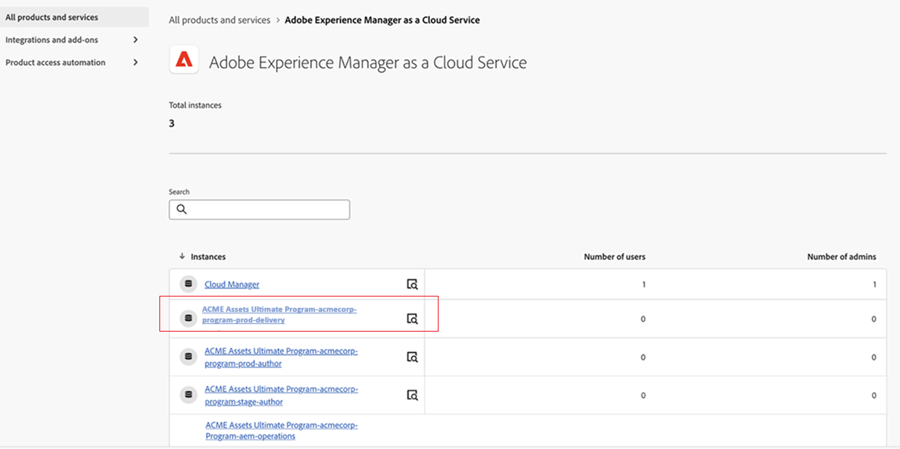

# Distribuera Content Hub {#deploy-content-hub}

| [Sök efter bästa praxis](/help/assets/search-best-practices.md) | [Metadata - bästa praxis](/help/assets/metadata-best-practices.md) | [Content Hub](/help/assets/product-overview.md) | [Dynamic Media med OpenAPI-funktioner](/help/assets/dynamic-media-open-apis-overview.md) | [AEM Assets-dokumentation för utvecklare](https://developer.adobe.com/experience-cloud/experience-manager-apis/) |
| ------------- | --------------------------- |---------|----|-----|

Content Hub ingår som en del av Experience Manager Assets as a Cloud Service för att demokratisera tillgången till varumärkesinnehåll för organisationer och deras affärspartners.

Resurserna som är markerade Godkänd på Experience Manager Assets as a Cloud Service är tillgängliga för mediedistribution på Content Hub.

Den här artikeln innehåller ett komplett arbetsflöde för att ge Content Hub åtkomst till användare, inklusive variationer av behörigheter baserat på deras behov.

De olika behörigheterna för Content Hub omfattar:

* [Content Hub-användare](#onboard-content-hub-users): Få åtkomst till varumärkesgodkända resurser på Content Hub-portalen.

* [Content Hub-administratörer](#onboard-content-hub-administrator): Åtkomst till [användargränssnittet för konfiguration](/help/assets/configure-content-hub-ui-options.md) på Content Hub, förutom åtkomst till varumärkesgodkända resurser, överföring av resurser till Content Hub, Adobe Express-integrering för redigering av bilder (om du har Adobe Expresser).

* [Content Hub-användare med behörighet att lägga till resurser](#onboard-content-hub-users-add-assets): Möjlighet att [överföra resurser till Content Hub](/help/assets/upload-brand-approved-assets.md) utöver åtkomst till varumärkesgodkända resurser på Content Hub-portalen.

* [Content Hub-användare med behörighet att mixa om resurser till nya varianter](#onboard-content-hub-users-remix-assets): [Adobe Express Integration](/help/assets/edit-images-content-hub.md) (om du har Adobe Express) förutom att få tillgång till varumärkesgodkända resurser på Content Hub-portalen.

* [Experience Manager Assets-användare](#experience-manager-assets-users): Möjlighet att godkänna resurser på Experience Manager Assets as a Cloud Service för att göra dessa resurser tillgängliga på Content Hub.

I följande tabell sammanfattas tillgängliga Content Hub-användartyper, vilka behörigheter de har och vilka produktprofiler som krävs för att få dessa behörigheter:

| Användarroll | Content Hub | Content Hub-användare med rättigheter att lägga till resurser | Content Hub-användare som har rätt att mixa om resurser | Content Hub-administratörer |
|---------------|----------|----------|-------------------------|---|
| **Funktioner** |
| Få tillgång till varumärkesgodkända resurser på Content Hub-portalen | ✓ | ✓ | ✓ | ✓ |
| Överför resurser från Content Hub Portal | - | ✓ | ✓ | ✓ |
| Använd Adobe Express-integrering för att redigera bilder | - | - | ✓ | - |
| Åtkomst till Content Hub konfigurationsgränssnitt | - | - | - | ✓ |
| **Användaren måste finnas i de här produktprofilerna (Admin Console)** |
| AEM > Delivery instance > AEM Assets Limited Users | ✓ | ✓ | ✓ | ✓ |
| AEM > Production Author instance > AEM Users | - | ✓ | ✓ | - |
| AEM > Production Author instance > AEM Administrators | - | - | - | ✓ |
| Adobe Express | - | - | ✓ | - |
| **Mer information** | Se [Content Hub-användare](#onboard-content-hub-users) | Se [Content Hub-användare med behörighet att lägga till resurser](#onboard-content-hub-users-add-assets) | Se [Content Hub-användare med behörighet att mixa om resurser till nya varianter](#onboard-content-hub-users-remix-assets) | Se [Content Hub-administratörer](#onboard-content-hub-administrator) |

>[!NOTE]
>
>[Experience Manager Assets-användare](#experience-manager-assets-users) kan godkänna resurser i en Experience Manager Assets as a Cloud Service-miljö och göra dessa resurser tillgängliga i Content Hub. Dessa användare måste läggas till i AEM > Production Author instance > AEM Users produktprofil med Admin Console.

## Steg 1: Aktivera Content Hub för Experience Manager Assets med Cloud Manager {#enable-content-hub}

För att få tillgång till Content Hub-portalen måste administratörer först aktivera Content Hub för Experience Manager Assets as a Cloud Service med Cloud Manager. Utför följande steg:

1. Logga in på Cloud Manager. Se till att du väljer rätt organisation när du loggar in. Cloud Manager listar alla program.

1. Navigera till Experience Manager Assets as a Cloud Service program, klicka på ikonen Fler alternativ (..) och välj **[!UICONTROL Edit Program]**.

   

1. I dialogrutan [!UICONTROL Edit Program] väljer du fliken **[!UICONTROL Solutions & Add-ons]**.

1. Expandera **[!UICONTROL Assets]** och välj **[!UICONTROL Content Hub]**.
   

   >[!NOTE]
   >
   >Om **[!UICONTROL Update]** inte har aktiverats för dig när du har valt Content Hub kontrollerar du att du har angett Go-Live-inställningar för programmet.

1. Klicka på **[!UICONTROL Update]**.

Content Hub är nu aktiverat för Experience Manager Assets as a Cloud Service. När du har aktiverat Content Hub i en produktionsmiljö kan du inte inaktivera det via självbetjäning.

>[!NOTE]
>
>Du har tillgång till och kan använda Content Hub med upp till 250 Content Hub-användare. Kontakta din Adobe-representant om du har ytterligare frågor.

Om du inte har använt Experience Manager Assets tidigare klickar du på **[!UICONTROL Add Program]**, anger programinformation (Programnamn, konfigurera för produktion) och klickar på **[!UICONTROL Continue]**. Du kan sedan välja **[!UICONTROL Assets]** och **[!UICONTROL Content Hub]** på fliken **[!UICONTROL Solutions & Add-ons]**.

### Content Hub instans och produktprofil på Admin Console{#content-hub-instance-product-profile}

När du har [aktiverat Content Hub för Assets as a Cloud Service med Cloud Manager](#enable-content-hub) skapas en ny instans i AEM Assets as a Cloud Service Admin Console med suffixet `delivery`:

>[!NOTE]
>
>Om du har etablerat Content Hub före 14 augusti 2024 skapas den nya instansen med `contenthub` som suffix.

Observera att det inte finns någon `author` eller `publish` i instansnamnet för Content Hub.

Klicka på instansnamnet för att visa Content Hub produktprofil.

>[!NOTE]
>
>Om du har etablerat Content Hub före den 14 augusti 2024 har Content Hub produktprofil `contenthub` omnämns efter `Limited Users` i stället för `delivery`.

## Steg 2: Integrera Content Hub-administratören {#onboard-content-hub-administrator}

Content Hub-administratörer har tillgång till [användargränssnittet för konfiguration](/help/assets/configure-content-hub-ui-options.md) på Content Hub, förutom tillgång till resurser som godkänts av varumärket, överföring av resurser till Content Hub, integrering av Adobe Expresser för att redigera bilder (om du har Adobe Expresser).

Så här skaffar du Content Hub-administratören:

1. [Öppna och klicka på Content Hub användarproduktprofil](#content-hub-instance-product-profile).

1. Klicka på **[!UICONTROL Add users]** om du vill lägga till användare eller användargrupper i produktprofilen.

1. Klicka på **[!UICONTROL Save]** om du vill spara ändringarna.

1. När du har lagt till användaren i Content Hub produktprofil kan du få tillgång till Experience Manager Assets produktprofiler genom att klicka på AEM as a Cloud Service produktnamn i produktlistan på Admin Console.

1. Klicka på författarinstansen för AEM as a Cloud Service:
   

   Admin Console visar två produktprofiler för AEM as a Cloud Service: Administratörer och Användare.
1. Klicka på produktprofilen Administratörer och klicka på **[!UICONTROL Add users]** för att lägga till användaren i produktprofilen.
   

1. Klicka på **[!UICONTROL Save]** om du vill spara ändringarna.

## Steg 3: Införliva Content Hub-användare {#onboard-content-hub-users}

Content Hub-användare har åtkomst till resurser som är tillgängliga på portalen, men kan inte lägga till nya resurser eller ändra befintliga resurser.

Anlita Content Hub-användare:

1. [Öppna och klicka på Content Hub användarproduktprofil](#content-hub-instance-product-profile).

1. Klicka på **[!UICONTROL Add users]** om du vill lägga till användare eller användargrupper i produktprofilen.

1. Klicka på **[!UICONTROL Save]** om du vill spara ändringarna.

Dessa användare har nu tillgång till de resurser som finns på Content Hub-portalen.

>[!NOTE]
>
>Du kan använda alla avancerade företagsfunktioner som synkronisering med externa identitetsleverantörer.

### Hur kommer jag åt Content Hub? {#access-content-hub}

Du kommer åt Content Hub på följande sätt:

* Öppna Content Hub via följande länk:

  `https://experience.adobe.com/#/assets/contenthub`

* Logga in på `experience.adobe com` och klicka på **[!UICONTROL Experience Manager Assets Content Hub]** som finns i avsnittet **[!UICONTROL Quick access]**:
  

* Logga in på `experience.adobe com` och klicka på **[!UICONTROL Experience Manager Assets Content Hub]** i produktväljaren:
  

### Inaktivera e-postmeddelanden för användare {#disable-email-notifications}

Om administratörer måste inaktivera e-postmeddelanden som skickas till användare när de läggs till i Content Hub produktprofil:

Klicka på sökikonen bredvid produktprofilens namn och inaktivera växlingsknappen **[!UICONTROL Notify users by email]**.

## Steg 4: Införliva Content Hub-användare med rättigheter att lägga till resurser (valfritt) {#onboard-content-hub-users-add-assets}

Content Hub-användare med behörighet att lägga till resurser kan [överföra nya varumärkesgodkända resurser till Content Hub](/help/assets/upload-brand-approved-assets.md).

Så här integrerar du Content Hub-användare med rättigheter att lägga till användare:

1. [När du har lagt till användaren i Content Hub produktprofil](#onboard-content-hub-users) får du tillgång till Experience Manager Assets produktprofiler genom att klicka på AEM as a Cloud Service produktnamn i produktlistan på Admin Console.

1. Klicka på författarinstansen för AEM as a Cloud Service:
   

   Admin Console visar två produktprofiler för AEM as a Cloud Service: Administratörer och Användare.
1. Klicka på produktprofilen Användare och klicka på **[!UICONTROL Add users]** för att lägga till användaren i produktprofilen.
   

1. Klicka på **[!UICONTROL Save]** om du vill spara ändringarna.

## Steg 4: Införliva Content Hub-användare med rätt att mixa om resurser till nya varianter (valfritt) {#onboard-content-hub-users-remix-assets}

Content Hub-användare med behörighet att mixa om resurser till nya varianter kan [ändra befintliga resurser med Adobe Express och spara resursen i databasen](/help/assets/edit-images-content-hub.md). Det går bara att redigera resurser med Adobe Express om användaren har Adobe Express.

Så här integrerar du Content Hub-användare med rättigheter att mixa om resurser till nya varianter:

1. [När du har lagt till användaren i Content Hub produktprofil](#onboard-content-hub-users) får du tillgång till Experience Manager Assets produktprofiler genom att klicka på AEM as a Cloud Service produktnamn i produktlistan på Admin Console.

1. Klicka på författarinstansen för AEM as a Cloud Service:
   

   Admin Console visar två produktprofiler för AEM as a Cloud Service: Administratörer och Användare.
1. Klicka på produktprofilen Användare och klicka på **[!UICONTROL Add users]** för att lägga till användaren i produktprofilen.
   

1. Klicka på **[!UICONTROL Save]** om du vill spara ändringarna.

## Experience Manager Assets {#experience-manager-assets-users}

Experience Manager Assets-användare kan godkänna mediefiler på AEM as a Cloud Service så att de är tillgängliga på Content Hub.

Så här konfigurerar du Experience Manager Assets-användare:

1. Gå till Experience Manager Assets produktprofiler genom att klicka på AEM as a Cloud Service produktnamn i produktlistan på Admin Console.

1. Klicka på författarinstansen för AEM as a Cloud Service:
   

   Admin Console visar två produktprofiler för AEM as a Cloud Service: Administratörer och Användare.
1. Klicka på produktprofilen Användare och klicka på **[!UICONTROL Add users]** för att lägga till användaren i produktprofilen.
   

1. Klicka på **[!UICONTROL Save]** om du vill spara ändringarna.

   >[!NOTE]
   >
   > Du behöver inte läggas till i [Content Hub-produktprofilen](#onboard-content-hub-users) för Experience Manager Assets-användare.
