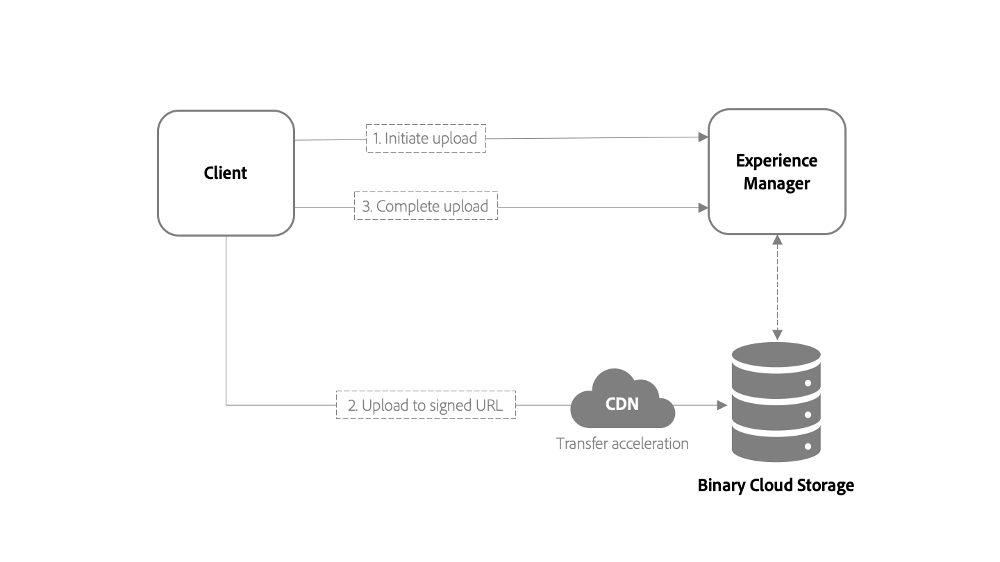

# [!DNL Assets] API:er och referensmaterial för utvecklare {#assets-cloud-service-apis}

Artikeln innehåller referensmaterial och resurser för utvecklare av [!DNL Assets] som en Cloud Service. Det innehåller en ny överföringsmetod, API-referens och information om stödet i efterbehandlingsarbetsflödena.

## Överföring av tillgångar {#asset-upload-technical}

[!DNL Experience Manager] som Cloud Service innehåller en ny metod för att överföra resurser till databasen. Användare kan överföra resurserna direkt till molnlagringen med HTTP API. Stegen för att överföra en binär fil är:

1. [Skicka en HTTP-begäran](#initiate-upload). Den informerar [!DNL Experience Manage]eller distribuerar om din avsikt att överföra en ny binär fil.
1. [POST innehållet i binärfilen](#upload-binary) till en eller flera URI:er som tillhandahålls av initieringsbegäran.
1. [Skicka en HTTP-begäran](#complete-upload) för att informera servern om att innehållet i binärfilen har överförts.



Metoden ger en skalbar och mer effektiv hantering av överföringar av resurser. Skillnaderna jämfört med [!DNL Experience Manager] 6.5 är:

* Binärfiler fungerar inte [!DNL Experience Manager]som nu helt enkelt koordinerar överföringsprocessen med det binära molnlagringsutrymmet som är konfigurerat för distributionen.
* Binär molnlagring fungerar med ett CDN-nätverk (Content Delivery Network) eller Edge-nätverk. Ett CDN väljer en slutpunkt för överföring som är närmare för en klient. När data flyttas kortare tid till en närliggande slutpunkt förbättras överföringsprestanda och användarupplevelsen, särskilt för geografiskt utspridda team.

>[!NOTE]
>
>Se klientkoden för att implementera den här metoden i open-source- [biblioteket](https://github.com/adobe/aem-upload)aem-upload.

### Initiera överföring {#initiate-upload}

Skicka en begäran om HTTP-POST till den önskade mappen. Resurser skapas eller uppdateras i den här mappen. Inkludera väljaren `.initiateUpload.json` för att ange att begäran är att initiera överföringen av en binär fil. Sökvägen till mappen där resursen ska skapas är till exempel `/assets/folder`. POSTENS begäran är `POST https://[aem_server]:[port]/content/dam/assets/folder.initiateUpload.json`.

Innehållstypen för begärandetexten ska vara `application/x-www-form-urlencoded` formulärdata, som innehåller följande fält:

* `(string) fileName`: Krävs. Namnet på resursen så som den visas i [!DNL Experience Manager].
* `(number) fileSize`: Krävs. Filstorleken, i byte, för resursen som överförs.

En enda begäran kan användas för att initiera överföringar för flera binärfiler, förutsatt att varje binärfil innehåller de obligatoriska fälten. Om det lyckas svarar begäran med en `201` statuskod och en brödtext som innehåller JSON-data i följande format:

```json
{
    "completeURI": "(string)",
    "folderPath": (string)",
    "files": [
        {
            "fileName": "(string)",
            "mimeType": "(string)",
            "uploadToken": "(string)",
            "uploadURIs": [
                "(string)"
            ]
        }
    ]
}
```

* `completeURI` (sträng): Anropa den här URI:n när den binära filen har överförts. URI:n kan vara en absolut eller relativ URI och klienterna bör kunna hantera båda. Värdet kan alltså vara `"https://author.acme.com/content/dam.completeUpload.json"` eller `"/content/dam.completeUpload.json"` Se [hela överföringen](#complete-upload).
* `folderPath` (sträng): Fullständig sökväg till mappen som binärfilen överförs till.
* `(files)` (array): En lista med element vars längd och ordning matchar längden och ordningen för listan med binär information som tillhandahålls i initieringsbegäran.
* `fileName` (sträng): Namnet på motsvarande binärfil, som anges i initieringsbegäran. Detta värde bör inkluderas i den fullständiga begäran.
* `mimeType` (sträng): Mime-typen för motsvarande binärfil, som anges i initieringsbegäran. Detta värde bör inkluderas i den fullständiga begäran.
* `uploadToken` (sträng): En överföringstoken för motsvarande binär fil. Detta värde bör inkluderas i den fullständiga begäran.
* `uploadURIs` (array): En lista över strängar vars värden är fullständiga URI:er som binärens innehåll ska överföras till (se [Överför binärt](#upload-binary)).
* `minPartSize` (tal): Den minsta längden, i byte, på data som kan anges till någon av uploadURI:erna, om det finns mer än en URI.
* `maxPartSize` (tal): Den maximala längden, i byte, på data som kan tillhandahållas till någon av uploadURI:erna, om det finns mer än en URI.

### Ladda upp binärt {#upload-binary}

Utdata från initiering av en överföring innehåller ett eller flera överförda URI-värden. Om mer än en URI anges delar klienten upp binärfilen i delar och begär POST av varje del till varje URI, i ordning. Använd alla URI:er. Se till att storleken på varje del ligger inom de minimi- och maximistorlekar som anges i initieringssvaret. CDN-kantnoder snabbar upp begärd överföring av binärfiler.

En möjlig metod för att uppnå detta är att beräkna delstorleken baserat på antalet överförings-URI:er som tillhandahålls av API:t. Anta till exempel att binärfilens totala storlek är 20 000 byte och att antalet överförda URI är 2. Följ sedan dessa steg:

* Beräkna delstorlek genom att dividera den totala storleken med antalet URI:er: 20 000 / 2 = 10 000.
* POSTENS byteintervall är 0-9 999 för binärfilen till den första URI:n i listan över överförda URI:er.
* POSTENS byteintervall 10 000 - 19 999 för binärfilen till den andra URI:n i listan över överförda URI:er.

Om överföringen lyckas svarar servern på varje begäran med en `201` statuskod.

### fullständig överföring {#complete-upload}

När alla delar av en binär fil har överförts skickar du en begäran om HTTP-POST till den fullständiga URI som anges av initieringsdata. Innehållstypen för begärandetexten ska vara `application/x-www-form-urlencoded` formulärdata, som innehåller följande fält.

| fält | Typ | Obligatoriskt eller inte | Beskrivning |
|---|---|---|---|
| `fileName` | Sträng | Krävs | Namnet på resursen, enligt initieringsdata. |
| `mimeType` | Sträng | Krävs | HTTP-innehållstypen för binärfilen, som angavs i initieringsdata. |
| `uploadToken` | Sträng | Krävs | Överför token för binärfilen enligt initieringsdata. |
| `createVersion` | Boolesk | Valfritt | Om det finns `True` en resurs med det angivna namnet [!DNL Experience Manager] skapas en ny version av resursen. |
| `versionLabel` | Sträng | Valfritt | Om en ny version skapas är den etikett som är associerad med den nya versionen av en resurs . |
| `versionComment` | Sträng | Valfritt | Om en ny version skapas, de kommentarer som är kopplade till versionen. |
| `replace` | Boolesk | Valfritt | Om det finns `True` en resurs med det angivna namnet tar [!DNL Experience Manager] bort resursen och återskapar den. |

>!![NOTE]
Om resursen finns och varken `createVersion` eller `replace` anges, [!DNL Experience Manager] uppdateras resursens aktuella version med den nya binärfilen.

Precis som initieringsprocessen kan fullständiga data för begäran innehålla information för mer än en fil.

Överföringen av en binär fil utförs inte förrän den fullständiga URL:en anropas för filen. En resurs bearbetas när överföringen är klar. Bearbetningen startar inte även om resursens binära fil överförs helt, men överföringen inte slutförs.

Om det lyckas svarar servern med en `200` statuskod.

### Överföringsbibliotek med öppen källkod {#open-source-upload-library}

För att lära dig mer om överföringsalgoritmerna eller för att skapa egna överföringsskript och verktyg kan Adobe tillhandahålla bibliotek och verktyg med öppen källkod:

* [Uppladdningsbibliotek](https://github.com/adobe/aem-upload)med öppen källkod.
* [Kommandoradsverktyget](https://github.com/adobe/aio-cli-plugin-aem)med öppen källkod.

### Inaktuella API:er för överföring av resurser {#deprecated-asset-upload-api}

<!-- #ENGCHECK review / update the list of deprecated APIs below. -->

Den nya överföringsmetoden stöds endast för [!DNL Adobe Experience Manager] som Cloud Service. API:erna från [!DNL Adobe Experience Manager] 6.5 är föråldrade. Metoderna för att överföra eller uppdatera resurser eller återgivningar (all binär överföring) är ersatta i följande API:er:

* [Experience Manager Assets HTTP API](mac-api-assets.md)
* `AssetManager` Java API, som `AssetManager.createAsset(..)`

>[!MORELIKETHIS]
* [Uppladdningsbibliotek](https://github.com/adobe/aem-upload)med öppen källkod.
* [Kommandoradsverktyget](https://github.com/adobe/aio-cli-plugin-aem)med öppen källkod.


## Resurshantering och efterbearbetning {#post-processing-workflows}

I [!DNL Experience Manager]är resursbearbetningen baserad på **[!UICONTROL Processing Profiles]** konfiguration som använder [tillgångsmikrotjänster](asset-microservices-configure-and-use.md#get-started-using-asset-microservices). Bearbetningen kräver inga utvecklartillägg.

Använd standardarbetsflödena med tillägg med anpassade steg för konfiguration av efterbearbetning av arbetsflöde.

## Stöd för arbetsflödessteg i efterbearbetningsarbetsflödet {#post-processing-workflows-steps}

Kunder som uppgraderar från tidigare versioner av [!DNL Experience Manager] kan använda tillgångsmikrotjänster för att bearbeta resurser. De molnbaserade mikrotjänsterna för resurser är mycket enklare att konfigurera och använda. Ett fåtal arbetsflödessteg som används i arbetsflödet i den tidigare versionen stöds inte [!UICONTROL DAM Update Asset] .

[!DNL Experience Manager] som Cloud Service stöder följande arbetsflödessteg:

* `com.day.cq.dam.similaritysearch.internal.workflow.process.AutoTagAssetProcess`
* `com.day.cq.dam.core.impl.process.CreateAssetLanguageCopyProcess`
* `com.day.cq.wcm.workflow.process.CreateVersionProcess`
* `com.day.cq.dam.similaritysearch.internal.workflow.smarttags.StartTrainingProcess`
* `com.day.cq.dam.similaritysearch.internal.workflow.smarttags.TransferTrainingDataProcess`
* `com.day.cq.dam.core.impl.process.TranslateAssetLanguageCopyProcess`
* `com.day.cq.dam.core.impl.process.UpdateAssetLanguageCopyProcess`
* `com.adobe.cq.workflow.replication.impl.ReplicationWorkflowProcess`
* `com.day.cq.dam.core.impl.process.DamUpdateAssetWorkflowCompletedProcess`

Följande tekniska arbetsflödesmodeller ersätts av resursmikrotjänster eller så är support inte tillgänglig:

* `com.day.cq.dam.core.impl.process.DamMetadataWritebackWorkflowCompletedProcess`
* `com.day.cq.dam.core.process.DeleteImagePreviewProcess`
* `com.day.cq.dam.s7dam.common.process.DMEncodeVideoWorkflowCompletedProcess`
* `com.day.cq.dam.core.process.GateKeeperProcess`
* `com.day.cq.dam.core.process.AssetOffloadingProcess`
* `com.day.cq.dam.core.process.MetadataProcessorProcess`
* `com.day.cq.dam.core.process.XMPWritebackProcess`
* `com.adobe.cq.dam.dm.process.workflow.DMImageProcess`
* `com.day.cq.dam.s7dam.common.process.S7VideoThumbnailProcess`
* `com.day.cq.dam.scene7.impl.process.Scene7UploadProcess`
* `com.day.cq.dam.s7dam.common.process.VideoProxyServiceProcess`
* `com.day.cq.dam.s7dam.common.process.VideoThumbnailDownloadProcess`
* `com.day.cq.dam.s7dam.common.process.VideoUserUploadedThumbnailProcess`
* `com.day.cq.dam.core.process.CreatePdfPreviewProcess`
* `com.day.cq.dam.core.process.CreateWebEnabledImageProcess`
* `com.day.cq.dam.video.FFMpegThumbnailProcess`
* `com.day.cq.dam.core.process.ThumbnailProcess`
* `com.day.cq.dam.cameraraw.process.CameraRawHandlingProcess`
* `com.day.cq.dam.core.process.CommandLineProcess`
* `com.day.cq.dam.pdfrasterizer.process.PdfRasterizerHandlingProcess`
* `com.day.cq.dam.core.process.AddPropertyWorkflowProcess`
* `com.day.cq.dam.core.process.CreateSubAssetsProcess`
* `com.day.cq.dam.core.process.DownloadAssetProcess`
* `com.day.cq.dam.word.process.ExtractImagesProcess`
* `com.day.cq.dam.word.process.ExtractPlainProcess`
* `com.day.cq.dam.video.FFMpegTranscodeProcess`
* `com.day.cq.dam.ids.impl.process.IDSJobProcess`
* `com.day.cq.dam.indd.process.INDDMediaExtractProcess`
* `com.day.cq.dam.indd.process.INDDPageExtractProcess`
* `com.day.cq.dam.core.impl.lightbox.LightboxUpdateAssetProcess`
* `com.day.cq.dam.pim.impl.sourcing.upload.process.ProductAssetsUploadProcess`
* `com.day.cq.dam.core.process.ScheduledPublishBPProcess`
* `com.day.cq.dam.core.process.ScheduledUnPublishBPProcess`
* `com.day.cq.dam.core.process.SendDownloadAssetEmailProcess`
* `com.day.cq.dam.core.impl.process.SendTransientWorkflowCompletedEmailProcess`

<!-- PPTX source: slide in add-assets.md - overview of direct binary upload section of 
https://adobe-my.sharepoint.com/personal/gklebus_adobe_com/_layouts/15/guestaccess.aspx?guestaccesstoken=jexDC5ZnepXSt6dTPciH66TzckS1BPEfdaZuSgHugL8%3D&docid=2_1ec37f0bd4cc74354b4f481cd420e07fc&rev=1&e=CdgElS
-->

>[!MORELIKETHIS]
* [Experience Cloud som Cloud Service-SDK](/help/implementing/developing/introduction/aem-as-a-cloud-service-sdk.md).

