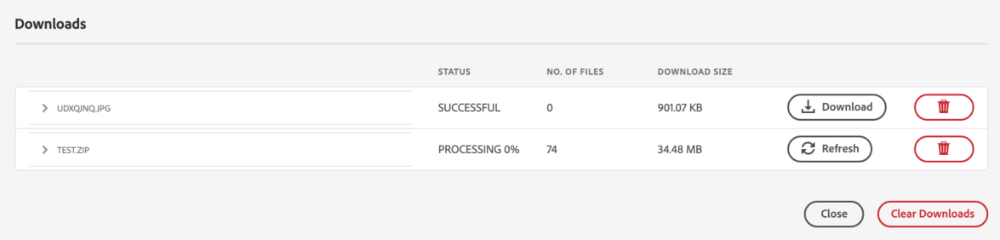

# Hämta resurser från [!DNL Adobe Experience Manager] {#download-assets-from-aem}

Du kan hämta resurser, inklusive statiska och dynamiska återgivningar. Du kan även skicka e-postmeddelanden med länkar till resurser direkt från [!DNL Adobe Experience Manager Assets]. Hämtade resurser paketeras i en ZIP-fil. <!-- The compressed ZIP file has a maximum file size of 1 GB for the export job. A maximum of 500 total assets per export job are allowed. -->

<!--
>[!NOTE]
>
>Recipients of emails must be members of the `dam-users` group to access the ZIP download link in the email message. To be able to download the assets, the members must have permissions to launch workflows that trigger downloading of assets.
-->

Det går inte att hämta resurstyperna Bilduppsättningar, Snurra uppsättningar, Blandade medieuppsättningar och Carousel-uppsättningar.

Du kan hämta Experience Manager-resurser på följande sätt:

<!-- * [Link Share](#link-share-download) -->

* [Experience Manager användargränssnitt](#download-assets)
* [Kommandon för resursdelning](https://adobe-marketing-cloud.github.io/asset-share-commons/)
* [Brand Portal](https://experienceleague.adobe.com/docs/experience-manager-brand-portal/using/introduction/brand-portal.html)
* [Datorprogram](https://experienceleague.adobe.com/docs/experience-manager-desktop-app/using/using.html#download-assets)

## Hämta resurser med [!DNL Experience Manager] gränssnitt {#download-assets}

Asynkron nedladdningstjänst ger ett ramverk för smidig nedladdning av stora resurser. Nedladdningsarkivet är större än 100 GB och delas upp i flera ZIP-arkiv med en maximal storlek på 100 GB vardera. Dessa kan laddas ned separat. Mindre filer hämtas från användargränssnittet i realtid. [!DNL Experience Manager] arkiverar inte enskilda hämtningar av resurser där originalfilen hämtas. Med den här funktionen går det snabbare att ladda ned.

Som standard [!DNL Experience Manager] utlöser ett meddelande när hämtningsarbetsflödet har slutförts. Hämtningsmeddelandet visas i  [[!DNL Experience Manager] Inkorg](/help/sites-cloud/authoring/getting-started/inbox.md).


<!--
The large files are downloaded asynchronously and [!DNL Experience Manager] notifies of the completion via notifications in the Inbox. See [understand [!DNL Experience Manager] Inbox](/help/sites-cloud/authoring/getting-started/inbox.md).


*Figure: Download notification via [!DNL Experience Manager] Inbox.*

Asynchronous downloads are triggered in either of the following case:

* If there are more than 10 assets or more than 100 MB to be downloaded.
* If the download takes more than 30 seconds to prepare.
-->

### Aktivera e-postmeddelanden för stora nedladdningar {#enable-emails-for-large-downloads}

Asynkrona nedladdningar aktiveras i följande fall:

* Om det finns fler än tio resurser
* Om hämtningsstorleken är större än 100 MB
* Om nedladdningen tar mer än 30 sekunder att förbereda

Medan den asynkrona nedladdningen körs i bakgrunden kan användaren fortsätta utforska och arbeta vidare i Experience Manager. Det krävs en färdig mekanism som meddelar användaren när nedladdningen är klar. För att uppnå detta kan administratörer konfigurera e-posttjänsten genom att konfigurera en SMTP-server. Se [konfigurera e-posttjänst](https://experienceleague.adobe.com/docs/experience-manager-cloud-service/content/implementing/developing/development-guidelines.html#sending-email).

När e-posttjänsten har konfigurerats kan administratörer och användare aktivera e-postmeddelanden från Experience Manager-gränssnittet.

Så här aktiverar du e-postmeddelanden:

1. Logga in på [!DNL Experience Manager Assets].
1. Klicka på användarikonen i det övre högra hörnet och klicka sedan på **[!UICONTROL My Preferences]**. Fönstret Användarinställningar öppnas.
1. Välj **[!UICONTROL Asset Download email notifications]** kryssruta och klicka **[!UICONTROL Accept]**.

   


Så här hämtar du resurser:

1. I [!DNL Experience Manager] användargränssnitt, klicka **[!UICONTROL Assets]** > **[!UICONTROL Files]**.
1. Navigera till de resurser du vill hämta. Markera mappen eller välj en eller flera resurser i mappen. I verktygsfältet klickar du på **[!UICONTROL Download]**.

   ![Tillgängliga alternativ vid hämtning av resurser från [!DNL Experience Manager Assets]](/help/assets/assets/asset-download1.png)

1. I hämtningsdialogrutan väljer du de hämtningsalternativ som du vill ha.

   | Hämtningsalternativ | Beskrivning |
   |---|---|
   | **[!UICONTROL Create separate folder for each asset]** | Välj det här alternativet om du vill inkludera varje resurs som du hämtar, inklusive resurser, i underordnade mappar som är kapslade under resursens överordnade mapp i en mapp på den lokala datorn. När det här alternativet är *not* som standard ignoreras mapphierarkin och alla resurser hämtas till en mapp på den lokala datorn. |
   | **[!UICONTROL Email]** | Välj det här alternativet om du vill skicka ett e-postmeddelande (som innehåller en länk till din hämtning) till en annan användare. Mottagaranvändaren måste vara medlem i `dam-users` grupp. Standardmallar för e-post finns på följande platser:<ul><li>`/libs/settings/dam/workflow/notification/email/downloadasset`.</li><li>`/libs/settings/dam/workflow/notification/email/transientworkflowcompleted`.</li></ul> Mallar som du anpassar under distributionen finns på följande platser: <ul><li>`/apps/settings/dam/workflow/notification/email/downloadasset`.</li><li>`/apps/settings/dam/workflow/notification/email/transientworkflowcompleted`.</li></ul>Du kan lagra klientspecifika anpassade mallar på följande platser:<ul><li>`/conf/<tenant_specific_config_root>/settings/dam/workflow/notification/email/downloadasset`.</li><li>`/conf/<tenant_specific_config_root>/settings/dam/workflow/notification/email/transientworkflowcompleted`.</li></ul> |
   | **[!UICONTROL Asset(s)]** | Välj det här alternativet om du vill hämta resursen i dess ursprungliga form utan några återgivningar.<br>Alternativet Delresurser är tillgängligt om den ursprungliga tillgången har delresurser. |
   | **[!UICONTROL Rendition(s)]** | En återgivning är den binära representationen av en resurs. Resurser har en primär representation - den som utgörs av den överförda filen. De kan ha valfritt antal representationer. <br> Med det här alternativet kan du välja de återgivningar du vill hämta. Vilka återgivningar som är tillgängliga beror på vilken resurs du har valt. |
   | **[!UICONTROL Smart Crops]** | Välj det här alternativet om du vill hämta alla smarta beskärningsåtergivningar för den valda resursen inifrån [!DNL Experience Manager]. En ZIP-fil med renderingarna Smart Crop skapas och hämtas till din lokala dator. |
   | **[!UICONTROL Dynamic Rendition(s)]** | Välj det här alternativet om du vill generera en serie alternativa återgivningar i realtid. När du väljer det här alternativet väljer du också de återgivningar som du vill skapa dynamiskt genom att välja bland [Bildförinställning](/help/assets/dynamic-media/image-presets.md) lista. <br>Du kan dessutom välja storlek och måttenhet, format, färgrymd, upplösning och alla valfria bildmodifierare, t.ex. invertering av bilden. Alternativet är bara tillgängligt om du har [!DNL Dynamic Media] aktiverat. |

1. Klicka på **[!UICONTROL Download]**.

   Om e-postmeddelanden har aktiverats för stora nedladdningar visas ett e-postmeddelande med en nedladdnings-URL för den arkiverade zip-mappen i inkorgen. Klicka på nedladdningslänken från e-postmeddelandet för att hämta zip-mappen.

   

   Du kan även visa meddelandet i [!DNL Experience Manager] Inkorgen.

   

## Hämta resurser som delas via länkdelning {#link-share-download}

<!--
>[!NOTE]
>
>This functionality is available in the Experience Manager prerelease channel.
-->

Att dela resurser via en länk är ett bekvämt sätt att göra det tillgängligt för intresserade utan att de först behöver logga in på [!DNL Assets]. Se [Funktionen för delning av länkar](/help/assets/share-assets.md#sharelink).

När användare hämtar resurser från delade länkar, [!DNL Assets] använder en asynkron tjänst som ger snabbare och oavbruten nedladdning. De resurser som ska laddas ned köas i bakgrunden i en inkorg i ZIP-arkiv med hanterbar filstorlek. Vid mycket stora nedladdningar delas nedladdningen in i filer som är 100 GB stora.

I inkorgen visas bearbetningsstatus för varje arkiv. När bearbetningen är klar kan du hämta arkiven från inkorgen.



## Aktivera resurshämtningsserver {#enable-asset-download-servlet}

Standardservleten i [!DNL Experience Manager] tillåter autentiserade användare att utfärda godtyckligt stora, samtidiga hämtningsbegäranden för att skapa ZIP-filer med resurser. Förberedelsen kan påverka prestanda eller till och med överbelasta servern och nätverket. För att minska sådana potentiella DoS-liknande risker som den här funktionen medför, `AssetDownloadServlet` OSGi-komponenten är inaktiverad för publiceringsinstanser. Om du inte behöver nedladdningsfunktionen för författarinstanser inaktiverar du den som skapade den.

Om du vill tillåta hämtning av resurser från DAM, till exempel när du använder Assets Share Commons eller någon annan portalliknande implementering, aktiverar du servleten manuellt via en OSGi-konfiguration. Adobe rekommenderar att du anger en så låg hämtningsstorlek som möjligt utan att det påverkar den dagliga hämtningen. Ett högt värde kan påverka prestandan.

1. Skapa en mapp med en namnkonvention som anger publiceringsmiljön som mål, det vill säga `config.publish`:

   `/apps/<your-app-name>/config.publish`

1. Skapa en ny fil av typen i konfigurationsmappen `nt:file` namngiven `com.day.cq.dam.core.impl.servlet.AssetDownloadServlet.config`.
1. Fylla `com.day.cq.dam.core.impl.servlet.AssetDownloadServlet.config` med följande. Anger en maximal storlek (i byte) för hämtningen som värdet av `asset.download.prezip.maxcontentsize`. Nedanstående exempel konfigurerar den maximala storleken för ZIP-nedladdningen till högst 100 kB.

   ```java
   enabled=B"true"
   asset.download.prezip.maxcontentsize=I"102400"
   ```

## Inaktivera resurshämtningsserver {#disable-asset-download-servlet}

Om du inte behöver nedladdningsfunktionen kan du inaktivera servleten för att förhindra DoS-liknande risker. The `Asset Download Servlet` kan inaktiveras på en [!DNL Experience Manager] skapa och publicera instanser genom att uppdatera dispatcherns konfiguration för att blockera alla förfrågningar om hämtning av resurser. Servern kan även inaktiveras manuellt via OSGi-konsolen direkt.

1. Om du vill blockera resurshämtningsbegäranden via en dispatcher-konfiguration redigerar du `dispatcher.any` konfigurera och lägga till en ny regel i [filtersektion](https://experienceleague.adobe.com/docs/experience-manager-dispatcher/using/configuring/dispatcher-configuration.html#configuring).

   `/0100 { /type "deny" /url "*.assetdownload.zip/assets.zip*" }`

## Tips och begränsningar {#tips-limitations}

* Om du hämtar en tom mapp [!DNL Experience Manager] förmedlar ett meddelande om att ett ZIP-arkiv har skapats, men arkivet har inte skapats.

>[!MORELIKETHIS]
>
>* [Hämta DRM-skyddade resurser](drm.md)
>* [Hämta resurser med datorprogrammet Experience Manager på Win eller Mac](https://experienceleague.adobe.com/docs/experience-manager-desktop-app/using/using.html)
>* [Hämta resurser med Adobe Assets Link inifrån de Adobe Creative Cloud-appar som stöds](https://helpx.adobe.com/se/enterprise/using/manage-assets-using-adobe-asset-link.html)

