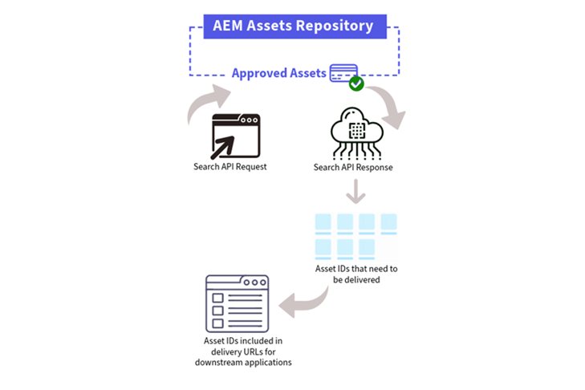

# Dynamic Media med OpenAPI-funktioner {#new-dynaminc-media-apis-overview}

I dagens snabba digitala värld är det avgörande att frigöra potentialen i ert varumärkes digitala resurser för att ligga steget före konkurrenterna. En helhetsbaserad lösning för digital Assets Management (DAM) underlättar materialstyrning, främjar varumärkets enhetlighet och snabbar upp innehållsleveransen samtidigt som man säkerställer varumärkets integritet och exceptionella kundupplevelser.

Dynamic Media med OpenAPI-funktioner sätter DAM i centrum för ett flexibelt och effektivt ekosystem av innehållsleverantörer för att säkerställa resursstyrning och leverans.

## Varför använda Dynamic Media med OpenAPI-funktioner? {#dynamic-media-open-api-features}

Dynamic Media med OpenAPI-funktioner har följande viktiga fördelar:

* **Smidiga integreringar**: Dynamic Media med OpenAPI-funktioner erbjuder en omfattande uppsättning API:er för sökning och leverans. Det gör att utvecklarna enkelt kan [integrera leverans av resurser med sina program](/help/assets/integrate-dynamic-media-open-apis.md). Programmen omfattar både Adobe och tredjepartsprogram. Det har ett [användargränssnitt för resursväljare i Microsoft FrontEnd](/help/assets/asset-selector.md) för att söka efter och välja godkända resurser. Väljaren kan enkelt integreras med alla program som är baserade på JavaScript ramverk som React JS, Angular JS och Vanilla JS.

* **Centraliserad hantering av digitala resurser**: DAM är den enda källan till sanning för alla digitala resurser. Dina digitala resurser hanteras centralt i AEM Assets och levereras till de förbrukande programmen via referens via leverans-URL:er, utan att du behöver kopiera resurbinärfiler.

* **Realtidsuppdateringar**: Alla ändringar som görs i godkända resurser i DAM, inklusive versionsuppdateringar och metadataändringar, återspeglas automatiskt i leverans-URL:erna. Med ett kort TTL-värde (Time-to-Live) på 10 minuter konfigurerat för Dynamic Media med OpenAPI-funktioner via CDN blir uppdateringarna synliga i alla redigerings- och publiceringsgränssnitt på mindre än 10 minuter.

* **Varumärkeskonsekvens**: Endast [varumärkesgodkända resurser](/help/assets/approve-assets.md) exponeras för program längre fram i kedjan. [Varumärkesansvariga och marknadsförare har strikt kontroll över varumärkesresurser](/help/assets/restrict-assets-delivery.md). Det är bara en godkänd och den senaste versionen av resursen som är tillgänglig för användning, vilket garanterar ett enhetligt varumärke i alla kanaler och tillämpningar.

* **Webboptimerad leverans**: Digitala resurser levereras i webboptimerade format för att förbättra de digitala upplevelsernas Core Web Vitals. Detta inkluderar stöd för WebP-återgivningar för bilder, adaptiv direktuppspelning via HLS- eller DASH-protokoll för videor och ursprungliga återgivningar för dokument.

* **Dynamisk resursomformning**: I vårt system går det att göra bildomformningar direkt med URL-parametrar som kallas bildmodifierare. [Till exempel bredd, höjd, rotering, vänd, kvalitet, beskärning, format och smart beskärning](/help/assets/deliver-assets-apis.md). Omformade renderingar genereras dynamiskt och levereras smidigt via CDN.

* **Säker leverans av resurser**: Dynamic Media med OpenAPI-funktioner erbjuder en mekanism för kontroll över åtkomsten till dina digitala resurser. Du kan ange användarroller eller användargrupper som metadata för att skydda resurser och ange en fördefinierad tidsram under vilken [endast behöriga användare kan komma åt dessa resurser](/help/assets/restrict-assets-delivery.md). Leverans-URL:erna för skyddade tillgångar kan inte matchas för obehöriga användare under den begränsade perioden.

* **Datainsikter för att fatta välgrundade beslut (kommande)**: Utöver tillgångshantering och leverans, samlar den in leveransdatainsikter om tillgångsleveranser hos CDN, vilket gör det möjligt för varumärkesansvariga att spåra leveransmått över olika kanaler. Det gör det möjligt för dem att fatta datadrivna beslut för kontinuerlig optimering av resursstyrnings- och leveransstrategier.

## Förutsättningar för att få tillgång till Dynamic Media med OpenAPI-funktioner {#prerequisites-dynaminc-media-open-apis}

För att få tillgång till Dynamic Media med OpenAPI-funktioner måste du ha licenser för:

* AEM Assets as a Cloud Service

* AEM Dynamic Media

## Hur aktiverar man Dynamic Media med OpenAPI-funktioner? {#enable-dynamic-media-open-apis}

Innan du skickar en begäran om att aktivera Dynamic Media med OpenAPI-funktioner i AEM as a Cloud Service måste du kontrollera att det inte redan är aktiverat.

När [Förutsättningar](#prerequisites-dynaminc-media-open-apis) har uppfyllts och om Dynamic Media med OpenAPI-funktioner har aktiverats på din AEM as a Cloud Service-instans finns det en leverans-URL tillgänglig för varje godkänd resurs i databasen. Information om hur du kopierar leverans-URL finns i [Kopiera leverans-URL för godkända resurser](approve-assets.md#copy-delivery-url-approved-assets) . Adobe rekommenderar att du använder den här metoden för att verifiera att Dynamic Media med OpenAPI-funktioner är aktiverat på AEM as a Cloud Service innan du skickar in en supportanmälan för att aktivera den.

Om du vill aktivera Dynamic Media med OpenAPI-funktioner i AEM as a Cloud Service skickar du ett supportärende för Adobe med följande information:

* Program- och miljö-ID för Cloud Service

* Information om hur man använder Dynamic Media med OpenAPI-funktioner.

* Information om de program i senare led som ska integreras med Dynamic Media med OpenAPI-funktioner.

  >[!NOTE]
  >
  > Om du vill integrera med andra program än Adobe anger du domännamn i vitlistan där programmet finns.

* Information om viktiga kundkontakter i integrationsprojektet.

* Lista över viktiga medlemmar i Adobe-kontoteam (e-post).

När du har skickat in supportanmälan aktiverar Adobe Dynamic Media med OpenAPI-funktioner i din Cloud Service-miljö och delar information, som IMS-klient-ID, så att du kan fortsätta med integreringen.

>[!NOTE]
>
>Undanta `/conf/global/settings/dam/assets-configurations/assetdelivery` från alla innehållspaket för att undvika inaktivering av Dynamic Media med OpenAPI-funktioner.

## Fördjupa dig i nyckelfunktionerna {#learn-more-key-capabilities}

<table>
<td>
   
   

      <a href="/help/assets/approve-assets.md">
      <strong>Godkänn resurser i Experience Manager Assets</strong>
      </a>
   

   

      <em>Godkänn resurser i AEM Assets för att effektivisera resurshanteringen och säkerställa en kontrollerad och effektiv process för hantering av resurser.</em>
   

</td>
<td>
   
   

      <a href="/help/assets/integrate-dynamic-media-open-apis.md">
      <strong> Integrera AEM Assets med program längre fram i kedjan </strong>
      </a>
   

   

      <em>Integrera ditt eget anpassade användargränssnitt med Experience Manager Assets-databasen med hjälp av API:erna för sökning och leverans eller använd Adobe Microsoft-Edge Asset Selector.</em>
   

</td>
<td>
   
   

      <a href="/help/assets/asset-selector.md">
      <strong> AdobeMicro-Frontend Asset Selector </strong>
      </a>
   

   

      <em>Ett användargränssnitt som interagerar med AEM Assets-databasen för att söka efter resurser och sedan använda dem i programredigeringsmiljön.</em>
   

</td>
</table>
<table>
<td>
   
   

      <a href="/help/assets/search-assets-api.md">
      <strong> Söka efter resurser i Experience Manager Assets-databasen </strong>
      </a>
   

   

      <em>Sök efter resurser i AEM Assets-databasen så att de kan levereras till program längre fram i kedjan.</em>
   

</td>
<td>
   
   

      <a href="/help/assets/deliver-assets-apis.md">
      <strong> Leverera resurser till program längre fram i kedjan </strong>
      </a>
   

   

      <em>Leverera resurser till integrerade program längre fram i kedjan med en leverans-URL.</em>
   

</td>
<td>
   
   

      <a href="/help/assets/restrict-assets-delivery.md">
      <strong> Begränsa åtkomst till resurser i Experience Manager </strong>
      </a>
   

   

      <em> DAM-administratör eller varumärkesansvariga begränsar åtkomsten genom att konfigurera roller för godkända resurser på AEM as a Cloud Service-författarinstansen.</em>
   

</td>
</table>

