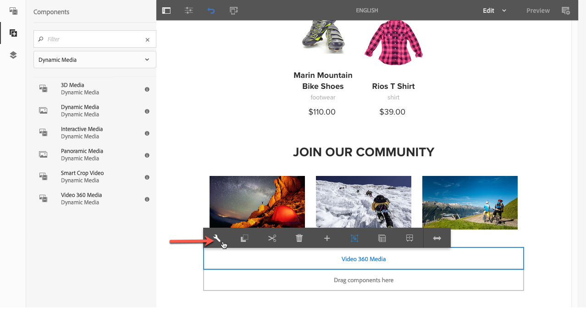
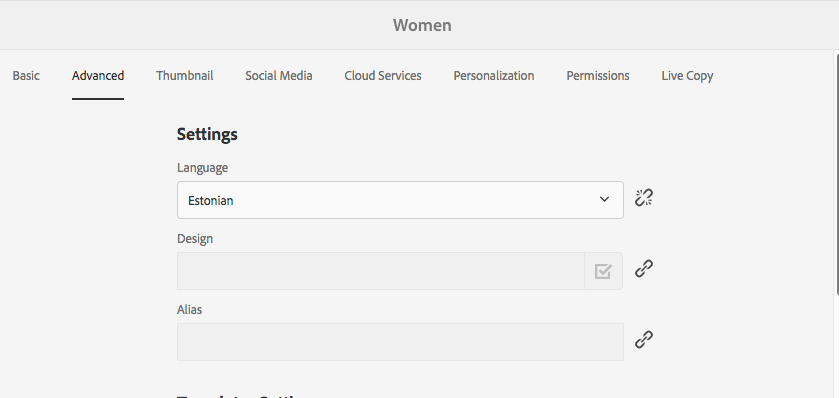

# Adding Dynamic Media Assets to Pages{#adding-dynamic-media-assets-to-pages}

Om du vill lägga till Dynamic Media-funktionen i resurser som används på era webbplatser kan du lägga till komponenten **dynamiska medier**, **interaktiva medier**, **panoramamedier** eller **360-videomedier** direkt på sidan. Det gör du genom att gå in i layoutläget och aktivera Dynamic Media-komponenterna. Sedan kan du lägga till komponenterna på sidan och lägga till resurser i komponenterna. Dynamic Media-komponenterna är smarta – de känner av om du lägger till en bild eller en video och konfigurationsalternativen ändras i enlighet med detta.

Du lägger till Dynamic Media-resurser direkt på sidan om du använder AEM som innehållshanteringssystem. Om ni använder en annan leverantör för innehållshanteringssystemet kan ni antingen [länka](/help/assets/dynamic-media/linking-urls-to-yourwebapplication.md) eller [bädda in](/help/assets/dynamic-media/embed-code.md) resurserna. Om du har en responsiv webbplats hos en extern leverantör läser du [Leverera optimerade bilder till en responsiv webbplats](/help/assets/dynamic-media/responsive-site.md).

>[!NOTE]
>
>Du måste publicera resurser innan du lägger till dem på sidor i AEM. See [Publishing Dynamic Media Assets](/help/assets/dynamic-media/publishing-dynamicmedia-assets.md).

## Lägga till en Dynamic Media-komponent på en sida {#adding-a-dynamic-media-component-to-a-page}

Att lägga till en 3D-mediekomponent, Dynamic Media, Interactive Media, Panoramic Media, Smart Crop Video eller Video 360 Media på en sida är detsamma som att lägga till en komponent på en sida. Komponenterna för dynamiska media beskrivs i följande avsnitt.

**Lägga till en Dynamic Media-komponent på en sida**

1. Öppna AEM sidan där du vill lägga till komponenten Dynamic Media.
1. Tryck på **[!UICONTROL Components]** ikonen i den vänstra rutan och filtrera sedan efter Dynamic Media.

   Om det inte finns någon lista över dynamiska mediakomponenter behöver du troligen aktivera de dynamiska mediakomponenter som du vill använda. Se [Aktivera komponenter](#enabling-dynamic-media-components)för dynamiska media.

   

1. Dra en **[!UICONTROL Dynamic Media]** komponent och släpp den på önskad plats på sidan.

1. Håll muspekaren direkt på komponenten. När komponenten är omgiven av en blå ruta trycker du en gång för att visa komponentens verktygsfält. Tryck på **[!UICONTROL Configuration (wrench)]** ikonen.

   

1. Beroende på vilken Dynamic Media-komponent du släppte på sidan öppnas en konfigurationsdialogruta. [Ange komponentens alternativ](/help/assets/dynamic-media/adding-dynamic-media-assets-to-pages.md#dynamic-media-components) efter behov.

   I exemplet nedan visas dialogrutan **[!UICONTROL Video 360 Media]** för komponenten Dynamic Media och de alternativ som är tillgängliga i listrutan för visningsförinställningar.

   

   Dynamic Media Video 360 Media-komponenten.

1. När du är klar trycker du på bockmarkeringen i dialogrutans övre högra hörn för att spara ändringarna.

### Aktivera komponenter för dynamiska media {#enabling-dynamic-media-components}

Om det inte finns några tillgängliga Dynamic Media-komponenter att lägga till på en sida betyder det troligen att du först måste aktivera de komponenter som du vill använda.

1. Öppna AEM sidan där du vill lägga till komponenten Dynamic Media.
1. Tryck på ikonen Sidinformation till vänster i verktygsfältet längst upp på sidan och tryck sedan på **[!UICONTROL Edit Template]** listrutan.

   

1. Tryck på i listrutan till höger om verktygsfältet uppe på sidan **[!UICONTROL Structure]**.

   

1. Långt ned på sidan: tryck **[!UICONTROL Layout Container]** för att öppna verktygsfältet och sedan på ikonen Policy.
1. Kontrollera att fliken är markerad under rubriken på **[!UICONTROL Layout Container]** sidan, under **[!UICONTROL Properties]** rubriken **[!UICONTROL Allowed Components]** .

   

1. Rulla tills du ser **[!UICONTROL Dynamic Media]**.
1. Tryck på ikonen > till vänster om för **[!UICONTROL Dynamic Media]** att utöka listan och välj de dynamiska mediakomponenter som du vill aktivera.

   

1. I närheten av det övre högra hörnet på **[!UICONTROL Layout Container]** sidan trycker du på ikonen Klar (bock).

1. Till höger om verktygsfältet uppe på sidan trycker du på **[!UICONTROL Initial Content]** i listrutan och [lägger sedan till en Dynamic Media-komponent på en sida](#adding-a-dynamic-media-component-to-a-page) som vanligt.

## Lokalisera dynamiska mediakomponenter {#localizing-dynamic-media-components}

Du kan lokalisera komponenter för dynamiska media på ett av två sätt:

* Från en webbsida i Sites öppnar du **[!UICONTROL Properties]** och väljer fliken **[!UICONTROL Advanced]**. Välj språk för lokalisering.

   

* Välj önskad sida eller sidgrupp i platsväljaren. Tryck **[!UICONTROL Properties]** och välj **[!UICONTROL Advanced]** fliken. Välj språk för lokalisering.

   >[!NOTE]
   >
   >Observera att inte alla språk som är tillgängliga på **[!UICONTROL Language]** menyn har tilldelade variabler.

## Tillgängliga dynamiska mediakomponenter {#dynamic-media-components}

Dynamiska mediekomponenter är tillgängliga när du trycker på **[!UICONTROL Components]** ikonen och sedan filtrerar på **[!UICONTROL Dynamic Media]**.

De dynamiska mediakomponenterna som är tillgängliga omfattar följande:

* **[!UICONTROL Dynamic Media]** – Används för t.ex. bilder, video, e-kataloger och rotationsuppsättningar.
* **[!UICONTROL Interactive Media]** - Använd för interaktiva resurser som interaktiv video, interaktiva bilder eller karuselluppsättningar.
* **[!UICONTROL Panoramic Media]** - Används för panoramabilder eller panoramabilder från VR.
* **[!UICONTROL Video 360 Media]** - Används för 360-video och 360-VR-videomaterial.

>[!NOTE]
>
>De här komponenterna är inte tillgängliga som standard och måste göras tillgängliga via mallredigeraren innan du använder dem. När de har gjorts tillgängliga i mallredigeraren kan du lägga till komponenterna på sidan på samma sätt som andra AEM.

### Komponent: Dynamiska medier {#dynamic-media-component}

Komponenten Dynamic Media är smart. Beroende på om du lägger till en bild eller en video har du olika alternativ. Komponenten har stöd för bildförinställningar, bildbaserade visningsprogram som bilduppsättningar, snurra, blandade medieuppsättningar och video. Dessutom är visningsprogrammet responsivt - skärmstorleken ändras automatiskt baserat på skärmstorleken. Alla visningsprogram är HTML5-visningsprogram.

>[!NOTE]
>
>Om din webbsida har följande:
>
>* Flera instanser av komponenten Dynamic Media används på samma sida.
>* Varje instans använder samma resurstyp.

>
>
Tänk på att det inte går att tilldela olika visningsprogramförinställningar till varje Dynamic Media-komponent på den sidan.
>
>Du kan dock använda samma visningsförinställning för alla komponenter för dynamiska media som använder resurser av samma typ på sidan.

När du lägger till komponenten Dynamic Media och **[!UICONTROL Dynamic Media Settings]** är tom eller du inte kan lägga till en resurs på rätt sätt ska du kontrollera följande:

* Bilden har en pyramidformad fil. Bilder som importerats innan dynamiska medier aktiverats har ingen pyramiddiff-fil.

#### När du arbetar med bilder {#when-working-with-images}

Med komponenten Dynamic Media kan du lägga till dynamiska bilder, inklusive bilduppsättningar, snurpuppsättningar och blandade medieuppsättningar. Du kan zooma in, zooma ut och, om tillämpligt, vrida en bild i en snurra eller välja en bild från en annan typ av uppsättning.

Du kan också konfigurera visningsförinställningen, bildförinställningen eller bildformatet direkt i komponenten. Om du vill göra en bild responsiv kan du antingen ange brytpunkter eller använda en responsiv bildförinställning.

Du kan redigera följande dynamiska mediainställningar genom att trycka på **[!UICONTROL Edit]** ikonen i komponenten och sedan **[!UICONTROL Dynamic Media Settings]**.

>[!NOTE]
>
>Som standard är Dynamic Media-bildkomponenten adaptiv. Om du vill att den ska ha en fast storlek anger du det i komponenten på fliken **[!UICONTROL Advanced]** med **[!UICONTROL Width]** och **[!UICONTROL Height]**.

* **[!UICONTROL Viewer preset]**- Välj en befintlig visningsförinställning i listrutan. Om den visningsförinställning som du söker efter inte visas kan du behöva göra den synlig. Se Hantera förinställningar för visningsprogram. Du kan inte välja en visningsförinställning om du använder en bildförinställning och vice versa.

   Det här är det enda tillgängliga alternativet om du visar bilduppsättningar, snurruppsättningar eller blandade medieuppsättningar. De visningsförinställningar som visas är också smarta - endast relevanta visningsprogramförinställningar visas.

* **[!UICONTROL Viewer modifiers]**—Visningsmodifierare har formen av namn=värde-par med en &amp;-avgränsare och du kan ändra visningsprogram enligt riktlinjerna i referenshandboken för visningsprogrammen. Ett exempel på en visningsmodifierare är `posterimage=img.jpg&caption=text.vtt,1` som ställer in en annan bild för videominiatyrbilden och kopplar en undertextningsfil till videon.

* **[!UICONTROL Image preset]**- Välj en befintlig bildförinställning i listrutan. Om den bildförinställning du söker inte syns kan du behöva göra den synlig. Se Hantera bildförinställningar. Du kan inte välja en visningsförinställning om du använder en bildförinställning och vice versa.

   Det här alternativet är inte tillgängligt om du visar bilduppsättningar, snurruppsättningar eller blandade medieuppsättningar.

* **[!UICONTROL Image Modifiers]**- Du kan använda bildeffekter genom att ange ytterligare bildkommandon. Dessa beskrivs i Bildförinställningar och i Referens för bildserverkommando.

   Det här alternativet är inte tillgängligt om du visar bilduppsättningar, snurruppsättningar eller blandade medieuppsättningar.

* **[!UICONTROL Breakpoints]**- Om du använder den här resursen på en responsiv webbplats måste du lägga till bildbrytpunkter. Bildbrytpunkter måste avgränsas med kommatecken (,). Det här alternativet fungerar när ingen höjd eller bredd har definierats i en bildförinställning.

   Det här alternativet är inte tillgängligt om du visar bilduppsättningar, snurruppsättningar eller blandade medieuppsättningar.

   You can edit the following Advanced Settings by tapping **[!UICONTROL Edit]** in the component.

* **[!UICONTROL Title]**—Ändra bildens titel.

* **[!UICONTROL Alt Text]**—Lägg till en titel i bilden för användare som har bilder inaktiverade.

   Det här alternativet är inte tillgängligt om du visar bilduppsättningar, snurruppsättningar eller blandade medieuppsättningar.

* **[!UICONTROL URL, Open in]**—Du kan ange att en resurs ska öppna en länk. Ange URL:en och Öppna i anger om du vill att den ska öppnas i samma fönster eller i ett nytt fönster.

   Det här alternativet är inte tillgängligt om du visar bilduppsättningar, snurruppsättningar eller blandade medieuppsättningar.

* **[!UICONTROL Width]**—Ange värdet i pixlar om du vill att bilden ska ha en fast storlek. Om du lämnar det här värdet tomt anpassas resursen.

* **[!UICONTROL Height]**—Ange värdet i pixlar om du vill att bilden ska ha en fast storlek. Om du lämnar det här värdet tomt anpassas resursen.

#### När du arbetar med video {#when-working-with-video}

Använd komponenten Dynamic Media för att lägga till dynamisk video på dina webbsidor. När du redigerar komponenten kan du välja att använda en fördefinierad videovisningsförinställning för att spela upp videon på sidan.

Du kan redigera följande dynamiska mediainställningar genom att klicka **[!UICONTROL Edit]** i komponenten.

>[!NOTE]
>
>Som standard är videokomponenten för dynamiska media adaptiv. If you want to make it a fixed size, set it in the component with the **[!UICONTROL Width]** and **[!UICONTROL Height]** in the **[!UICONTROL Advanced]** tab.

* **[!UICONTROL Viewer preset]**- Välj en befintlig förinställning för visningsprogrammet för video i listrutan. Om den visningsförinställning som du söker efter inte visas kan du behöva göra den synlig. Se Hantera förinställningar för visningsprogram.

* **[!UICONTROL Viewer modifiers]**—Visningsmodifierare har formen av namn=värde-par med en &amp;-avgränsare och du kan ändra visningsprogram enligt riktlinjerna i referenshandboken för Adobe. Ett exempel på en visningsmodifierare är `posterimage=img.jpg&caption=text.vtt,1`

   Med visningsmodifierare kan du till exempel göra följande:

   * Associera en bildtextfil med en video: [bildtext](https://docs.adobe.com/content/help/en/dynamic-media-developer-resources/library/viewers-aem-assets-dmc/video/command-reference-url-video/r-html5-video-viewer-url-caption.html)
   * Associera en navigeringsfil med en video: [navigering](https://docs.adobe.com/content/help/en/dynamic-media-developer-resources/library/viewers-aem-assets-dmc/video/command-reference-url-video/r-html5-video-viewer-url-navigation.html)

   You can edit the following Advanced Settings by clicking **[!UICONTROL Edit]** in the component.

* **[!UICONTROL Title]**—Ändra videons titel.

* **[!UICONTROL Width]**—Ange värdet i pixlar om du vill att bilden ska ha en fast storlek. Om du lämnar det här värdet tomt anpassas resursen.

* **[!UICONTROL Height]**—Ange värdet i pixlar om du vill att bilden ska ha en fast storlek. Om du lämnar det här värdet tomt anpassas resursen.

#### När du arbetar med smart beskärning {#when-working-with-smart-crop}

Använd komponenten Dynamic Media för att lägga till bildresurser för smart beskärning på dina webbsidor. När du redigerar komponenten kan du välja att använda en fördefinierad videovisningsförinställning för att spela upp videon på sidan.

Se [Använda smart beskärning med AEM Assets Dynamic Media](https://docs.adobe.com/content/help/en/experience-manager-learn/assets/dynamic-media/smart-crop-feature-video-use.html)

Se även [Bildprofiler](/help/assets/dynamic-media/image-profiles.md).

Du kan redigera följande dynamiska mediainställningar genom att klicka **[!UICONTROL Edit]** i komponenten.

>[!NOTE]
>
>Som standard är Dynamic Media-bildkomponenten adaptiv. Om du vill att den ska ha en fast storlek anger du det i komponenten på fliken **[!UICONTROL Advanced]** med **[!UICONTROL Width]** och **[!UICONTROL Height]**.

* **[!UICONTROL Image Modifiers]**- Du kan använda bildeffekter genom att ange ytterligare bildkommandon. Dessa beskrivs i Bildförinställningar och i Referens för bildserverkommando.

   Det här alternativet är inte tillgängligt om du visar bilduppsättningar, snurruppsättningar eller blandade medieuppsättningar.

   You can edit the following Advanced Settings by clicking **[!UICONTROL Edit]** in the component.

* **[!UICONTROL Enable Aspect Ration match]**—Välj det här alternativet om du vill att Dynamic Media ska välja en smart beskärningsåtergivning med de proportioner som bäst matchar originalbildens proportioner.

* **[!UICONTROL Title]**- Ändra titeln på bilden för smart beskärning.

* **[!UICONTROL Alt Text]**—Lägg till en titel i den smarta beskärningsbilden för de användare som har inaktiverat grafik.

   Det här alternativet är inte tillgängligt om du visar bilduppsättningar, snurruppsättningar eller blandade medieuppsättningar.

* **[!UICONTROL URL, Open in]**—Du kan ange att en resurs ska öppna en länk. Ange URL:en och Öppna i anger om du vill att den ska öppnas i samma fönster eller i ett nytt fönster.

   Det här alternativet är inte tillgängligt om du visar bilduppsättningar, snurruppsättningar eller blandade medieuppsättningar.

* **[!UICONTROL Width]**—Ange värdet i pixlar om du vill att bilden ska ha en fast storlek. Om du lämnar det här värdet tomt anpassas resursen.

* **[!UICONTROL Height]**—Ange värdet i pixlar om du vill att bilden ska ha en fast storlek. Om du lämnar det här värdet tomt anpassas resursen.

### Komponent: Interaktiva media {#interactive-media-component}

Komponenten Interactive Media är till för de resurser som har interaktivitet i dem, till exempel hotspot-områden eller bildscheman. Om du har en interaktiv bild, interaktiv video eller karusellbanderoll använder du **[!UICONTROL Interactive Media]** komponenten.

Komponenten Interactive Media är smart. Beroende på om du lägger till en bild eller en video har du olika alternativ. Dessutom är visningsprogrammet responsivt - skärmstorleken ändras automatiskt baserat på skärmstorleken. Alla visningsprogram är HTML5-visningsprogram.

>[!NOTE]
>
>Om din webbsida har följande:
>
>* Flera instanser av komponenten Interactive Media används på samma sida.
>* Varje instans använder samma resurstyp.

>
>
Tänk på att det inte går att tilldela olika visningsprogramförinställningar till varje interaktiv mediekomponent på den sidan.
>
>Du kan dock använda samma visningsförinställning för alla interaktiva mediekomponenter som använder resurser av samma typ på sidan.

Du kan redigera följande **[!UICONTROL General]** inställningar genom att trycka på **[!UICONTROL Edit]** i komponenten.

* **[!UICONTROL Viewer preset]**- Välj en befintlig visningsförinställning i listrutan. Om den visningsförinställning som du söker efter inte visas kan du behöva göra den synlig. Förinställningar för visningsprogram måste publiceras innan de kan användas. Se Hantera förinställningar för visningsprogram.

* **[!UICONTROL Title]**—Ändra videons titel.

* **[!UICONTROL Width]**—Ange värdet i pixlar om du vill att bilden ska ha en fast storlek. Om du lämnar det här värdet tomt anpassas resursen.

* **[!UICONTROL Height]**—Ange värdet i pixlar om du vill att bilden ska ha en fast storlek. Om du lämnar det här värdet tomt anpassas resursen.

   You can edit the following **[!UICONTROL Add To Cart]** settings by clicking **[!UICONTROL Edit]** in the component.

* **[!UICONTROL Show Product Asset]**—Som standard är det här värdet valt. Produktresursen visar en bild av produkten enligt definitionen i modulen Handel. Avmarkera kryssrutan om du inte vill visa produktresursen.

* **[!UICONTROL Show Product Price]**—Som standard är det här värdet valt. Produktpriset visar priset för artikeln enligt definitionen i modulen Handel. Avmarkera kryssrutan om du inte vill visa produktpriset.

* **[!UICONTROL Show Product Form]**—Som standard är det här värdet inte markerat. Produktformuläret innehåller alla produktvarianter som storlek och färg. Avmarkera kryssrutan om du inte vill visa produktvarianterna.

### Komponent: Panoramabilder {#panoramic-media-component}

Komponenten för panoramamedia är avsedd för resurser som är sfäriska panoramabilder. Sådana bilder ger en 360-gradig visningsupplevelse av ett rum, en egenskap, en plats eller ett landskap. För att en bild ska kvalificeras som ett sfäriskt panorama måste den ha antingen ett ELLER båda av följande:

* Proportionerna 2:1.
* Taggad med nyckelorden `equirectangular` eller (`spherical` + `panorama`) eller (`spherical` + `panoramic`). Se [Använda taggar](/help/sites-cloud/authoring/features/tags.md).

Kriterierna för proportioner och nyckelord gäller även för panoramaresurser på sidan med resursinformation och för komponenten **[!UICONTROL Panoramic Media]** i innehållshanteringssystemet.

>[!NOTE]
>
>Om din webbsida har följande:
>
>* Flera instanser av **[!UICONTROL Panoramic Media]** komponenten som används på samma sida.
>* Varje instans använder samma resurstyp.

>
>
Tänk på att det inte går att tilldela olika visningsförinställningar till alla **[!UICONTROL Panoramic Media]**-komponenter på sidan.
>
>Du kan dock använda samma visningsförinställning för alla panoramakomponenter som använder resurser av samma typ på sidan.

Du kan redigera följande inställning genom att trycka på **[!UICONTROL Configure]** i komponenten.

* **[!UICONTROL Viewer Preset]**- Välj ett befintligt visningsprogram på den nedrullningsbara menyn Visningsförinställning.

Om den visningsförinställning du söker efter inte visas kontrollerar du att den är publicerad. Du måste publicera förinställningarna för visningsprogrammet innan du kan använda dem. Se [Hantera visningsförinställningar](/help/assets/dynamic-media/managing-viewer-presets.md).

### Komponent: Video 360 Media {#video-media-component}

Använd **[!UICONTROL Video 360 Media]** komponenten för att återge ekvirektangulär video på din webbsida för en engagerande upplevelse av ett rum, en egenskap, plats, landskap eller medicinskt förfarande.

Vid uppspelning på en platt skärm har användaren kontroll över betraktningsvinkeln. uppspelning på mobila enheter utnyttjar vanligtvis de inbyggda gyroskopiska kontrollerna.

Visningsprogrammet har inbyggt stöd för leverans av 360 videomaterial. Som standard krävs ingen ytterligare konfiguration för visning eller uppspelning. Du levererar 360-video med standardvideotillägg som .mp4, .mkv och .mov. Den vanligaste kodeken är H.264.

Du kan redigera följande inställning genom att trycka på **[!UICONTROL Configure]** i komponenten.

* **[!UICONTROL Viewer Preset]**- Välj ett befintligt visningsprogram på den nedrullningsbara menyn Visningsförinställning. Använd Video360VR för slutanvändare som använder virtuella verklighetsglasögon. Innehåller grundläggande videouppspelningskontroller och funktioner för sociala medier. Använd Video360_social som innehåller grundläggande videouppspelningskontroller. Videoåtergivning sker i stereoläge. Manuell vypunktskontroll är inaktiverad men gyroskopisk kontroll är aktiverad. Det finns inga funktioner för sociala medier.

Om den visningsförinställning du söker efter inte visas kontrollerar du att den är publicerad. Du måste publicera förinställningarna för visningsprogrammet innan du kan använda dem. Se [Hantera visningsförinställningar](/help/assets/dynamic-media/managing-viewer-presets.md).

### Använda HTTP/2 för att leverera Dynamic Media-resurser {#using-http-to-delivery-dynamic-media-assets}

HTTP/2 är det nya, uppdaterade webbprotokollet som förbättrar kommunikationen mellan webbläsare och servrar. Det ger snabbare överföring av information och minskar mängden processorkraft som behövs. Dynamic Media-material kan nu levereras via HTTP/2 vilket ger bättre respons och laddningstider.

Se [HTTP2 Delivery of Content](/help/assets/dynamic-media/http2faq.md) för fullständig information om hur du kommer igång med HTTP/2 med ditt Dynamic Media-konto.

>[!MORELIKETHIS]
>
>* [Använda videospelaren i AEM Dynamic Media](https://docs.adobe.com/content/help/en/experience-manager-learn/assets/dynamic-media/dynamic-media-video-player-feature-video-use.html)
>* [Använda interaktiv video med AEM Dynamic Media](https://docs.adobe.com/content/help/en/experience-manager-learn/assets/dynamic-media/dynamic-media-interactive-video-feature-video-use.html)
>* [Om resursvisningsprogrammet med AEM Dynamic Media](https://docs.adobe.com/content/help/en/experience-manager-learn/assets/dynamic-media/dynamic-media-viewer-feature-video-understand.html)
>* [Använda anpassade videominiatyrer med AEM Dynamic Media](https://docs.adobe.com/content/help/en/experience-manager-learn/assets/dynamic-media/dynamic-media-video-thumbnails-feature-video-use.html)
>* [Färghantering med AEM Dynamic Media](https://docs.adobe.com/content/help/en/experience-manager-learn/assets/dynamic-media/dynamic-media-color-management-technical-video-setup.html)
>* [Använda bildskärpa med AEM Dynamic Media](https://docs.adobe.com/content/help/en/experience-manager-learn/assets/dynamic-media/dynamic-media-image-sharpening-feature-video-use.html)

