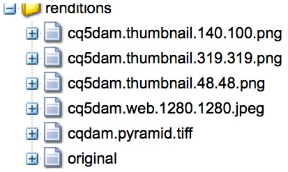

# Konfigurera Dynamic Media Cloud Service {#configuring-dynamic-media-scene-mode}

Om du använder Adobe Experience Manager för olika miljöer, till exempel en för utveckling, en för staging och en för liveproduktion, måste du konfigurera Dynamic Media-Cloud Servicens för var och en av dessa miljöer.

## Arkitektur för Dynamic Media {#architecture-diagram-of-dynamic-media-scene-mode}

Följande arkitekturdiagram beskriver hur Dynamic Media fungerar.

Med den nya arkitekturen ansvarar AEM för primära källresurser och synkronisering med Dynamic Media för bearbetning och publicering av resurser:

1. När den primära källresursen överförs till AEM replikeras den till Dynamic Media. I det läget hanterar Dynamic Media all materialbearbetning och återgivningsgenerering, till exempel videokodning och dynamiska varianter av en bild.
1. När återgivningarna har genererats kan AEM på ett säkert sätt få åtkomst till och förhandsgranska de dynamiska fjärråtergivningarna (inga binärfiler skickas tillbaka till AEM).
1. När innehållet är klart att publiceras och godkännas utlöses Dynamic Media-tjänsten att skicka ut innehållet till leveransservrar och cachelagra innehållet vid CDN.


<!-- OBSOLETE CONTENT

## (Optional) Migrating Dynamic Media presets and configurations from 6.3 to 6.5 Zero Downtime {#optional-migrating-dynamic-media-presets-and-configurations-from-to-zero-downtime}

If you are upgrading AEM Dynamic Media from 6.3 to 6.4 or 6.5 (which now includes the ability for zero downtime deployments), you are required to run the following curl command to migrate all your presets and configurations from `/etc` to `/conf` in CRXDE Lite.

>[!NOTE]
>
>If you run your AEM instance in compatibility mode--that is, you have the compatibility packaged installed--you do not need to run these commands.

For all upgrades, either with or without the compatibility package, you can copy the default, out-of-the-box viewer presets that originally came with Dynamic Media by running the following Linux curl command:

`curl -u admin:admin -X POST https://<server_address>:<server_port>/libs/settings/dam/dm/presets/viewer.pushviewerpresets.json`

To migrate any custom viewer presets and configurations that you have created from `/etc` to `/conf`, run the following Linux curl command:

`curl -u admin:admin -X POST https://<server_address>:<server_port>/libs/settings/dam/dm/presets.migratedmcontent.json`

-->

## Konfigurera Dynamic Media Cloud Service {#configuring-dynamic-media-cloud-services}

**Innan du konfigurerar Dynamic Media Cloud Service**: När du har fått ditt e-postmeddelande med inloggningsuppgifter för Dynamic Media måste du [logga in](https://www.adobe.com/marketing-cloud/experience-manager/scene7-login.html) på Dynamic Media Classic för att ändra ditt lösenord. Lösenordet som anges i e-postmeddelandet om etablering genereras av systemet och är endast avsett som ett tillfälligt lösenord. Det är viktigt att du uppdaterar lösenordet så att Dynamic Media Cloud Service har rätt autentiseringsuppgifter.

Så här konfigurerar du molntjänster för dynamiska media:

1. I AEM trycker du på AEM logotyp för att komma åt den globala navigeringskonsolen.
1. Till vänster om konsolen, under rubriken **[!UICONTROL Tools]**, trycker du på **[!UICONTROL Cloud Services > Dynamic Media Configuration]**.
1. På sidan Läsare för Dynamic Media-konfiguration trycker du i den vänstra rutan på **[!UICONTROL global]** (tryck inte på och välj inte mappikonen till vänster om **[!UICONTROL global]**) och sedan trycker du på **[!UICONTROL Create]**.
1. På sidan Skapa dynamisk mediekonfiguration anger du en titel, e-postadress för Dynamic Media-kontot, lösenord och väljer sedan region. Dessa tillhandahålls av Adobe i e-postmeddelandet om etablering. Kontakta supporten om du inte fått detta.
1. Klicka på **[!UICONTROL Connect to Dynamic Media]**.

   >[!NOTE]
   >
   >När du har fått ditt e-postmeddelande med inloggningsuppgifter för Dynamic Media loggar du [in på](https://www.adobe.com/marketing-cloud/experience-manager/scene7-login.html) Dynamic Media Classic för att ändra ditt lösenord. Lösenordet som anges i e-postmeddelandet om etablering genereras av systemet och är endast avsett som ett tillfälligt lösenord. Det är viktigt att du uppdaterar lösenordet så att molntjänsten Dynamic Media är konfigurerad med rätt autentiseringsuppgifter.

1. När anslutningen lyckas kan du ange följande:

   * **[!UICONTROL Company]** - namnet på Dynamic Media-kontot. Det är möjligt att du har flera Dynamic Media-konton för olika undervarumärken, divisioner eller olika miljöer för staging/produktion.

   * **[!UICONTROL Company Root Folder Path]**

   * **[!UICONTROL Publishing Assets]** - Du kan välja mellan följande tre alternativ:
      * **[!UICONTROL Immediately]** betyder att när resurser överförs, importeras resurserna och URL:en/inbäddningen anges omedelbart. Ingen användaråtgärd krävs för att publicera resurser.
      * **[!UICONTROL Upon Activation]** betyder att du måste publicera resursen explicit innan en URL/Embed-länk anges.
      * **[!UICONTROL Selective Publish]** betyder att resurser automatiskt publiceras för säker förhandsvisning och kan publiceras explicit till AEM utan publicering till DMS7 för att distribueras offentligt. I framtiden kommer Adobe att förbättra detta alternativ för att publicera resurser till AEM och publicera resurser till Dynamic Media, som inte utesluter varandra. Det innebär att du kan publicera resurser på DMS7 så att du kan använda funktioner som Smart Crop eller dynamiska återgivningar. Du kan också publicera resurser exklusivt i AEM för förhandsgranskning. samma resurser inte publiceras i DMS7 för att distribueras offentligt.
   * **[!UICONTROL Secure Preview Server]** - gör att du kan ange URL-sökvägen till förhandsgranskningsservern för säkra återgivningar. Det innebär att när renderingar har genererats kan AEM på ett säkert sätt komma åt och förhandsgranska de dynamiska fjärrrenderingarna (inga binärfiler skickas tillbaka till AEM).
Om du inte har ett särskilt arrangemang för att använda ditt företags server eller en speciell server rekommenderar Adobe Systems att du låter den här inställningen vara kvar som den har angetts.

   * **[!UICONTROL Sync all content]** - Markerat som standard. Avmarkera det här alternativet om du vill inkludera eller exkludera resurser från synkroniseringen till dynamiska media. Om du avmarkerar det här alternativet kan du välja mellan följande två synkroniseringslägen för dynamiska media:

   * **[!UICONTROL Dynamic Media sync mode]**
      * **[!UICONTROL Enabled by default]** - Konfigurationen används som standard på alla mappar såvida du inte markerar en mapp som är exkluderad. <!-- you can then deselect the folders that you do not want the configuration applied to.-->
      * **[!UICONTROL Disabled by default]** - Konfigurationen tillämpas inte på någon mapp förrän du uttryckligen markerar en vald mapp för synkronisering till Dynamic Media.
Om du vill markera en vald mapp för synkronisering med Dynamic Media öppnar du sidan Egenskaper för resursmappen. Tryck på **[!UICONTROL Details]** fliken och välj sedan ett av följande tre alternativ i **[!UICONTROL Dynamic Media sync mode]** listrutan. Spara sedan knappen **[!UICONTROL Save]**.
         * **[!UICONTROL Inherited]** - Det finns inget explicit synkroniseringsvärde i mappen; I stället ärver mappen synkroniseringsvärdet från en av de överordnade mapparna eller standardläget i molnkonfigurationen. Detaljerad status för ärvda program genom ett verktygstips.
         * **[!UICONTROL Enable for sub-folders]** - Inkludera allt i det här underträdet för synkronisering till Dynamic Media. De mappspecifika inställningarna åsidosätter standardläget i molnkonfigurationen.
         * **[!UICONTROL Disabled for sub-folders]** - Uteslut allt i det här underträdet från synkronisering till Dynamic Media.

   >[!NOTE]
   >
   >Det finns inget stöd för versionshantering i Dynamic Media. Dessutom gäller fördröjd aktivering endast om **[!UICONTROL Publish Assets]** på sidan Redigera Dynamic Media-konfiguration är inställd på **[!UICONTROL Upon Activation]** och då endast tills resursen aktiveras första gången.
   >
   >
   >När en mediefil har aktiverats publiceras uppdateringar direkt till S7 Delivery.

   

1. Tryck på **[!UICONTROL Save]**.
1. Om du vill förhandsgranska dynamiskt mediematerial på ett säkert sätt innan det publiceras måste du &quot;tillåtslista&quot; den AEM författarinstansen för att ansluta till Dynamic Media:

   * Logga in på ditt konto för Dynamic Media Classic: [https://www.adobe.com/marketing-cloud/experience-manager/scene7-login.html](https://www.adobe.com/marketing-cloud/experience-manager/scene7-login.html). Dina autentiseringsuppgifter och din inloggning tillhandahölls av Adobe vid tidpunkten för etableringen. Om du inte har den här informationen kontaktar du teknisk support.
   * Klicka på i navigeringsfältet uppe till höger på sidan **[!UICONTROL Setup > Application Setup > Publish Setup > Image Server]**.

   * Välj **[!UICONTROL Test Image Serving]** i listrutan Publiceringskontext på sidan Image Server Publish Context.
   * Tryck på **[!UICONTROL Add]** Klientadressfiltret.
   * Markera kryssrutan för att aktivera (aktivera) adressen och ange sedan IP-adressen för AEM Author-instansen (inte Dispatcher IP).
   * Klicka på **[!UICONTROL Save]**.

Du är nu klar med den grundläggande konfigurationen; är du redo att använda Dynamic Media.

Om du vill anpassa konfigurationen ytterligare kan du utföra alla uppgifter under [Konfigurera avancerade inställningar i Dynamic Media](#optional-configuring-advanced-settings-in-dynamic-media-scene-mode).

## (Valfritt) Konfigurera avancerade inställningar i Dynamic Media{#optional-configuring-advanced-settings-in-dynamic-media-scene-mode}

Om du vill anpassa konfigurationen och konfigurationen av Dynamic Media ytterligare, eller optimera dess prestanda, kan du utföra en eller flera av följande *valfria* uppgifter:

* [Konfigurera och konfigurera inställningar för dynamiska media](#optional-setup-and-configuration-of-dynamic-media-scene-mode-settings)
* [(Valfritt) Justera prestanda för dynamiska media](#optional-tuning-the-performance-of-dynamic-media-scene-mode)

<!--

* [(Optional) Filtering assets for replication](#optional-filtering-assets-for-replication)

-->

### (Valfritt) Konfigurera inställningar för Dynamic Media {#optional-setup-and-configuration-of-dynamic-media-scene-mode-settings}

Använd användargränssnittet för Dynamic Media Classic (Scene7) för att göra ändringar i inställningarna för Dynamic Media.

Vissa av ovanstående uppgifter kräver att du loggar in på Dynamic Media Classic (Scene7) här: [https://www.adobe.com/marketing-cloud/experience-manager/scene7-login.html](https://www.adobe.com/marketing-cloud/experience-manager/scene7-login.html)

Installations- och konfigureringsuppgifter omfattar följande:

* [Publiceringskonfiguration för Image Server](#publishing-setup-for-image-server)
* [Konfigurera allmänna inställningar för programmet](#configuring-application-general-settings)
* [Konfigurera färghantering](#configuring-color-management)
* [Konfigurera bearbetning av resurser](#configuring-asset-processing)
* [Lägga till anpassade MIME-typer för format som inte stöds](#adding-custom-mime-types-for-unsupported-formats)
* [Skapa gruppuppsättningsförinställningar för automatisk generering av bilduppsättningar och snurpuppsättningar](#creating-batch-set-presets-to-auto-generate-image-sets-and-spin-sets)

#### Publiceringskonfiguration för Image Server {#publishing-setup-for-image-server}

Publiceringsinställningarna avgör hur resurser levereras som standard från Dynamic Media. Om ingen inställning anges levererar Dynamic Media en resurs enligt standardinställningarna som definierats i Publiceringsinställningar. En begäran om att leverera en bild som inte innehåller ett upplösningsattribut ger till exempel en bild med inställningen för standardobjektupplösning.

Så här konfigurerar du publiceringsinställningar: i Dynamic Media Classic klickar du på **[!UICONTROL Setup > Application Setup > Publish Setup > Image Server]**.

Bildserverskärmen anger standardinställningar för att leverera bilder. I gränssnittsskärmen finns en beskrivning av varje inställning.

* **[!UICONTROL Request Attributes]** - De här inställningarna begränsar antalet bilder som kan levereras från servern.
* **[!UICONTROL Default Request Attributes]** - De här inställningarna gäller standardutseendet för bilder.
* **[!UICONTROL Common Thumbnail Attributes]** - De här inställningarna gäller för miniatyrbildernas standardutseende.
* **[!UICONTROL Defaults for Catalog Fields]**- De här inställningarna gäller bildernas upplösning och standardtyp av miniatyrbilder.
* **[!UICONTROL Color Management Attributes]** - De här inställningarna avgör vilka ICC-färgprofiler som används.
* **[!UICONTROL Compatibility Attributes]** - Den här inställningen gör att inledande och avslutande stycken i textlager kan hanteras som de var i version 3.6 för bakåtkompatibilitet.
* **[!UICONTROL Localization Support]** - Med de här inställningarna kan du hantera flera språkattribut. Här kan du också ange en sträng för språkområdeskarta så att du kan definiera vilka språk du vill ha stöd för de olika verktygstipsen i visningsprogram. Mer information om hur du konfigurerar **[!UICONTROL Localization Support]** finns i [Saker att tänka på när du konfigurerar lokalisering av resurser](https://help.adobe.com/en_US/scene7/using/WS997f1dc4cb0179f034e07dc31412799d19a-8000.html).

#### Konfigurera färghantering {#configuring-color-management}

Med dynamisk mediefärghantering kan du färgkorrigera resurser. Med färgkorrigering behåller inkapslade resurser sin färgmodell (RGB, CMYK, Grå) och inbäddad färgprofil. När du begär en dynamisk återgivning korrigeras bildfärgen till målfärgrymden med hjälp av CMYK-, RGB- eller grå utdata. Se [Konfigurera bildförinställningar](/help/assets/dynamic-media/managing-image-presets.md).

Så här konfigurerar du standardfärgegenskaperna så att färgkorrigering aktiveras när du begär bilder:

1. [Logga in på Dynamic Media Classic](https://www.adobe.com/marketing-cloud/experience-manager/scene7-login.html) med de autentiseringsuppgifter som angavs under etableringen. Navigera till **[!UICONTROL Setup > Application Setup]**.
1. Expandera området **[!UICONTROL Publish Setup]** och markera **[!UICONTROL Image Server]**. Ange **[!UICONTROL Publish Context]** som **[!UICONTROL Image Serving]** när du anger standardvärden för publiceringsinstanser.
1. Bläddra till den egenskap som du behöver ändra, till exempel en egenskap i **[!UICONTROL Color Management Attributes]** området.

   Du kan ange följande egenskaper för färgkorrigering:

   * **[!UICONTROL CMYK Default Color Space]** - Namnet på CMYK-standardfärgprofilen.
   * **[!UICONTROL Gray-Scale Default Color Space]** - Namnet på standardfärgprofilen för grått.
   * **[!UICONTROL RGB Default Color Space]** - Namnet på standardfärgprofilen för RGB.
   * **[!UICONTROL Color Conversion Rendering Intent]** - Anger återgivningsmetod. Godtagbara värden är: **[!UICONTROL perceptual]**, **[!UICONTROL relative colometric]**, **[!UICONTROL saturation]**, **[!UICONTROL absolute colometric.]** Adobe rekommenderar **[!UICONTROL relative]** som standard.

1. Tryck på **[!UICONTROL Save]**.

Du kan till exempel ställa in **[!UICONTROL RGB Default Color Space]** på *sRGB* och **[!UICONTROL CMYK Default Color Space]** på *WebCoated*.

Om du gör det gör du så här:

* Aktiverar färgkorrigering för RGB- och CMYK-bilder.
* RGB-bilder som inte har någon färgprofil antas finnas i *färgrymden sRGB* .
* CMYK-bilder som inte har någon färgprofil antas finnas i *WebCoated* -färgmodellen.
* Dynamiska renderingar som returnerar RGB-utdata returnerar den i färgrymden *sRGB *.
* Dynamiska återgivningar som returnerar CMYK-utdata returnerar det i *WebCoated* -färgrymden.

#### Konfigurera bearbetning av resurser {#configuring-asset-processing}

Du kan definiera vilka resurstyper som ska bearbetas av Dynamic Media och anpassa avancerade parametrar för resurshantering. Du kan till exempel ange parametrar för tillgångsbearbetning för att göra följande:

* Konvertera en Adobe PDF till en eCatalog-resurs.
* Konvertera ett Adobe Photoshop-dokument (.PSD) till en bannermallsresurs för personalisering.
* Rastrera en Adobe Illustrator-fil (.AI) eller en Adobe Photoshop Encapsulated Postscript-fil (.EPS).
* Obs! Videoprofiler och bildprofiler kan användas för att definiera bearbetning av videoklipp och bilder.

Se [Överföra resurser](/help/assets/add-assets.md).

Så här konfigurerar du bearbetning av resurser:

1. In AEM, click the AEM logo to access the global navigation console, then click **[!UICONTROL General > CRXDE Lite]**.
1. Navigera till följande i den vänstra listen:

   `/conf/global/settings/cloudconfigs/dmscene7/jcr:content/mimeTypes`

   

1. Välj en mime-typ i mappen mimeTypes.
1. Till höger på CRXDE Lite-sidan i den nedre delen:

   * dubbelklicka på **[!UICONTROL enabled]** fältet. Som standard är alla resursens MIME-typer aktiverade (inställda på **[!UICONTROL true]**), vilket innebär att resurserna synkroniseras till Dynamic Media för bearbetning. Om du vill utesluta den här resursens MIME-typ från bearbetningen ändrar du den här inställningen till **[!UICONTROL false]**.

   * dubbelklicka **[!UICONTROL jobParam]** för att öppna det tillhörande textfältet. Se [Mime-typer](/help/assets/file-format-support.md) som stöds för en lista över tillåtna värden för processparametrar som du kan använda för en viss MIME-typ.

1. Gör något av följande:
   * Upprepa steg 3-4 om du vill redigera ytterligare MIME-typer.
   * På menyraden på CRXDE Lite-sidan klickar du på **[!UICONTROL Save All.]**

1. Tryck för **[!UICONTROL CRXDE Lite]** att gå tillbaka till AEM i det övre vänstra hörnet på sidan.

#### Lägga till anpassade MIME-typer för format som inte stöds {#adding-custom-mime-types-for-unsupported-formats}

Du kan lägga till anpassade MIME-typer för format som inte stöds i AEM Assets. För att säkerställa att nya noder som du lägger till i CRXDE Lite inte tas bort av AEM måste du se till att du placerar MIME-typen före `image_` och att dess aktiverade värde är inställt på **[!UICONTROL false]**.

Så här lägger du till anpassade MIME-typer för format som inte stöds:

1. Från AEM, tryck **[!UICONTROL Tools > Operations > Web Console.]**

   

1. En ny flik i webbläsaren öppnas på **[!UICONTROL Adobe Experience Manager Web Console Configuration]** sidan.

   

1. På sidan bläddrar du nedåt till namnet *Adobe CQ Scene7 Asset MIME type Service* enligt följande skärmbild. Tryck på **[!UICONTROL Edit the configuration values]** (pennikonen) till höger om namnet.

   

1. På sidan för **Adobe CQ Scene7 Asset MIME-typtjänst** klickar du på en plusteckenikon &lt;+>. Platsen i tabellen där du klickar på plustecknet för att lägga till den nya mime-typen är enkel.

   

1. Skriv `DWG=image/vnd.dwg` i det tomma textfältet som du just lade till.

   Observera att exemplet bara `DWG=image/vnd.dwg` är för illustrationsändamål. MIME-typen som du lägger till här kan vara ett annat format som inte stöds.

   

1. In the lower-right corner of the page, tap **[!UICONTROL Save]**.

   Nu kan du stänga webbläsarfliken som har den öppna konfigurationssidan för Adobe Experience Manager Web Console.

1. Gå tillbaka till webbläsarfliken som har din öppna AEM.
1. Från AEM, tryck **[!UICONTROL Tools > General > CRXDE Lite]**.

   

1. Navigera till följande i den vänstra listen:

   `conf/global/settings/cloudconfigs/dmscene7/jcr:content/mimeTypes`

1. Dra MIME-typen `image_vnd.dwg` och släpp den direkt ovanför `image_` i trädet så som visas på skärmbilden nedan.

   

1. Med mime-typen `image_vnd.dwg` markerad dubbelklickar du på värdet på fliken **[!UICONTROL Properties]**, på raden **[!UICONTROL enabled]**, under kolumnrubriken **[!UICONTROL Value]**, för att öppna listrutan **[!UICONTROL Value]**.
1. Skriv `false` i fältet (eller välj **[!UICONTROL false]** från listrutan).

   

1. Near the upper-left corner of the CRXDE Lite page, click **[!UICONTROL Save All]**.

#### Skapa gruppuppsättningsförinställningar för automatisk generering av bilduppsättningar och snurpuppsättningar {#creating-batch-set-presets-to-auto-generate-image-sets-and-spin-sets}

Använd förinställningar för gruppuppsättningar för att automatisera skapandet av bilduppsättningar eller snurruppsättningar medan resurser överförs till Dynamic Media.

Definiera först namnkonventionen för hur resurser ska grupperas tillsammans i en uppsättning. Du kan sedan skapa en gruppuppsättningsförinställning som är en unik, självständig uppsättning instruktioner som definierar hur uppsättningen ska skapas med bilder som matchar de definierade namnkonventionerna i förinställningsreceptet.

När du överför filer skapar Dynamic Media automatiskt en uppsättning med alla filer som matchar den definierade namnkonventionen i de aktiva förinställningarna.

**Konfigurerar standardnamngivning**

Skapa en standardnamnkonvention som används i alla förinställda gruppuppsättningar. Den standardnamnkonvention som valts i förinställningsdefinitionen för gruppuppsättning kan vara allt ditt företag behöver för att gruppgenerera uppsättningar. En gruppuppsättningsförinställning skapas för att använda den standardnamnkonvention som du definierar. Du kan skapa så många gruppuppsättningsförinställningar med alternativa, anpassade namnkonventioner som behövs för en viss uppsättning innehåll om det finns ett undantag från den företagsdefinierade standardnamngivningen.

När det inte krävs någon standardnamnkonvention för att använda funktionen för gruppuppsättningsförinställningar rekommenderar vi att du använder standardnamnkonventionen för att definiera så många element i namnkonventionen som du vill gruppera i en uppsättning så att du kan effektivisera skapandet av gruppuppsättningar.

Observera också att du kan använda **[!UICONTROL View Code]** utan formulärfält. I den här vyn skapar du namnkonventionens definitioner helt med hjälp av reguljära uttryck.

Det finns två element för definition, Matcha och Basnamn. Med dessa fält kan du definiera alla element i en namnkonvention och identifiera den del av konventionen som används för att namnge den uppsättning i vilken de finns. Ett företags personliga namnkonvention kan använda en eller flera definitionsrader för vart och ett av dessa element. Du kan använda så många rader för din unika definition och gruppera dem i distinkta element, t.ex. för Huvudbild, Färgelement, Alternativa vyer och Färgruteelement.

Så här konfigurerar du standardnamn:

1. Logga in på ditt konto för Dynamic Media Classic (Scene7): [https://www.adobe.com/marketing-cloud/experience-manager/scene7-login.html](https://www.adobe.com/marketing-cloud/experience-manager/scene7-login.html)

   Dina autentiseringsuppgifter och din inloggning tillhandahölls av Adobe vid tidpunkten för etableringen. Om du inte har den här informationen kontaktar du teknisk support.

1. Tryck på i navigeringsfältet uppe på sidan **[!UICONTROL Setup > Application Setup > Batch Set Presets > Default Naming]**.
1. Välj **[!UICONTROL View Form]** eller **[!UICONTROL View Code]** för att ange hur du vill visa och ange information om varje element.

   Du kan markera kryssrutan om du vill visa värdeuppbyggnaden för det reguljära uttrycket tillsammans med dina formulärval. **[!UICONTROL View Code]** Du kan ange eller ändra dessa värden för att underlätta definitionen av elementen i namnkonventionen, om formulärvyn begränsar dig av någon anledning. Om dina värden inte kan tolkas i formulärvyn blir formulärfälten inaktiva.

   >[!NOTE]
   >
   >Inaktiverade formulärfält verifierar inte att reguljära uttryck är korrekta. Resultaten av det reguljära uttryck som du skapar för varje element efter resultatraden visas. Det fullständiga reguljära uttrycket visas längst ned på sidan.

1. Expandera varje element efter behov och ange de namnkonventioner som du vill använda.
1. Gör något av följande om det behövs:

   * Tryck för **[!UICONTROL Add]** att lägga till en annan namnkonvention för ett element.
   * Tryck för **[!UICONTROL Remove]** att ta bort en namnkonvention för ett element.

1. Gör något av följande:

   * Tryck **[!UICONTROL Save As]** och skriv ett namn för förinställningen.
   * Tryck **[!UICONTROL Save]** om du redigerar en befintlig förinställning.

**Skapa en förinställning för gruppuppsättning**

I Dynamic Media används gruppuppsättningsförinställningar för att ordna resurser i uppsättningar med bilder (alternativa bilder, färgalternativ, 360-rotation) för visning i visningsprogram. Förinställningarna för gruppuppsättningar körs automatiskt tillsammans med överföringsprocesserna för resurser i Dynamic Media.

Du kan skapa, redigera och hantera dina gruppuppsättningsförinställningar. Det finns två former av förinställda gruppuppsättningsdefinitioner: en för en standardnamnkonvention som du kan ha konfigurerat och en för anpassade namnkonventioner som du skapar direkt.

Du kan antingen använda formulärfältsmetoden för att definiera en gruppuppsättningsförinställning eller kodmetoden, som gör att du kan använda reguljära uttryck. Precis som i Standardnamn kan du välja Visa kod samtidigt som du definierar i formulärvyn och använda reguljära uttryck för att skapa definitioner. Du kan också avmarkera en vy om du vill använda den ena eller den andra enbart.

Så här skapar du en förinställning för gruppuppsättning:

1. Logga in på ditt konto för Dynamic Media Classic (Scene7): [https://www.adobe.com/marketing-cloud/experience-manager/scene7-login.html](https://www.adobe.com/marketing-cloud/experience-manager/scene7-login.html)

   Dina autentiseringsuppgifter och din inloggning tillhandahölls av Adobe vid tidpunkten för etableringen. Om du inte har den här informationen kontaktar du teknisk support.

1. Tryck på i navigeringsfältet uppe på sidan **[!UICONTROL Setup > Application Setup > Batch Set Presets > Batch Set Preset]**.

   Observera att **[!UICONTROL View Form]** standardvyn är inställd i det övre högra hörnet på detaljsidan.

1. Tryck på panelen Förinställningslista för **[!UICONTROL Add]** att aktivera definitionsfälten på panelen Detaljer till höger på skärmen.
1. Skriv ett namn på förinställningen i fältet Förinställningsnamn på panelen Detaljer.
1. Välj en förinställningstyp i listrutan Gruppuppsättningstyp.
1. Gör något av följande:

   * Om du använder en standardnamnkonvention som du tidigare har konfigurerat under **[!UICONTROL Application Setup > Batch Set Presets > Default Naming]** expanderar du **[!UICONTROL Asset Naming Conventions]** och trycker sedan på **[!UICONTROL Default]** i listrutan Namnge fil.

   * To define a new naming convention as you set up the preset, expand **[!UICONTROL Asset Naming Conventions]**, and then in the File Naming drop-down list, click **[!UICONTROL Custom]**.

1. I Sekvensordning definierar du i vilken ordning bilderna ska visas efter att uppsättningen har grupperats tillsammans i Dynamic Media.

   Som standard sorteras dina resurser alfanumeriskt. Du kan dock använda en kommaavgränsad lista med reguljära uttryck för att definiera ordningen.

1. Ange suffixet eller prefixet till basnamnet som du definierade i konventionen om namngivning av tillgångar för Ange namngivning och skapande. Definiera också var uppsättningen ska skapas i mappstrukturen Dynamic Media.

   Om du definierar ett stort antal uppsättningar kanske du föredrar att hålla dessa åtskilda från de mappar som innehåller själva resurserna. Du kan till exempel skapa en mapp för bilduppsättningar och placera genererade uppsättningar här.

1. Tryck på **[!UICONTROL Save]** detaljpanelen.
1. Tryck **[!UICONTROL Active]** bredvid den nya förinställningens namn.

   När du aktiverar förinställningen används den för att generera uppsättningen när du överför resurser till dynamiska media.

**Skapa en gruppuppsättningsförinställning för automatisk generering av en 2D-snurpuppsättning**

Du kan använda gruppuppsättningstypen **[!UICONTROL Multi-Axis Spin Set]** för att skapa ett recept som automatiserar genereringen av 2D-snurpuppsättningar. Vid gruppering av bilder används reguljära uttryck för rad och kolumn så att bildresurserna justeras korrekt på motsvarande plats i den flerdimensionella arrayen. Det finns inget minsta eller högsta antal rader eller kolumner som du måste ha i en rotationsuppsättning med flera axlar.

Anta till exempel att du vill skapa en fleraxelsnurvuppsättning med namnet `spin-2dspin`. Du har en uppsättning bilder med snurra uppsättningar som innehåller tre rader, med 12 bilder per rad. Bilderna får följande namn:

```
spin-01-01
 spin-01-02
 …
 spin-01-12
 spin-02-01
 …
 spin-03-12
```

Med den här informationen kan ditt recept för gruppuppsättningstyp skapas på följande sätt:


Gruppering för den delade resursnamnsdelen av rotationsuppsättningen läggs till i fältet **Matcha** (markerat). Variabeldelen av resursnamnet som innehåller raden och kolumnen läggs till i fälten **Rad** och **Kolumn**.

När rotationsuppsättningen har överförts och publicerats aktiverar du namnet på det 2D-rotationsuppsättningsrecept som visas under **Förinställningar för gruppuppsättning** i dialogrutan **Alternativ för överföringsjobb**.

**Skapa en gruppuppsättningsförinställning för automatisk generering av en 2D-snurpuppsättning**

1. Logga in på ditt konto för Dynamic Media Classic (Scene7): [https://www.adobe.com/marketing-cloud/experience-manager/scene7-login.html](https://www.adobe.com/marketing-cloud/experience-manager/scene7-login.html)

   Dina autentiseringsuppgifter och din inloggning tillhandahölls av Adobe vid tidpunkten för etableringen. Om du inte har den här informationen kontaktar du teknisk support.

1. Klicka på **[!UICONTROL Setup > Application Setup]>[!UICONTROL Batch Set Presets]>[!UICONTROL Batch Set Preset]** i navigeringsfältet uppe på sidan.

   Observera att **[!UICONTROL View Form]** standardvyn är inställd i det övre högra hörnet på detaljsidan.

1. Klicka på panelen Förinställningslista för **[!UICONTROL Add]** att aktivera definitionsfälten på panelen Detaljer till höger på skärmen.
1. Skriv ett namn på förinställningen i fältet Förinställningsnamn på panelen Detaljer.
1. I listrutan Gruppuppsättningstyp väljer du **[!UICONTROL Asset Set]**.
1. I listrutan Undertyp väljer du **[!UICONTROL Multi-Axis Spin Set]**.
1. Expandera **[!UICONTROL Asset Naming Conventions]** och klicka sedan på **[!UICONTROL Custom]** i listrutan Namnge fil.
1. Använd attributen **[!UICONTROL Match]** och eventuellt **[!UICONTROL Base Name]** för att definiera ett reguljärt uttryck för namngivning av bildresurser som utgör grupperingen.

   Det reguljära uttrycket för literal Match kan till exempel se ut så här:

   `(w+)-w+-w+`

1. Expandera **[!UICONTROL Row Column Position]** och definiera sedan namnformatet för bildresursens position i 2D-rotationsmatrisen.

   Använd parentesen för att omsluta rad- eller kolumnpositionen i filnamnet.

   För en rad med ett reguljärt uttryck kan det se ut så här:

   `\w+-R([0-9]+)-\w+`

   eller

   `\w+-(\d+)-\w+`

   För det reguljära uttrycket i kolumnen kan det se ut så här:

   `\w+-\w+-C([0-9]+)`

   eller

   `\w+-\w+-C(\d+)`

   Kom ihåg att detta bara är exempel. Du kan skapa det reguljära uttrycket hur du vill.

   >[!NOTE]
   >
   >Om kombinationen av reguljära uttryck för rader och kolumner inte kan avgöra positionen för resursen i den flerdimensionella spinset-arrayen, läggs resursen inte till i uppsättningen och ett fel loggas.

1. Ange suffixet eller prefixet till basnamnet som du definierade i konventionen om namngivning av tillgångar för Ange namngivning och skapande.

   Definiera också var rotationsuppsättningen ska skapas i mappstrukturen Dynamic Media Classic.

   Om du definierar ett stort antal uppsättningar kanske du föredrar att hålla dessa åtskilda från de mappar som innehåller själva resurserna. Du kan till exempel skapa en mapp för snurruppsättningar där du kan placera genererade uppsättningar här.

1. Klicka på panelen Detaljer **[!UICONTROL Save]**.
1. Klicka **[!UICONTROL Active]** bredvid den nya förinställningens namn.

   När du aktiverar förinställningen används den för att generera uppsättningen när du överför resurser till dynamiska media.

### (Valfritt) Justera prestanda för dynamiska media {#optional-tuning-the-performance-of-dynamic-media-scene-mode}

Adobe rekommenderar följande finjusteringstips för synkroniseringsprestanda/skalbarhet för att Dynamic Media ska <!--(with `dynamicmedia_scene7` run mode)--> fungera smidigt:

* Uppdaterar de fördefinierade jobbparametrarna för bearbetning av olika filformat.
* Uppdaterar de fördefinierade arbetstrådarna för Granite-arbetsflödet (videoresurser).
* Uppdaterar det fördefinierade tillfälliga Granite-arbetsflödet (bilder och icke-videomaterial) för köarbetstrådar.
* Uppdaterar de maximala överföringsanslutningarna till Dynamic Media Classic-servern.

#### Uppdatera de fördefinierade jobbparametrarna för bearbetning av olika filformat

Du kan justera jobbparametrar för snabbare bearbetning när du överför filer. Om du till exempel överför PSD-filer, men inte vill bearbeta dem som mallar, kan du ange att lagerextraheringen ska vara false (av). I så fall visas den justerade jobbparametern som `process=None&createTemplate=false`.

Adobe rekommenderar att du använder följande&quot;justerade&quot; jobbparametrar för PDF-, PostScript- och PSD-filer:

| Filtyp | Rekommenderade jobbparametrar |
| ---| ---|
| PDF | `pdfprocess=Rasterize&resolution=150&colorspace=Auto&pdfbrochure=false&keywords=false&links=false` |
| Postscript | `psprocess=Rasterize&psresolution=150&pscolorspace=Auto&psalpha=false&psextractsearchwords=false&aiprocess=Rasterize&airesolution=150&aicolorspace=Auto&aialpha=false` |
| PSD | `process=None&layerNaming=Layername&anchor=Center&createTemplate=false&extractText=false&extendLayers=false` |

Om du vill uppdatera någon av de här parametrarna följer du stegen i [Aktivera stöd](#enabling-mime-type-based-assets-scene-upload-job-parameter-support)för MIME-typbaserade resurser/Dynamic Media Classic-överföringsjobbparametrar.

#### Uppdaterar kön för Granska tillfälligt arbetsflöde {#updating-the-granite-transient-workflow-queue}

Kön för Bevilja överföring av arbetsflöde används för **[!UICONTROL DAM Update Asset]** arbetsflödet. I Dynamic Media används den för bildinläsning och bearbetning.

**Så här uppdaterar du kön för Granska tillfälligt arbetsflöde**

1. Gå till [https://&lt;server>/system/console/configMgr](https://localhost:4502/system/console/configMgr) och sök efter **kö: Bevilja en tillfällig arbetsflödeskö**.

   >[!NOTE]
   >
   >En textsökning är nödvändig i stället för en direkt URL eftersom OSGi PID genereras dynamiskt.

1. I **[!UICONTROL Maximum Parallel Jobs]** fältet ändrar du talet till önskat värde.

   Som standard beror det maximala antalet parallella jobb på antalet tillgängliga processorkärnor. På en server med fyra kärnor tilldelas till exempel två arbetstrådar. (Ett värde mellan 0,0 och 1,0 är baserat på förhållandet, eller alla tal som är större än 1 tilldelar antalet arbetstrådar.)

   Adobe rekommenderar att 32 **[!UICONTROL Maximum Parallel Jobs]** är konfigurerat för att ge tillräckligt stöd för överföring av filer till Dynamic Media Classic (Scene7).

   

1. Tryck på **[!UICONTROL Save]**.

#### Uppdaterar kön för Granite-arbetsflöde {#updating-the-granite-workflow-queue}

Beviljad arbetsflödeskö används för icke-tillfälliga arbetsflöden. I Dynamic Media brukade det bearbeta video med **[!UICONTROL Dynamic Media Encode Video]** arbetsflödet.

Så här uppdaterar du arbetsflödeskön för Granite:

1. Navigera till `https://<server>/system/console/configMgr` och sök efter **kö: Begränsa arbetsflödeskö**.

   >[!NOTE]
   >
   >En textsökning är nödvändig i stället för en direkt URL eftersom OSGi PID genereras dynamiskt.

1. I **[!UICONTROL Maximum Parallel Jobs]** fältet ändrar du talet till önskat värde.

   Som standard beror det maximala antalet parallella jobb på antalet tillgängliga processorkärnor. På en server med fyra kärnor tilldelas till exempel två arbetstrådar. (Ett värde mellan 0,0 och 1,0 är baserat på förhållandet, eller alla tal som är större än 1 tilldelar antalet arbetstrådar.)

   I de flesta fall räcker standardinställningen 0,5.

   

1. Tryck på **[!UICONTROL Save]**.

#### Uppdaterar Scene7 överföringsanslutning {#updating-the-scene-upload-connection}

Inställningen Scene7 Upload Connection synkroniserar AEM till Dynamic Media Classic-servrar.

Så här uppdaterar du Scene7 överföringsanslutning:

1. Navigera till `https://<server>/system/console/configMgr/com.day.cq.dam.scene7.impl.Scene7UploadServiceImpl`
1. I **[!UICONTROL Number of connections]** fältet och/eller i **[!UICONTROL Active job timeout]** fältet ändrar du numret.

   Inställningen styr det maximala antalet HTTP-anslutningar som tillåts för AEM till Dynamic Media-överföring. **[!UICONTROL Number of connections]** vanligtvis räcker det fördefinierade värdet på 10 anslutningar.

   Inställningen avgör **[!UICONTROL Active job timeout]** väntetiden för när överförda dynamiska medieresurser ska publiceras på leveransservern. Det här värdet är som standard 2 100 sekunder eller 35 minuter.

   I de flesta fall räcker det med inställningen 2 100.

   

1. Tryck på **[!UICONTROL Save.]**

<!-- NOTE - OBSOLETE that customisations to replication agents to transform content are no longer used; the following content is obsolete now 

### (Optional) Filtering assets for replication {#optional-filtering-assets-for-replication}

In non-Dynamic Media deployments, you replicate *all* assets (both images and video) from your AEM author environment to the AEM publish node. This workflow is necessary because the AEM publish servers also deliver the assets.

However, in Dynamic Media deployments, because assets are delivered by way of the cloud service, there is no need to replicate those same assets to AEM publish nodes. Such a "hybrid publishing" workflow avoids extra storage costs and longer processing times to replicate assets. Other content, such as Site pages, continue to be served from the AEM publish nodes.

The filters provide a way for you to *exclude* assets from being replicated to the AEM publish node.

#### Using default asset filters for replication {#using-default-asset-filters-for-replication}

If you are using Dynamic Media for imaging and/or video, then you can use the default filters that we provide as-is. The following filters are active by default:

<table>
 <tbody>
  <tr>
   <td> </td>
   <td><strong>Filter</strong></td>
   <td><strong>Mimetype</strong></td>
   <td><strong>Renditions</strong></td>
  </tr>
  <tr>
   <td>Dynamic Media Image Delivery</td>
   <td><p>filter-images</p> <p>filter-sets</p> <p> </p> </td>
   <td><p>Starts with <strong>image/</strong></p> <p>Contains <strong>application/</strong> and ends with <strong>set</strong>.</p> </td>
   <td>The out-of-the-box "filter-images" (applies to single images assets, including interactive images) and "filter-sets" (applies to Spin Sets, Image Sets, Mixed Media Sets, and Carousel Sets) will:
    <ul>
     <li>Exclude from replication the original image and static image renditions.</li>
    </ul> </td>
  </tr>
  <tr>
   <td>Dynamic Media Video Delivery</td>
   <td>filter-video</td>
   <td>Starts with <strong>video/</strong></td>
   <td>The out-of-the-box "filter-video" will:
    <ul>
     <li>Exclude from replication the original video and static thumbnail renditions.<br /> <br /> </li>
    </ul> </td>
  </tr>
 </tbody>
</table>

>[!NOTE]
>
>Filters apply to mime types and cannot be path specific.

#### Customizing asset filters for replication {#customizing-asset-filters-for-replication}

1. In AEM, tap the AEM logo to access the global navigation console and tap the **[!UICONTROL Tools > General > CRXDE Lite]**.
1. In the left folder tree, navigate to `/etc/replication/agents.author/publish/jcr:content/damRenditionFilters` to review the filters.

   

1. To define the Mime Type for the filter, you can locate the Mime Type as follows:

   In the left rail, expand `content > dam > <locate_your_asset> > jcr:content > metadata`, and then in the table, locate `dc:format`.

   The following graphic is an example of an asset's path to `dc:format`.

   

   Notice that the `dc:format` for the asset `Fiji Red.jpg` is `image/jpeg`.

   To have this filter apply to all images, regardless of their format, set the value to `image/*` where `*` is a regular expression that is applied to all images of any format.

   To have the filter apply only to images of the type JPEG, enter a value of `image/jpeg`.

1. Define what renditions you want to include or exclude from replication.

   Characters that you can use to filter for replication include the following:

<table>
 <tbody>
  <tr>
   <td><strong>Character to use</strong></td>
   <td><strong>How it filters assets for replication</strong></td>
  </tr>
  <tr>
   <td>*</td>
   <td>Wildcard character<br /> </td>
  </tr>
  <tr>
   <td>+</td>
   <td>Includes assets for replication.</td>
  </tr>
  <tr>
   <td>-</td>
   <td>Excludes assets from replication.</td>
  </tr>
 </tbody>
</table>

   Navigate to `content/dam/<locate your asset>/jcr:content/renditions`.

   The following graphic is an example of an asset's renditions.

   

   If you only wanted to replicate the original, then you would enter `+original`.

   -->

