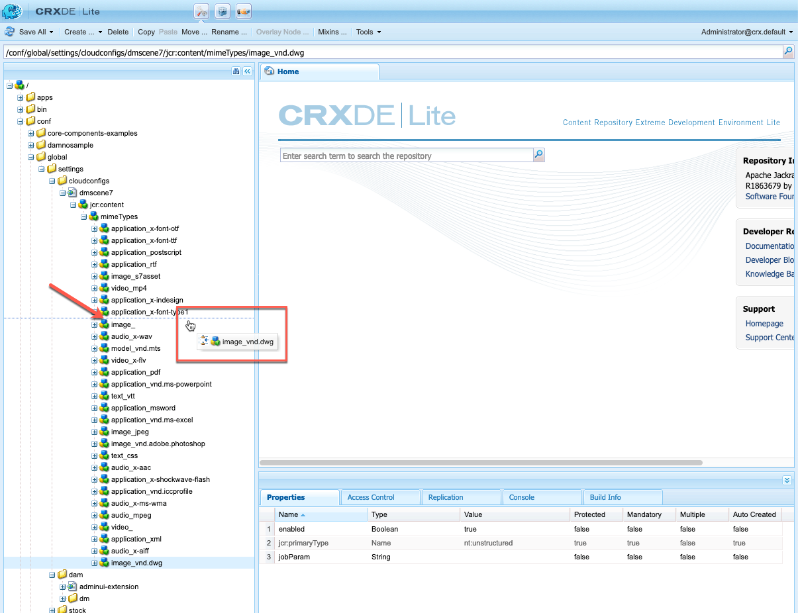

# Konfigurera Dynamic Media Cloud Service {#configuring-dynamic-media-scene-mode}

Om du använder Adobe Experience Manager för olika miljöer, till exempel en för utveckling, en för staging och en för liveproduktion, måste du konfigurera Dynamic Media-Cloud Services för var och en av dessa miljöer.

## Arkitektur för Dynamic Media {#architecture-diagram-of-dynamic-media-scene-mode}

I följande arkitekturdiagram beskrivs hur Dynamic Media fungerar.

Med den nya arkitekturen ansvarar AEM för primära källresurser och synkningar med Dynamic Media för bearbetning och publicering av resurser:

1. När den primära källresursen överförs till AEM replikeras den till Dynamic Media. Då hanterar Dynamic Media all bearbetning och generering av resurser, till exempel videokodning och dynamiska varianter av en bild.
1. När återgivningarna har genererats kan AEM på ett säkert sätt komma åt och förhandsgranska Dynamic Media-fjärråtergivningarna (inga binärfiler skickas tillbaka till AEM).
1. När innehållet är klart att publiceras och godkännas utlöses Dynamic Media-tjänsten att skicka ut innehåll till leveransservrar och cachelagra innehåll på CDN.

<!-- OBSOLETE CONTENT

## (Optional) Migrating Dynamic Media presets and configurations from 6.3 to 6.5 Zero Downtime {#optional-migrating-dynamic-media-presets-and-configurations-from-to-zero-downtime}

If you are upgrading AEM Dynamic Media from 6.3 to 6.4 or 6.5 (which now includes the ability for zero downtime deployments), you are required to run the following curl command to migrate all your presets and configurations from `/etc` to `/conf` in CRXDE Lite.

>[!NOTE]
>
>If you run your AEM instance in compatibility mode--that is, you have the compatibility packaged installed--you do not need to run these commands.

For all upgrades, either with or without the compatibility package, you can copy the default, out-of-the-box viewer presets that originally came with Dynamic Media by running the following Linux curl command:

`curl -u admin:admin -X POST https://<server_address>:<server_port>/libs/settings/dam/dm/presets/viewer.pushviewerpresets.json`

To migrate any custom viewer presets and configurations that you have created from `/etc` to `/conf`, run the following Linux curl command:

`curl -u admin:admin -X POST https://<server_address>:<server_port>/libs/settings/dam/dm/presets.migratedmcontent.json`

-->

## Skapa en ny Dynamic Media-konfiguration i Cloud Services {#configuring-dynamic-media-cloud-services}

<!-- **Before you creating a Dynamic Media Configuration in Cloud Services**: After you receive your provisioning email with Dynamic Media credentials, you must [log in](https://www.adobe.com/marketing-cloud/experience-manager/scene7-login.html) to Dynamic Media Classic to change your password. The password provided in the provisioning email is system-generated and intended to be a temporary password only. It is important that you update the password so that Dynamic Media Cloud Service is set up with the correct credentials. -->

1. I AEM trycker du på AEM logotyp för att komma åt den globala navigeringskonsolen.
1. Tryck på verktygsikonen till vänster om konsolen och tryck sedan på **[!UICONTROL Cloud Services > Dynamic Media Configuration]**.
1. På sidan Läsare för Dynamic Media-konfiguration trycker du i den vänstra rutan på **[!UICONTROL global]** (tryck inte på och välj inte mappikonen till vänster om **[!UICONTROL global]**) och sedan trycker du på **[!UICONTROL Create]**.
1. På sidan **[!UICONTROL Create Dynamic Media Configuration]** anger du en titel, e-postadress för Dynamic Media-konto, lösenord och väljer sedan region. Dessa tillhandahålls av Adobe i e-postmeddelandet om etablering. Kontakta supporten om du inte fått detta.
1. Klicka på **[!UICONTROL Connect to Dynamic Media]**.
1. I dialogrutan **[!UICONTROL Change Password]** anger du ett nytt lösenord som består av 8-25 tecken i fältet **[!UICONTROL New Password]**. Lösenordet måste innehålla minst ett av följande:

   * Versaler
   * Gemener
   * Siffra
   * Specialtecken: `# $ & . - _ : { }`

   Observera att fältet **[!UICONTROL Current Password]** är avsiktligt ifyllt och dolt för interaktion.

   Om det behövs kan du kontrollera stavningen av ett lösenord som du har skrivit eller skrivit in igen genom att trycka på lösenordsikonen för att visa lösenordet. Tryck på ikonen igen för att dölja lösenordet.

1. I fältet **[!UICONTROL Repeat Password]** skriver du det nya lösenordet igen och trycker sedan på **[!UICONTROL Done.]**

   Det nya lösenordet sparas när du trycker på **[!UICONTROL Save]** i det övre högra hörnet på **[!UICONTROL Create Dynamic Media Configuration]**-sidan.

   Om du knackade på **[!UICONTROL Cancel]** i dialogrutan **[!UICONTROL Change Password]** måste du fortfarande ange ett nytt lösenord när du trycker på **[!UICONTROL Save]** för att spara den nya Dynamic Media-konfigurationen.

   Se även [Ändra lösenordet till Dynamic Media](#change-dm-password).

1. När anslutningen lyckas kan du ange följande:

   | Egenskap | Beskrivning |
   |---|---|
   | Företag | Namnet på Dynamic Media-kontot. Det är möjligt att du har flera Dynamic Media-konton för olika undervarumärken, divisioner eller olika staging-/produktionsmiljöer. |
   | Företagets rotmappsökväg | Företagets rotmappsökväg. |
   | Publicera resurser | Du kan välja mellan följande tre alternativ: **[!UICONTROL Immediately]**: När resurser överförs importeras resurserna och URL/Embed anges omedelbart. Ingen användaråtgärd krävs för att publicera resurser. **[!UICONTROL Upon Activation]**: Du måste publicera resursen explicit innan en URL/Embed-länk anges. **[!UICONTROL Selective Publish]**: Resurser publiceras automatiskt för säker förhandsgranskning och kan publiceras explicit till AEM utan publicering till DMS7 för att distribueras offentligt. I framtiden kommer Adobe att förbättra detta alternativ för att publicera resurser till AEM och publicera resurser till Dynamic Media, som utesluter varandra. Det innebär att du kan publicera resurser på DMS7 så att du kan använda funktioner som Smart Crop eller dynamiska återgivningar. Du kan också publicera resurser exklusivt i AEM för förhandsgranskning. samma resurser inte publiceras i DMS7 för att distribueras offentligt. |
   | Secure Preview Server | Här kan du ange URL-sökvägen till förhandsgranskningsservern för säkra återgivningar. Det innebär att när återgivningarna har genererats kan AEM på ett säkert sätt komma åt och förhandsgranska Dynamic Media-fjärråtergivningarna (inga binärfiler skickas tillbaka till den AEM instansen). Om du inte har ett särskilt arrangemang för att använda ditt företags server eller en speciell server rekommenderar Adobe Systems att du låter den här inställningen vara kvar som den har angetts. |
   | Synkronisera allt innehåll | Markerad som standard. Avmarkera det här alternativet om du vill inkludera eller exkludera resurser från synkroniseringen till Dynamic Media. Om du avmarkerar det här alternativet kan du välja mellan följande två synkroniseringslägen för Dynamic Media: **[!UICONTROL Dynamic Media sync mode]** **[!UICONTROL Enable by default]**: Konfigurationen används som standard på alla mappar såvida du inte markerar en mapp som är exkluderad.<!-- you can then deselect the folders that you do not want the configuration applied to.--> **[!UICONTROL Disabled by default]**: Konfigurationen tillämpas inte på någon mapp förrän du uttryckligen markerar en vald mapp för synkronisering till Dynamic Media. Om du vill markera en markerad mapp för synkronisering till Dynamic Media väljer du en resursmapp och trycker sedan på  **[!UICONTROL Properties]**. Välj bland följande tre alternativ i listrutan **[!UICONTROL Dynamic Media sync mode]** på fliken **[!UICONTROL Details]**. När du är klar trycker du på **[!UICONTROL Save]**. *Kom ihåg: Dessa tre alternativ är inte tillgängliga om du valde **Synkronisera allt**innehåll tidigare.* Se även  [Arbeta med selektiv publicering på mappnivå i Dynamic Media.](/help/assets/dynamic-media/selective-publishing.md) **[!UICONTROL Inherited]**: Det finns inget explicit synkroniseringsvärde för mappen; I stället ärver mappen synkroniseringsvärdet från en av de överordnade mapparna eller standardläget i molnkonfigurationen. Detaljerad status för ärvda program genom ett verktygstips. **[!UICONTROL Enable for sub-folders]**: Inkludera allt i det här underträdet för synkronisering med Dynamic Media. De mappspecifika inställningarna åsidosätter standardläget i molnkonfigurationen. **[!UICONTROL Disabled for sub-folders]**: Uteslut allt i det här underträdet från synkronisering till Dynamic Media. |

   >[!NOTE]
   >
   >Det finns inget stöd för versionshantering i Dynamic Media. Dessutom gäller fördröjd aktivering endast om **[!UICONTROL Publish Assets]** på sidan Redigera Dynamic Media-konfiguration är inställd på **[!UICONTROL Upon Activation]** och då endast tills resursen aktiveras första gången.
   >
   >
   >När en mediefil har aktiverats publiceras uppdateringar direkt till S7 Delivery.

   

1. Tryck på **[!UICONTROL Save]**. Det nya lösenordet och den nya konfigurationen för Dynamic Media sparas. Om du knackade på **[!UICONTROL Cancel]** i stället sker ingen lösenordsuppdatering.
1. I dialogrutan **[!UICONTROL Configuring Dynamic Media]** trycker du på **[!UICONTROL OK]** för att starta konfigurationen.

   >[!IMPORTANT]
   >
   >När den nya Dynamic Media-konfigurationen är klar får du ett statusmeddelande i AEM Inkorg.
   >
   >Det här inkorgsmeddelandet informerar dig om konfigurationen lyckades eller inte.
   > Mer information finns i [Felsöka en ny Dynamic Media-konfiguration](#troubleshoot-dm-config) och [Din inkorg](/help/sites-cloud/authoring/getting-started/inbox.md).

1. Om du vill förhandsgranska Dynamic Media-innehåll på ett säkert sätt innan det publiceras måste du tillåtslista den AEM författarinstansen för att ansluta till Dynamic Media. Så här konfigurerar du den:

   * Logga in på ditt Dynamic Media Classic-konto: [https://www.adobe.com/marketing-cloud/experience-manager/scene7-login.html](https://www.adobe.com/marketing-cloud/experience-manager/scene7-login.html). Dina autentiseringsuppgifter och din inloggning tillhandahölls av Adobe vid tidpunkten för etableringen. Om du inte har den här informationen kontaktar du teknisk support.
   * Klicka på **[!UICONTROL Setup > Application Setup > Publish Setup > Image Server]** i navigeringsfältet uppe till höger på sidan.

   * Välj **[!UICONTROL Test Image Serving]** i listrutan Publiceringskontext på sidan Image Server Publish.
   * Tryck på **[!UICONTROL Add]** för klientadressfiltret.
   * Markera kryssrutan för att aktivera (aktivera) adressen och ange sedan IP-adressen för AEM Author-instansen (inte Dispatcher IP).
   * Klicka på **[!UICONTROL Save]**.

Du är nu klar med den grundläggande konfigurationen; är du redo att använda Dynamic Media.

Om du vill anpassa konfigurationen ytterligare kan du utföra alla uppgifter under [Konfigurera avancerade inställningar i Dynamic Media](#optional-configuring-advanced-settings-in-dynamic-media-scene-mode).

### Felsöka en ny Dynamic Media-konfiguration {#troubleshoot-dm-config}

När konfigurationen av en ny Dynamic Media-konfiguration är klar får du ett statusmeddelande AEM Inkorgen. Det här meddelandet informerar dig om konfigurationen lyckades eller inte, vilket visas i följande bilder från Inkorgen.

Se även [Inkorgen](/help/sites-cloud/authoring/getting-started/inbox.md).

**Felsöka en ny Dynamic Media-konfiguration**

1. I närheten av det övre högra hörnet på AEM trycker du på klockikonen och sedan på **[!UICONTROL View All]**.
1. På sidan Inkorg trycker du på meddelandet om att åtgärden lyckades för att läsa en översikt över konfigurationens status och loggar.

   Om konfigurationen misslyckas trycker du på felmeddelandet som liknar följande skärmbild.

   

1. Granska konfigurationsinformationen som beskriver felet på sidan **[!UICONTROL DMSETUP]**. Tänk särskilt på eventuella felmeddelanden eller felkoder. Du måste kontakta Adobe Care med denna information.

   

### Ändra lösenordet till Dynamic Media {#change-dm-password}

Lösenordets giltighetstid i Dynamic Media är inställd på 100 år från det aktuella systemdatumet.

Lösenordet måste innehålla minst ett av följande:

* Versaler
* Gemener
* Siffra
* Specialtecken: `# $ & . - _ : { }`

Om det behövs kan du kontrollera stavningen av ett lösenord som du har skrivit eller skrivit in igen genom att trycka på lösenordsikonen för att visa lösenordet. Tryck på ikonen igen för att dölja lösenordet.

Det ändrade lösenordet sparas när du trycker på **[!UICONTROL Save]** i det övre högra hörnet på **[!UICONTROL Edit Dynamic Media Configuration]**-sidan.

1. I AEM trycker du på AEM logotyp för att komma åt den globala navigeringskonsolen.
1. Tryck på verktygsikonen till vänster om konsolen och tryck sedan på **[!UICONTROL Cloud Services > Dynamic Media Configuration.]**
1. På sidan Läsare för Dynamic Media-konfiguration trycker du i den vänstra rutan på **[!UICONTROL global]** (tryck inte på och välj inte mappikonen till vänster om **[!UICONTROL global]**) och sedan trycker du på **[!UICONTROL Edit.]**
1. På sidan **[!UICONTROL Edit Dynamic Media Configuration]**, direkt under fältet **[!UICONTROL Password]** trycker du på **[!UICONTROL Change Password.]**
1. Gör följande i dialogrutan **[!UICONTROL Change Password]**:

   * Ange ett nytt lösenord i fältet **[!UICONTROL New Password]**.

      Observera att fältet **[!UICONTROL Current Password]** är avsiktligt ifyllt och dolt för interaktion.

   * I fältet **[!UICONTROL Repeat Password]** skriver du det nya lösenordet igen och trycker sedan på **[!UICONTROL Done.]**

1. I det övre högra hörnet på sidan **[!UICONTROL Edit Dynamic Media Configuration]** trycker du på **[!UICONTROL Save]** och sedan på **[!UICONTROL OK.]**

## (Valfritt) Konfigurera avancerade inställningar i Dynamic Media{#optional-configuring-advanced-settings-in-dynamic-media-scene-mode}

Om du vill anpassa konfigurationen och konfigurationen av Dynamic Media ytterligare, eller optimera prestandan, kan du utföra en eller flera av följande *valfria* uppgifter:

* [Konfigurera och konfigurera Dynamic Media-inställningar](#optional-setup-and-configuration-of-dynamic-media-scene-mode-settings)
* [(Valfritt) Justera prestanda för Dynamic Media](#optional-tuning-the-performance-of-dynamic-media-scene-mode)

<!--

* [(Optional) Filtering assets for replication](#optional-filtering-assets-for-replication)

-->

### (Valfritt) Konfigurera och konfigurera Dynamic Media-inställningar {#optional-setup-and-configuration-of-dynamic-media-scene-mode-settings}

Använd användargränssnittet i Dynamic Media Classic (Scene7) om du vill ändra Dynamic Media-inställningarna.

Vissa av ovanstående uppgifter kräver att du loggar in på Dynamic Media Classic (Scene7) här: [https://www.adobe.com/marketing-cloud/experience-manager/scene7-login.html](https://www.adobe.com/marketing-cloud/experience-manager/scene7-login.html)

Installations- och konfigureringsuppgifter omfattar följande:

* [Publiceringskonfiguration för Image Server](#publishing-setup-for-image-server)
* [Konfigurera allmänna inställningar för programmet](#configuring-application-general-settings)
* [Konfigurera färghantering](#configuring-color-management)
* [Redigera MIME-typer för format som stöds](#editing-mime-types-for-supported-formats)
* [Lägga till MIME-typer för format som inte stöds](#adding-mime-types-for-unsupported-formats)

<!-- * [Creating batch set presets to auto-generate Image Sets and Spin Sets](#creating-batch-set-presets-to-auto-generate-image-sets-and-spin-sets) -->

#### Publiceringsinställningar för Image Server {#publishing-setup-for-image-server}

Publiceringsinställningarna avgör hur resurser levereras som standard från Dynamic Media. Om ingen inställning anges levererar Dynamic Media en resurs enligt standardinställningarna som definierats i Publiceringsinställningar. En begäran om att leverera en bild som inte innehåller ett upplösningsattribut ger till exempel en bild med inställningen för standardobjektupplösning.

Så här konfigurerar du publiceringsinställningar: i Dynamic Media Classic klickar du på **[!UICONTROL Setup > Application Setup > Publish Setup > Image Server]**.

Bildserverskärmen anger standardinställningar för att leverera bilder. I gränssnittsskärmen finns en beskrivning av varje inställning.

**[!UICONTROL Request Attributes]** - De här inställningarna begränsar antalet bilder som kan levereras från servern.
**[!UICONTROL Default Request Attributes]** - De här inställningarna gäller standardutseendet för bilder.
**[!UICONTROL Common Thumbnail Attributes]** - De här inställningarna gäller för miniatyrbildernas standardutseende.
**[!UICONTROL Defaults for Catalog Fields]**- De här inställningarna gäller bildernas upplösning och standardtyp av miniatyrbilder.
**[!UICONTROL Color Management Attributes]** - De här inställningarna avgör vilka ICC-färgprofiler som används.
**[!UICONTROL Compatibility Attributes]** - Den här inställningen gör att inledande och avslutande stycken i textlager kan hanteras som de var i version 3.6 för bakåtkompatibilitet.
**[!UICONTROL Localization Support]** - Med de här inställningarna kan du hantera flera språkattribut. Här kan du också ange en sträng för språkområdeskarta så att du kan definiera vilka språk du vill ha stöd för de olika verktygstipsen i visningsprogram. Mer information om hur du konfigurerar **[!UICONTROL Localization Support]** finns i [Att tänka på när du konfigurerar lokalisering av resurser](https://experienceleague.corp.adobe.com/docs/dynamic-media-classic/using/setup/publish-setup.html#considerations-when-setting-up-localization-of-assets).

#### Konfigurerar allmänna inställningar för programmet {#configuring-application-general-settings}

Om du vill öppna sidan Allmänna inställningar för programmet klickar du på **[!UICONTROL Setup > Application Setup > General Settings.]** i det globala navigeringsfältet i Dynamic Media Classic

**[!UICONTROL Servers]** - Vid kontoetablering tillhandahåller Dynamic Media automatiskt de tilldelade servrarna för ditt företag. De här servrarna används för att skapa URL-strängar för din webbplats och dina program. Dessa URL-anrop är specifika för ditt konto. Ändra inte något av servernamnen om du inte uttryckligen har fått instruktioner om att göra det av AEM.
**[!UICONTROL Overwrite Images]** - Dynamic Media tillåter inte att två filer har samma namn. Varje objekts URL-ID (filnamnet minus filtillägget) måste vara unikt. De här alternativen anger hur ersättningsresurser överförs: om de ersätter originalet eller blir dubbletter. Duplicerade resurser får ett nytt namn med namnet&quot;-1&quot; (till exempel heter stol.tif stol-1.tif). Dessa alternativ påverkar resurser som överförts till en annan mapp än den ursprungliga eller resurser med ett annat filnamnstillägg än den ursprungliga (till exempel JPG, TIF eller PNG).
**[!UICONTROL Overwrite in current folder, same base image name/extension]** - Det här alternativet är den striktaste regeln för ersättning. Det kräver att du överför ersättningsbilden till samma mapp som originalbilden och att ersättningsbilden har samma filnamnstillägg som originalbilden. Om dessa krav inte uppfylls skapas en dubblett. Välj alltid **[!UICONTROL Overwrite in current folder, same base image name/extension]** om du vill att AEM ska vara konsekvent.
**[!UICONTROL Overwrite in any folder, same base asset name/extension]** - Kräver att ersättningsbilden har samma filnamnstillägg som originalbilden (t.ex. måste stol.jpg ersätta stol.jpg, inte stol.tif). Du kan dock överföra ersättningsbilden till en annan mapp än den ursprungliga. Den uppdaterade bilden finns i den nya mappen; filen inte längre kan hittas på sin ursprungliga plats.
**[!UICONTROL Overwrite in any folder, same base asset name regardless of extension]** - Det här alternativet är den mest omfattande ersättningsregeln. Du kan överföra en ersättningsbild till en annan mapp än den ursprungliga, överföra en fil med ett annat filnamnstillägg och ersätta den ursprungliga filen. Om originalfilen finns i en annan mapp finns ersättningsbilden i den nya mappen som den överfördes till.
**[!UICONTROL Default Color Profiles]** - Mer information finns i  [Konfigurera ](#configuring-color-management) färghantering. Som standard visas 15 återgivningar när du väljer **[!UICONTROL Renditions]** och 15 visningsförinställningar när du väljer **[!UICONTROL Viewers]** i resursens detaljvy. Du kan öka den här gränsen. Se [Öka eller minska antalet bildförinställningar som visas](/help/assets/dynamic-media/managing-image-presets.md#increasing-or-decreasing-the-number-of-image-presets-that-display) eller [Öka eller minska antalet visningsförinställningar som visas](/help/assets/dynamic-media/managing-viewer-presets.md#increasing-the-number-of-viewer-presets-that-display).

#### Konfigurerar färghantering {#configuring-color-management}

Med dynamisk mediefärghantering kan du färgkorrigera resurser. Med färgkorrigering behåller inkapslade resurser sin färgmodell (RGB, CMYK, Grå) och inbäddad färgprofil. När du begär en dynamisk återgivning korrigeras bildfärgen till målfärgrymden med hjälp av CMYK-, RGB- eller grå utdata. Se [Konfigurera bildförinställningar](/help/assets/dynamic-media/managing-image-presets.md).

Så här konfigurerar du standardfärgegenskaperna så att färgkorrigering aktiveras när du begär bilder:

1. [Logga in på Dynamic Media ](https://www.adobe.com/marketing-cloud/experience-manager/scene7-login.html) Classic med de autentiseringsuppgifter som angavs under etableringen. Navigera till **[!UICONTROL Setup > Application Setup]**.
1. Expandera området **[!UICONTROL Publish Setup]** och markera **[!UICONTROL Image Server]**. Ange **[!UICONTROL Publish Context]** som **[!UICONTROL Image Serving]** när du anger standardvärden för publiceringsinstanser.
1. Bläddra till den egenskap som du behöver ändra, till exempel en egenskap i **[!UICONTROL Color Management Attributes]**-området.
Du kan ange följande egenskaper för färgkorrigering:

   | Egenskap | Beskrivning |
   |---|---|
   | Standardfärgmodell för CMYK | Namn på CMYK-standardfärgprofilen. |
   | Standardfärgmodell för gråskala | Namnet på standardfärgprofilen för grått. |
   | RGB-standardfärgmodell | Namn på standardfärgprofilen för RGB. |
   | Återgivningsmetod för färgkonvertering | Anger återgivningsmetod. Godtagbara värden är: **[!UICONTROL perceptual]**, **[!UICONTROL relative colometric]**, **[!UICONTROL saturation]**, **[!UICONTROL absolute colometric.]** Adobe rekommenderar **[!UICONTROL relative]** som standard. |

1. Tryck på **[!UICONTROL Save]**.

Du kan till exempel ställa in **[!UICONTROL RGB Default Color Space]** på *sRGB* och **[!UICONTROL CMYK Default Color Space]** på *WebCoated*.

Om du gör det gör du så här:

* Aktiverar färgkorrigering för RGB- och CMYK-bilder.
* RGB-bilder som inte har någon färgprofil antas finnas i färgrymden *sRGB*.
* CMYK-bilder som inte har någon färgprofil antas vara i färgrymden *WebCoated*.
* Dynamiska återgivningar som returnerar RGB-utdata returnerar det i färgrymden *sRGB*.
* Dynamiska återgivningar som returnerar CMYK-utdata returnerar det i färgrymden *WebCoated*.

#### Redigera MIME-typer för format som stöds {#editing-mime-types-for-supported-formats}

Du kan definiera vilka resurstyper som bearbetas av Dynamic Media och anpassa avancerade parametrar för resurshantering. Du kan till exempel ange parametrar för tillgångsbearbetning för att göra följande:

* Konvertera en Adobe PDF till en eCatalog-resurs.
* Konvertera ett Adobe Photoshop-dokument (.PSD) till en bannermallsresurs för personalisering.
* Rastrera en Adobe Illustrator-fil (.AI) eller en Adobe Photoshop Encapsulated Postscript-fil (.EPS).
* [Videoprofiler ](/help/assets/dynamic-media/video-profiles.md) och  [bildprofiler ](/help/assets/dynamic-media/image-profiles.md) kan användas för att definiera bearbetning av videoklipp och bilder.

Se [Överför resurser](/help/assets/add-assets.md).

**Redigera MIME-typer för de format som stöds**

1. I AEM klickar du på den AEM logotypen för att komma åt den globala navigeringskonsolen och klickar sedan på **[!UICONTROL General > CRXDE Lite]**.
1. Navigera till följande i den vänstra listen:

   `/conf/global/settings/cloudconfigs/dmscene7/jcr:content/mimeTypes`

   

1. Välj en mime-typ i mappen mimeTypes.
1. Till höger på CRXDE Lite-sidan i den nedre delen:

   * Dubbelklicka på fältet **[!UICONTROL enabled]**. Som standard är alla resursens MIME-typer aktiverade (inställda på **[!UICONTROL true]**), vilket innebär att resurserna synkroniseras till Dynamic Media för bearbetning. Om du vill utesluta den här resursens MIME-typ från bearbetningen ändrar du den här inställningen till **[!UICONTROL false]**.

   * Dubbelklicka på **[!UICONTROL jobParam]** för att öppna det tillhörande textfältet. Se [MIME-typer som stöds](/help/assets/file-format-support.md) för en lista över tillåtna värden för processparametrar som du kan använda för en viss MIME-typ.

1. Gör något av följande:
   * Upprepa steg 3-4 om du vill redigera ytterligare MIME-typer.
   * Klicka på **[!UICONTROL Save All.]** på menyraden på CRXDE Lite-sidan

1. Tryck på **[!UICONTROL CRXDE Lite]** längst upp till vänster på sidan för att återgå till AEM.

#### Lägger till MIME-typer för format som inte stöds {#adding-mime-types-for-unsupported-formats}

Du kan lägga till anpassade MIME-typer för format som inte stöds i AEM Assets. För att säkerställa att nya noder som du lägger till i CRXDE Lite inte tas bort av AEM måste du se till att du placerar MIME-typen före `image_` och att dess aktiverade värde är inställt på **[!UICONTROL false]**.

**Lägga till MIME-typer för format som inte stöds**

1. Tryck på **[!UICONTROL Tools > Operations > Web Console.]** från AEM

   

1. En ny flik i webbläsaren öppnas på sidan **[!UICONTROL Adobe Experience Manager Web Console Configuration]**.

   

1. På sidan bläddrar du nedåt till namnet *Adobe CQ Scene7 Asset MIME type Service* enligt följande skärmbild. Tryck på **[!UICONTROL Edit the configuration values]** (pennikonen) till höger om namnet.

   

1. På sidan **Adobe CQ Scene7 Asset MIME type Service** klickar du på en plusteckenikon &lt;+>. Platsen i tabellen där du klickar på plustecknet för att lägga till den nya mime-typen är enkel.

   

1. Skriv `DWG=image/vnd.dwg` i det tomma textfältet som du just lade till.

   Observera att exemplet `DWG=image/vnd.dwg` endast är för illustrationsändamål. MIME-typen som du lägger till här kan vara ett annat format som inte stöds.

   

1. Tryck på **[!UICONTROL Save]** längst ned till höger på sidan.

   Nu kan du stänga webbläsarfliken som har den öppna konfigurationssidan för Adobe Experience Manager Web Console.

1. Gå tillbaka till webbläsarfliken som har din öppna AEM.
1. Tryck på **[!UICONTROL Tools > General > CRXDE Lite]** från AEM.

   

1. Navigera till följande i den vänstra listen:

   `conf/global/settings/cloudconfigs/dmscene7/jcr:content/mimeTypes`

1. Dra MIME-typen `image_vnd.dwg` och släpp den direkt ovanför `image_` i trädet så som visas på följande skärmbild.

   

1. Med mime-typen `image_vnd.dwg` markerad dubbelklickar du på värdet på fliken **[!UICONTROL Properties]**, på raden **[!UICONTROL enabled]**, under kolumnrubriken **[!UICONTROL Value]**, för att öppna listrutan **[!UICONTROL Value]**.
1. Skriv `false` i fältet (eller välj **[!UICONTROL false]** i listrutan).

   

1. Klicka på **[!UICONTROL Save All]** nära det övre vänstra hörnet på CRXDE Lite-sidan.

### (Valfritt) Justera prestanda för Dynamic Media {#optional-tuning-the-performance-of-dynamic-media-scene-mode}

För att Dynamic Media <!--(with `dynamicmedia_scene7` run mode)--> ska fungera smidigt rekommenderar Adobe följande tips för finjustering av synkroniseringsprestanda/skalbarhet:

* Uppdaterar de fördefinierade jobbparametrarna för bearbetning av olika filformat.
* Uppdaterar de fördefinierade arbetstrådarna för Granite-arbetsflödet (videoresurser).
* Uppdaterar det fördefinierade tillfälliga Granite-arbetsflödet (bilder och icke-videomaterial) för köarbetstrådar.
* Uppdaterar de maximala överföringsanslutningarna till Dynamic Media Classic-servern.

#### Uppdatera de fördefinierade jobbparametrarna för bearbetning av olika filformat

Du kan justera jobbparametrar för snabbare bearbetning när du överför filer. Om du till exempel överför PSD-filer, men inte vill bearbeta dem som mallar, kan du ange att lagerextraheringen ska vara false (av). I så fall visas den justerade jobbparametern som `process=None&createTemplate=false`.

Adobe rekommenderar att du använder följande&quot;justerade&quot; jobbparametrar för PDF-, PostScript- och PSD-filer:

| Filtyp | Rekommenderade jobbparametrar |
| ---| ---|
| PDF | `pdfprocess=Rasterize&resolution=150&colorspace=Auto&pdfbrochure=false&keywords=false&links=false` |
| Postscript | `psprocess=Rasterize&psresolution=150&pscolorspace=Auto&psalpha=false&psextractsearchwords=false&aiprocess=Rasterize&airesolution=150&aicolorspace=Auto&aialpha=false` |
| PSD | `process=None&layerNaming=Layername&anchor=Center&createTemplate=false&extractText=false&extendLayers=false` |

<!-- To update any of these parameters, follow the steps in [Enabling MIME type-based Assets/Dynamic Media Classic upload job parameter support](#enabling-mime-type-based-assets-scene-upload-job-parameter-support). -->

#### Uppdaterar kön för Granska tillfälligt arbetsflöde {#updating-the-granite-transient-workflow-queue}

Kön för Bevilja överföring av arbetsflöde används för **[!UICONTROL DAM Update Asset]**-arbetsflödet. I Dynamic Media används den för bildhantering.

**Så här uppdaterar du kön för Granska tillfälligt arbetsflöde**

1. Gå till [https://&lt;server>/system/console/configMgr](https://localhost:4502/system/console/configMgr) och sök efter **kö: Bevilja övergångsarbetsflödeskö**.

   >[!NOTE]
   >
   >En textsökning är nödvändig i stället för en direkt URL eftersom OSGi PID genereras dynamiskt.

1. I fältet **[!UICONTROL Maximum Parallel Jobs]** ändrar du talet till önskat värde.

   Du kan öka **[!UICONTROL Maximum Parallel Jobs]** för att få tillräckligt stöd för överföring av filer till Dynamic Media. Det exakta värdet beror på maskinvarukapaciteten. I vissa scenarier - det vill säga en inledande migrering eller en engångsöverföring av en grupp - kan du använda ett stort värde. Tänk dock på att användning av ett stort värde (till exempel två gånger antalet kärnor) kan ha negativa effekter på andra samtidiga aktiviteter. Därför bör du testa och justera värdet baserat på ditt specifika användningsfall.

<!--    By default, the maximum number of parallel jobs depends on the number of available CPU cores. For example, on a 4-core server, it assigns 2 worker threads. (A value between 0.0 and 1.0 is ratio based, or any numbers greater than 1 will assign the number of worker threads.)

   Adobe recommends that 32 **[!UICONTROL Maximum Parallel Jobs]** be configured to adequately support heavy upload of files to Dynamic Media Classic. -->

1. Tryck på **[!UICONTROL Save]**.

#### Uppdaterar Granite-arbetsflödeskön {#updating-the-granite-workflow-queue}

Beviljad arbetsflödeskö används för icke-tillfälliga arbetsflöden. I Dynamic Media bearbetades video med arbetsflödet **[!UICONTROL Dynamic Media Encode Video]**.

Så här uppdaterar du arbetsflödeskön för Granite:

1. Navigera till `https://<server>/system/console/configMgr` och sök efter **Kö: Begränsa arbetsflödeskö**.

   >[!NOTE]
   >
   >En textsökning är nödvändig i stället för en direkt URL eftersom OSGi PID genereras dynamiskt.

1. I fältet **[!UICONTROL Maximum Parallel Jobs]** ändrar du talet till önskat värde.

   Som standard beror det maximala antalet parallella jobb på antalet tillgängliga processorkärnor. På en server med fyra kärnor tilldelas till exempel två arbetstrådar. (Ett värde mellan 0,0 och 1,0 är baserat på förhållandet, eller alla tal som är större än 1 tilldelar antalet arbetstrådar.)

   I de flesta fall räcker standardinställningen 0,5.

   

1. Tryck på **[!UICONTROL Save]**.

#### Uppdaterar Scene7 överföringsanslutning {#updating-the-scene-upload-connection}

Inställningen Scene7 Upload Connection synkroniserar AEM resurser till Dynamic Media Classic-servrar.

Så här uppdaterar du Scene7 överföringsanslutning:

1. Navigera till `https://<server>/system/console/configMgr/com.day.cq.dam.scene7.impl.Scene7UploadServiceImpl`
1. I fältet **[!UICONTROL Number of connections]** och/eller fältet **[!UICONTROL Active job timeout]** ändrar du talet efter behov.

   Inställningen **[!UICONTROL Number of connections]** styr det maximala antalet HTTP-anslutningar som tillåts för AEM till Dynamic Media-överföring. vanligtvis räcker det fördefinierade värdet på 10 anslutningar.

   Inställningen **[!UICONTROL Active job timeout]** avgör väntetiden för överförda Dynamic Media-resurser som ska publiceras på leveransservern. Det här värdet är som standard 2 100 sekunder eller 35 minuter.

   I de flesta fall räcker det med inställningen 2 100.

   

1. Tryck på **[!UICONTROL Save.]**

<!-- NOTE - OBSOLETE that customisations to replication agents to transform content are no longer used; the following content is obsolete now 

### (Optional) Filtering assets for replication {#optional-filtering-assets-for-replication}

In non-Dynamic Media deployments, you replicate *all* assets (both images and video) from your AEM author environment to the AEM publish node. This workflow is necessary because the AEM publish servers also deliver the assets.

However, in Dynamic Media deployments, because assets are delivered by way of the cloud service, there is no need to replicate those same assets to AEM publish nodes. Such a "hybrid publishing" workflow avoids extra storage costs and longer processing times to replicate assets. Other content, such as Site pages, continue to be served from the AEM publish nodes.

The filters provide a way for you to *exclude* assets from being replicated to the AEM publish node.

#### Using default asset filters for replication {#using-default-asset-filters-for-replication}

If you are using Dynamic Media for imaging and/or video, then you can use the default filters that we provide as-is. The following filters are active by default:

<table>
 <tbody>
  <tr>
   <td> </td>
   <td><strong>Filter</strong></td>
   <td><strong>Mimetype</strong></td>
   <td><strong>Renditions</strong></td>
  </tr>
  <tr>
   <td>Dynamic Media Image Delivery</td>
   <td>
filter-images
 
filter-sets
 
 
 </td>
   <td>
Starts with <strong>image/</strong>
 
Contains <strong>application/</strong> and ends with <strong>set</strong>.
 </td>
   <td>The out-of-the-box "filter-images" (applies to single images assets, including interactive images) and "filter-sets" (applies to Spin Sets, Image Sets, Mixed Media Sets, and Carousel Sets) will:
    <ul>
     <li>Exclude from replication the original image and static image renditions.</li>
    </ul> </td>
  </tr>
  <tr>
   <td>Dynamic Media Video Delivery</td>
   <td>filter-video</td>
   <td>Starts with <strong>video/</strong></td>
   <td>The out-of-the-box "filter-video" will:
    <ul>
     <li>Exclude from replication the original video and static thumbnail renditions.    </li>
    </ul> </td>
  </tr>
 </tbody>
</table>

>[!NOTE]
>
>Filters apply to mime types and cannot be path specific.

#### Customizing asset filters for replication {#customizing-asset-filters-for-replication}

1. In AEM, tap the AEM logo to access the global navigation console and tap the **[!UICONTROL Tools > General > CRXDE Lite]**.
1. In the left folder tree, navigate to `/etc/replication/agents.author/publish/jcr:content/damRenditionFilters` to review the filters.

   

1. To define the Mime Type for the filter, you can locate the Mime Type as follows:

   In the left rail, expand `content > dam > <locate_your_asset> > jcr:content > metadata`, and then in the table, locate `dc:format`.

   The following graphic is an example of an asset's path to `dc:format`.

   

   Notice that the `dc:format` for the asset `Fiji Red.jpg` is `image/jpeg`.

   To have this filter apply to all images, regardless of their format, set the value to `image/*` where `*` is a regular expression that is applied to all images of any format.

   To have the filter apply only to images of the type JPEG, enter a value of `image/jpeg`.

1. Define what renditions you want to include or exclude from replication.

   Characters that you can use to filter for replication include the following:

<table>
 <tbody>
  <tr>
   <td><strong>Character to use</strong></td>
   <td><strong>How it filters assets for replication</strong></td>
  </tr>
  <tr>
   <td>*</td>
   <td>Wildcard character  </td>
  </tr>
  <tr>
   <td>+</td>
   <td>Includes assets for replication.</td>
  </tr>
  <tr>
   <td>-</td>
   <td>Excludes assets from replication.</td>
  </tr>
 </tbody>
</table>

   Navigate to `content/dam/<locate your asset>/jcr:content/renditions`.

   The following graphic is an example of an asset's renditions.

   

   If you only wanted to replicate the original, then you would enter `+original`.

   -->

