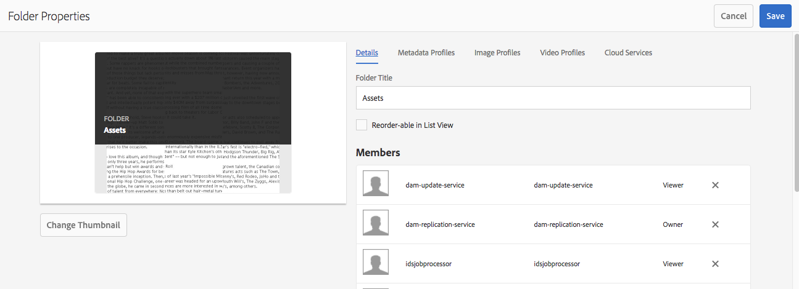
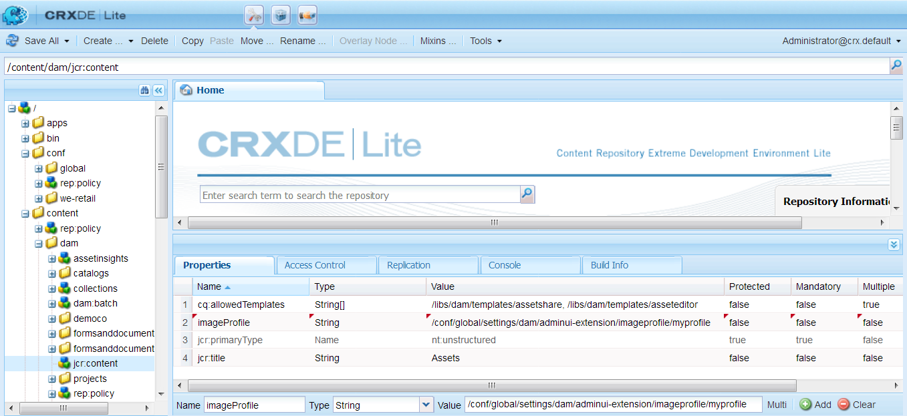

# Bildprofiler för Dynamic Media {#image-profiles}

När du överför bilder kan du beskära bilden automatiskt vid överföring genom att tillämpa en bildprofil på mappen.

>[!IMPORTANT]
>
>Bildprofiler kan inte användas för PDF-, animerade GIF- eller INDD-filer (Adobe InDesign).

## Beskärningsalternativ {#crop-options}

<!-- CQDOC-16069 for the paragraph directly below -->

Koordinaterna för smart beskärning är proportionella. För inställningarna för smart beskärning i en bildprofil skickas samma proportioner till Dynamic Media om proportionerna är desamma för de tillagda dimensionerna i bildprofilen. Adobe rekommenderar att du använder samma beskärningsområde. Om du gör det ser du till att de olika måtten som används i bildprofilen inte påverkas.

Varje generering av Smart Crop som du skapar kräver extra bearbetning. Om du till exempel lägger till mer än fem proportioner för smart beskärning blir det långsamt att resursen tar upp den. Det kan också ge ökad belastning på systemen. Eftersom du kan använda SmartCrop på mappnivå rekommenderar Adobe att du bara använder det på mappar *där det behövs.*

Du kan välja mellan två bildbeskärningsalternativ. Du kan också automatisera skapandet av färg- och bildfärgrutor.

<table>
 <tbody>
  <tr>
   <td><strong>Alternativ</strong></td>
   <td><strong>När ska användas</strong></td>
   <td><strong>Beskrivning</strong></td>
  </tr>
  <tr>
   <td>Pixelbeskärning</td>
   <td>Beskär bilder i grupp endast baserat på dimensioner.</td>
   <td>
Om du vill använda det här alternativet väljer du <strong>Pixelbeskärning</strong> i listrutan Beskärningsalternativ.
 
Om du vill beskära från sidorna av en bild anger du antalet pixlar som ska beskäras från valfri sida eller från varje sida av bilden. Hur mycket av bilden som beskärs beror på bildfilens ppi-inställning (pixlar per tum).
 
Pixelbeskärning i en bildprofil återges på följande sätt:  

    <ul>
     <li>Värdena är Överkant, Underkant, Vänster och Höger.</li>
     <li>Övre vänster räknas som 0,0 och pixelbeskärningen beräknas därifrån.</li>
     <li>Startpunkt för beskärning: Vänster är X och Överkant är Y</li>
     <li>Vågrät beräkning: vågrät pixelstorlek för originalbilden minus vänster och sedan minus höger.</li>
     <li>Lodrät beräkning: vertikal pixelhöjd minus överkant och sedan minus underkant.</li>
    </ul> 
Anta till exempel att du har en bild på 4 000 x 3 000 pixlar. Du använder värden: Top=250, Bottom=500, Left=300, Right=700.
 
Från övre vänstra (300,250) beskär med fyllningsutrymmet (4000-300-700, 3000-250-500 eller 3000,2250).
 </td>
  </tr>
  <tr>
   <td>Smart beskärning</td>
   <td>Massbeskär bilder baserat på deras visuella fokalpunkt.</td>
   <td>
Smart Crop använder intelligensen i Adobe Sensei för att snabbt automatisera beskärningen av bilder i bulk. Smart Crop identifierar och beskär automatiskt bilder till fokuspunkten i alla bilder för att uppnå den avsedda intressepunkten, oavsett skärmstorlek.
 
Om du vill använda Smart beskärning väljer du <strong>Smart beskärning</strong> i listrutan Beskärningsalternativ. Aktivera sedan funktionen till höger om Responsiv bildbeskärning.
 
Standardbrytpunktsstorlekarna (stor, medel, liten) täcker alla storlekar som de flesta bilder används för mobila enheter och surfplattor, datorer och banners. Om du vill kan du redigera standardnamnen för Stor, Medel och Liten.
 
Om du vill lägga till fler brytpunkter klickar du på <strong>Lägg till beskärning</strong>; Om du vill ta bort en beskärning klickar du på ikonen Skräpburk.
 </td>
  </tr>
  <tr>
   <td>Färg och bildfärgruta</td>
   <td>Med Massor genereras en färgruta för varje bild.</td>
   <td>
<strong>Obs</strong>: Smarta färgrutor stöds inte i Dynamic Media Classic.
 
Hitta och generera högkvalitativa färgrutor automatiskt från produktbilder som visar färg eller textur.
 
Om du vill använda färg- och bildfärgruta väljer du <strong>Smart beskärning</strong> i listrutan Beskärningsalternativ. Aktivera funktionen till höger om Färg och Bildruta. Ange ett pixelvärde i textrutorna Bredd och Höjd.
 
Alla bildbeskärningar är tillgängliga från renderingslisten, men färgrutor används bara via funktionen Kopiera URL. Använd en egen visningskomponent för att återge färgrutan på webbplatsen. Undantaget till den här regeln är Carousel banners. Dynamic Media tillhandahåller visningskomponenten för den färgruta som används i karusellbanderoller.
 
<strong>Använda färgrutor</strong>
 
URL:en för färgrutor är enkel:
 
<code>/is/image/company/&lt;asset_name&gt;:Swatch</code>
 
Där <code>:Swatch</code> läggs till i resursbegäran.
 
<strong>Använda färgrutor</strong>
 
Om du vill använda färgrutor gör du en <code>req=userdata</code>-förfrågan med följande:
 
<code>/is/image/&lt;company_name&gt;/&lt;swatch_asset_name&gt;:Swatch?req=userdata</code>
 
Följande är till exempel en färgruteresurs i Dynamic Media Classic:
 
<code>https://my.company.com:8080/is/image/DemoCo/Sleek:Swatch</code>
 
Här är färgruteresursens motsvarande <code>req=userdata</code>-URL:
 
<code>https://my.company.com:8080/is/image/DemoCo/Sleek:Swatch?req=userdata</code>
 
<code>req=userdata</code>-svaret är följande:
 
<code class="code">SmartCropDef=Swatch
       SmartCropHeight=200.0
       SmartCropRect=0.421671,0.389815,0.0848564,0.0592593,200,200
       SmartCropType=Swatch
       SmartCropWidth=200.0
       SmartSwatchColor=0xA56DB2</code>
 
Du kan också begära ett <code>req=userdata</code>-svar i antingen XML- eller JSON-format, som i följande URL-exempel:
 
<code>https://my.company.com:8080/is/image/DemoCo/Sleek:Swatch?req=userdata,xml</code>

<code>SmartSwatchColor</code>

</td></tr></tbody></table>

## Oskarp mask {#unsharp-mask}

Du använder **[!UICONTROL Unsharp mask]** för att finjustera en skärpefiltereffekt på den slutliga nedsamplade bilden. Du kan styra intensiteten för effekten, radien för effekten (mätt i pixlar) och ett tröskelvärde för kontrast som ignoreras. Effekten har samma alternativ som filtret Oskarp mask i Adobe Photoshop.

>[!NOTE]
>
>Oskarp mask används endast för nedskalade återgivningar i PTIFF (pyramidformade gånger) som nedsamplas till mer än 50 %. Det innebär att de största återgivningarna i bilden inte påverkas av oskarp mask. Mindre renderingar, till exempel miniatyrbilder, ändras (och visar den oskarpa masken).

I **[!UICONTROL Unsharp Mask]** har du följande filtreringsalternativ:

<table>
 <tbody>
  <tr>
   <td><strong>Alternativ</strong></td>
   <td><strong>Beskrivning</strong></td>
  </tr>
  <tr>
   <td>Belopp</td>
   <td>Styr mängden kontrast som används på kantpixlar. Standardvärdet är 1,75. För högupplösta bilder kan du öka den till upp till 5. Tänk på Mängd som ett mått på filterintensiteten. Intervallet är 0-5.</td>
  </tr>
  <tr>
   <td>Radie</td>
   <td>Anger antalet pixlar runt kantpixlarna som påverkar skärpan. För högupplösta bilder anger du 1 till 2. Med ett lågt värde ökas endast kantpixlarna skärpan. ett högt värde ökar skärpan i ett större antal pixlar. Vilket värde som är korrekt beror på bildens storlek. Standardvärdet är 0,2. Intervallet är 0-250.</td>
  </tr>
  <tr>
   <td>Tröskelvärde</td>
   <td>
Anger det kontrastintervall som ska ignoreras när det oskarpa maskfiltret används. Med andra ord, det här alternativet avgör hur olika de pixlar som ska göras skarpare måste vara från det omgivande området innan de betraktas som kantpixlar och blir skarpare. Experimentera med värden mellan 0 och 255 för att undvika brus.
 </td>
  </tr>
 </tbody>
</table>

Skärpa beskrivs i [Skärpa bilder](/help/assets/dynamic-media/assets/sharpening_images.pdf).

## Skapar Dynamic Media-bildprofiler {#creating-image-profiles}

Mer information om hur du definierar avancerade bearbetningsparametrar för andra resurstyper finns i [Konfigurera resursbearbetning](config-dm.md#configuring-asset-processing).

Se [Om Dynamic Media bildprofiler och videoprofiler](/help/assets/dynamic-media/about-image-video-profiles.md).

Se även [Bästa metoder för att ordna dina digitala resurser så att du kan använda Bearbeta profiler](/help/assets/dynamic-media/best-practices-for-file-management.md).

**Så här skapar du Dynamic Media-bildprofiler:**

1. Tryck på Adobe Experience Manager logotyp och navigera till **[!UICONTROL Tools]** > **[!UICONTROL Assets]** > **[!UICONTROL Image Profiles]**.
1. Om du vill lägga till en bildprofil trycker du på **[!UICONTROL Create]**.
1. Ange ett profilnamn och värden för oskarp mask, beskärning eller färgruta, eller båda.

   Tips: Använd ett profilnamn som är specifikt för dess avsedda syfte. Anta till exempel att du vill skapa en profil som bara genererar färgrutor. Smart beskärning är alltså inaktiverat (inaktiverat) och Färg och Bildruta är aktiverat (aktiverat). I så fall kan du använda profilnamnet&quot;Smarta färgrutor&quot;.

   Se även [Alternativ för smart beskärning och smarta färgrutor](#crop-options) och [Oskarp mask](#unsharp-mask).

   

1. Tryck på **[!UICONTROL Save]**. Den nya profilen visas i listan med tillgängliga profiler.

## Redigera eller ta bort Dynamic Media-bildprofiler {#editing-or-deleting-image-profiles}

1. Tryck på Experience Manager-logotypen och navigera till **[!UICONTROL Tools]** > **[!UICONTROL Assets]** > **[!UICONTROL Image Profiles]**.
1. Markera den bildprofil som du vill redigera eller ta bort. Om du vill redigera den väljer du **[!UICONTROL Edit Image Processing Profile]**. Om du vill ta bort den väljer du **[!UICONTROL Delete Image Processing Profile]**.

   

1. Spara ändringarna om du redigerar dem. Bekräfta att du vill ta bort profilen om du tar bort den.

## Använda en Dynamic Media-bildprofil för mappar {#applying-an-image-profile-to-folders}

När du tilldelar en bildprofil till en mapp ärver alla undermappar automatiskt profilen från den överordnade mappen. Därför kan du bara tilldela en bildprofil till en mapp. Fundera därför noga över mappstrukturen för var du överför, lagrar, använder och arkiverar resurser.

Om du har tilldelat en annan bildprofil till en mapp åsidosätter den nya profilen den tidigare profilen. De tidigare befintliga mappresurserna ändras inte. Den nya profilen används för resurser som läggs till i mappen senare.

Mappar som har tilldelats en profil visas i användargränssnittet med namnet på profilen som visas på kortet.

<!-- When you add smart crop to an existing Image Profile, you need to re-trigger the [DAM Update Asset workflow](assets-workflow.md) if you want to generate crops for existing assets in your asset repository. -->

Du kan tillämpa bildprofiler på specifika mappar eller globalt på alla resurser.

Du kan bearbeta resurser i en mapp som redan har en befintlig bildprofil som du senare ändrade. Se [Återbearbeta resurser i en mapp när du har redigerat dess bearbetningsprofil](/help/assets/dynamic-media/about-image-video-profiles.md#reprocessing-assets).

### Använda Dynamic Media Image Profiles på specifika mappar {#applying-image-profiles-to-specific-folders}

Du kan tillämpa en bildprofil på en mapp från menyn **[!UICONTROL Tools]** eller från **[!UICONTROL Properties]** om du är i mappen.

För mappar som redan har tilldelats en profil visas profilens namn direkt under mappnamnet.

Du kan bearbeta resurser i en mapp som redan har en befintlig videoprofil som du senare ändrade. Se [Återbearbeta resurser i en mapp när du har redigerat dess bearbetningsprofil](/help/assets/dynamic-media/about-image-video-profiles.md#reprocessing-assets).

#### Använda Dynamic Media Image Profiles på mappar från användargränssnittet för profiler {#applying-image-profiles-to-folders-from-profiles-user-interface}

1. Tryck på Experience Manager-logotypen och navigera till **[!UICONTROL Tools]** > **[!UICONTROL Assets]** > **[!UICONTROL Image Profiles]**.
1. Välj den bildprofil som du vill använda för en eller flera mappar.

   

1. Tryck på **[!UICONTROL Apply Processing Profile to Folders]** och markera den eller de mappar som du vill använda för att ta emot de nyligen överförda resurserna. Tryck/klicka sedan på **[!UICONTROL Apply]**. För mappar som redan har tilldelats en profil visas profilens namn direkt under mappnamnet.

#### Använda Dynamic Media Image Profiles på mappar från Egenskaper {#applying-image-profiles-to-folders-from-properties}

1. Tryck på Experience Manager-logotypen och navigera till **[!UICONTROL Assets]** och sedan till den mapp som du vill tillämpa en bildprofil på.
1. Markera mappen genom att trycka på bockmarkeringen och sedan på **[!UICONTROL Properties]**.
1. Tryck på fliken **[!UICONTROL Image Profiles]**. Välj profilen i listrutan **[!UICONTROL Profile Name]** och tryck sedan på **[!UICONTROL Save & Close]**. För mappar som redan har tilldelats en profil visas profilens namn direkt under mappnamnet.

   

### Använda en Dynamic Media-bildprofil globalt {#applying-an-image-profile-globally}

Förutom att tillämpa en profil på en mapp kan du även tillämpa en profil globalt. Den valda profilen används för allt innehåll som överförs till Experience Manager Assets i en mapp.

Du kan bearbeta resurser i en mapp som redan har en befintlig videoprofil som du senare ändrade. Se [Återbearbeta resurser i en mapp när du har redigerat dess bearbetningsprofil](/help/assets/dynamic-media/about-image-video-profiles.md#reprocessing-assets).

**Så här använder du en Dynamic Media-bildprofil globalt:**

1. Gör något av följande:

   * Navigera till `https://&lt;AEM server&gt;/mnt/overlay/dam/gui/content/assets/foldersharewizard.html/content/dam` och använd rätt profil och tryck på **[!UICONTROL Save]**.

      

   * Navigera till CRXDE Lite till följande nod: `/content/dam/jcr:content`.

      Lägg till egenskapen `imageProfile:/conf/global/settings/dam/adminui-extension/imageprofile/<name of image profile>` och tryck på **[!UICONTROL Save All]**.

      

## Redigera den smarta beskärningen eller smarta färgrutan för en enskild bild {#editing-the-smart-crop-or-smart-swatch-of-a-single-image}

Du kan justera eller ändra storlek på bildens smarta beskärningsfönster manuellt för att ytterligare förfina fokalpunkten.

När du har redigerat en smart beskärning och sparat sprids ändringen överallt där du använder beskärningen för de specifika bilderna.

Du kan vid behov köra smart beskärning igen för att generera ytterligare beskärningar.

Se även [Redigera den smarta beskärningen eller den smarta färgrutan för flera bilder](#editing-the-smart-crop-or-smart-swatch-of-multiple-images).

**Så här redigerar du den smarta beskärningen eller smarta färgrutan för en enskild bild:**

1. Tryck på Experience Manager-logotypen och navigera till **[!UICONTROL Assets]** och sedan till den mapp där en smart beskärningsbildprofil eller en smart färgrutebildprofil används.
1. Tryck på mappen för att öppna dess innehåll.
1. Tryck på den bild vars smarta beskärning eller smarta färgruta du vill justera.
1. Tryck på **[!UICONTROL Smart Crop]** i verktygsfältet.

1. Gör något av följande:

   * I närheten av det övre högra hörnet av sidan drar du skjutreglaget åt vänster eller höger för att öka respektive minska visningen av bilden.
   * Dra i ett hörnhandtag på bilden för att justera storleken på det visningsbara området för beskärningen eller färgrutan.
   * Dra rutan/färgrutan till en ny plats på bilden. Du kan bara redigera färgrutor för bilder; färgrutor är statiska.
   * Ovanför bilden trycker du på **[!UICONTROL Revert]** för att ångra alla redigeringar och återställa den ursprungliga beskärningen eller färgrutan.
   * Använd piltangenterna på tangentbordet för att beskära bildrutestorleken, flytta bilden eller båda.

1. I närheten av det övre högra hörnet av sidan trycker du på **[!UICONTROL Save]** och sedan på **[!UICONTROL Close]** för att gå tillbaka till resursmappen.

## Redigera den smarta beskärningen eller smarta färgrutan för flera bilder {#editing-the-smart-crop-or-smart-swatch-of-multiple-images}

När du har tillämpat en bildprofil - som innehåller smart beskärning - på en mapp tillämpas en beskärning på alla bilder i den mappen. Om du vill kan du *manuellt* justera eller ändra storlek på det smarta beskärningsfönstret i flera bilder för att ytterligare förfina fokalpunkten.

När du har redigerat en smart beskärning och sparat sprids ändringen överallt där du använder beskärningen för de specifika bilderna.

Du kan vid behov köra smart beskärning igen för att generera ytterligare beskärningar.

**Så här redigerar du den smarta beskärningen eller smarta färgrutan för flera bilder:**

1. Tryck på Experience Manager-logotypen och navigera till **[!UICONTROL Assets]** och sedan till en mapp där en smart beskärningsbildprofil eller en smart färgrutebildprofil används.
1. Tryck på ikonen **[!UICONTROL More Actions]** (..) i mappen och tryck sedan på **[!UICONTROL Smart Crop]**.

1. Gör något av följande på sidan **[!UICONTROL Edit Smart Crops]**:

   * Justera visningsstorleken för bilder på sidan.

      Dra skjutreglaget åt vänster eller höger till höger om listrutan för brytpunktsnamn för att ändra storleken på den visningsbara bilden.

      

   * Filtrera listan med visningsbara bilder baserat på brytpunktsnamn. I exemplet nedan filtreras bilderna efter brytpunktsnamnet&quot;Medium&quot;.

      I den nedrullningsbara listan i det övre högra hörnet av sidan väljer du ett brytpunktsnamn som du vill filtrera efter vilka bilder du ser. (Se bilden ovan.)

      

   * Ändra storlek på den smarta beskärningsrutan. Gör något av följande:

      * Om bilden har en smart beskärning eller endast en smart färgruta drar du i beskärningsrutans hörnhandtag på bilden. Justera storleken på den visningsbara ytan för beskärningen.
      * Om bilden har både en smart beskärning och en smart färgruta drar du i beskärningsrutans hörnhandtag på bilden. Justera storleken på den visningsbara ytan för beskärningen. Du kan också trycka på den smarta färgrutan under bilden (färgrutorna är statiska) och sedan dra i hörnhandtaget för beskärningsrutan. Justera storleken på den visningsbara ytan för färgrutan.

      .

   * Flytta den smarta beskärningsrutan. Gör något av följande:

      * Om bilden har en smart beskärning eller endast en smart färgruta drar du beskärningsrutan till en ny plats på bilden.
      * Om bilden har både en smart beskärning och en smart färgruta drar du den smarta beskärningsrutan till en ny plats på bilden. Du kan också trycka eller klicka på den smarta färgrutan under bilden (färgrutorna är statiska) och sedan dra den smarta färgrutans beskärningsruta till en ny plats.

      

   * Ångra alla redigeringar och återställ den ursprungliga smarta beskärningen eller den smarta färgrutan (gäller endast den aktuella redigeringssessionen).

      Tryck **[!UICONTROL Revert]** ovanför bilden.

      

1. I närheten av det övre högra hörnet av sidan trycker du på **[!UICONTROL Save]** och sedan på **[!UICONTROL Close]** för att gå tillbaka till resursmappen.

## Ta bort en bildprofil från mappar {#removing-an-image-profile-from-folders}

När du tar bort en bildprofil från en mapp ärver alla undermappar automatiskt borttagningen av profilen från den överordnade mappen. All bearbetning av filer som har inträffat i mapparna förblir dock oförändrad.

Du kan ta bort en bildprofil från en mapp från menyn **[!UICONTROL Tools]** eller från **[!UICONTROL Properties]** om du är i mappen.

### Ta bort Dynamic Media Image Profiles från mappar via profilanvändargränssnittet {#removing-image-profiles-from-folders-via-profiles-user-interface}

1. Tryck på Experience Manager-logotypen och navigera till **[!UICONTROL Tools]** > **[!UICONTROL Assets]** > **[!UICONTROL Image Profiles]**.
1. Markera den bildprofil som du vill ta bort från en eller flera mappar.
1. Tryck på **[!UICONTROL Remove Processing Profile from Folders]** och markera den eller de mappar som du vill ta bort profilen från och tryck sedan på **[!UICONTROL Remove]**.

   Du kan bekräfta att bildprofilen inte längre används för en mapp eftersom namnet inte längre visas under mappnamnet.

### Ta bort Dynamic Media-bildprofiler från mappar med hjälp av egenskaperna {#removing-image-profiles-from-folders-via-properties}

1. Tryck på Experience Manager-logotypen, navigera till **[!UICONTROL Assets]** och sedan till den mapp som du vill ta bort en bildprofil från.
1. Markera mappen genom att trycka på bockmarkeringen och sedan på **[!UICONTROL Properties]**.
1. Välj fliken **[!UICONTROL Image Profiles]**.
1. Välj **[!UICONTROL None]** i listrutan **[!UICONTROL Profile Name]** och tryck sedan på **[!UICONTROL Save & Close]**.

   För mappar som redan har tilldelats en profil visas profilens namn direkt under mappnamnet.
