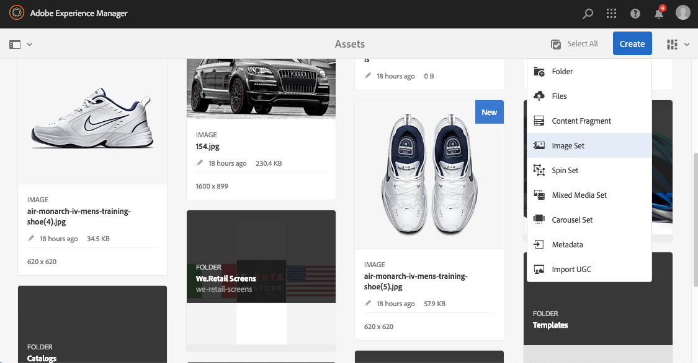

# Bilduppsättningar {#image-sets}

Bilduppsättningar ger användarna en integrerad visningsupplevelse, där användarna kan se olika vyer av ett objekt genom att klicka på en miniatyrbild. Med bilduppsättningar kan du visa alternativa vyer av ett objekt och visningsprogrammet har zoomverktyg som gör att du kan granska bilder noggrant.

Bilduppsättningar definieras av en banderoll med ordet `IMAGESET`. Om bilduppsättningen dessutom publiceras finns det publiceringsdatum som anges av ikonen **[!UICONTROL World]** på banderollen. Dessutom visas det senaste ändringsdatumet som anges av ikonen **[!UICONTROL Pencil]**.

I bilduppsättningen kan du även skapa färgrutor genom att skapa en bilduppsättning och lägga till miniatyrbilder.

Det här programmet är användbart när du vill visa ett objekt i en annan färg, ett annat mönster eller en annan avslutning. Om du vill skapa en bilduppsättning med färgrutor behöver du en bild för varje färg, mönster eller slut som du vill presentera för användarna. Du behöver också en färg-, mönster- eller slutfärgruta för varje färg, mönster eller slut.

Anta till exempel att du vill visa bilder med olika färgskalor; räkningarna är röda, gröna och blå. I så fall behöver du tre bilder med samma lock. Du behöver en bild med rött, en med grönt och en med blå räkning. Du behöver också en röd, grön och blå färgruta. Färgrutorna fungerar som miniatyrbilder som användare klickar på i visningsprogrammet för färgrutor för att visa den röda, gröna eller blå hatten.

>[!NOTE]
>
>Mer information om användargränssnittet Resurser finns i [Hantera resurser med Touch-gränssnittet](/help/assets/manage-digital-assets.md).

## Snabbstart: Bilduppsättningar {#quick-start-image-sets}

Så här kommer du igång snabbt:

1. Valfritt. [Skapa en ](/help/assets/dynamic-media/batch-set-presets-dm.md) förinställning för gruppuppsättning och använd den i en ny mapp där dina bilder överförs.

   En gruppuppsättning kan hjälpa dig att automatisera skapandet av din bilduppsättning.

   >[!IMPORTANT]
   >
   >Batchuppsättningar skapas av IPS (Image Production System) som en del av tillgångsinmatningen.

1. [Överför dina primära källbilder för flera vyer](#uploading-assets-in-image-sets).

   Ladda upp bilderna för dina bilduppsättningar. Kom ihåg att användare kan zooma in bilder i bilduppsättningsvisningsprogrammet. Välj bilderna noggrant. Se till att bilderna har minst 2 000 pixlar i den största dimensionen. Experience Manager Assets stöder många bildfilsformat, men förlustfria TIFF-, PNG- och EPS-bilder rekommenderas.

1. [Skapa bilduppsättningar](#creating-image-sets).

   I Bilduppsättningar klickar användare på miniatyrbilder i Bilduppsättningsvisningsprogrammet.

   Om du vill skapa en bilduppsättning i Resurser trycker eller klickar du på **[!UICONTROL Create > Image Sets]**. Lägg sedan till bilder och klicka på **[!UICONTROL Save]**.

   Se [Förbereda bilduppsättningsresurser för överföring och överföring av filer](#uploading-assets-in-image-sets).

   Se [Arbeta med väljare](/help/assets/dynamic-media/working-with-selectors.md).

1. Lägg till [Image Set Viewer-förinställningar](/help/assets/dynamic-media/managing-viewer-presets.md) efter behov.

   Administratörer kan skapa eller ändra förinställningar för bildspelsvisningsprogrammet. Om du vill visa bilduppsättningen med en visningsförinställning markerar du bilduppsättningen och väljer **[!UICONTROL Viewers]** i listrutan till vänster.

   Information om hur du skapar eller redigerar förinställningar för visningsprogram finns i **[!UICONTROL Tools > Assets > Viewer Presets]**.

1. (Valfritt) [Visa bilduppsättningar](/help/assets/dynamic-media/image-sets.md#viewing-image-sets) som har skapats med gruppuppsättningsförinställningar.
1. [Förhandsgranska bilduppsättningar](/help/assets/dynamic-media/previewing-assets.md).

   Markera bilduppsättningen och du kan förhandsgranska den. Tryck på miniatyrbildikonerna för att undersöka din bilduppsättning i det valda visningsprogrammet. Du kan välja olika visningsprogram på menyn **[!UICONTROL Viewers]**, som finns i den vänstra listrutan med spår.

1. [Publicera bilduppsättningar](/help/assets/dynamic-media/publishing-dynamicmedia-assets.md).

   När du publicerar en bilduppsättning aktiveras URL-adressen och strängen Embed. Dessutom måste du [publicera alla anpassade visningsförinställningar](/help/assets/dynamic-media/managing-viewer-presets.md) som du har skapat. Visningsförinställningarna som är färdiga för leverans har redan publicerats.

1. [Länka URL:er till webbprogrammet ](/help/assets/dynamic-media/linking-urls-to-yourwebapplication.md) eller  [bädda in video- eller bildvisningsprogrammet](/help/assets/dynamic-media/embed-code.md).

   Experience Manager Assets skapar URL-anrop för Image Sets och aktiverar dem när du har publicerat bilduppsättningarna. Du kan kopiera dessa URL:er när du förhandsgranskar resurser. Du kan även bädda in dem på din webbplats.

   Markera bilduppsättningen och välj **[!UICONTROL Viewers]** i den vänstra listrutan.

   Läs mer i [Länka en bilduppsättning till en webbsida](/help/assets/dynamic-media/linking-urls-to-yourwebapplication.md) och [Bädda in video- eller bildvisningsprogrammet](/help/assets/dynamic-media/embed-code.md).

Mer information om hur du redigerar bilduppsättningar finns i [redigera bilduppsättningar](#editing-image-sets). Dessutom kan du visa och redigera [bilduppsättningsegenskaper](/help/assets/manage-digital-assets.md#editing-properties).

Om du har problem med att skapa uppsättningar kan du läsa Bilder och uppsättningar i [Felsöka Dynamic Media](/help/assets/dynamic-media/troubleshoot-dm.md#images-and-sets).

## Överför resurser för bilduppsättningar {#uploading-assets-in-image-sets}

Börja med att ladda upp bildresurserna för dina bilduppsättningar. Kom ihåg att användare kan zooma in bilder i bilduppsättningsvisningsprogrammet. Välj bilderna noggrant. Se till att bilderna har minst 2 000 pixlar i den största dimensionen för optimal zoomdetaljrikedom. Dynamic Media kan återge bilder på upp till 25 megapixlar vardera. Du kan till exempel använda en 5 000 × 5 000 megapixelbild eller någon annan storlekskombination på upp till 25 megapixlar.

Bilduppsättningar har stöd för många bildfilsformat, men förlustfria TIFF-, PNG- och EPS-bilder rekommenderas.

Du kan överföra bilder för bilduppsättningar på samma sätt som du [överför andra resurser i Resurser](/help/assets/manage-digital-assets.md#uploading-assets).

### Förbereder bilduppsättningsresurser för överföring {#preparing-image-set-assets-for-upload}

Innan du skapar bilduppsättningar bör du kontrollera att bilderna har rätt storlek och format.

Om du vill skapa en bilduppsättning med flera vyer behöver du bilder som visar ett objekt från olika vypunkter eller visar olika aspekter av samma objekt. Målet är att framhäva de viktiga funktionerna i ett objekt så att läsarna får en fullständig bild av hur det ser ut eller gör.

Eftersom användare kan zooma bilder i bilduppsättningar bör du se till att bilderna har minst 2 000 pixlar i den största dimensionen. Experience Manager Assets stöder många bildfilsformat, men förlustfria TIFF-, PNG- och EPS-bilder rekommenderas.

>[!NOTE]
>
>Om du använder miniatyrbilder för att ange färgrutor för produkten gör du följande:
>
>Skapa vinjetter eller olika bilder av samma bild och visa dem i olika färger, mönster eller ytfärger. Du behöver också miniatyrbilder som motsvarar de olika färgerna, mönstren eller ytorna. Om du till exempel vill visa miniatyrbilder med en bilduppsättning med samma jacka i svart, brunt och grönt behöver du:
>
>* En svart, brun och grön tagning av samma jacka.
>* En svart, brun och grön färgminiatyrbild.

## Skapar bilduppsättningar {#creating-image-sets}

Du kan skapa bilduppsättningar via användargränssnittet eller via API:t.

>[!NOTE]
>
>Du kan också skapa bilduppsättningar automatiskt med [gruppuppsättningsförinställningar](/help/assets/dynamic-media/batch-set-presets-dm.md).
>**Viktigt!** Gruppuppsättningar skapas av IPS (Image Production System) som en del av resurshämtningen.

När du lägger till resurser i uppsättningen läggs de automatiskt till i alfanumerisk ordning. Du kan ändra ordning på eller sortera resurser manuellt när de har lagts till.

>[!NOTE]
>
>Bilduppsättningar stöds inte för resurser med &quot;,&quot; (komma) i filnamnet.

**Skapa en bilduppsättning**

1. I Adobe Experience Manager trycker du på Experience Manager-logotypen för att komma åt den globala navigeringskonsolen.
1. Tryck på **[!UICONTROL Navigation > Assets]**. Navigera till den plats där du vill skapa en bilduppsättning och tryck sedan på **[!UICONTROL Create > Image Set]** för att öppna sidan Redigerare för bilduppsättningar.

   Du kan också skapa uppsättningen inifrån en mapp som innehåller resurserna.

   

1. Ange ett namn för bilduppsättningen i fältet **[!UICONTROL Title]** på sidan Bilduppsättningsredigerare. Namnet visas i banderollen över bilduppsättningen. Du kan också ange en beskrivning.

   

1. Gör något av följande:

   * Tryck på **[!UICONTROL Add Asset]** i det övre vänstra hörnet av bilduppsättningsredigerarsidan.

   * Tryck på **[!UICONTROL Tap to open Asset Selector]** mitt på sidan Bilduppsättningsredigerare.
   Tryck för att välja resurser som du vill inkludera i din bilduppsättning. De markerade resurserna har en bockmarkeringsikon. När du är klar trycker du **[!UICONTROL Select]** i det övre högra hörnet på sidan.

   Med resursväljaren kan du söka efter resurser genom att skriva ett nyckelord och trycka eller klicka på **[!UICONTROL Return]**. Du kan också använda filter för att förfina sökresultatet. Du kan filtrera efter sökväg, samling, filtyp och tagg. Markera filtret och tryck sedan på ikonen **[!UICONTROL Filter]** i verktygsfältet. Ändra vyn genom att trycka på ikonen Visa och sedan välja **[!UICONTROL Column View]**, **[!UICONTROL Card View]** eller **[!UICONTROL List View]**.

   Se [Arbeta med väljare](/help/assets/dynamic-media/working-with-selectors.md).

   

1. När du lägger till resurser i uppsättningen läggs de automatiskt till i alfanumerisk ordning. Du kan ändra ordning på eller sortera resurser manuellt när du har lagt till dem.

   Om det behövs kan du dra en resurs sorteringsikon till höger om resursens filnamn för att ordna om bilderna uppåt eller nedåt i uppsättningslistan.

   

   Om du vill ändra en miniatyrbild eller färgruta klickar du på ikonen **+** **miniatyr** bredvid bilden och navigerar till den miniatyrbild eller färgruta som du vill använda. När du har markerat alla bilderna klickar du på **[!UICONTROL Save]**.

1. (Valfritt) Gör något av följande:

   * Om du vill ta bort en bild markerar du bilden och trycker på **[!UICONTROL Delete Asset]**.

   * Om du vill använda en förinställning trycker du på **[!UICONTROL Preset]** längst upp till höger på sidan och väljer sedan en förinställning som ska användas på alla resurser samtidigt.
   >[!NOTE]
   >
   >När du skapar bilduppsättningen kan du ändra miniatyrbilden för bilduppsättningen. Du kan också låta Experience Manager välja miniatyrbilden automatiskt baserat på resurserna i bilduppsättningen. Om du vill välja en miniatyrbild trycker du på **[!UICONTROL Change thumbnail]** ovanför fältet Titel på sidan för bilduppsättningsredigeraren. Markera sedan en bild (du kan navigera till andra mappar om du även vill söka efter bilder). Om du markerade en miniatyrbild och sedan vill att Experience Manager ska generera en från bilduppsättningen väljer du **[!UICONTROL Switch to]** **[!UICONTROL Automatic thumbnail]**.

1. Klicka på **[!UICONTROL Save]**. Den nya bilduppsättningen visas i den mapp du skapade den i.

## Visa bilduppsättningar {#viewing-image-sets}

Du kan skapa bilduppsättningar antingen i användargränssnittet eller automatiskt med [gruppuppsättningsförinställningar](/help/assets/dynamic-media/batch-set-presets-dm.md).

>[!IMPORTANT]
>
>Batchuppsättningar skapas av IPS [Image Production System] som en del av tillgångsintag.

Uppsättningar som skapats med gruppuppsättningsförinställningar visas *inte* i användargränssnittet. Du kan visa uppsättningarna på tre olika sätt. (Dessa metoder är tillgängliga även om du har skapat bilduppsättningarna i användargränssnittet).

* Öppna egenskaperna för en resurs. Egenskaper anger vad som ställer in den valda resursen eller en medlem i. Om du vill visa hela uppsättningen trycker du på uppsättningens namn.

   

* Från en medlemsbild i en uppsättning. Välj menyn **[!UICONTROL Sets]** om du vill visa de uppsättningar som resursen är medlem i.

   

* I sökningen kan du välja **[!UICONTROL Filter]**, sedan expandera **[!UICONTROL Dynamic Media]** och välja **[!UICONTROL Sets]**.

   Sökningen returnerar matchande uppsättningar som skapats manuellt i användargränssnittet eller automatiskt skapats med gruppuppsättningsförinställningar. För automatiska uppsättningar utförs sökfrågan med&quot;Börjar med&quot;. Det här sökvillkoret skiljer sig från Experience Manager, som bygger på &quot;Contains&quot;. Det enda sättet att söka efter automatiska uppsättningar är att ställa in filtret på **[!UICONTROL Sets]**.

   

>[!NOTE]
>
>Du kan visa uppsättningar via användargränssnittet enligt beskrivningen i [Redigera bilduppsättningar](#editing-image-sets).

## Redigera bilduppsättningar {#editing-image-sets}

Du kan utföra olika redigeringsåtgärder på bilduppsättningar, till exempel:

* Lägg till bilder i bilduppsättningen.
* Ändra ordning på bilderna i bilduppsättningen.
* Ta bort resurser i bilduppsättningen.
* Använd förinställningar för visningsprogram.
* Ta bort bilduppsättningen.

**Redigera bilduppsättningar**

1. Gör något av följande:

   * Håll pekaren över en bilduppsättningsresurs och tryck sedan på **[!UICONTROL Edit]** (pennikon).
   * Håll pekaren över en bilduppsättningsresurs, tryck på **[!UICONTROL Select]** (bockmarkeringsikon) och tryck sedan på **[!UICONTROL Edit]** i verktygsfältet.
   * Tryck på en bilduppsättningsresurs och tryck sedan på **[!UICONTROL Edit]** (pennikon) i verktygsfältet.

1. Gör något av följande om du vill redigera bilderna i bilduppsättningen:

   * Om du vill ändra ordning på resurser drar du en bild till en ny plats (markera sorteringsikonen för att flytta objekt).
   * Om du vill sortera objekt i stigande eller fallande ordning klickar du på kolumnrubriken.
   * Om du vill lägga till en resurs eller uppdatera en befintlig resurs klickar du på **[!UICONTROL Add Asset]**. Navigera till en resurs, markera den och tryck sedan på **[!UICONTROL Select]** nära det övre högra hörnet på sidan.

      >[!NOTE]
      >
      >Om du tar bort den bild som Experience Manager använder som miniatyrbild genom att ersätta den med en annan bild, visas fortfarande originalresursen.
   * Om du vill ta bort en resurs markerar du den och trycker eller klickar på **[!UICONTROL Delete Asset]**.
   * Om du vill använda en förinställning trycker du på **[!UICONTROL Preset]** längst upp till höger på sidan och väljer sedan en visningsförinställning.
   * Om du vill lägga till eller ändra en miniatyrbild markerar du miniatyrbildikonen bredvid resursens högra sida. Navigera till den nya miniatyrbilden eller färgruteresursen, markera den och tryck sedan på **[!UICONTROL Select]**.
   * Om du vill ta bort en hel bilduppsättning går du till bilduppsättningen, markerar den och trycker på **[!UICONTROL Delete]**.

   >[!NOTE]
   >
   >Du kan redigera bilderna i en bilduppsättning. Navigera till uppsättningen och tryck på **[!UICONTROL Set Members]** i den vänstra listen. Öppna redigeringsfönstret genom att trycka på pennikonen på en resurs.

1. Tryck på **[!UICONTROL Save]** när du är klar med redigeringen.

## Förhandsvisa bilduppsättningar {#previewing-image-sets}

Se [Förhandsgranska resurser](/help/assets/dynamic-media/previewing-assets.md).

## Publicerar bilduppsättningar {#publishing-image-sets}

Se [Publicera resurser](/help/assets/dynamic-media/publishing-dynamicmedia-assets.md).
