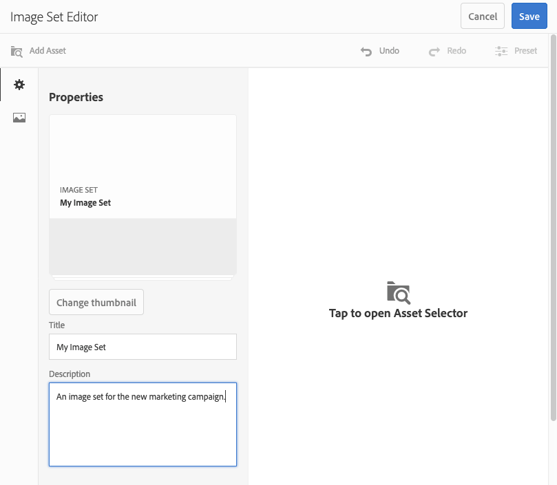

# Bilduppsättningar {#image-sets}

Bilduppsättningar ger användarna en integrerad visningsupplevelse, där användarna kan se olika vyer av ett objekt genom att klicka på en miniatyrbild. Med bilduppsättningar kan du visa alternativa vyer av ett objekt och visningsprogrammet har zoomverktyg som gör att du kan granska bilder noggrant.

Bilduppsättningar definieras av en banderoll med ordet `IMAGESET`. Om bilduppsättningen dessutom publiceras är det publiceringsdatum som anges av **[!UICONTROL World]** ikonen finns på banderollen. Det senaste ändringsdatumet, som anges av **[!UICONTROL Pencil]** visas.

I bilduppsättningen kan du även skapa färgrutor genom att skapa en bilduppsättning och lägga till miniatyrbilder.

Det här programmet är användbart när du vill visa ett objekt i en annan färg, ett annat mönster eller en annan avslutning. Om du vill skapa en bilduppsättning med färgrutor behöver du en bild för varje färg, mönster eller slut som du vill presentera för användarna. Du behöver också en färg-, mönster- eller slutfärgruta för varje färg, mönster eller slut.

Anta till exempel att du vill visa bilder av ändpunkter med olika färgskalor. Bilderna är röda, gröna och blå. I så fall behöver du tre bilder med samma lock. Du behöver en bild med rött, en med grönt och en med blå räkning. Du behöver också en röd, grön och blå färgruta. Färgrutorna fungerar som miniatyrbilder som användare klickar på i visningsprogrammet för färgrutor för att visa den röda, gröna eller blå hatten.

>[!NOTE]
>
>Mer information om gränssnittet Resurser finns i [Hantera resurser med Touch-gränssnittet](/help/assets/manage-digital-assets.md).

När du skapar en bilduppsättning rekommenderar Adobe följande metodtips och tillämpar följande begränsningar:

| Begränsningstyp | Bästa praxis | Begränsning har införts |
| --- | --- | --- |
| Antal dubblettresurser per uppsättning | Inga dubbletter | 20 |
| Maximalt antal bilder per uppsättning | 5-10 bilder per uppsättning | 1000 |

Se även [Dynamic Media begränsningar](/help/assets/dynamic-media/limitations.md).

## Snabbstart: Bilduppsättningar {#quick-start-image-sets}

Så här kommer du igång snabbt:

1. Valfritt. [Skapa en förinställning för gruppuppsättning](/help/assets/dynamic-media/batch-set-presets-dm.md) och tillämpa den på en ny mapp där dina bilder överförs.

   En gruppuppsättning kan hjälpa dig att automatisera skapandet av din bilduppsättning.

   >[!IMPORTANT]
   >
   >Batchuppsättningar skapas av IPS (Image Production System) som en del av tillgångsinmatningen.

1. [Överför dina primära källbilder för flera vyer](#uploading-assets-in-image-sets).

   Överför bilderna till dina bilduppsättningar. Kom ihåg att användare kan zooma in bilder i bilduppsättningsvisningsprogrammet. Därför bör du vara noggrann när du väljer bilder. Se till att bilderna har en största storlek på minst 2 000 pixlar.

   Se [Dynamic Media - Rasterbildformat som stöds](/help/assets/file-format-support.md#image-support-dynamic-media) för en lista med format som stöds av bilduppsättningar.

1. [Skapa bilduppsättningar](#creating-image-sets).

   I Bilduppsättningar klickar användare på miniatyrbilder i Bilduppsättningsvisningsprogrammet.

   Om du vill skapa en bilduppsättning i Resurser väljer du **[!UICONTROL Create]** > **[!UICONTROL Image Sets]**. Lägg sedan till bilder och klicka på **[!UICONTROL Save]**.

   Se [Förbereda bilduppsättningsresurser för överföring och överföring av filer](#uploading-assets-in-image-sets).

   Se [Arbeta med väljare](/help/assets/dynamic-media/working-with-selectors.md).

1. Lägg till [Bildinställningar för visningsprogram](/help/assets/dynamic-media/managing-viewer-presets.md), efter behov.

   Administratörer kan skapa eller ändra förinställningar för bildspelsvisningsprogrammet. Om du vill visa bilduppsättningen med en visningsförinställning markerar du bilduppsättningen och väljer i listrutan till vänster **[!UICONTROL Viewers]**.

   Information om hur du skapar eller redigerar förinställningar för visningsprogram finns i **[!UICONTROL Tools]** > **[!UICONTROL Assets]** > **[!UICONTROL Viewer Presets]**.

1. (Valfritt) [Visa bilduppsättningar](/help/assets/dynamic-media/image-sets.md#viewing-image-sets) som skapades med gruppuppsättningsförinställningar.
1. [Förhandsvisa bilduppsättningar](/help/assets/dynamic-media/previewing-assets.md).

   Markera bilduppsättningen och du kan förhandsgranska den. Markera miniatyrbildikonerna om du vill undersöka bilduppsättningen i det valda visningsprogrammet. Du kan välja olika visningsprogram från **[!UICONTROL Viewers]** som finns i den vänstra rullgardinsmenyn.

1. [Publicera bilduppsättningar](/help/assets/dynamic-media/publishing-dynamicmedia-assets.md).

   När du publicerar en bilduppsättning aktiveras URL-adressen och strängen Embed. Dessutom måste du [publicera anpassade visningsprogramförinställningar](/help/assets/dynamic-media/managing-viewer-presets.md) som du har skapat. Visningsförinställningarna som är färdiga för leverans har redan publicerats.

1. [Länka URL:er till ditt webbprogram](/help/assets/dynamic-media/linking-urls-to-yourwebapplication.md) eller [Bädda in video- eller bildvisningsprogrammet](/help/assets/dynamic-media/embed-code.md).

   Experience Manager Assets skapar URL-anrop för bilduppsättningar och aktiverar dem när du har publicerat bilduppsättningarna. Du kan kopiera dessa URL:er när du förhandsgranskar resurser. Du kan även bädda in dem på din webbplats.

   Markera bilduppsättningen och välj sedan i den vänstra listrutan med skenor **[!UICONTROL Viewers]**.

   Se [Länka en bilduppsättning till en webbsida](/help/assets/dynamic-media/linking-urls-to-yourwebapplication.md) och [Bädda in video- eller bildvisningsprogrammet](/help/assets/dynamic-media/embed-code.md).

Information om hur du redigerar bilduppsättningar finns i [redigera bilduppsättningar](#editing-image-sets). Dessutom kan du visa och redigera [Egenskaper för bilduppsättning](/help/assets/manage-digital-assets.md#editing-properties).

Om du har problem med att skapa uppsättningar kan du läsa Bilder och uppsättningar i [Felsöka Dynamic Media](/help/assets/dynamic-media/troubleshoot-dm.md#images-and-sets).

## Överför resurser för bilduppsättningar {#uploading-assets-in-image-sets}

Börja med att ladda upp bildresurserna för dina bilduppsättningar. Kom ihåg att användare kan zooma in bilder i bilduppsättningsvisningsprogrammet. Därför bör du vara noggrann när du väljer bilder. Se till att bilderna är minst 2 000 pixlar i den största storleken för optimal zoomdetaljrikedom. Dynamic Media kan återge bilder på upp till 25 megapixlar vardera. Du kan till exempel använda en 5 000 × 5 000 megapixelbild eller någon annan storlekskombination på upp till 25 megapixlar.

<!-- Image Sets supports many image file formats, but lossless TIFF, PNG, and EPS images are recommended. -->

Se [Dynamic Media - Rasterbildformat som stöds](/help/assets/file-format-support.md#image-support-dynamic-media) för en lista med format som stöds av bilduppsättningar.

Du kan överföra bilder för bilduppsättningar på samma sätt som du gör [ladda upp alla andra resurser i Assets](/help/assets/manage-digital-assets.md#uploading-assets).

### Förbered bilduppsättningsresurser för överföring {#preparing-image-set-assets-for-upload}

Innan du skapar bilduppsättningar bör du kontrollera att bilderna har rätt storlek och format.

Om du vill skapa en bilduppsättning med flera vyer behöver du bilder som visar ett objekt från olika vypunkter eller visar olika aspekter av samma objekt. Målet är att framhäva de viktiga funktionerna i ett objekt så att läsarna får en fullständig bild av hur det ser ut eller vad det gör.

Eftersom användare kan zooma bilder i bilduppsättningar bör du se till att bilderna har minst 2 000 pixlar stor storlek. Experience Manager Assets har stöd för många bildfilsformat, men förlustfria bilder i TIFF, PNG och EPS rekommenderas.

>[!NOTE]
>
>Om du använder miniatyrbilder för att ange färgrutor för produkten gör du följande:
>
>Skapa vinjetter eller olika bilder av samma bild och visa dem i olika färger, mönster eller ytfärger. Du behöver också miniatyrbilder som motsvarar de olika färgerna, mönstren eller ytorna. Om du till exempel vill visa miniatyrbilder med en bilduppsättning med samma jacka i svart, brunt och grönt behöver du:
>
>* En svart, brun och grön tagning av samma jacka.
>* En svart, brun och grön färgminiatyrbild.

## Skapa bilduppsättningar {#creating-image-sets}

Du kan skapa bilduppsättningar via användargränssnittet eller via API:t.

>[!NOTE]
>
>Du kan också skapa bilduppsättningar automatiskt med [gruppuppsättningsförinställningar](/help/assets/dynamic-media/batch-set-presets-dm.md).
>**Viktigt:** Batchuppsättningar skapas av IPS (Image Production System) som en del av tillgångsinmatningen.

När du lägger till resurser i uppsättningen läggs de automatiskt till i alfanumerisk ordning. Du kan ändra ordning på eller sortera resurser manuellt när de har lagts till.

>[!NOTE]
>
>Bilduppsättningar stöds inte för resurser med &quot;,&quot; (komma) i filnamnet.

När du skapar en bilduppsättning rekommenderar Adobe följande metodtips och tillämpar följande begränsningar:

| Begränsningstyp | Bästa praxis | Begränsning har införts |
| --- | --- | --- |
| Antal dubblettresurser per uppsättning | Inga dubbletter | 20 |
| Maximalt antal bilder per uppsättning | 5-10 bilder per uppsättning | 1000 |

Se även [Dynamic Media begränsningar](/help/assets/dynamic-media/limitations.md).

**Så här skapar du bilduppsättningar:**

1. I Adobe Experience Manager väljer du Experience Manager logotypen för att komma åt den globala navigeringskonsolen.
1. Välj **[!UICONTROL Navigation]** > **[!UICONTROL Assets]**. Navigera till den plats där du vill skapa en bilduppsättning och gå sedan till **[!UICONTROL Create]** > **[!UICONTROL Image Set]** för att öppna sidan Bilduppsättningsredigerare.

   Du kan också skapa uppsättningen inifrån en mapp som innehåller dina resurser.

   

1. På sidan Bilduppsättningsredigerare, på **[!UICONTROL Title]** anger du ett namn för bilduppsättningen. Namnet visas i banderollen över bilduppsättningen. Du kan också ange en beskrivning.

   

1. Gör något av följande:

   * I närheten av det övre vänstra hörnet på sidan Bilduppsättningsredigerare väljer du **[!UICONTROL Add Asset]**.

   * I mitten av bilduppsättningens redigeringssida väljer du **[!UICONTROL Tap to open Asset Selector]**.

   Välj det här alternativet om du vill välja resurser som ska ingå i din bilduppsättning. Markerade resurser har en bockmarkeringsikon över sig. När du är klar väljer du **[!UICONTROL Select]**.

   Med resursväljaren kan du söka efter resurser genom att skriva ett nyckelord och välja **[!UICONTROL Return]**. Du kan också använda filter för att förfina sökresultatet. Du kan filtrera efter sökväg, samling, filtyp och tagg. Markera filtret och välj sedan **[!UICONTROL Filter]** i verktygsfältet. Ändra vyn genom att markera ikonen Visa och välja **[!UICONTROL Column View]**, **[!UICONTROL Card View]**, eller **[!UICONTROL List View]**.

   Se [Arbeta med väljare](/help/assets/dynamic-media/working-with-selectors.md).

   

1. När du lägger till resurser i uppsättningen läggs de automatiskt till i alfanumerisk ordning. Du kan ändra ordning på eller sortera resurser manuellt när du har lagt till dem.

   Om det behövs kan du dra en resurs sorteringsikon till höger om resursens filnamn för att ordna om bilderna uppåt eller nedåt i uppsättningslistan.

   

   Om du vill ändra en miniatyrbild eller färgruta klickar du på ikonen **+** **miniatyr** bredvid bilden och navigerar till den miniatyrbild eller färgruta som du vill använda. När du har markerat alla bilderna klickar du på **[!UICONTROL Save]**.

1. (Valfritt) Gör något av följande:

   * Om du vill ta bort en bild markerar du bilden och väljer **[!UICONTROL Delete Asset]**.

   * Om du vill använda en förinställning väljer du **[!UICONTROL Preset]** väljer du sedan en förinställning som ska användas på alla resurser samtidigt.

   >[!NOTE]
   >
   >När du skapar bilduppsättningen kan du ändra miniatyrbilden för bilduppsättningen. Du kan också låta Experience Manager välja miniatyrbilden automatiskt baserat på resurserna i bilduppsättningen. Om du vill välja en miniatyrbild väljer du **[!UICONTROL Change thumbnail]** ovanför fältet Titel på sidan Bilduppsättningsredigerare. Markera sedan en bild (du kan navigera till andra mappar om du även vill söka efter bilder). Om du har markerat en miniatyrbild och sedan vill att Experience Manager ska generera en från bilduppsättningen väljer du **[!UICONTROL Switch to]** **[!UICONTROL Automatic thumbnail]**.

1. Klicka på **[!UICONTROL Save]**. Den skapade bilduppsättningen visas i den mapp du skapade den i.

## Visa bilduppsättningar {#viewing-image-sets}

Du kan skapa bilduppsättningar antingen i användargränssnittet eller automatiskt med [gruppuppsättningsförinställningar](/help/assets/dynamic-media/batch-set-presets-dm.md).

>[!IMPORTANT]
>
>Batchuppsättningar skapas av IPS [Bildproduktionssystem] som en del av tillgångsintag.

Men uppsättningar som skapats med gruppuppsättningsförinställningar gör *not* visas i användargränssnittet. Du kan visa uppsättningarna på tre olika sätt. (Dessa metoder är tillgängliga även om du har skapat bilduppsättningarna i användargränssnittet).

* Öppna egenskaperna för en resurs. Egenskaper anger vad som ställer in den valda resursen eller en medlem i. Om du vill se hela uppsättningen markerar du uppsättningens namn.

  

* Från en medlemsbild i en uppsättning. Välj **[!UICONTROL Sets]** för att visa de uppsättningar som resursen är medlem i.

  

* Från sökningen kan du välja **[!UICONTROL Filter]** och sedan expandera **[!UICONTROL Dynamic Media]** och markera **[!UICONTROL Sets]**.

  Sökningen returnerar matchande uppsättningar som skapats manuellt i användargränssnittet eller automatiskt skapats med gruppuppsättningsförinställningar. För automatiska uppsättningar utförs sökfrågan med&quot;Börjar med&quot;. Det här sökvillkoret skiljer sig från Experience Manager, som bygger på &quot;Contains&quot;. Ange att filtret ska **[!UICONTROL Sets]** är det enda sättet att söka i automatiska uppsättningar.

  

>[!NOTE]
>
>Du kan visa uppsättningar via användargränssnittet enligt beskrivningen i [Redigera bilduppsättningar](#editing-image-sets).

## Redigera bilduppsättningar {#editing-image-sets}

Du kan utföra olika redigeringsåtgärder på bilduppsättningar, till exempel följande:

* Lägg till bilder i bilduppsättningen.
* Ändra ordning på bilderna i bilduppsättningen.
* Ta bort resurser i bilduppsättningen.
* Använd förinställningar för visningsprogram.
* Ta bort bilduppsättningen.

**Så här redigerar du bilduppsättningar:**

1. Gör något av följande:

   * Håll pekaren över en bilduppsättningsresurs och välj sedan **[!UICONTROL Edit]** (pennikon).
   * Hovra över en bilduppsättningsresurs, välj **[!UICONTROL Select]** (bockmarkeringsikon) och sedan välja **[!UICONTROL Edit]** i verktygsfältet.
   * Välj en bilduppsättningsresurs och välj sedan **[!UICONTROL Edit]** (pennikon) i verktygsfältet.

1. Gör något av följande om du vill redigera bilderna i bilduppsättningen:

   * Om du vill ändra ordning på resurser drar du en bild till en ny plats (markera sorteringsikonen för att flytta objekt).
   * Om du vill sortera objekt i stigande eller fallande ordning klickar du på kolumnrubriken.
   * Om du vill lägga till en resurs eller uppdatera en befintlig resurs klickar du på **[!UICONTROL Add Asset]**. Navigera till en resurs, markera den och välj **[!UICONTROL Select]** nära sidans övre högra hörn.
     >[!NOTE]
     >
     >Om du tar bort den bild som Experience Manager använder som miniatyrbild genom att ersätta den med en annan bild, visas fortfarande originalresursen.
   * Om du vill ta bort en resurs markerar du den och väljer **[!UICONTROL Delete Asset]**.
   * Om du vill använda en förinställning väljer du **[!UICONTROL Preset]** väljer du sedan en visningsförinställning.
   * Om du vill lägga till eller ändra en miniatyrbild markerar du miniatyrbildikonen bredvid resursens högra sida. Navigera till den nya miniatyrbilden eller färgruteresursen, markera den och markera sedan **[!UICONTROL Select]**.
   * Om du vill ta bort en hel bilduppsättning går du till bilduppsättningen, markerar den och markerar den **[!UICONTROL Delete]**.

   >[!NOTE]
   >
   >Du kan redigera bilderna i en bilduppsättning. Navigera till uppsättningen och markera **[!UICONTROL Set Members]** till vänster. Om du vill öppna redigeringsfönstret väljer du pennikonen på en resurs.

1. Välj **[!UICONTROL Save]** när du är klar med redigeringen.

## Förhandsvisa bilduppsättningar {#previewing-image-sets}

Se [Förhandsgranska resurser](/help/assets/dynamic-media/previewing-assets.md).

## Publicera bilduppsättningar {#publishing-image-sets}

Se [Publicera resurser](/help/assets/dynamic-media/publishing-dynamicmedia-assets.md).
