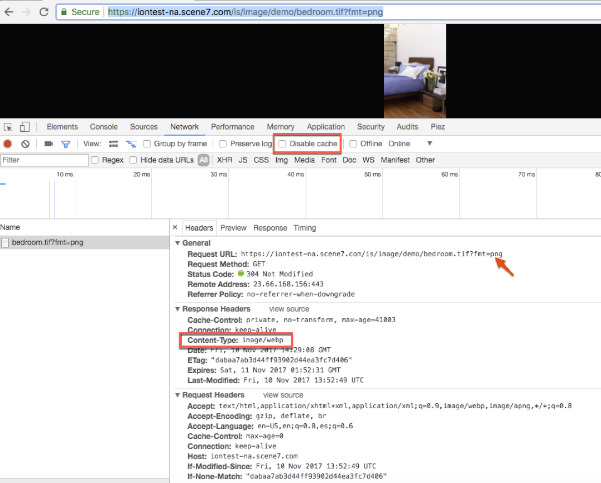

# Smart bildbehandling {#smart-imaging}

## Vad är&quot;Smart Imaging&quot;? {#what-is-smart-imaging}

Smart Imaging-tekniken tillämpar Adobe Sensei AI-funktioner och fungerar med befintliga&quot;bildförinställningar&quot;. Det förbättrar bildleveransen genom att automatiskt optimera bildformat, storlek och kvalitet baserat på webbläsarens funktioner.

>[!IMPORTANT]
>
>Smart Imaging kräver att du använder det färdiga CDN (Content Delivery Network) som medföljer Adobe Experience Manager - Dynamic Media. Eventuellt annat anpassat CDN stöds inte med den här funktionen.

Smart Imaging drar också nytta av den ökade prestandaförbättringen genom att vara helt integrerad med Adobe förstklassiga CDN-tjänst (Content Delivery Network). Den här tjänsten hittar den optimala Internet-vägen mellan servrar, nätverk och peering-punkter. Den hittar en väg som har lägst latens och lägst paketförlustfrekvens i stället för att använda standardvägen på Internet.

I följande bildresursexempel visas den nya optimeringen av smarta bilder:

| Bild (URL) | Miniatyrbild | Storlek  (JPEG) | Storlek (WebP)  (med Smart Imaging) | % minskning |
|---|---|---|---|---|
| [Bild 1](https://techsupport.scene7.com/is/image/TechSupport/SmartImaging_6?hei=500&amp;fmt=jpg&amp;qlt=85&amp;resmode=bisharp&amp;op_usm=5,0.125,5,0) |  | 73,75 kB | 45,92 kB | 38 % |
| [Bild 2](https://techsupport.scene7.com/is/image/TechSupport/SmartImaging_3?hei=500&amp;fmt=jpg&amp;qlt=85&amp;resmode=bisharp&amp;op_usm=5,0.125,5,0) |  | 191 kB | 70,66 kB | 63 % |
| [Bild 3](https://techsupport.scene7.com/is/image/TechSupport/SmartImaging_2?hei=500&amp;fmt=jpg&amp;qlt=85&amp;resmode=bisharp&amp;op_usm=5,0.125,5,0) |  | 96,64 kB | 39,44 kB | 59 % |
| [Bild 4](https://techsupport.scene7.com/is/image/TechSupport/SmartImaging_1?hei=500&amp;qlt=85&amp;resmode=bisharp&amp;op_usm=5,0.125,5,0) |  | 315,80 kB | 178,19 kB | 44 % |
|  |  |  |  | Genomsnitt = 51 % |

På samma sätt som ovanstående testade Adobe också 7 009 URL:er från kundsajter. De kunde i genomsnitt optimera JPEG med 38 % ytterligare. För PNG med WebP-format kunde de i genomsnitt optimera filstorleken med 31 %. Den här typen av optimering är möjlig tack vare funktionen för smart bildbehandling.

På mobilnätet förvärras problemen av två faktorer:

* Många olika enheter med olika formfaktorer och skärmar med hög upplösning.
* Begränsad nätverksbandbredd.

När det gäller bilder är målet att leverera bilder av högsta kvalitet så effektivt som möjligt.

### Om optimering av enhetens pixelproportioner {#dpr}

Enhetens pixelförhållande (DPR) - även kallat CSS-pixelförhållande - är relationen mellan en enhets fysiska pixlar och logiska pixlar. I synnerhet med nya retinaskärmar växer pixelupplösningen i moderna mobilenheter i snabb takt.

Om du aktiverar optimering av enhetspixelproportioner återges bilden med skärmens ursprungliga upplösning, vilket gör att den ser skarp ut.

Om du aktiverar DPR-konfigurationen för smart bildåtergivning justeras den begärda bilden automatiskt baserat på pixeldensiteten på den skärm som begäran hanteras från. För närvarande kommer pixeldensiteten för visningen från Akamai CDN-rubrikvärden.

| Tillåtna värden i en bilds URL | Beskrivning |
|---|---|
| `dpr=off` | Inaktivera DPR-optimering på URL-nivå för en enskild bild. |
| `dpr=on,dprValue` | Åsidosätt det DPR-värde som identifieras av Smart Imaging, med ett anpassat värde (som identifieras av någon klientlogik eller annan metod). Tillåtet värde för `dprValue` är ett tal som är större än 0. De angivna värdena 1,5, 2 eller 3 är typiska. |

>[!NOTE]
>
>* Du kan använda `dpr=on,dprValue` även om inställningen för DPR på företagsnivå är inaktiverad.
>* På grund av DPR-optimering identifieras alltid MaxPix-bredden när den resulterande bilden är större än Dynamic Media-inställningen MaxPix genom att bildens proportioner behålls.

| Begärd bildstorlek | DPR-värde | Levererad bildstorlek |
|---|---|---|
| 816x500 | 1 | 816x500 |
| 816x500 | 2 | 1632x1000 |

Se även [När du arbetar med bilder](/help/assets/dynamic-media/adding-dynamic-media-assets-to-pages.md#when-working-with-images) och [När du arbetar med smart beskärning](/help/assets/dynamic-media/adding-dynamic-media-assets-to-pages.md#when-working-with-smart-crop).

### Om optimering av nätverksbandbredd {#network-bandwidth-optimization}

Om du aktiverar nätverksbandbredd justeras den bildkvalitet som hanteras automatiskt baserat på den faktiska nätverksbandbredden. För dålig nätverksbandbredd inaktiveras DPR-optimering automatiskt, även om det redan är aktiverat.

Om du vill kan ditt företag välja att inte optimera nätverksbandbredden på den enskilda bildnivån genom att lägga till `network=off` till bildens URL.

| Tillåtet värde i URL:en för en bild | Beskrivning |
|---|---|
| `network=off` | Stänger av nätverksoptimering på URL-nivå för en enskild bild. |

>[!NOTE]
>
>DPR- och nätverksbandbreddsvärdena baseras på de värden som identifierats på klientsidan för det paketerade CDN. Dessa värden är ibland felaktiga. I iPhone5 med DPR=2 och iPhone12 med DPR=3 visar båda DPR=2. För högupplösta enheter är det ändå bättre att skicka DPR=2 än att skicka DPR=1. Kommer snart: Adobe arbetar med kod på klientsidan för att exakt fastställa slutanvändarens DPR.

## Vilka är de viktigaste fördelarna med den senaste Smart Imaging? {#what-are-the-key-benefits-of-smart-imaging}

Bilderna utgör större delen av en sidas inläsningstid. Därför kan alla prestandaförbättringar ha en genomgripande effekt på högre konverteringsgrader, hur lång tid som läggs på en webbplats och få lägre avhoppsfrekvens.

Förbättringar i den senaste versionen av Smart Imaging:

* Förbättrad Google SEO-rankning för webbsidor som använder den senaste Smart Imaging.
* Serverar optimerat innehåll direkt (vid körning).
* Använder Adobe Sensei-teknik för att konvertera enligt den kvalitet (`qlt`) som anges i bildbegäran.
* Smart Imaging kan inaktiveras med URL-parametern `bfc`.
* TTL-oberoende (Time To Live). Tidigare var en minsta TTL på 12 timmar obligatorisk för att Smart Imaging skulle fungera.
* Tidigare cachelagrades både original- och härledda bilder, och det var en tvåstegsprocess att göra cacheminnet ogiltigt. I den senaste versionen av Smart Imaging cachelagras bara derivat, vilket möjliggör en cacheogiltigförklaring i ett enda steg.
* Kunder som använder anpassade rubriker i sina regeluppsättningar kan dra nytta av den senaste smarta bildhanteringen eftersom dessa rubriker inte blockeras, till skillnad från den tidigare versionen av Smart Imaging. Exempel:&quot;Timing Allow Origin&quot;,&quot;X-Robot&quot; som föreslogs i [Lägga till ett anpassat rubrikvärde i bildsvar|Dynamic Media Classic](https://helpx.adobe.com/experience-manager/scene7/kb/base/scene7-rulesets/add-custom-header-val-image.html).

## Är det några licenskostnader kopplade till Smart Imaging? {#are-there-any-licensing-costs-associated-with-smart-imaging}

Nej. Smart Imaging ingår i din befintliga licens. Den här regeln gäller antingen Dynamic Media Classic eller Experience Manager - Dynamic Media (On-prem, AMS och Experience Manager som Cloud Service).

>[!NOTE]
>
>Smart Imaging är inte tillgängligt för Dynamic Media - Hybrid-kunder.

## Hur fungerar Smart Imaging? {#how-does-smart-imaging-work}

När en bild efterfrågas av en konsument kontrollerar Smart Imaging användarens egenskaper och konverterar till rätt bildformat baserat på vilken webbläsare som används. Dessa formatkonverteringar görs på ett sätt som inte försämrar den visuella återgivningen. Smart bildbehandling konverterar automatiskt bilder till olika format baserat på webbläsarkapacitet på följande sätt.

<!--   * Safari 14.0 +
    * Safari 14 only with iOS 14.0 and above and macOS BigSur and above -->

* Konvertera automatiskt till WebP för följande webbläsare:
   * Krom
   * Firefox
   * Microsoft® Edge
   * Safari (i iOS, macOS, iPadOS), webbläsare och operativsystem stöder WebP
   * Android™
   * Opera
* Stöd för äldre webbläsare för följande:

   | Webbläsare | Webbläsare/OS-version | Format |
   | --- | --- | --- |
   | Safari | Tidigare än iOS/iPad 14.0 eller macOS BigSur | JPEG2000 |
   | Edge | Tidigare än 18 | JPEGXR |
   | Internet Explorer | 9+ | JPEGXR |
* För webbläsare som inte stöder dessa format används det bildformat som ursprungligen begärdes.

Om den ursprungliga bildstorleken är mindre än vad Smart Imaging skapar, behålls originalbilden.

## Vilka bildformat stöds? {#what-image-formats-are-supported}

Följande bildformat stöds för Smart Imaging:

* JPEG
* PNG

<!-- For any other format mentioned in a URL, you should explicity turn off Smart Imaging.  Append modifier `bfc=off` to the URL for file formats other than JPEG and PNG. You can accomplish this by using either one of the following methods:

* Use a ruleset if the `fmt` modifier is mentioned in the URL. 
* Append in URL modifiers field of the presets concerned.

Adobe is working on a permanent fix that does not require you to append `bfc=off` for `fmt !=JPEG` or `fmt !=PNG`. This topic will be updated after the fix is delivered. -->

## Hur fungerar Smart Imaging med befintliga bildförinställningar som redan används? {#how-does-smart-imaging-work-with-our-existing-image-presets-that-are-already-in-use}

Smart Imaging fungerar med befintliga&quot;bildförinställningar&quot;. Den observerar alla bildinställningar förutom kvalitet (`qlt`) och format (`fmt`) om det begärda filformatet är JPEG eller PNG. Vid formatkonvertering bevarar Smart Imaging den fullständiga visuella återgivningen enligt inställningarna för bildförinställningarna, men med en mindre filstorlek. Om den ursprungliga bildstorleken är mindre än vad Smart Imaging skapar, behålls originalbilden.

<!-- In addition, if your image presets are used to return `fmt !=JPEG` or `fmt !=PNG`, be sure append `bfc=off` in the preset modifier field to return the requested file format. -->

## Måste jag ändra URL:er, bildförinställningar eller distribuera ny kod för Smart Imaging på min webbplats? {#will-i-have-to-change-any-urls-image-presets-or-deploy-any-new-code-on-my-site-for-smart-imaging}

Smart Imaging fungerar sömlöst med dina befintliga bild-URL:er och bildförinställningar om du konfigurerar Smart Imaging på din befintliga anpassade domän. Dessutom kräver Smart Imaging inte att du lägger till kod på webbplatsen för att identifiera en användares webbläsare. Allt hanteras automatiskt.

Om du måste konfigurera en ny anpassad domän att använda Smart Imaging måste URL:erna uppdateras för att återspegla den anpassade domänen.

Mer information om krav för smart bildbehandling finns i [Är jag berättigad att använda Smart bildbehandling?](#am-i-eligible-to-use-smart-imaging)

<!-- No. Smart Imaging works seamlessly with your existing image URLs and image presets. In addition, Smart Imaging does not require you to add any code on your website to detect a user's browser. All of this is handled automatically. -->

<!-- As mentioned earlier, Smart Imaging supports only JPEG and PNG image formats. For other formats, you need to append the `bfc=off` modifier to the URL as described earlier. -->

## Fungerar Smart Imaging med HTTPS? Vad sägs om HTTP/2? {#does-smart-imaging-working-with-https-how-about-http}

Smart Imaging fungerar med bilder som levereras via HTTP eller HTTPS. Dessutom fungerar det även över HTTP/2.

## Är jag berättigad att använda Smart Imaging? {#am-i-eligible-to-use-smart-imaging}

Om du vill använda Smart Imaging måste ditt företags Dynamic Media Classic- eller Dynamic Media-konto på Experience Manager uppfylla följande krav:

* Använd det Adobe-paketerade CDN (Content Delivery Network) som en del av licensen.
* Använd en dedikerad domän (till exempel `images.company.com` eller `mycompany.scene7.com`), inte en allmän domän (till exempel `s7d1.scene7.com`, `s7d2.scene7.com` eller `s7d13.scene7.com`).

Om du vill hitta dina domäner öppnar du [Dynamic Media Classic-datorprogrammet](https://experienceleague.adobe.com/docs/dynamic-media-classic/using/getting-started/signing-out.html#getting-started) och loggar sedan in på ditt eller dina företagskonton.

Tryck på **[!UICONTROL Setup]** > **[!UICONTROL Application Setup]** > **[!UICONTROL General Settings]**. Leta efter fältet **[!UICONTROL Published Server Name]**. Om du för närvarande använder en allmän domän kan du begära att få gå över till din egen anpassade domän. Gör den här övergångsbegäran när du skickar in en teknisk supportanmälan.

Din första anpassade domän kostar inget extra med en Dynamic Media-licens.

## Hur aktiverar jag Smart Imaging för mitt konto? {#what-is-the-process-for-enabling-smart-imaging-for-my-account}

Du initierar begäran om att använda Smart Imaging; den inte aktiveras automatiskt.

Som standard är DPR för Smart Imaging och nätverksoptimering inaktiverat (inaktiverat) för ett Dynamic Media-företagskonto. Om du vill aktivera (aktivera) en eller båda av dessa färdiga förbättringar skapar du ett supportärende enligt beskrivningen nedan.

Versionsschemat för DPR för Smart Imaging och nätverksoptimering är följande:

| Län | Måldatum |
|---|---|
| Nordamerika | 24 maj 2021 |
| Europa, Mellanöstern, Afrika | 25 juni 2021 |
| Asien-Stillahavsområdet | 19 juli 2021 |

1. [Använd Admin Console för att skapa ett supportärende](https://helpx.adobe.com/enterprise/admin-guide.html/enterprise/using/support-for-experience-cloud.ug.html).
1. Ange följande information i ditt supportärende:

   1. Primärt kontaktnamn, e-postadress, telefon.
   1. Alla domäner som ska aktiveras för Smart Imaging (d.v.s. `images.company.com` eller `mycompany.scene7.com`).

      Om du vill hitta dina domäner öppnar du [Dynamic Media Classic-datorprogrammet](https://experienceleague.adobe.com/docs/dynamic-media-classic/using/getting-started/signing-out.html#getting-started) och loggar sedan in på ditt eller dina företagskonton.

      Klicka på **[!UICONTROL Setup]** > **[!UICONTROL Application Setup]** > **[!UICONTROL General Settings]**.

      Leta efter fältet **[!UICONTROL Published Server Name]**.
   1. Kontrollera att du använder CDN via Adobe och inte hanteras med en direkt relation.
   1. Kontrollera att du använder en dedikerad domän som `images.company.com` eller `mycompany.scene7.com` och inte en allmän domän, som `s7d1.scene7.com`, `s7d2.scene7.com`, `s7d13.scene7.com`.

      Om du vill hitta dina domäner öppnar du [Dynamic Media Classic-datorprogrammet](https://experienceleague.adobe.com/docs/dynamic-media-classic/using/getting-started/signing-out.html#getting-started) och loggar sedan in på ditt eller dina företagskonton.

      Klicka på **[!UICONTROL Setup]** > **[!UICONTROL Application Setup]** > **[!UICONTROL General Settings]**.

      Leta efter fältet **[!UICONTROL Published Server Name]**. Om du för närvarande använder en allmän Dynamic Media Classic-domän kan du begära att du flyttar över till din egen anpassade domän som en del av den här övergången.
   1. Ange om du vill att den ska fungera över HTTP/2.

1. Adobe kundtjänst lägger till dig i väntelistan för Smart Imaging baserat på i vilken ordning begäranden skickas.
1. När Adobe är redo att hantera din begäran kontaktar kundtjänst dig för att koordinera och ange ett måldatum.
1. **Valfritt**: Om du vill kan du testa Smart Imaging i Förproduktion innan Adobe publicerar den nya funktionen.
1. Du meddelas när du är klar av Kundtjänst.
1. För att maximera prestandaförbättringarna av Smart Imaging rekommenderar Adobe att TTL (Time To Live) ställs in på 24 timmar eller längre. TTL-värdet definierar hur länge resurser cachas av CDN. Så här ändrar du den här inställningen:

   1. Om du använder Dynamic Media Classic klickar du på **[!UICONTROL Setup]** > **[!UICONTROL Application Setup]** > **[!UICONTROL Publish Setup]** > **[!UICONTROL Image Server]**. Ange **[!UICONTROL Default Client Cache Time To Live]**-värdet till 24 eller längre.
   1. Om du använder Dynamic Media följer du [dessa instruktioner](config-dm.md). Ange **[!UICONTROL Expiration]**-värdet 24 timmar eller längre.

## När kan jag förvänta mig att mitt konto ska aktiveras med Smart Imaging? {#when-can-i-expect-my-account-to-be-enabled-with-smart-imaging}

Förfrågningar behandlas i den ordning som de tas emot av kundtjänst, enligt väntelistan.

>[!NOTE]
>
>Det kan ta lång tid att skapa eftersom du måste rensa cacheminnet genom att aktivera Smart Imaging. Därför kan bara ett fåtal kundövergångar hanteras vid en viss tidpunkt.

## Vilka är riskerna med att byta till Smart Imaging? {#what-are-the-risks-with-switching-over-to-use-smart-imaging}

Det finns ingen risk för kundens webbsida. Övergången till Smart Imaging tar dock bort CDN-cachen. Den här åtgärden innebär att du måste gå till en ny konfiguration av Dynamic Media Classic eller Dynamic Media på Experience Manager.

Under den inledande övergången kommer de icke-cachelagrade bilderna direkt till Adobe origin-servrarna tills cachen återskapas. Adobe planerar därför att hantera ett fåtal kundövergångar i taget så att man behåller godtagbara prestanda när man drar in förfrågningar från ursprungsläget. För de flesta kunder är cacheminnet helt uppbyggt igen på CDN inom cirka 1-2 dagar.

## Hur kan jag verifiera om Smart Imaging fungerar som förväntat?{#how-can-i-verify-whether-smart-imaging-is-working-as-expected}

1. När ditt konto har konfigurerats med Smart Imaging läser du in en bild-URL för Dynamic Media Classic eller Adobe Experience Manager - Dynamic Media i webbläsaren.
1. Öppna Chrome-utvecklarfönstret genom att klicka på **[!UICONTROL View]** > **[!UICONTROL Developer]** > **[!UICONTROL Developer Tools]** i webbläsaren. Eller välj ett valfritt verktyg för webbläsare.

1. Kontrollera att cache är inaktiverat när utvecklingsverktygen är öppna.

   * I Windows® navigerar du till inställningarna i rutan för utvecklarverktyget och markerar sedan kryssrutan **[!UICONTROL Disable cache (while devtools is open)]**.
   * I macOS väljer du **[!UICONTROL disable cache]** under fliken **[!UICONTROL Network]** i utvecklarfönstret.

1. Observera att innehållstypen har omvandlats till lämpligt format. På följande skärmbild visas en PNG-bild som konverteras dynamiskt till WebP i Chrome.
1. Upprepa testet i olika webbläsare och under olika användarförhållanden.

>[!NOTE]
>
>Alla bilder konverteras inte. Smart Imaging avgör om konverteringen kan förbättra prestandan. Ibland konverteras bilden inte om det inte finns någon förväntad prestandaökning eller om formatet inte är JPEG eller PNG.

## Kan Smart Imaging inaktiveras för alla förfrågningar?{#turning-off-smart-imaging}

Ja. Du kan inaktivera Smart Imaging genom att lägga till modifieraren `bfc=off` i URL:en.

## Kan jag begära att DPR och nätverksoptimering stängs av på företagsnivå? {#dpr-companylevel-turnoff}

Ja. Om du vill inaktivera DPR och nätverksoptimering på ditt företag skapar du ett supportärende enligt beskrivningen ovan i det här avsnittet.

## Vilken &quot;justering&quot; är tillgänglig? Finns det några inställningar eller beteenden som kan definieras? {#tuning-settings}

För närvarande kan du välja att aktivera eller inaktivera Smart bildbehandling. Ingen annan justering är tillgänglig.

## Om Smart Imaging hanterar kvalitetsinställningarna, finns det några minimi- och maximumvärden jag kan ange? Kan du till exempel ange &quot;inte lägre än 60&quot; och &quot;inte större än 80&quot;? {#minimum-maximum}

Det finns ingen sådan provisioneringsmöjlighet i den aktuella funktionen för smart bildbehandling.

## Ibland returneras en JPEG-bild till Chrome i stället för till en WebP-bild. Varför händer det där? {#jpeg-webp}

Smart bildbehandling avgör om konverteringen är bra eller inte. Den nya bilden returneras bara om konverteringen resulterar i en mindre filstorlek med jämförbar kvalitet.

## Hur fungerar optimeringen av DPR för Smart Imaging med Adobe Experience Manager Sites-komponenter och Dynamic Media-visningsprogram?

* Experience Manager Sites Core Components är konfigurerade som standard för DPR-optimering. För att undvika alltför stora bilder på grund av DPR-optimering på serversidan läggs `dpr=off` alltid till i Dynamic Media-bilder för grundkomponenterna för Experience Manager Sites.
* Eftersom Dynamic Media Foundation-komponenten är konfigurerad som standard för DPR-optimering, kommer `dpr=off` alltid att läggas till i Dynamic Media Foundation-komponentbilder för att undvika överdimensionerade bilder på grund av DPR-optimering på serversidan. Även om kunden avmarkerar DPR-optimering i DM Foundation Component får inte serversidan DPR fart. Sammanfattningsvis gäller DM Foundation-komponenten DPR-optimering endast baserat på DM Foundation-komponentnivåinställning.
* DPR-optimering på visningsprogramsidan fungerar tillsammans med DPR-optimering på serversidan, och leder inte till alltför stora bilder. DPR-värdena på serversidan aktiveras alltså inte, oavsett var DPR hanteras av visningsprogrammet, t.ex. huvudvyn i ett zoomaktiverat visningsprogram. På samma sätt aktiveras DPR-värdet på serversidan när visningsprogramelementen, t.ex. färgrutor och miniatyrbilder, inte har någon DPR-hantering.

Se även [När du arbetar med bilder](/help/assets/dynamic-media/adding-dynamic-media-assets-to-pages.md#when-working-with-images) och [När du arbetar med smart beskärning](/help/assets/dynamic-media/adding-dynamic-media-assets-to-pages.md#when-working-with-smart-crop).
